# 我如何构建一个单页 React 应用程序

> 原文：<https://www.freecodecamp.org/news/how-i-architected-a-single-page-react-application-3ebd90f59087/>

by Gooi Ying Chyi

# 我如何构建一个单页 React 应用程序

#### 数据结构、组件和与 Redux 的集成


Background photo by [Sven Mieke](https://unsplash.com/photos/A-btl_OPYWA?utm_source=unsplash&utm_medium=referral&utm_content=creditCopyText) on [Unsplash](https://unsplash.com/search/photos/architect?utm_source=unsplash&utm_medium=referral&utm_content=creditCopyText)

我最近构建了一个与后端 JSON API 服务器交互的单页面应用程序。我选择使用 React 来加深我对 React 基础知识的理解，以及每个工具如何帮助构建一个可伸缩的前端。

该应用程序的堆栈包括:

*   带 React/Redux 的前端
*   一个带有 Sinatra 的后端 JSON API 服务器，与 Postgres 集成用于数据库持久性
*   一个 API 客户端，从用 Ruby 编写的 OMDb API 获取数据

对于这篇文章，我们将假设我们已经完成了后端。因此，让我们关注一下前端的设计决策是如何制定的。

> 附注:此处给出的决策仅供参考，可能会根据您的应用需求而有所不同。这里使用了一个 OMDb 电影追踪器应用程序示例进行演示。

### 该应用程序

该应用程序由一个搜索输入表单组成。用户可以输入电影标题以从 [OMDb](http://www.omdbapi.com/) 返回电影结果。用户还可以将带有评级和简短评论的电影保存到收藏夹列表中。

**要查看最终的应用，[点击这里](https://omdb-tracker.herokuapp.com/)。**查看源代码，点击[此处](https://github.com/YingCGooi/omdb-tracker/tree/master/public/js)。

当用户在主页上搜索一部电影时，它看起来是这样的:

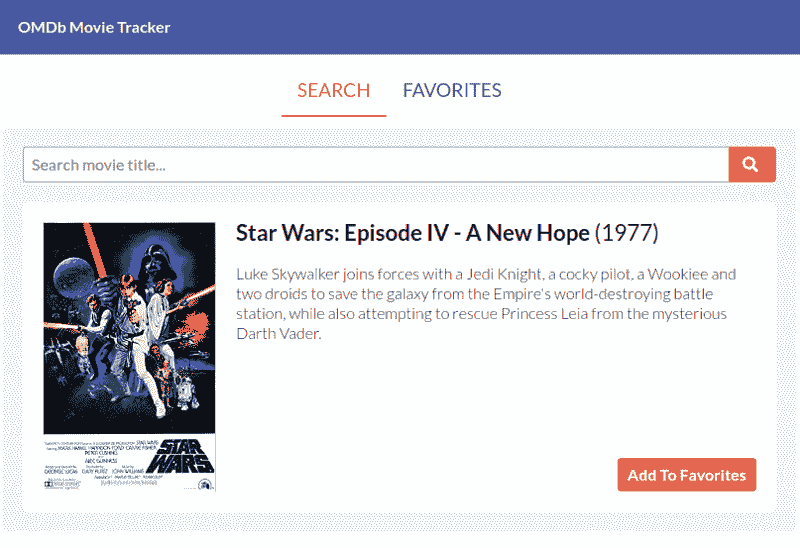

The UI contains a search input form and a movie result below it.

为了简单起见，本文中我们将只关注设计应用程序的核心特性。也可以跳到 [**第二部:系列的 Redux**](https://medium.com/p/d6eaf235f4d) 。

### 数据结构

定义适当的数据结构应该是设计应用程序最重要的方面之一。这应该是第一步，因为它不仅决定了前端应该如何呈现元素，还决定了 API 服务器应该如何返回 JSON 响应。

对于这个应用程序，我们需要两条主要信息来正确呈现我们的 UI: **一个电影结果**和**一个收藏电影列表**。

#### 电影结果对象

单个电影结果将包含诸如标题、年份、描述和海报图像等信息。这样，我们需要定义一个可以存储这些属性的对象:

```
{  "title": "Star Wars: Episode IV - A New Hope",  "year": "1977",  "plot": "Luke Skywalker joins forces with a Jedi Knight...",  "poster": "https://m.media-amazon.com/path/to/poster.jpg",  "imdbID": "tt0076759"}
```

`poster`属性只是一个将显示在结果中的海报图像的 URL。如果没有该电影的海报，它将是“N/A”，我们将显示一个占位符。我们还需要一个`imdbID`属性来唯一标识每部电影。这有助于确定电影结果是否已经存在于收藏夹列表中。我们稍后将探讨它是如何工作的。

#### 收藏夹列表

收藏夹列表将包含所有保存为收藏夹的电影。该列表将如下所示:

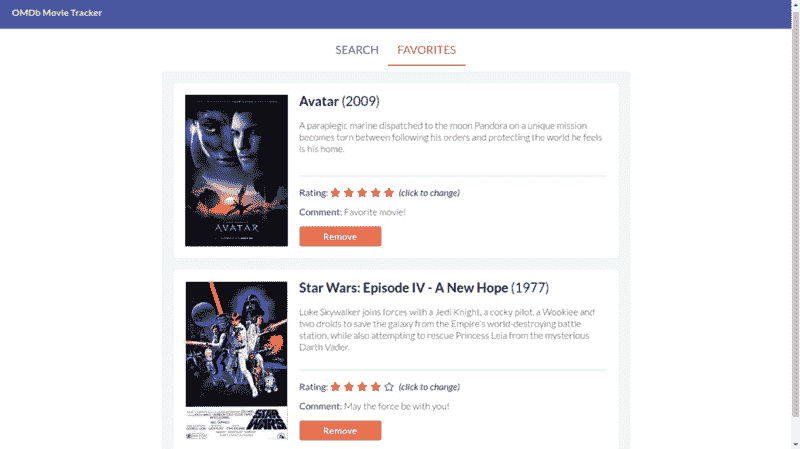

Each movie also includes additional favorite information (rating and comment)

```
[  { title: "Star Wars", year: "1977", ..., rating: 4 },  { title: "Avatar", year: "2009", ..., rating: 5 }]
```

请记住，我们需要从列表中查找特定的电影，这种方法的时间复杂度是 **O(N)** 。虽然它对较小的数据集很有效，但想象一下，必须在无限增长的收藏夹列表中搜索电影。

考虑到这一点，我选择使用一个散列表，其中键作为`imdbID`，值作为收藏的电影对象:

```
{  tt0076759: {    title: "Star Wars: Episode IV - A New Hope",    year: "1977",    plot: "...",    poster: "...",    rating: "4",    comment: "May the force be with you!",  },  tt0499549: {    title: "Avatar",    year: "2009",    plot: "...",    poster: "...",    rating: "5",    comment: "Favorite movie!",  }}
```

这样，我们就可以通过电影的`imdbID`在 **O(1)** 时间的收藏夹列表中查找电影。

> 注意:在大多数情况下，运行时的复杂性可能无关紧要，因为客户端的数据集通常很小。我们也将在 Redux 中执行切片和复制(也是 O(N)操作)。但是作为一名工程师，了解我们可以执行的潜在优化是有好处的。

### 成分

组件是 React 的核心。我们需要确定哪些将与 Redux 存储交互，哪些仅用于表示。我们也可以重用一些表示组件。我们的组件层次结构如下所示:

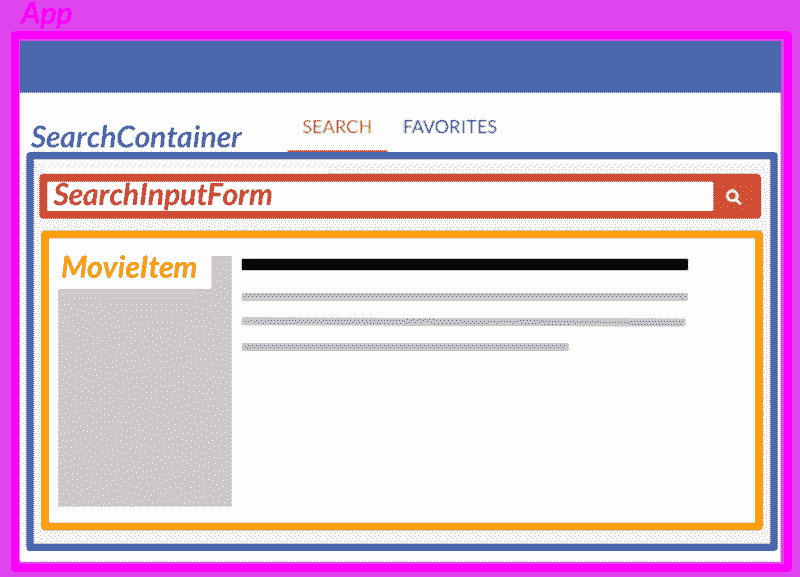

#### 主页

我们在顶层指定我们的**应用**组件。当根路径被访问时，它需要呈现 **SearchContainer** 。它还需要向用户显示 flash 消息，并处理客户端路由。

**SearchContainer** 将从我们的 Redux store 中检索电影结果，将信息作为道具提供给 **MovieItem** 进行渲染。当用户在 **SearchInputForm** 中提交搜索时，它还会调度一个搜索动作。稍后将详细介绍 Redux。

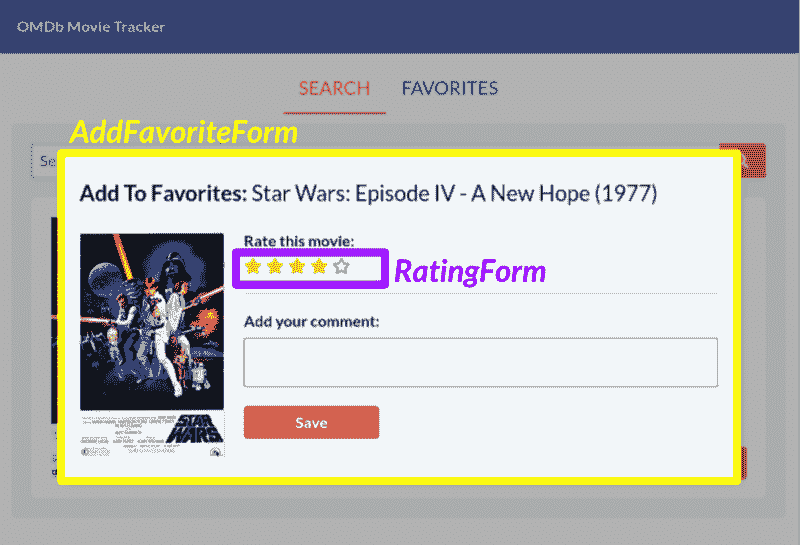

A modal that allows users to add a rating and comment when saving a favorite.

#### 添加到收藏夹表单

当用户点击“添加到收藏夹”按钮时，我们将显示 **AddFavoriteForm** ，一个[控制的组件](https://reactjs.org/docs/forms.html)。

每当用户在评论文本区更改评级或输入文本时，我们都会不断更新它的状态。这对于表单提交时的验证非常有用。

当用户点击黄色星星时， **RatingForm** 负责呈现黄色星星。它还将当前评级值通知给 **AddFavoriteForm** 。

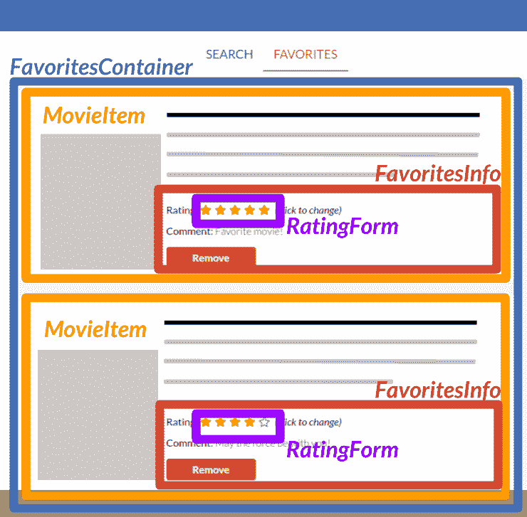

The FavoritesContainer contains a list of MovieItem components

#### 收藏夹选项卡

当用户点击“收藏夹”标签时，**应用程序**呈现**收藏夹容器**。

**FavoritesContainer** 负责从 Redux 存储中检索收藏夹列表。它还在用户更改评级或点击“删除”按钮时调度操作。

我们的 **MovieItem** 和 **FavoritesInfo** 只是从 **FavoritesContainer** 接收道具的表示组件。

我们将在这里重用 **RatingForm** 组件。当用户点击**评分表单**中的一颗星时， **FavoritesContainer** 接收评分值并向 Redux store 发送更新评分动作。

### Redux 商店

我们的 Redux 存储将包括处理搜索和收藏夹操作的 reducers。此外，我们需要包含一个状态缩减器来跟踪用户发起动作时的状态变化。我们将在后面探讨更多关于状态缩减器的内容。

```
//store.js
```

```
import { createStore, combineReducers, applyMiddleware } from 'redux';import thunk from "redux-thunk";
```

```
import search from './reducers/searchReducer';import favorites from './reducers/favoritesReducer';import status from './reducers/statusReducer';
```

```
export default createStore(  combineReducers({    search,    favorites,    status  }),  {},  applyMiddleware(thunk))
```

我们还将立即应用 Redux Thunk 中间件。我们稍后会更详细地讨论这一点。现在，让我们弄清楚当用户提交搜索时，我们如何管理状态变化。

### 搜索缩减器

当用户执行搜索动作时，我们希望通过 **searchReducer** 用新的搜索结果更新商店。然后我们可以相应地渲染我们的组件。事件的一般流程如下所示:

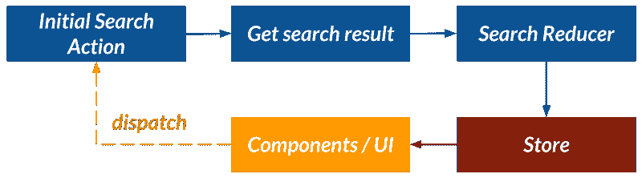

我们现在将把**“获取搜索结果”**视为一个黑盒。我们将在后面用 Redux Thunk 来探索它是如何工作的。现在，让我们实现 reducer 函数。

```
//searchReducer.js
```

```
const initialState = {  "title": "",  "year": "",  "plot": "",  "poster": "",  "imdbID": "",}
```

```
export default (state = initialState, action) => {  if (action.type === 'SEARCH_SUCCESS') {    state = action.result;  }  return state;}
```

**initialState** 将表示之前定义为单个电影结果对象的数据结构。在 reducer 函数中，我们处理搜索成功时的动作。如果动作被触发，我们只需将状态重新分配给新的电影结果对象。

```
//searchActions.jsexport const searchSuccess = (result) => ({  type: 'SEARCH_SUCCESS', result});
```

我们定义了一个名为 **searchSuccess** 的动作，它接受一个参数，即电影结果对象，并返回一个“ **SEARCH_SUCCESS** 类型的动作对象。我们将在搜索 API 调用成功时调度此操作。

### Redux Thunk:搜索

让我们来探索一下早期的**“获取搜索结果”**是如何工作的。首先，我们需要对后端 API 服务器进行远程 API 调用。当请求收到一个成功的 JSON 响应时，我们将把 **searchSuccess** 动作连同有效负载一起发送给 **searchReducer** 。

知道我们需要在异步调用完成后进行调度，我们将利用 [Redux Thunk](https://github.com/reduxjs/redux-thunk) 。Thunk 用于进行多次调度或延迟调度。使用 Thunk，我们更新的事件流如下所示:

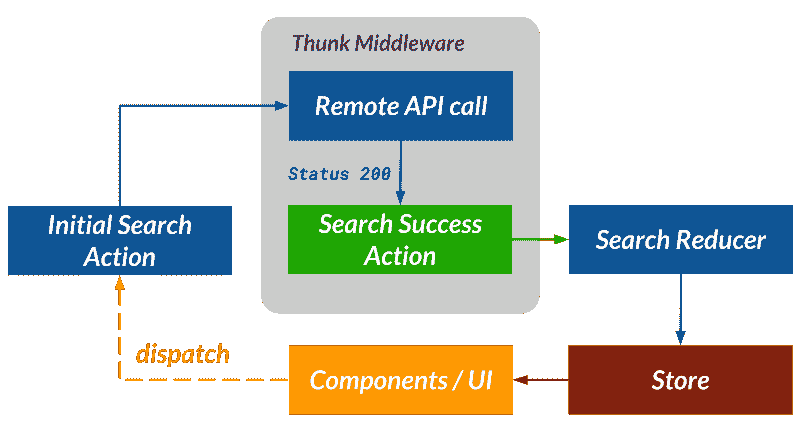

为此，我们定义了一个函数，它接受一个参数`title`，并作为初始的**搜索**动作。这个函数负责获取搜索结果并分派一个 **searchSuccess** 动作:

```
//searchActions.jsimport apiClient from '../apiClient';
```

```
...
```

```
export function search(title) {  return (dispatch) => {    apiClient.query(title)      .then(response => {        dispatch(searchSuccess(response.data))      });  }}
```

我们已经预先设置了我们的 API 客户端，你可以在这里了解更多关于[我是如何设置 API 客户端的。`apiClient.query`方法只是对我们的后端服务器执行一个 AJAX GET 请求，并返回一个带有响应数据的承诺。](https://medium.com/@gooiyingchyi/how-i-architected-a-single-page-react-application-part-i-data-structure-components-and-apis-24386cc78a6#40eb)

然后，我们可以将这个函数作为动作分派连接到我们的 **SearchContainer** 组件:

```
//SearchContainer.js
```

```
import React from 'react';import { connect } from 'react-redux';import { search } from '../actions/searchActions';
```

```
...
```

```
const mapStateToProps = (state) => (  {    result: state.search,  });
```

```
const mapDispatchToProps = (dispatch) => (  {    search(title) {      dispatch(search(title))    },  });
```

```
export default connect(mapStateToProps, mapDispatchToProps)(SearchContainer);
```

当搜索请求成功时，我们的 **SearchContainer** 组件将呈现电影结果:

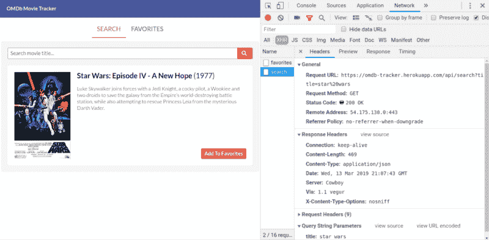

Left: the app renders the movie result | Right: a successful search request

### 处理其他搜索状态

现在我们已经让我们的**搜索**动作正常工作，并且连接到我们的**搜索容器**组件，我们想要处理除了成功搜索之外的其他情况。

#### 搜索请求待定

当用户提交搜索时，我们将显示一个加载动画，表明搜索请求正在等待处理:

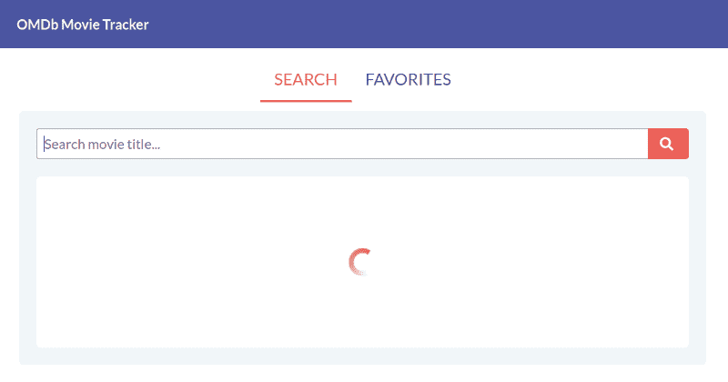

The app displays a spinner animation when waiting for the search result

#### 搜索请求成功

如果搜索失败，我们将向用户显示适当的错误消息。这有助于提供一些背景信息。如果电影标题不可用，或者我们的服务器在与 OMDb API 通信时遇到问题，搜索可能会失败。

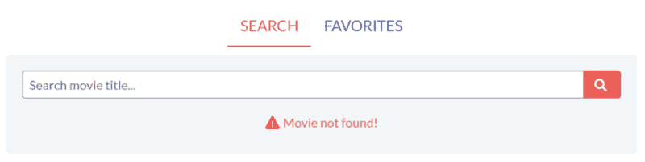

When a movie title is not found in OMDb, we display an error message

为了处理不同的搜索状态，我们需要一种方法来存储和更新当前状态以及任何错误消息。

### 状态缩减器

**statusReducer** 负责在用户执行动作时跟踪状态变化。动作的当前状态可以用三种“状态”之一来表示:

*   待定(当用户首次启动操作时)
*   成功(当请求返回成功响应时)
*   错误(当请求返回错误响应时)

有了这些状态，我们可以根据给定动作类型的当前状态呈现不同的 ui。在这种情况下，我们将关注跟踪**搜索**动作的状态。

我们将从实现 **statusReducer** 开始。对于初始状态，我们需要跟踪当前的搜索状态和任何错误:

```
// statusReducer.jsconst initialState = {  search: '',      // status of the current search  searchError: '', // error message when a search fails}
```

接下来，我们需要定义 reducer 函数。每当我们的 **SearchContainer** 发送一个“SEARCH_[STATUS]”动作时，我们将通过替换`search`和`searchError`属性来更新商店。

```
// statusReducer.js
```

```
...
```

```
export default (state = initialState, action) => {  const actionHandlers = {    'SEARCH_REQUEST': {      search: 'PENDING',      searchError: '',    },    'SEARCH_SUCCESS': {      search: 'SUCCESS',       searchError: '',          },    'SEARCH_FAILURE': {      search: 'ERROR',      searchError: action.error,     },  }  const propsToUpdate = actionHandlers[action.type];  state = Object.assign({}, state, propsToUpdate);  return state;}
```

我们在这里使用一个`actionHandlers`散列表，因为我们只是替换状态的属性。此外，它比使用`if/else`或`case`语句更能提高可读性。

有了我们的 **statusReducer** 之后，我们可以基于不同的搜索状态来呈现 UI。我们将把我们的事件流程更新为:

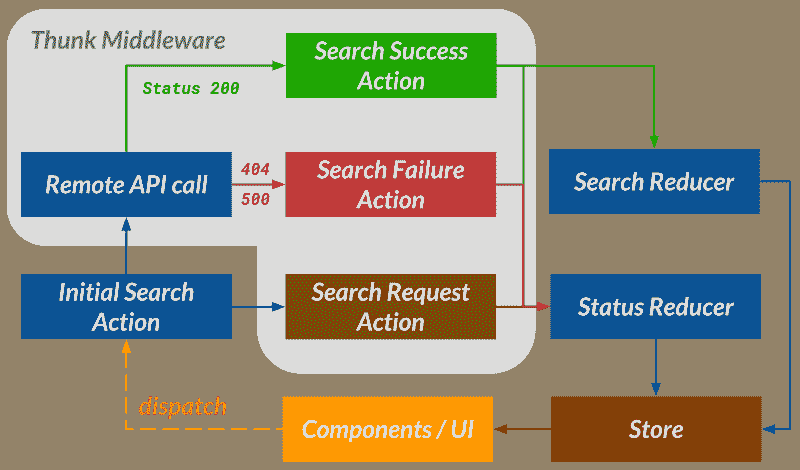

我们现在有额外的 **searchRequest** 和 **searchFailure** 动作可以分派到商店:

```
//searchActions.js
```

```
export const searchRequest = () => ({  type: 'SEARCH_REQUEST'});
```

```
export const searchFailure = (error) => ({  type: 'SEARCH_FAILURE', error});
```

为了更新我们的 **search** 动作，我们将立即调度 **searchRequest** ，并将根据 Axios 返回的承诺的最终成功或失败，调度 **searchSuccess** 或 **searchFailure** :

```
//searchActions.js
```

```
...
```

```
export function search(title) {  return (dispatch) => {    dispatch(searchRequest());
```

```
apiClient.query(title)      .then(response => {        dispatch(searchSuccess(response.data))      })      .catch(error => {        dispatch(searchFailure(error.response.data))      });  }}
```

我们现在可以将搜索状态 state 连接到我们的 **SearchContainer** ，将其作为一个道具传递。每当我们的商店接收到状态变化，我们的 **SearchContainer** 就会呈现一个加载动画、一条错误消息或搜索结果:

```
//SearchContainer.js
```

```
...(imports omitted)
```

```
const SearchContainer = (props) => (  <main id='search-container'>    <SearchInputForm       placeholder='Search movie title...'      onSubmit={ (title) => props.search(title) }    />    {      (props.searchStatus === 'SUCCESS')      ? <MovieItem          movie={ props.result }          ...(other props)        />      : null    }    {      (props.searchStatus === 'PENDING')      ? <section className='loading'>                  </section>      : null    }    {      (props.searchStatus === 'ERROR')      ? <section className='error'>           <p className='error'>            <i className="red exclamation triangle icon"></i>            { props.searchError }          </p>        </section>      : null    }  </main>);
```

```
const mapStateToProps = (state) => (  {    searchStatus: state.status.search,    searchError: state.status.searchError,    result: state.search,  });
```

```
...
```

### 收藏夹缩减器

我们需要处理收藏夹列表中的用户执行的 CRUD 操作。回想一下之前的 API 端点，我们希望允许用户执行以下操作，并相应地更新我们的商店:

*   将电影保存到收藏夹列表
*   检索所有收藏的电影
*   更新收藏的评级
*   从收藏夹列表中删除电影

为了确保 reducer 函数是纯的，我们简单地使用`Object.assign`将旧状态和任何新属性一起复制到一个新对象中。注意，我们只处理类型为 **_SUCCESS** 的动作:

```
//favoritesReducer.js
```

```
export default (state = {}, action) => {  switch (action.type) {    case 'SAVE_FAVORITE_SUCCESS':      state = Object.assign({}, state, action.favorite);      break;
```

```
case 'GET_FAVORITES_SUCCESS':      state = action.favorites;      break;
```

```
case 'UPDATE_RATING_SUCCESS':      state = Object.assign({}, state, action.favorite);      break;
```

```
case 'DELETE_FAVORITE_SUCCESS':      state = Object.assign({}, state);      delete state[action.imdbID];      break;
```

```
default: return state;  }  return state;}
```

我们将把**初始状态**作为一个空对象。原因是，如果我们的 **initialState** 包含占位符电影项目，我们的应用程序将在等待来自后端 API 服务器的实际收藏夹列表响应之前立即呈现它们。

从现在开始，每个收藏夹操作都将遵循如下所示的一般事件流程。该模式类似于上一节中的搜索操作，只是现在我们将跳过处理任何“未决”状态。

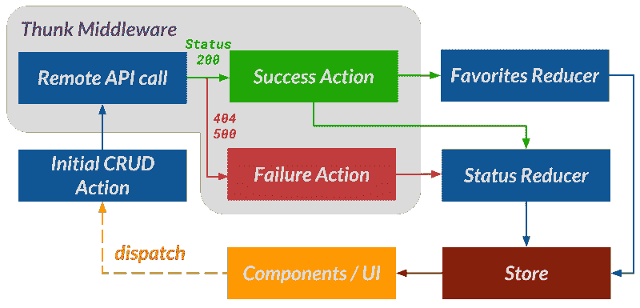

#### 保存收藏夹操作

以保存收藏夹操作为例。该函数使用我们的 **apiClient** 对进行 API 调用，并根据我们是否收到成功响应来调度 **saveFavoriteSuccess** 或 **saveFavoriteFailure** 操作:

```
//favoritesActions.jsimport apiClient from '../apiClient';
```

```
export const saveFavoriteSuccess = (favorite) => ({  type: 'SAVE_FAVORITE_SUCCESS', favorite});
```

```
export const saveFavoriteFailure = (error) => ({  type: 'SAVE_FAVORITE_FAILURE', error});
```

```
export function save(movie) {  return (dispatch) => {    apiClient.saveFavorite(movie)      .then(res => {        dispatch(saveFavoriteSuccess(res.data))      })      .catch(err => {        dispatch(saveFavoriteFailure(err.response.data))      });  }}
```

我们现在可以通过 React Redux 将**保存**收藏动作连接到 **AddFavoriteForm** 。

要了解更多关于我如何处理显示 flash 消息的流程，[点击这里](https://blog.usejournal.com/how-i-architected-a-single-page-react-application-part-ii-redux-d6eaf235f4d#956b)。

### 结论

设计应用程序的前端需要一些深谋远虑，即使使用流行的 JavaScript 库，如 React。通过思考数据结构、组件、API 和状态管理如何作为一个整体工作，我们可以更好地预测边缘情况，并在出现错误时有效地修复错误。通过使用特定的设计模式，比如受控组件、Redux，以及使用 Thunk 处理 AJAX 工作流，我们可以简化向用户操作提供 UI 反馈的流程管理。最终，我们如何进行设计将对可用性、清晰性和未来的可伸缩性产生影响。

#### 参考

[full stack React:React js 和 Friends 完全指南](https://www.fullstackreact.com/#table-of-contents)

### 关于我

我是一名居住在纽约的软件工程师，也是[飞船](https://spacecraft-repl.com)的共同创造者。我有设计单页面应用程序、在多个客户端之间同步状态以及用 Docker 部署可伸缩应用程序的经验。

我正在寻找下一个全职工作的机会！如果你认为我会很适合你的团队，请[联系](https://gooi.tech)。