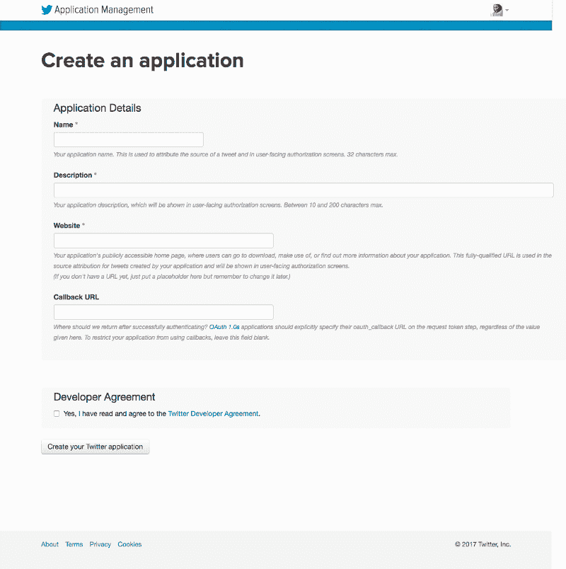

# 我如何在 5 分钟内自动创建了一个免费代码露营者的 Twitter 列表

> 原文：<https://www.freecodecamp.org/news/how-i-automatically-created-a-twitter-list-of-freecodecampers-in-5-minutes-425f0b922118/>

莫妮卡·鲍威尔

# 我如何在 5 分钟内自动创建了一个免费代码露营者的 Twitter 列表

#### 使用 Twython Twitter API 包装器向 Twitter 列表添加用户


我们将创建一个 Python 脚本，该脚本将自动在 Twitter 中搜索使用 **#freeCodeCamp** 标签的个人，并将他们添加到 Twitter 的“FreeCodeCampers”列表中。 [Twitter 列表](https://help.twitter.com/en/using-twitter/twitter-lists)是一种在 Twitter 上管理一群人并收集他们所有推文的方式，而不必关注每个人的账户。Twitter 列表可以包含多达 5000 个个人 Twitter 帐户。

我们可以通过以下方式实现这一点:

*   安装必要的 Python 包
*   向 Twitter 注册应用程序
*   生成和访问我们的 Twitter 凭证
*   制作 Twitter [搜索](https://developer.twitter.com/en/docs/tweets/search/api-reference/get-search-tweets)和[列表](https://developer.twitter.com/en/docs/accounts-and-users/create-manage-lists/api-reference/get-lists-list) API 调用

所以让我们开始吧。

### 1.安装必要的 Python 包

创建一个名为`addToFreeCodeCampList.py`的文件，它将包含我们的主脚本，然后将两个 Python 模块导入到这个文件中:

*   **导入配置:**在与我们的`addToFreeCodeCampList.py`脚本相同的目录下，创建一个名为`config.py`的文件，该文件存储我们机密的 Twitter API 凭证。我们将通过包含行`import config`将我们的 API 凭证从该文件导入到我们的`addToFreeCodeCampList.py`脚本中。Twitter 要求所有 API 请求都有一个有效的 API 密钥、API 秘密、访问令牌和令牌秘密。
*   **导入 Twython:** [Twython](https://github.com/ryanmcgrath/twython) 是 Twitter API 的 Python 包装器，它使得使用 Python 以编程方式访问和操作 Twitter 中的数据变得更加容易。我们可以用下面的代码行`from twython import Twython, TwythonError`导入 Twython。

您的`addToFreeCodeCampList.py`脚本现在应该是这样的。

```
import configfrom twython import Twython, TwythonError
```

### 2.向 Twitter 注册应用程序

为了访问 Twitter API，我们需要认证我们的应用程序。你需要有一个 Twitter 账户才能访问 Twitter 的应用管理网站。在应用程序管理站点，您可以查看/编辑/创建 API 密钥、API 机密、访问令牌和令牌机密。

1.  为了创建这些凭证，我们需要创建一个 Twitter 应用程序。转到应用程序管理网站，点击“创建新应用程序”。这将引导您进入一个与下图相似的页面。



2.填写必填字段，然后点击“创建您的 Twitter 应用程序”。然后，您将被重定向到一个页面，上面有您申请的详细信息。

### 3.生成和访问我们的 Twitter 凭证

1.  点击“密钥和访问令牌”选项卡，将“消费者密钥(API 密钥)”和“消费者秘密(API 秘密)”复制到`config.py`文件中
2.  向下滚动到页面底部，然后单击“创建我的访问令牌”。将生成的“访问令牌”和“访问令牌秘密”复制到`config.py`文件中。

作为参考，我建议将 config.py 格式化为类似于下面的文件:

3.目前，我们所有的 Twitter 凭证都保存在我们的`config.py`文件中，我们已经将`config`导入到我们的`addToFreeCodeCampList.py`文件中。然而，我们实际上并没有在文件之间传递任何信息。

让我们通过创建一个 Twython 对象并从我们的`config.py`文件中传递必要的 API 密钥、API 秘密和 API 令牌来改变这一点，如下所示:

```
twitter = Twython(config.api_key, config.api_secret, config.access_token, config.token_secret)`
```

`addToFreeCodeCampList.py`文件现在应该看起来像这样:

```
import config
```

```
from twython import Twython, TwythonError
```

```
# create a Twython object by passing the necessary secret passwordstwitter = Twython(config.api_key, config.api_secret, config.access_token, config.token_secret)
```

### 4.进行 Twitter 搜索和列表 API 调用

1.  让我们进行一个 API 调用来搜索 Twitter，并返回包含“#freeCodeCamp”的 100 条最近的推文(不包括转发):

```
# return tweets containing #FreeCodeCampresponse = twitter.search(q=’”#FreeCodeCamp” -filter:retweets’, result_type=”recent”, count=100)
```

2.看看我们搜索返回的推文

```
# for each tweet returned from search of #FreeCodeCampfor tweet in response[‘statuses’]: # print tweet info if needed for debugging print(tweet) print(tweet[‘user’][‘screen_name’])
```

这个 API 调用返回的一条 tweet 在 JSON 中是这样的:

```
{'created_at': 'Sun Dec 24 00:23:05 +0000 2017', 'id': 944725078763298816, 'id_str': '944725078763298816', 'text': 'Why is it so hard to wrap my head around node/express. Diving in just seems so overwhelming. Templates, forms, post… https://t.co/ae52rro63i', 'truncated': True, 'entities': {'hashtags': [], 'symbols': [], 'user_mentions': [], 'urls': [{'url': 'https://t.co/ae52rro63i', 'expanded_url': 'https://twitter.com/i/web/status/944725078763298816', 'display_url': 'twitter.com/i/web/status/9…', 'indices': [117, 140]}]}, 'metadata': {'iso_language_code': 'en', 'result_type': 'recent'}, 'source': '<a href="http://twitter.com" rel="nofollow">Twitter Web Client</a>', 'in_reply_to_status_id': None, 'in_reply_to_status_id_str': None, 'in_reply_to_user_id': None, 'in_reply_to_user_id_str': None, 'in_reply_to_screen_name': None, 'user': {'id': 48602981, 'id_str': '48602981', 'name': 'Matt Huberty', 'screen_name': 'MattHuberty', 'location': 'Oxford, MS', 'description': "I'm a science and video game loving eagle scout with a Microbio degree from UF. Nowadays I'm working on growing my tutoring business at Ole Miss. Link below!", 'url': 'https://t.co/dfuqNNoBYZ', 'entities': {'url': {'urls': [{'url': 'https://t.co/dfuqNNoBYZ', 'expanded_url': 'http://www.thetutorcrew.com', 'display_url': 'thetutorcrew.com', 'indices': [0, 23]}]}, 'description': {'urls': []}}, 'protected': False, 'followers_count': 42, 'friends_count': 121, 'listed_count': 4, 'created_at': 'Fri Jun 19 04:00:44 +0000 2009', 'favourites_count': 991, 'utc_offset': -28800, 'time_zone': 'Pacific Time (US & Canada)', 'geo_enabled': False, 'verified': False, 'statuses_count': 199, 'lang': 'en', 'contributors_enabled': False, 'is_translator': False, 'is_translation_enabled': False, 'profile_background_color': 'C0DEED', 'profile_background_image_url': 'http://abs.twimg.com/images/themes/theme1/bg.png', 'profile_background_image_url_https': 'https://abs.twimg.com/images/themes/theme1/bg.png', 'profile_background_tile': False, 'profile_image_url': 'http://pbs.twimg.com/profile_images/777294001598758912/FVOIrnb4_normal.jpg', 'profile_image_url_https': 'https://pbs.twimg.com/profile_images/777294001598758912/FVOIrnb4_normal.jpg', 'profile_banner_url': 'https://pbs.twimg.com/profile_banners/48602981/1431670621', 'profile_link_color': '1DA1F2', 'profile_sidebar_border_color': 'C0DEED', 'profile_sidebar_fill_color': 'DDEEF6', 'profile_text_color': '333333', 'profile_use_background_image': True, 'has_extended_profile': True, 'default_profile': True, 'default_profile_image': False, 'following': False, 'follow_request_sent': False, 'notifications': False, 'translator_type': 'none'}, 'geo': None, 'coordinates': None, 'place': None, 'contributors': None, 'is_quote_status': False, 'retweet_count': 1, 'favorite_count': 0, 'favorited': False, 'retweeted': False, 'lang': 'en'}MattHuberty
```

在 Twitter.com 上是这样的:

3.将 Tweet-ers 添加到我们的 Twitter 列表

为了将推文的作者添加到我们的 Twitter 列表中，我们需要与推文相关的用户名`tweet['user']['screen_name']`

让我们尝试将这些推文中的用户添加到我们的 Twitter 列表“FreeCodeCampers”中。我在 https://twitter.com/waterproofheart/lists/freecodecampers 的[创建了我的 Twitter 列表](https://twitter.com/waterproofheart/lists/freecodecampers)，这意味着对于我的脚本来说，鼻涕虫是`freecodecampers`而`owner_screen_name`是我的，防水的心脏。

```
for tweet in response['statuses']:
```

```
# try to add each user who has tweeted the hashtag to the list try: twitter.add_list_member(slug=’YOUR_LIST_SLUG’, owner_screen_name=’YOUR_USERNAME’, screen_name= tweet[‘user’][‘screen_name’])
```

```
#if for some reason Twython can't add user to the list print exception messageexcept TwythonError as e: print(e)
```

您可以创建自己的 Twitter 列表，方法是导航到您的 Twitter 个人资料，单击桌面上的“列表”，然后单击右侧的“创建新列表”。查看官方 Twitter 列表文档了解更多信息。


您可以通过在终端中运行`python addToFreeCodeCampList.py`来测试您的脚本。

我最终的脚本是这样的:

该脚本可以设置为自动在本地运行，或者通过一个 [cron 作业](https://en.wikipedia.org/wiki/Cron)远程运行，该作业允许任务按照设定的时间表执行。

如果您有任何问题、建议或想分享您是如何修改这个脚本的，请随时在下面发表评论或发推文给我。

如果你喜欢阅读这篇文章，可以考虑点击拍手按钮？。想看更多我的作品吗？在 h[TTP://about Monica . com .](http://aboutmonica.com)查看我的代码并了解更多我的开发经验