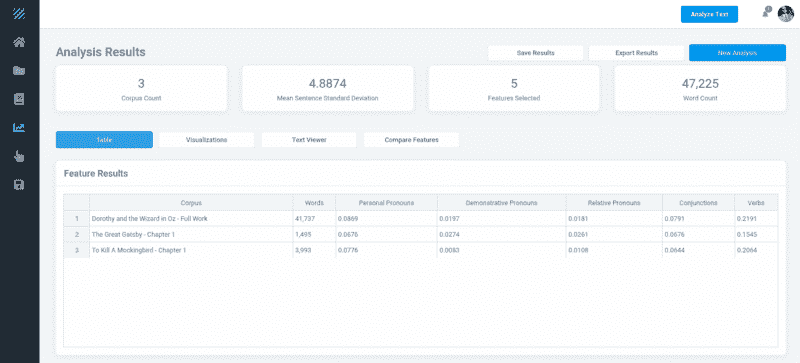
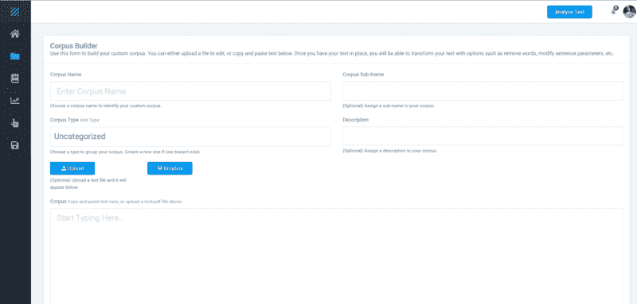
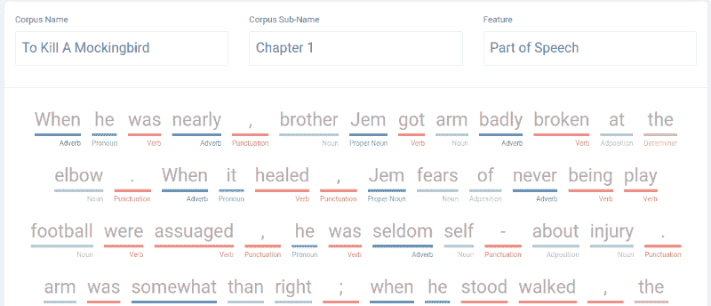

# 我如何在一个月内构建一个复杂的文本分析应用程序

> 原文：<https://www.freecodecamp.org/news/how-i-built-a-complex-text-analysis-app-in-a-month-61917877cd72/>

杰弗里·弗林特

# 我如何在一个月内构建一个复杂的文本分析应用程序

### **它是如何开始的**

我参加了德克萨斯大学奥斯汀分校为期一周的人文学科强化学习研讨会，参加了一个文本分析会议。一名与会者问道:

> “为什么软件开发人员不使这变得更容易，而不是我们必须了解 R 或 Python？”

我在训练中感觉很舒服，因为我之前有过这两方面的经验。但是我绝对能够理解那些不愿意编写命令来查看快速输出的用户的情绪。

我是德克萨斯大学奥斯丁分校定量批评实验室(QCL)的副研究员。主要研究者建议我参加这个课程。这门课程无疑帮助我提炼和发现了自然语言处理(NLP)的新技能。

不经意间，当我专注于其他工具包和项目时，我把这个问题放在了次要位置。在波士顿参加古典研究研讨会时，我注意到许多人对缺乏更简单的文本分析和可视化工具感到沮丧。

我所在的 UT Austin 团队正在为多种语言开发基于网络的[风格计量](https://en.wikipedia.org/wiki/Stylometry)工具包，但目前还没有针对英语的全功能选项。

当然也有像 [Voyant](https://en.wikipedia.org/wiki/Voyant_Tools) 这样的选择。但是，还没有现成的解决方案能够为没有编程知识的人提供命名实体提取、词性(POS)标记、从嘈杂文本中分词以及情感分析等功能。再加上这一点和上述内容，它强化了为 NLP 推出一个更简单的应用程序的想法。

### 我从哪里开始？

在等待登机的时候，我开始考虑从哪里开始。我最终决定创建用户界面。我这样做的理由是，在我为用户弄清楚工作流程之后，创建功能会更容易。

当队长说可以使用便携式电子设备时，我拿出笔记本电脑开始工作。我敢肯定，坐在我旁边的家伙可能认为我一直在控制台上黑东西。

当我从五个小时的飞行中降落时，我已经完成了登录、注册、忘记密码和语料库建设器屏幕。

你可能会问，怎么可能用相应的 JavaScript 函数和测试来完成所有这些。我在早期学到的减少开发时间的一个好的实践是为这些情况保留 boiler plate 代码。

我的代码通常包括:

*   注册/登录
*   通知
*   可视化(Chart.js、引导表、Handsontable.js)
*   按指定路线发送

另一种减少开发时间的方法，尤其是当你独自处理一个项目时，是为 UI 使用预先制作的管理模板。主题森林管理网站模板部分有一些我在项目中使用的很棒的 UI 元素。通过使用预先构建的资产，我节省了超过 50%的开发时间。

当然，我必须了解 HTML、CSS 和 jQuery。但是有了这些已经设计好的资产，我只需要担心放置和数据集成。

我选择的框架是 [Meteor.js](https://www.meteor.com/) 。Meteor 是一个 JavaScript 框架，位于 Node.js 之上。我使用 MongoDB 作为我的数据库，使用 Python 处理繁重的 NLP 任务。

对于那些熟悉 Meteor 的人来说，我选择不包括发布和订阅，只包括方法和调用，而是对运行在客户机上的所有第三方库使用动态导入。这有助于提高性能。我还为任何需要操作字符串的客户端代码使用了 workers。这使我减少到大约 500kb 的包大小。

我选定了 Textalytic 作为名字，并获得了[网站](https://www.textalytic.com/)。

### 哦，你以为会很简单？

根据我以前在 QCL 实验室从事 NLP 相关工具包工作的经验，我认为这一切都很简单。但是，总会有这样的时刻。

我希望用户能够在他们的语料库中查看突出显示的命名实体。我首先必须获得一个快速的 JavaScript 兼容库来提取命名实体。

一开始我用的是 [compromise.js](https://github.com/spencermountain/compromise) 。这在某种程度上工作得很好，但是相对较大的文本的速度是需要改进的。

然后我选定了空间，但这是用 Python 写的。我以前从来没有集成过两种不同的语言，所以可以从堆栈溢出中学习一些东西。

在让 SpaCy 使用 JavaScript 之后，我遇到了两个问题。首先是 SpaCy 不会返回准确的计数。

用户能够查看名词、形容词、动词等的频率。SpaCy 将返回 31 个“car”实例，但是手工计数时，我将得到 44 个。

起初，我让 Python handle 返回名词的频率:

我最终选择只返回原始名词数组，让 JavaScript 返回前 10 个名词。

这导致了名词的精确计数:

第二个问题是命名实体。大多数文本分析模型(如果不是全部的话)在命名实体上不会获得 100%的准确性。为了补充 SpaCy，我将取自 [WikiData](https://www.wikidata.org/wiki/Wikidata:Main_Page) 的一个大型命名实体列表导入 MongoDB。

文本通过 SpaCy 运行，SpaCy 返回找到的实体的数组。然后，MongoDB 产生一个大约 15 万个实体的大数组，这个数组和文本一起被发送到一个函数，这个函数根据单词边界执行匹配。标点符号和边界的正则表达式会导致许多令人头疼的问题。

这两个数组被过滤，并删除重复的条目，以产生最终的实体数组。这种方法似乎是最快的，大约在 5 秒钟内返回结果。

这种方法在获得比 SpaCy 的 85.85%更高的准确性方面提供了更好的覆盖面。

### 能简单点吗？

许多 NLP 任务的教程都要求用户在分析之前对文本进行预处理。我希望用户有一个更简单的方法。

有了语料库建设工具，用户可以输入、复制和粘贴文本，或者从他们的电脑或 Dropbox 中选择一个文件。

#### 预处理

我现在必须考虑解析不同的文件类型，净化用户输入，并提供预处理的点击选项。

对于预处理，用户可以删除空行、停用词、重复行、标点、额外空格、换行符和包含用户选择的单词的行。

为了使文本分析更容易，用户不需要做任何事情。根据运行时选择的特性，后端决定如何最好地处理文本。

#### 文本转换

在参加文本分析课程时，我们似乎在开始测试各种模型之前做了大量的文本转换。

我首先尝试将 Dropbox API 集成到应用程序中。我认为这是获得这一功能的唯一途径。我错了，因为 Dropbox 有一个名为 Chooser 的组件，它允许用户将他们的文档放入应用程序，而无需我花费更多时间添加 API 调用。

而在文本分析课上，用户必须从某人的 Google Drive 上下载文本文件，或者从 NLTK 上下载现成的语料库。在等待每个人下载和导入文件时，这需要花费相当多的时间。

对于只想测试功能或了解文本分析如何工作的用户，我选择了包括一个公共领域文学作品库，他们可以添加到他们的[语料库](https://en.wikipedia.org/wiki/Text_corpus)中进行选择。我希望这将为新用户提供一个宽松的准入门槛。

对于高级用户，我希望他们有选择，而不是被束缚在默认配置中。我实现了自定义停用词、自定义最常出现的单词列表等等。一些用户可能想搜索以“-ing”结尾的单词的频率，所以我也把它放了进去。

在添加这些选项时，我必须考虑这些额外的空间，将它们的输入转换成可用的数组，对它们的自定义列表的大小进行限制，等等。

### 不要阻塞循环！

我不希望用户只能看到名词和动词的正常频率。所以我最后加了关系从句和从属从句。

我目前正在测试更复杂的情况，比如悬挂修饰符、直接对象和并行结构。

#### 表演

我很兴奋有这个地方，结果返回得很快。然后我开始考虑性能。我在笔记本电脑和台式机上打开了这个网站，然后开始对一些非常大的语料库进行分析。正如你所料，当我只和我自己一起运行搜索时，我的结果返回得并不快。

问题是我的长时间运行的函数阻塞了主事件循环。我需要将这些任务卸载到一个单独的进程中，以保持节点响应。我花了几个小时试图让函数在另一个进程上运行。

最后我从微软找到了 [Napa.js](https://github.com/Microsoft/napajs) 。集成真的很简单，我不需要改变我的任何功能。

该应用程序现在运行顺利，多个用户分析了大量的语料库。但是，总有一个“但是”！

当使用包含大约 50 万个单词的庞大语料库进行搜索时，Python 会抛出一个`ValueError`。SpaCy 在单个字符串中有 1，000，000 个字符的限制，这是可以修改的。很自然地，我把语料库分成了几大块。

由于这是我自己支持的免费应用程序——服务器资源可能会变得昂贵——我选择为每个帐户设置 100 万个语料库单词和 5 万个语料库单词的硬性限制。用户可以对一组语料库进行分析，但是每个语料库都是单独分析的。这应该有助于防止服务器在计算密集型功能上达到极限。

#### 词性标注

以有意义的方式可视化的词性标注是我知道我必须在应用程序中拥有的东西。SpaCy 毫无问题地返回了一个大型对象数组中每个单词的 POS 标签，但是这对用户没有帮助。我必须设法将这个数组转换成用户喜欢的格式。

Compromise.js 有一个很好的格式来做到这一点，这是我的灵感来源。

我将该数组放入一个循环中，该循环根据位置添加颜色标签，并将新数组转换为一个字符串，并将页面更新为:

### 结论

在一个月的时间里，这款应用已经准备好发布了。此后，我做了各种优化和其他调整。除非万不得已，否则我尽量不添加 npm 模块。除了可视化库和 [toastr](https://github.com/CodeSeven/toastr) 通知之外，一切都是用普通的 JavaScript 编写的。通过这样做，代码库变得更精简，我不必担心项目的维护者什么时候会做`x`。

在这个项目快结束的时候，我开始思考:
“谁会用这个？”
“这个 app 其实够好吗？”
“我是不是在什么地方搞砸了，这会永远被玷污？”

我抑制了这些想法，并认为如果失败了，我会学到很多东西，这些东西我可能在做其他事情时学不到。

你可能会浪费很多时间去优化每一个函数。我很快学会了放弃用最新的 ES 语法编写函数的想法。然而，我确实关注了各种功能的性能，更关注用户体验。

节省时间的最佳策略之一是使用 Gitlab 的 CI/CD 管道——而且是免费的！

我没有手动构建包、停止服务、上传等等，而是在 [GitKraken](https://www.gitkraken.com/) 中提交一次。 [GitLab](https://about.gitlab.com/) 处理服务器上的其他事情。

使用多实例、负载平衡和粘性会话来设置 NGINX 有一个学习曲线。但是有很多资源可以帮助你，比如 [freeCodeCamp](https://www.freecodecamp.org/) 、 [Stack Overflow](https://stackoverflow.com/) 和数字海洋的[博客版块](https://blog.digitalocean.com/)。

我一直在考虑增加对用户有用的新功能。文档摘要、定制机器学习模型和论点/立场检测是我计划在今年夏天添加的几个功能。如果你对可能有用的 NLP 特性感兴趣，请在评论区告诉我。感谢阅读！