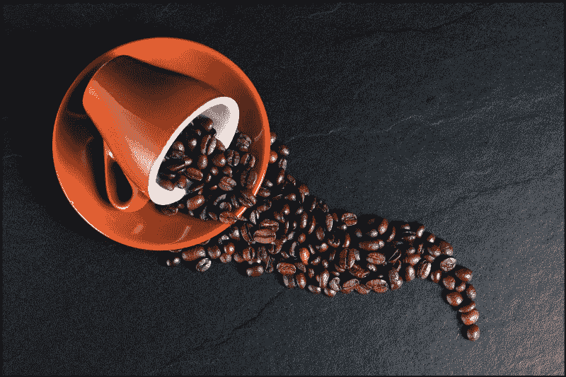
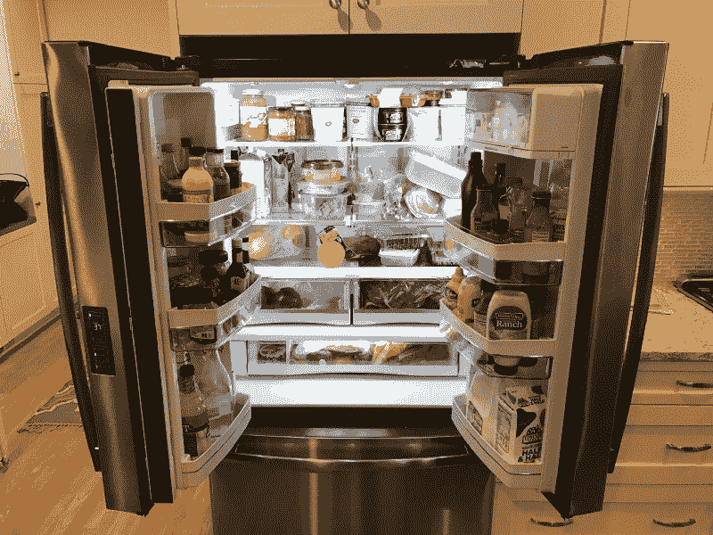
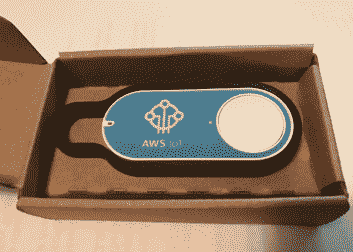
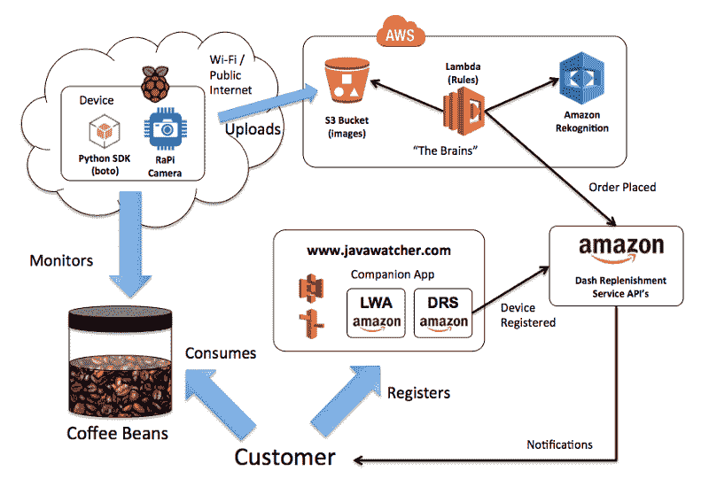
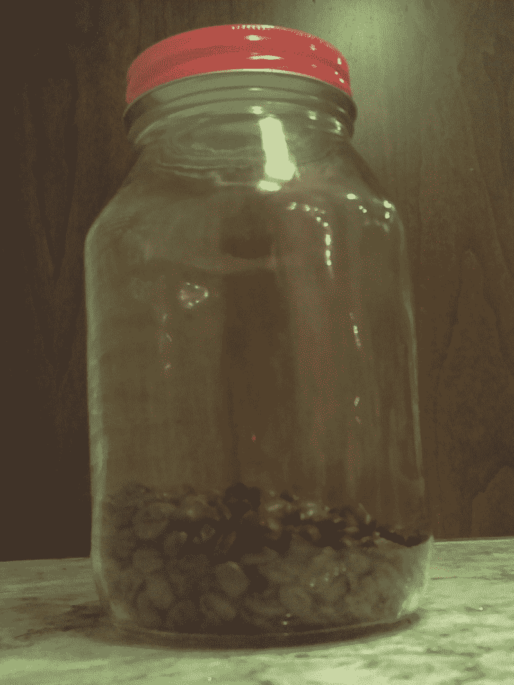

# 我如何建立一个全自动的系统，从亚马逊上进货我厨房的咖啡

> 原文：<https://www.freecodecamp.org/news/how-i-built-a-fully-automated-system-that-restocks-my-kitchens-coffee-from-amazon-87072b65efd0/>

特伦·彼得森

# 我如何建立一个全自动的系统，从亚马逊上进货我厨房的咖啡



这些年来，我已经完善了一个为去杂货店做准备的方法。我小心翼翼地打开冰箱，浏览了几遍，放出了大部分冷空气。



然后，我对厨房里的其他几个橱柜做了类似的练习。然后我在一张纸上草草写下我需要的所有物品。

尽管我尝试了不同的手机应用程序，试图变得更有条理，但我还没有改进这个简单的纸上方法。

鉴于我热爱技术，我相信有更好的方式来储存我的货架，但还没有看到正确的解决方案。我确实喜欢亚马逊网上购物的便利，但在实现方面仍有滞后，这需要更多的规划，超出了我的能力。

那时我开始思考:也许解决办法在于更好地监控库存。所以我开始朝这个方向努力。

因为我家喝很多咖啡，而且网上有很多选择，所以我决定从那里开始。

作为 Hackster 竞赛的一部分，我真的有动力将这个从概念变成代码，并完全自动化我的咖啡豆供应，直接送到我家。我的整个解决方案的详细记录可以在[这里](https://www.hackster.io/terren/javawatch-your-coffee-bean-guardian-807ef7)找到，摘要如下。

### 亚马逊 Dash 补货服务

亚马逊发布的众多新技术产品中有一款叫做 Dash。这是一个名为 Dash Button 的可编程按钮的图片，他们也出售已经设置为从他们的网站订购产品的按钮，如肥皂洗涤剂、电池、芯片等。



用于这些按钮的相同技术可以内置到硬件中。这使得能够用可以请求订购产品的其他刺激来代替按钮。经过一番精彩的头脑风暴后，我想到了这个点子。

### 如何让这一切发挥作用

所以在想出一个吸引人的名字和创造性的概念后，我勾画出了一个如何运作的架构。在基于 Raspberry Pi 的硬件设备和 Dash 补货 API 之间，我添加了几个月前发布的 [Amazon Rekognition 服务](https://aws.amazon.com/rekognition/)。以下是所有部分如何组合在一起。



### 在厨房中利用人工智能

保持咖啡豆供应的关键在于利用 AWS 的图像识别能力。我已经看到了这种面部识别技术的一些很好的用例，但也许我是第一个给咖啡豆拍照的人。

这项服务很容易上手。Raspberry Pi 相机以预设的时间间隔捕捉照片，并上传到 AWS 名为 S3 的基于对象的存储服务中。每个照片对象都有一个唯一的地址，然后调用 Rekognition API 传递这个地址，这样就可以应用 AI 了。举个例子，这里有一张设备拍摄的满满一罐豆子的实际照片。


响应中返回的是一组“标签”——可以把它们想象成对图像视野中的东西的预测。

```
{    “Labels”: [        { “Confidence”: 84.64501190185547, “Name”: “Bottle”,        { “Confidence”: 84.64501190185547, “Name”: “Jug”,        { “Confidence”: 84.64501190185547, “Name”: “Water Bottle”,        { “Confidence”: 80.86704254150390, “Name”: “Jar”,        { “Confidence”: 73.33070373535156, “Name”: “Bean”,        { “Confidence”: 73.33070373535156, “Name”: “Produce”,        { “Confidence”: 73.33070373535156, “Name”: “Vegetable”    ],    “OrientationCorrection”: “ROTATE_0”}
```

我很幸运，人工智能确实注册了一个“豆”标签，并在这张照片中以 73%的把握预测它在图像中。它还返回了许多其他正确的断言(是的，它也是一个瓶子，可能是生产的？)但与我要找的东西不相关。

那么，当咖啡豆供应接近枯竭时，会发生什么呢？这是树莓派从我的厨房捕捉到的图像。



这是人工智能反馈回来的标签。

```
{    “Labels”: [        { “Confidence”: 94.05787658691406, “Name”: “Bottle”,        { “Confidence”: 94.05787658691406, “Name”: “Jug”,        { “Confidence”: 94.05787658691406, “Name”: “Water Bottle”,        { “Confidence”: 80.77616882324219, “Name”: “Jar”,        { “Confidence”: 63.5648078918457, “Name”: “Alcohol”,        { “Confidence”: 63.5648078918457, “Name”: “Beer”,        { “Confidence”: 63.5648078918457, “Name”: “Beer Bottle”,        { “Confidence”: 63.5648078918457, “Name”: “Beverage”,        { “Confidence”: 63.5648078918457, “Name”: “Drink”    ],    “OrientationCorrection”: “ROTATE_0”}
```

成功了！豆子从视野中消失了，不再出现在阵列中。对数组的解析给了我足够的细节，这样我就可以做出一个排序决定，将罐子重新装满。

### 亚马逊应该送哪种咖啡？

确定亚马逊应该满足哪种咖啡是一项单独的任务，需要建立一个简单的网站，允许向亚马逊注册设备。下面是一个简短的视频，展示了一些[网站](http://javawatcher.com/)的截图，以及它是如何插入亚马逊产品目录的。

### 它能适用于其他项目吗？

现在，一旦我让东西工作起来，我就在周围的一些其他东西上测试它，看看这个人工智能在厨房里有多好。

番茄酱(巨大的成功——98.6%的认知度)。

Sri racha(miss——73.1%猜是饮料)。

草莓(另一个成功— 85.4%的识别率)。

蓝莓(部分错过——最接近的是“食物”,占 61.7%)。

鸡蛋——纸箱的俯视图(完全错过——51.6%猜测是汽车保险杠)。

因此，仍然有训练模型的空间，但这是一个好的开始，而且它不是专门针对咖啡豆的，这似乎是合理的。

### 下一步是什么？

在使用它一段时间后，我发现我可能使解决方案过于复杂了。虽然我绝对喜欢用 Raspberry Pi 构建，但用户体验的下一步是将它构建为智能手机上的应用程序，利用消费者口袋中已经可用的相机功能。

使解决方案完全可移植将是一个巨大的胜利，并消除了建设和任何硬件组件的成本。该解决方案中的大部分工作已经在云中进行，所以问题只是如何将照片发送到云中。Rekognition 服务只有几个月的历史，如果改进它的模型会鼓励 Amazon.com 的零售购买，我敢打赌它会变得很快！