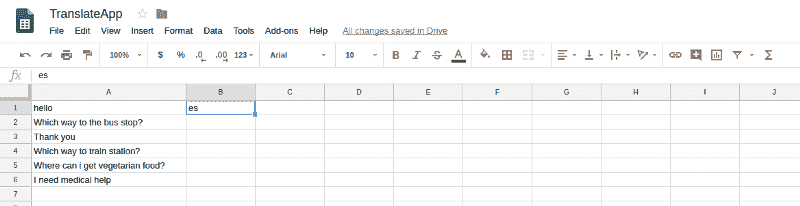
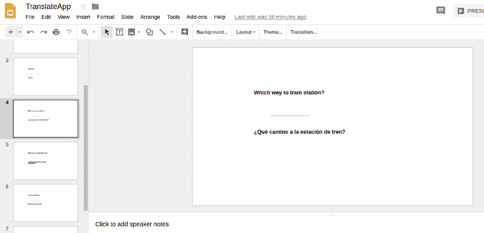

# 使用应用程序脚本破解 G 套件——不到一小时。

> 原文：<https://www.freecodecamp.org/news/how-i-built-a-hack-using-apps-scripts-in-under-an-hour-8442a1495dce/>

作者:苏普里亚·沙希瓦桑

# 使用应用程序脚本破解 G 套件——不到一小时。


你听说过 [Google Apps 脚本](https://developers.google.com/apps-script/)吗？我第一次接触到它是在班加罗尔举行的[谷歌开发者小组](https://www.meetup.com/GDGBangalore/)会议上。

Apps Script 通过运行类似于 JavaScript 的脚本来帮助你使用谷歌的 G Suite 产品。只需几行代码，用户只需点击一个按钮就可以完成工作，否则这将花费更多的时间。

Google Apps 脚本非常容易上手，可以帮助你利用 G Suite 构建复杂的系统。用户可以发布网络应用程序，并为谷歌幻灯片、表格和表单构建自定义功能。

在本文中，我将带您构建一个使用 Google Sheets、Google Slides 和 Google Translate 的小应用程序。

我为旅行者开发了这个应用程序。当我们访问外国时，由于语言障碍，交流成为一个问题。人们经常随身携带闪存卡，以帮助与当地人交流。


Photo by [Soner Eker](https://unsplash.com/@sonereker?utm_source=medium&utm_medium=referral) on [Unsplash](https://unsplash.com?utm_source=medium&utm_medium=referral)

我们要建造的正是这个。问题和短语放在谷歌表单上。然后，一个脚本翻译这些句子，并把它们写到谷歌幻灯片上。那里！！翻译好的闪存卡已经可以使用了。

现在，*准备就绪。设定代码*


### 存储数据

这里的数据是你要翻译的句子/单词。它们存储在 Google 工作表的行中。

因此，电子表格的结构将是:

*   每一行都将填入你想要翻译的句子。
*   第二列包含的值告诉我们句子必须翻译成哪种语言。这里的值是[谷歌翻译语言代码](https://ctrlq.org/code/19899-google-translate-languages)。如果我想把句子翻译成西班牙语，代码就是“es”。



Filled Google Sheet

### 访问脚本编辑器

完成所需任务的脚本是在脚本编辑器中编写的。要访问此功能，请转到**工具>脚本编辑器** r。另一种访问脚本编辑器的方法是访问[应用程序脚本仪表板](https://script.google.com/home) ard 并创建一个新的应用程序脚本。用户编写的所有脚本都可以通过这个仪表板进行管理。

脚本编辑器包含一个名为 **Code.gs** 的空文件。我们将在这里用一个脚本编写代码。

### 主要功能

我们编写了一个主函数`sheetToSlide()`，在这个函数中，活动的工作表和幻灯片被初始化。另一个函数`translate()`在主函数中被调用。实际的逻辑就发生在这里。

```
function sheetToSlide() {  var sheet =   SpreadsheetApp.getActiveSheet();  var slide = SlidesApp.create('TranslateApp');  var data = sheet.getDataRange().getValues();  var lan= data[0][1];  Logger.log(lan);  for (var i=0; i<data.length; i++){     translate(i,data[i][0],lan,slide);  }}
```

在变量`data`中，电子表格的内容存储为多维数组。这些值可以通过`data[Row][Column]`访问。

它们连同需要翻译的`slide`变量和`language`一起被传递给`translate`函数进行进一步处理。

`Logger`是一个用于向日志控制台写入文本的类。这在开发代码的过程中帮助很大。代码的输出可以打印到调试日志中。要查看日志，请在脚本编辑器窗口中进入**视图> L** ogs。

### 翻译功能

在此功能中，新的幻灯片被添加到包含原始句子和翻译句子的演示文稿中。每个句子都插入到文本框中的新幻灯片中。

```
function translate(num,data,language,slide){  var translate_lang = LanguageApp.translate(data, 'en', language);  var card= slide.insertSlide(num);  var shapeEnglish = card.insertShape(SlidesApp.ShapeType.TEXT_BOX, 150,100,300,60);  var textEnglish = shapeEnglish.getText();    textEnglish.setText(data);  textEnglish.getTextStyle().setBold(true);  card.insertLine(SlidesApp.LineCategory.STRAIGHT, 200,175,300,175)      var shapeTranslated = card.insertShape(SlidesApp.ShapeType.TEXT_BOX, 150,200,300,60);  var textTranslated = shapeTranslated.getText();  textTranslated.setText(translate_lang);  textTranslated.getTextStyle().setBold(true);  }
```

获得的句子首先使用 Google Translate 进行翻译，它是 G Suite 的一部分。

插入一个新的幻灯片来保存句子。在幻灯片中，文本框被放置在特定位置。你可以通过浏览这里的文档来修改它。

必须在文本框中显示的文本是使用`getText()`和`setText()`方法完成的。这些都是谷歌幻灯片的属性，你可以根据自己的意愿进行操作和定制。

这里的设计非常简单。使用`insertLine()`方法在中间放置一条水平线来分割原文和译文。Google 提供的文档中详细给出了所有这些方法的属性和变量。



要运行脚本，请单击时间图标旁边的运行按钮。该脚本将弹出一个窗口，询问是否允许访问工作表和幻灯片，只需允许即可。接下来，转到你的驱动器，一个新的演示将会准备好，它将会在卡片上有翻译的句子。

这就是应用程序脚本是多么有用和简单。你也可以通过使用 Google Sheets 来填充 Firebase 实时数据库。只需编写几行简单的脚本，你就可以自动化很多事情，还可以构建可以托管的 web 应用。

应用程序脚本非常强大，它的目标是让用户的服务自动化。下次你想给一群人发邮件的时候，试着用应用程序脚本。一旦你掌握了窍门，你就可以创建奇妙的东西，像网页、你自己的博客、幻灯片等等。

希望这有帮助。干杯！！

你可以随时联系我！

**推特**:【https://twitter.com/@s_omeal】T2

**payback hub**:paybackhub.com 和**cert hive**:certhive.com