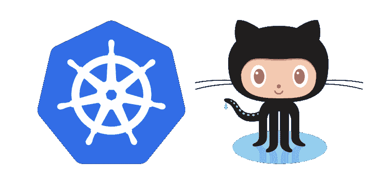

# 我如何构建 Kubernetes 集群，以便我的同事可以更快地部署应用程序

> 原文：<https://www.freecodecamp.org/news/how-i-built-a-kubernetes-cluster-so-my-coworkers-could-deploy-apps-faster-ad5567bf6fa8/>

作者:cheungpat

# 我如何构建 Kubernetes 集群，以便我的同事可以更快地部署应用程序

[Kubernetes](https://kubernetes.io/) x [GitHub](https://github.com/)

你如何鼓励你的开发团队构建更多的项目而不被部署所困扰？作为一家开发移动和网络产品的公司，我们的首要任务是创造一个团队成员专注于开发而非部署的环境。

但是，即使我们有一个部署平台，我们仍然需要有人来管理行政。作为工程师，我们必须重复的任何事情，我们都希望自动化。

让我们的开发人员访问我们的部署平台的安全方法是什么？

1.  我们希望允许我们的开发人员构建他们自己的项目(可能是个人的),而不需要向管理员请求许可或资源来部署新的应用程序进行测试或试验
2.  我们的开发人员可以部署自己的应用程序，更新或删除它
3.  降低尝试新事物的门槛(可以这么说)

### 我们的解决方案:库比涅斯

我们的解决方案是对我们的 Kubernetes 集群使用 GitHub 认证。

对于那些不知道的人来说， [Kubernetes](https://kubernetes.io/docs/concepts/overview/what-is-kubernetes/) 是 Google 开发的一个生产就绪的容器编排引擎。这是一个开源平台，实现了集装箱操作的自动化。比如跨主机(或节点)集群的部署和扩展。

有了 Kubernetes，我们能够支持我们的开发人员作为需要部署应用程序和无缝推出新功能的客户，而无需大量的管理开销。容器技术是打包后端应用程序并在服务器上运行它们的良好实践。我们在同一个集群中运行来自不同项目的容器。Kubernetes 让我们可以更少地关注单个服务器。我们可能认为 Kubernetes 是“一台大型计算机”,我们的团队成员可以在它上面运行容器。

### 允许我们的团队访问集群

我们希望同事拥有自己的用户凭据来访问集群。这节省了管理员的时间，因为他们不需要为每个用户开一个新账户。新用户可以自己生成凭据，或者在丢失凭据时生成新的凭据。

我们一直在寻找能够满足以下所有要求的身份认证解决方案:

1.  应该节省管理时间(因为他们也是我们的开发人员)
2.  新用户可以生成自己的凭据，而不需要管理员
3.  出于安全原因，用户凭证始终是私有的
4.  开发者有他们自己的实验空间
5.  多个用户可以访问和修改项目空间
6.  将来，我们可能希望启用审计来跟踪变更

### 尝试—大多数现有的身份认证策略都不适合

首先，许多现有的身份验证方法仍然需要管理员来生成或管理帐户。这是我们排除大部分的主要原因。

下面，我会列出一些常见的供参考，但如果你只是想了解我们为什么选择 GitHub 认证，可以随意跳到下一节。

#### **基于证书的**

每个用户都有自己的私有 SSL 证书来访问集群，这可能很难设置。这意味着管理员需要管理公钥基础设施(即认证机构)来签署用户证书。此外，当 1)有新用户，2)证书过期，或 3)用户丢失证书/私钥时，管理员需要这样做。最后，当用户想要在多台计算机上使用相同的 SSL 证书时，他们必须管理自己的私钥材料，这是一个潜在的安全弱点。

#### **基于用户名/密码的**

由于每个人都知道如何使用用户名和密码，这比基于证书的认证更容易实现。然而，Kubernetes 没有一个用户友好的界面让我们的团队成员创建他们自己的帐户，这意味着我们仍然需要一个管理员为每个用户生成一组用户名和密码。此外，这意味着如果用户丢失密码，管理员需要重置用户密码。如果没有用户友好的 UI，用户也很难更改密码。Kubernetes 还要求在用户名/密码列表改变时重启 API 服务器。

#### **基于预生成令牌的**

与基于用户名/密码的方法类似，管理员仍然需要生成令牌。

[**Open ID Connect(OIDC)**](http://openid.net/connect/)**:**在我们构建 Kubernetes 集群的时候，OIDC 的支持还没有完全成熟，我们还不确定如何将 OIDC 与谷歌账户集成。如果 OIDC 完全由 Kubernetes API 服务器和客户端命令实现，它是一个不错的选择(我上次检查时没有实现)。

### 使用 GitHub 认证的 5 个简单理由

GitHub 认证是一个简单的解决方案，因为:

1.  我们公司的每个人都已经有了一个 GitHub 账户
2.  这解决了我们的管理开销问题，因为人们管理他们自己的令牌
3.  用户可以在[github.com](http://github.com)上轻松生成访问令牌
4.  它非常灵活，因为用户只需生成新的令牌，就可以在不同的计算机上访问 Kubernetes 集群
5.  总是可以通过移除[github.com](http://github.com)上的访问令牌来撤销访问(以防 github 令牌泄露)

### 实现 GitHub 认证

我们使用 GitHub 令牌验证我们的团队成员。

Kubernetes 支持一个 [webhook 令牌认证器插件](https://github.com/kubernetes/kubernetes/pull/24902)来允许远程服务进行认证。所以我们所要做的就是实现一个验证令牌的 webhook。

当用户试图向 Kubernetes API 认证时，Kubernetes API 服务器调用这个认证器来验证承载令牌。这个验证器使用 GitHub API 检查访问令牌是否有效，并通过检查被请求的用户是否有权访问资源，将 GitHub 用户名返回给 API 服务器。它使用基于角色的访问控制(RBAC)规则。

注意，我们必须在 Kubernetes master 上运行 webhook，以便 API 服务器访问它。

这就是我们实际上如何[实现 WebHook](https://github.com/oursky/kubernetes-github-authn/blob/master/main.go) :

我们使用了 [RBAC](https://en.wikipedia.org/wiki/Role-based_access_control) ,因为它提供了最高的灵活性，而无需在 API 服务器上进行配置更改。除了 RBAC，Kubernetes 还有各种授权策略。

目前，GitHub 认证并没有完全解除管理员的责任。在某些情况下仍然需要管理员:

1.  如果用户想要自己的个人名称空间，管理员仍然需要为该用户创建名称空间并设置 RBAC 规则
2.  如果有一个新项目，管理员仍然需要为这个项目创建名称空间并设置 RBAC 规则

在设置项目时，管理员可以指定一个团队领导来控制参与团队成员的 RBAC 规则，并控制谁有权访问项目名称空间。

### 现在我们的 sky 团队成员可以使用 GitHub 访问集群了

每当我们的队友需要为他们的项目进行新的部署时(即使是个人项目)，他们可以从 GitHub 获得一个令牌。我们希望这能鼓励我们的团队构建一些有趣的东西，而不用担心稳定的部署。

欢迎大家来看看[这个 github 库](https://github.com/oursky/kubernetes-github-authn)中的具体实现。您也可以在自己的集群中随意实现这个解决方案。

*打造 app？我目前在 [Oursky](https://www.freecodecamp.org/news/how-i-built-a-kubernetes-cluster-so-my-coworkers-could-deploy-apps-faster-ad5567bf6fa8/undefined) 做一个[开源后端](http://skygear.io/)，这会让你的工作更容易。*