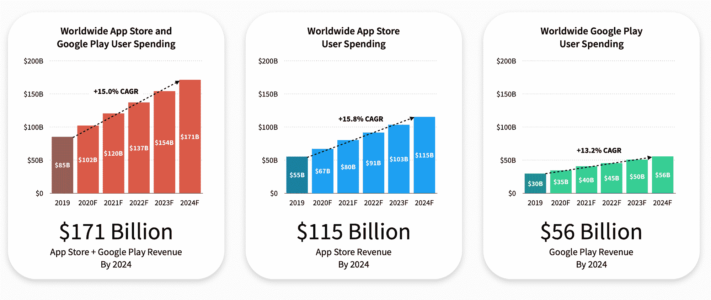
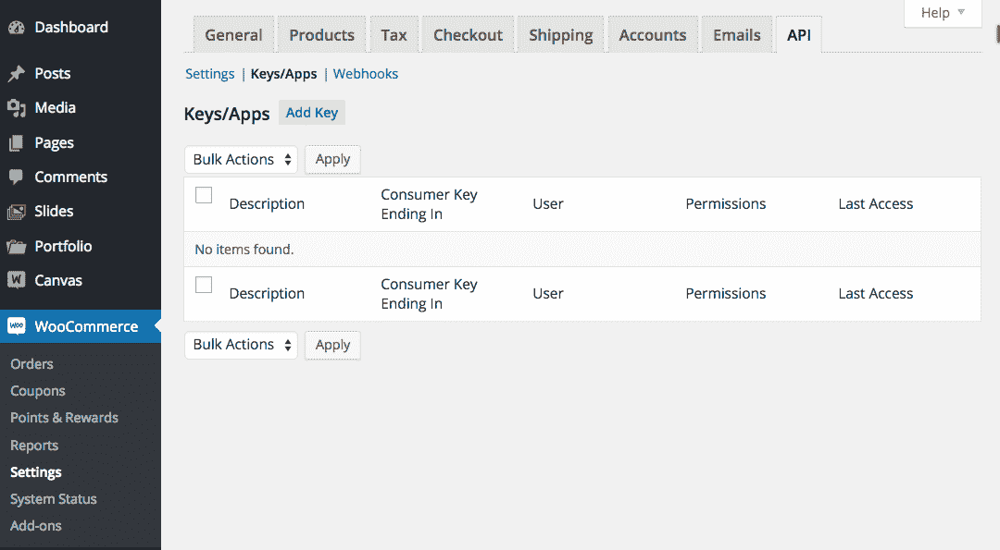
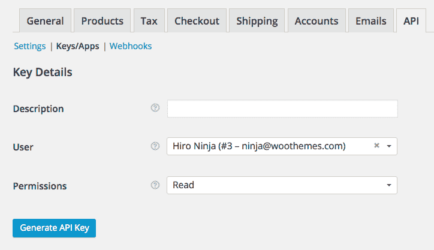
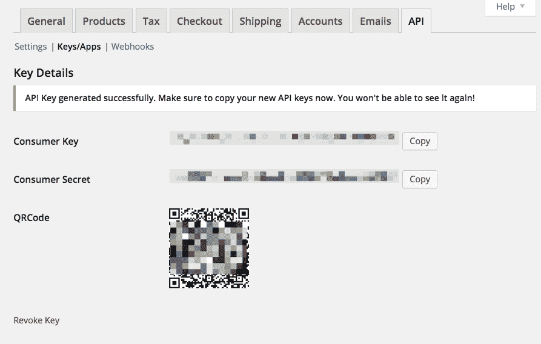

# 我如何在新冠肺炎封锁期间开发一个在线购物的移动应用程序

> 原文：<https://www.freecodecamp.org/news/how-i-built-a-mobile-app-for-online-shopping-amid-covid-19-lock-down/>

当许多销售非必需品的商店在三月份被政府命令关闭时，消费者将他们的购物转移到了网上。根据 Adobe Analytics 的数据，4 月份美国在线销售额同比增长 49%。

台式机的销量增长并不明显。但 Instacart [等移动购物应用的增幅约为 650%(哇！)](https://www.visualcapitalist.com/covid-19-impact-on-popularity/)3 月至 4 月间，新增移动应用用户(仅在美国)中。

因此，为了让电子商务商店充分利用冠状病毒疫情期间网上购物者的增加，他们应该有一个本地移动应用程序。

在本教程中，我将使用 Woocommerce 主题开发一个原生移动 Android 应用程序。我还会解释为什么我选择了原生移动应用(而不是混合应用或渐进式网络应用)和 Woocommerce 主题。更好的是，我将从一些研究数据开始，来说明电子商务商店拥有一个移动应用程序是多么重要。

## 实体店的客流量几乎消失了


Is there anybody out there?

消费者调查显示，只要新冠肺炎仍然是一个威胁，向网上购物的转变就会继续。2020 年 3 月下旬对 1200 名消费者的调查发现，由于冠状病毒疫情，90%的购物者在商店购物时犹豫不决。45%的人预计网上购物将是他们在危机期间的必需品。

4 月份的另一项调查发现，55%的网上消费者表示，他们在网上订购的东西比病毒来袭前多了，高于 3 月份的 26%。22%的人表示，4 月份他们在网上订购的数量大大增加，而 3 月份只有 6%。

如果疫情继续徘徊，在零售商一年中最大的两个季节——返校和假日购物期间，可能会出现向网上购物的巨大转变。在 3 月份接受调查的零售商中，23%的零售商计划因冠状病毒爆发而转移资源。

零售业被迫做出一些重大改变。由于所有非必要的业务都被要求关闭，实体零售店的客流量几乎消失了。即使交错重新开放，拥有电子商务功能的重要性比以往任何时候都更加明显。

疫情证明了各种类型的企业都需要灵活应变，需要实现数字化飞跃。电子商务将成为新常态的前沿和中心。

## 但是我的客户有一个响应网站！

许多趋势正在融合，使得网站所有者想要一个本地移动应用程序。每个网站所有者的主要目标是通过接触更多的用户来增加业务价值。我认为，手机的使用正在上升，越来越多的人用手机而不是台式机进行互动，这并不奇怪。

为了进入这个手机用户市场，我们需要知道这些手机用户与哪些类型的应用程序交互最多(渐进式网络应用程序、混合应用程序、响应式移动网站或原生应用程序)。对我们来说幸运的是, [Go-Globe](https://www.go-globe.com/mobile-apps-usage) 的人做了一项分析:多达 85%的移动用户与本地移动应用互动最多。

在冠状病毒疫情肆虐之际，企业应该拥有一款本土移动应用，以满足越来越多的在线购物者的需求，还有许多其他原因。现在让我们更深入地探索一下。

### 它们为忠诚的网站访问者提供了更好的体验

移动网站是伟大的发现。但是忠实用户——那些经常回来的用户——想要一个应用程序。人们在移动设备上使用应用程序比使用搜索更多。用户主屏幕上的一个品牌(即一个应用程序)是一个网站及其内容的持续提醒。

### 他们直接与网站访问者联系

一个品牌可以出现在所有的社交渠道上，但只有一小部分用户会看到它的信息。电子邮件也可以发送，但在 25%的打开率下，只有一小部分受众会被触及。

一个品牌化的手机 app 给用户一条直线，最终留住用户，把不经意的访客变成忠实用户。

### 他们利用移动设备的功能

原生移动应用程序具有利用手机功能的优势，如相机、联系人列表、GPS、电话、加速度计、指南针等。这种设备功能在应用程序中使用时，可以使用户体验互动和有趣。

此外，这些功能还可以减少用户的工作量。例如，想知道一家企业位置的用户可以使用 GPS/导航来轻松找到它(在食品应用程序中尤其有用)。

这些功能还可以显著缩短用户在应用程序中执行某项任务的时间，甚至可以提高转化率。

移动网站、PWAs 和混合应用程序也可以使用该设备的一些功能。尽管如此，在利用本地移动应用程序可以轻松使用的设备的所有功能方面，仍然存在技术约束或限制。

### 他们给你离线工作的能力

这大概是移动网站和 app 最根本的区别。虽然原生移动应用程序可能需要互联网连接来执行大多数任务，但它们仍然可以在离线模式下为用户提供基本的内容和功能。

让我们以一个电子商务网站为例——该应用程序可以提供税收和分期付款计算等功能，并确定用户的消费限额。这些功能甚至可以在没有互联网连接的帮助下工作。

即使移动网站、pwa 和混合移动应用可以在没有互联网连接的情况下使用缓存来加载网页，它们也只能提供有限的功能。

### 它们有助于提高品牌知名度

用户在移动设备上花费大量时间。可以肯定地说，许多用户几乎每天都会看到他们安装在设备上的应用程序。

这种定期的接触可以被视为应用程序的品牌推广机会。即使用户没有主动使用移动应用程序，他们仍然会被提醒与该应用程序相关的品牌。这款应用的图标就像是品牌的迷你广告。

用户设备上应用的存在有助于影响他们潜意识中对品牌的认知。这种行为可以与信号检测理论联系起来，该理论表明用户仍然会在某种程度上潜意识地处理他们忽略的广告。

### 应用程序可以比网站运行得更快

一个设计良好的移动应用程序可以比移动网站更快地执行操作。与通常使用网络服务器的网站相比，应用程序通常将数据存储在本地移动设备上。出于这个原因，数据检索在移动应用程序中迅速发生。

应用程序可以存储用户的偏好，并代表他们采取主动行动，从而进一步节省用户的时间。

还有一个技术上的理由来解释为什么移动应用程序可以运行得更快。移动网站使用 JavaScript 代码来执行大部分功能。移动应用程序使用的一些框架的运行速度几乎是 JavaScript 的五倍！

虽然所有这些都是在后台发生的，但用户可以在移动应用的前端更快地完成操作，这再次带来了令人愉快的用户体验。

### 他们增加了网站的搜索引擎优化潜力

移动应用在两个方面具有优势——应用内内容和网站内容，因为在产品和服务的内容中会使用同义词。谷歌现在也对应用内的内容进行排名，你可以在你的应用中修改你的内容来帮助你的网站 SEO。

### 尽管受到新冠肺炎经济的影响，移动应用支出预计到 2024 年将翻一番

[根据修订后的 2020-2024 年市场预测](https://sensortower.com/blog/sensor-tower-app-market-forecast-2024)，到 2024 年，全球消费者在移动应用上的支出预计将达到 1710 亿美元。这比 2019 年的 850 亿美元增加了一倍多。

然而，这个总数比该公司在新冠肺炎疫情爆发前发布的预测少了约 30 亿美元(或 2%)。



Mobile App Spending

尽管如此，值得注意的是，到 2024 年，即使是苹果应用商店和谷歌 Play 增长最慢的地区，其收入也将比 2019 年的水平高出 80%以上。在接下来的五年里，应用商店也将达到几个里程碑。

首先，全球移动应用支出将在 2020 年首次超过 1000 亿美元，同比增长约 20%，达到 1020 亿美元。这表明网站所有者不只是获得更多的客户，而是更多愿意消费的付费客户。

### 他们接触年轻观众

统计数据表明，18-24 岁的人是最活跃的移动应用用户。

还不服气？让这些数据说话吧:

1.  77%的美国人拥有智能手机。
2.  超过 2.3 亿美国消费者拥有智能手机。
3.  大约有 1 亿美国消费者拥有平板电脑。
4.  79%的智能手机用户在过去 6 个月中使用移动设备进行过在线购物。
5.  电子商务收入现在占全部零售收入的 10%。
6.  80%的购物者在实体店内使用手机查看产品评论、比较价格或寻找其他商店位置。
7.  据估计，目前有 100 亿台移动互联设备正在使用中。
8.  移动应用用户每月平均花费 201.8 分钟购物，而网站用户每月花费 10.9 分钟。
9.  58%的千禧一代提到他们更喜欢通过应用程序购买。

忽视移动电子商务(业内称为移动商务)发展中的这些趋势意味着随着这些趋势的继续，可能会错过越来越多的利润。

## 说够了！让我们写一些代码

所有的原生移动应用都只是一堆用 Java、Kotlin、Objective-C 或 Swift 编写的操纵数据和资源的代码(。png，。xml 文件)。可以从移动设备的传感器(如屏幕、相机、存储器、GPS、扬声器、加速度计、指南针)或从服务器检索经处理的数据。

在本教程中，我们将使用以下工具:

*   ****JSoup(一个** J **ava 库):**** JSoup 是一个 HTML 解析器，可以直接解析一个 URL，HTML 文本内容，并提供了一套非常方便的 API 接口来操作数据。
*   ****Android Studio:**** 这是一款用 Java 或 Kotlin 编写和编译 Android 应用程序的官方工具，并且生产即可安装。apk 文件。本教程中的所有代码都将使用 Java 编写。
*   Woocommerce 插件:这个[是 WordPress](https://trends.builtwith.com/shop/WooCommerce) 最流行的电子商务插件。因此，为最流行的电子商务插件开发一个移动应用似乎是个好主意。

## 从服务器获取和操作数据

将使用一个 RESTful API 从服务器获取数据。woo commerce(2.6+版)完全集成了 WordPress REST API。这允许使用 JSON 格式的请求来创建、读取、更新和删除数据。它使用 WordPress REST API 认证方法和大多数 HTTP 客户端理解的标准 HTTP 动词。

我将使用 API 版本 2，v2，它适用于 Woocommerce 版本 3.0.x 或更高版本以及 WordPress 版本 4.4 或更高版本。

默认的响应格式是 JSON。成功的请求将返回一个`200 OK` HTTP 状态。关于响应的一些关键信息如下:

*   日期以 ISO8601 格式返回:`YYYY-MM-DDTHH:MM:SS`
*   资源 id 作为整数返回。
*   任何十进制货币金额，如价格或总额，都将作为具有两位小数的字符串返回。
*   其他数量(如项目计数)以整数形式返回。
*   空白字段一般被包含为`null`或空字符串，而不是被省略。

向 Woocommerce REST API 发出的大多数请求都必须使用预先生成的密钥(消费者密钥和消费者秘密)进行认证。新的密钥通过 WordPress 管理界面生成。只需进入 WooCommerce >设置> API >按键/应用程序。



单击“添加密钥”按钮。在下一个屏幕中，添加一个描述，并选择您想要为其生成密钥的 WordPress 用户。然后点击“生成 API 密钥”按钮，WooCommerce 将为所选用户生成 REST API 密钥。



现在已经生成了密钥，您应该会看到两个新的密钥。这两个密钥是您的消费者密钥和消费者秘密。



然后，我们创建一个 URL，其中包含业务网站和 API 端点，JSON 格式的数据将从该端点返回。

使用 Jsoup 库，我们连接到 URL(网站+ API 端点)并添加 API 密钥(消费者密钥和消费者秘密)以及 API 端点的其他参数。几乎所有端点都接受可选参数，这些参数可以作为 HTTP 查询字符串参数传递:

```
public static final int JSOUP_CONNECTION_TIMEOUT = 100000;

String websiteUrl = "www.freecodecamp.shop"; //example website doesn't exist
//This API lets you retrieve all product categories
String apiExtension = "/wp-json/wc/v2/products/categories";
//Map to store our parameters in a key value format
HashMap<String, String> data = new HashMap<>();
data.put("page", String.valueOf(page)); // API parameter to get the current page of the collection. Default is 1.
//add API keys for authentication
data.put("consumer_key", getKey());
data.put("consumer_secret", getSecret());

//concatenate both websiteUrl and apiExtension to form the requestUrl
String requestUrl = websiteUrl + apiExtension

try {
    Connection.Response response = Jsoup.connect(requestUrl).timeout(JSOUP_CONNECTION_TIMEOUT).followRedirects(true)
        .ignoreContentType(true)
        .data(data)
        .execute();

    String json = response.body();
	//parse json string to get needed data.

} catch (Exception e){
    //catch both JSONException and IOException
}
```

`getKey()`和`getSecret()`方法只返回 API 键:

```
 public static String getKey() {
        return "ck_a89d59d7441f027df0d91f01c9e2dcaxxxxxxxxx";
    }

    public static String getSecret() {
        return "cs_c3f8fe620bd5b1cb3567712eb843609xxxxxxxxx";
    }
```

但是等等...对于一些网站，当我运行这段代码时，它给我错误`401 Unauthorized`。由于 API 密钥不正确，这是一个身份验证或权限错误...那么是什么原因呢？

当然，上述代码只适用于使用 HTTPS 协议的安全网站，而使用 HTTP 协议的不安全网站在发送 API 密钥之前需要对其进行加密。

这到底是什么意思？HTTPS 是带加密的 HTTP，因为 HTTPS 使用 TLS (SSL)来加密普通的 HTTP 请求和响应。这使得 HTTPS 比 HTTP 更安全。使用 HTTP 的网站在其 URL 中有 http://，而使用 HTTPS 的网站有 https://。

您必须使用 OAuth 1.0a“单脚”认证来确保您的 REST API 凭证不会被攻击者截获。需要的参数有 *oauth_consumer_key、oauth_timestamp、oauth_nonce、oauth_signature* 和 *oauth_signature_method。*

我们将创建一个方法，以 HashMap 的形式获取这些加密的参数。方法`getAuthenticationPrams(String url, HashMap<String, String> mData)`将接受一个请求 URL(网站 URL + API 扩展)和我们可能想要添加到 API 扩展的任何参数。

在这里，我们收集并规范化我们的参数，其中包括除了 *oauth_signature* 本身之外的所有 *oauth_** 参数。

```
public static HashMap<String, String> getAuthenticationParams(String url, @Nullable HashMap<String, String> mData){
    HashMap<String, String> data = new HashMap<>();
    if(url.startsWith("http://")){
        String nonce = new TimestampService().getNonce();
        String timestamp = new TimestampService().getTimestampInSeconds();

        data.put("oauth_consumer_key", getKey());
        data.put("oauth_signature_method", "HMAC-SHA1");
        data.put("oauth_version", "1.0");
        data.put("oauth_nonce", nonce);
        data.put("oauth_timestamp", timestamp);

        if(mData != null)
            data.putAll(mData);

        String firstBaseString = "GET&" + urlEncoded(url);
        String generatedBaseString = formatQuery(data);

        ParametersList result = new ParametersList();
        result.addQuerystring(generatedBaseString);
        generatedBaseString = result.sort().asOauthBaseString();
        String secondBaseString = "&" + generatedBaseString;

        if (firstBaseString.contains("%3F")) {
            secondBaseString = "%26" + urlEncoded(generatedBaseString);
        }
        String baseString = firstBaseString + secondBaseString;
        String signature = new HmacSha1SignatureService().getSignature(baseString, getSecret(), "");
        data.put("oauth_signature", signature);

    } else{
        data.put("consumer_key", getKey());
        data.put("consumer_secret", getSecret());

        data.putAll(mData);
    }

    return data;
} 
```

`TimestampService`类为 *oauth_nonce* 和 *oauth_timestamp* 参数生成时间戳和 nonce。

```
import java.util.Random;

public class TimestampService {
    private Timer timer;

    /**
     * Default constructor.
     */
    public TimestampService() {
        timer = new Timer();
    }

    public String getNonce() {
        Long ts = getTs();
        return String.valueOf(ts + timer.getRandomInteger());
    }

    public String getTimestampInSeconds() {
        return String.valueOf(getTs());
    }

    private Long getTs() {
        return timer.getMilis() / 1000;
    }

    void setTimer(Timer timer) {
        this.timer = timer;
    }

    /**
     * Inner class that uses {@link System} for generating the timestamps.
     *
     */
    static class Timer {
        private final Random rand = new Random();
        Long getMilis() {
            return System.currentTimeMillis();
        }

        Integer getRandomInteger() {
            return rand.nextInt();
        }
    }

}
```

`formatQuery(HashMap<String, String> mData)`方法将参数格式化为查询参数，查询参数是附加在 url 末尾的一组参数。`urlEncoded(String url)`方法使用特定的编码方案将给定的字符串翻译成 application/x-www-form-urlencoded 格式。此方法使用提供的编码方案来获取不安全字符的字节。

```
import java.io.UnsupportedEncodingException;
import java.net.URLEncoder;

    private static String formatQuery(HashMap<String, String> mData){
        int i = 0;
        StringBuilder param = new StringBuilder();
        for(String key : mData.keySet()){
            if(i > 0){
                param.append("&");
            }
            param.append(key);
            param.append("=");
            param.append(mData.get(key));
            i++;
        }

        return param.toString();
    }

    private static String urlEncoded(String url) {
        String encodedurl = "";
        try {
            encodedurl = URLEncoder.encode(url, "UTF-8");
        } catch (UnsupportedEncodingException e) {
            e.printStackTrace();
        }

        return encodedurl;
    }
```

`ParametersList`类获取格式化的查询，然后使用`OAuthEncoder`类对其进行编码。以 *oauth_** 开头的值需要被编码成一个字符串，供以后使用。构建字符串的过程非常具体:

1.  百分比对将要签名的每个密钥和值进行编码。
2.  按编码键的字母顺序对参数列表进行排序。
3.  对于每个键/值对:

*   将编码的密钥追加到输出字符串中
*   将`=`字符追加到输出字符串中
*   将编码值追加到输出字符串中
*   如果还剩下更多的键/值对，那么在输出字符串中添加一个`&`字符。

```
import java.util.ArrayList;
import java.util.Collections;
import java.util.List;
import java.util.Map;

public class ParametersList {
    private static final char QUERY_STRING_SEPARATOR = '?';
    private static final String PARAM_SEPARATOR = "&";
    private static final String PAIR_SEPARATOR = "=";
    private static final String EMPTY_STRING = "";

    private final List<Parameter> params;

    public ParametersList() {
        params = new ArrayList<Parameter>();
    }

    ParametersList(List<Parameter> params) {
        this.params = new ArrayList<Parameter>(params);
    }

    public void add(String key, String value) {
        params.add(new Parameter(key, value));
    }

    public String asOauthBaseString() {
        return OAuthEncoder.encode(asFormUrlEncodedString());
    }

    public String asFormUrlEncodedString() {
        if (params.size() == 0) return EMPTY_STRING;

        StringBuilder builder = new StringBuilder();
        for(Parameter p : params) {
            builder.append('&').append(p.asUrlEncodedPair());
        }
        return builder.toString().substring(1);
    }

    public void addAll(ParametersList other) {
        params.addAll(other.params);
    }

    public void addQuerystring(String queryString) {
        if (queryString != null && queryString.length() > 0) {
            for (String param : queryString.split(PARAM_SEPARATOR)) {
                String pair[] = param.split(PAIR_SEPARATOR);
                String key = OAuthEncoder.decode(pair[0]);
                String value = pair.length > 1 ? OAuthEncoder.decode(pair[1]) : EMPTY_STRING;
                params.add(new Parameter(key, value));
            }
        }
    }

    public boolean contains(Parameter param) {
        return params.contains(param);
    }

    public int size() {
        return params.size();
    }

    public ParametersList sort() {
        ParametersList sorted = new ParametersList(params);

        Collections.sort(sorted.params);
        return sorted;
    }
} 
```

```
public class Parameter implements Comparable<Parameter> {
    private final String key;
    private final String value;

    public Parameter(String key, String value) {
        this.key = key;
        this.value = value;
    }

    public String asUrlEncodedPair() {
        return OAuthEncoder.encode(key).concat("=").concat(OAuthEncoder.encode(value));
    }

    public boolean equals(Object other) {
        if(other == null) return false;
        if(other == this) return true;
        if(!(other instanceof Parameter)) return false;

        Parameter otherParam = (Parameter) other;
        return otherParam.key.equals(key) && otherParam.value.equals(value);
    }

    public int hashCode() {
        return key.hashCode() + value.hashCode();
    }

    public int compareTo(Parameter parameter) {
        int keyDiff = key.compareTo(parameter.key);

        return keyDiff != 0 ? keyDiff : value.compareTo(parameter.value);
    }
} 
```

```
import java.io.UnsupportedEncodingException;
import java.net.URLDecoder;
import java.net.URLEncoder;
import java.util.Collections;
import java.util.HashMap;
import java.util.Map;
import java.util.regex.Pattern;

public class OAuthEncoder {
    private static String CHARSET = "UTF-8";
    private static final Map<String, String> ENCODING_RULES;

    static {
        Map<String, String> rules = new HashMap<String, String>();
        rules.put("*", "%2A");
        rules.put("+", "%20");
        rules.put("%7E", "~");
        ENCODING_RULES = Collections.unmodifiableMap(rules);
    }

    private OAuthEncoder(){}

    public static String encode(String plain) {
        String encoded = "";
        try {
            encoded = URLEncoder.encode(plain, CHARSET);
        }
        catch (UnsupportedEncodingException uee) {
            throw new OAuthException("Charset not found while encoding string: " + CHARSET, uee);
        }
        for(Map.Entry<String, String> rule : ENCODING_RULES.entrySet()) {
            encoded = applyRule(encoded, rule.getKey(), rule.getValue());
        }
        return encoded;
    }

    private static String applyRule(String encoded, String toReplace, String replacement) {
        return encoded.replaceAll(Pattern.quote(toReplace), replacement);
    }

    public static String decode(String encoded) {
        try {
            return URLDecoder.decode(encoded, CHARSET);
        }
        catch(UnsupportedEncodingException uee) {
            throw new OAuthException("Charset not found while decoding string: " + CHARSET, uee);
        }
    }
} 
```

```
public class OAuthConstants {
    private OAuthConstants(){}

    public static final String OUT_OF_BAND = "oob";
}
```

```
public class OAuthException extends RuntimeException {

    /**
     * Default constructor
     * @param message message explaining what went wrong
     * @param e original exception
     */
    public OAuthException(String message, Exception e) {
        super(message, e);
    }

    /**
     * No-exception constructor. Used when there is no original exception
     *
     * @param message message explaining what went wrong
     */
    public OAuthException(String message) {
        super(message, null);
    }

    private static final long serialVersionUID = 1L;
} 
```

收集的值( *oauth_** 参数+ API 扩展参数)必须连接成一个字符串，签名将从该字符串生成。在 OAuth 规范中，这被称为签名基本字符串。

要将 HTTP 方法、请求 URL 和参数字符串编码成单个字符串:

1.  将输出字符串设置为大写的 HTTP 方法(本例中为 GET)。
2.  将`&`字符追加到输出字符串。
3.  百分比对 URL 进行编码，并将其附加到输出字符串中。
4.  将`&`字符追加到输出字符串中
5.  对参数 strng 进行百分比编码，并将其追加到输出字符串中。

`HmacSha1SignatureService`类通过 HMAC-SHA1 散列算法，使用签名基本字符串和带有`&`字符的用户密钥生成签名。

```
import android.util.Base64;

import javax.crypto.Mac;
import javax.crypto.spec.SecretKeySpec;

public class HmacSha1SignatureService {
    private static final String EMPTY_STRING = "";
    private static final String CARRIAGE_RETURN = "\r\n";
    private static final String UTF8 = "UTF-8";
    private static final String HMAC_SHA1 = "HmacSHA1";
    private static final String METHOD = "HMAC-SHA1";

    public String getSignature(String baseString, String apiSecret, String tokenSecret) {
        try {
            return doSign(baseString, OAuthEncoder.encode(apiSecret) + '&' + OAuthEncoder.encode(tokenSecret));
        }
        catch (Exception e) {
            throw new OAuthSignatureException(baseString, e);
        }
    }

    private String doSign(String toSign, String keyString) throws Exception {

        SecretKeySpec key = new SecretKeySpec((keyString).getBytes(UTF8), HMAC_SHA1);
        Mac mac = Mac.getInstance(HMAC_SHA1);
        mac.init(key);
        byte[] bytes = mac.doFinal(toSign.getBytes(UTF8));
        return bytesToBase64String(bytes).replace(CARRIAGE_RETURN, EMPTY_STRING);
    }

    private String bytesToBase64String(byte[] bytes) {
        return Base64.encodeToString(bytes,Base64.NO_WRAP);
    }

    public String getSignatureMethod() {
        return METHOD;
    }
}
```

```
/**
 * Specialized exception that represents a problem in the signature
  */
public class OAuthSignatureException extends OAuthException {
    private static final long serialVersionUID = 1L;
    private static final String MSG = "Error while signing string: %s";

    /**
     * Default constructor
     *
     * @param stringToSign plain string that gets signed (HMAC-SHA, etc)
     * @param e original exception
     */
    public OAuthSignatureException(String stringToSign, Exception e) {
        super(String.format(MSG, stringToSign), e);
    }

} 
```

就是这样！现在你可以连接到任何使用 Woocommerce 插件的电子商务网站，而无需安装任何其他插件。使用 WordPress REST API，你可以通过它的 API 端点获得/操作你想要的数据。我使用的端点是:

1.  `/wp-json/wc/v2/customers` -允许您在通过应用程序的登录/登录屏幕验证客户后创建新客户。
2.  `/wp-json/wc/v2/payment_gateways` -让您检索和查看所有可用的支付网关
3.  `/wp-json/wc/v2/products` -帮助您查看网站上出售的所有产品
4.  `/wp-json/wc/v2/shipping/zones` -帮助您创建新的运输区域
5.  `/wp-json/wc/v2/settings/general/woocommerce_currency` -获取使用的货币
6.  `/wp-json/wc/v2/orders` -帮助您创建新订单
7.  `/wp-json/wc/v2/products/categories` -让您检索所有产品类别
8.  `/wp-json/wc/v2/coupons` -帮助您列出网站管理员创建的所有优惠券

这是我最后的手机应用程序:


My Final Product

## 使应用程序看起来漂亮的资源

在完成你的原生移动应用程序创建的过程中，你需要一个用户界面/UX，用户可以通过它来操作从 WordPress 服务器获取的数据。幸运的是， [Wsdesign](https://wsdesign.in/freebies/) 的人有一些免费的现成模板，你可以下载。

我希望这篇文章对你有用，能够帮助你学习和构建一个很棒的应用程序。如果你真的喜欢它，请在所有社交媒体平台上分享它。