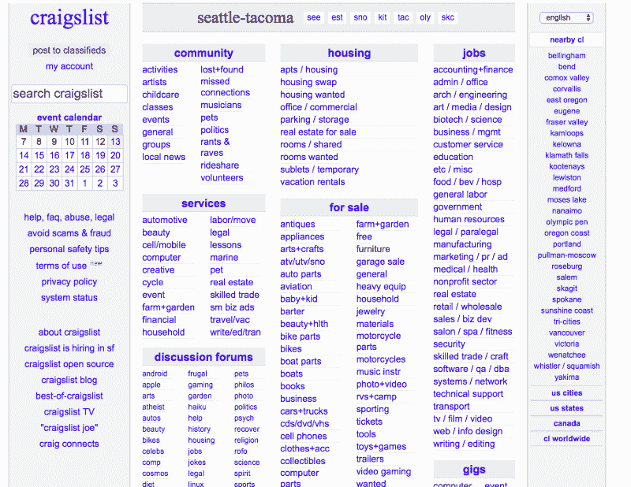
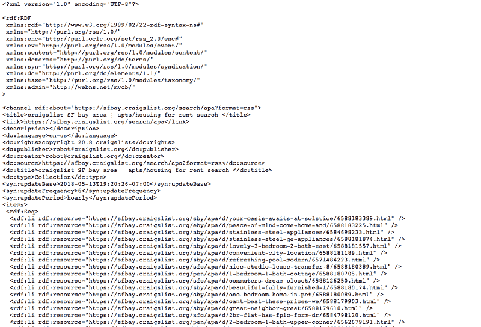
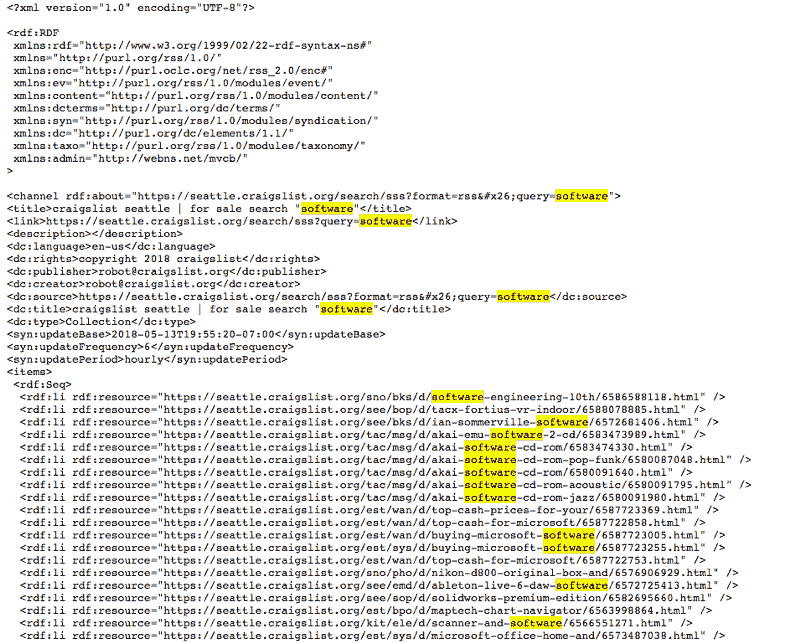
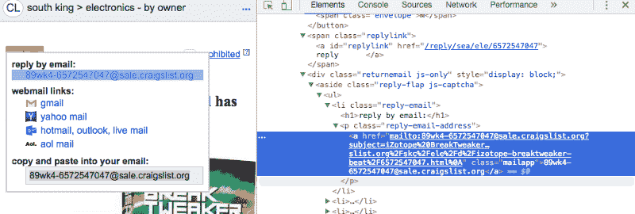
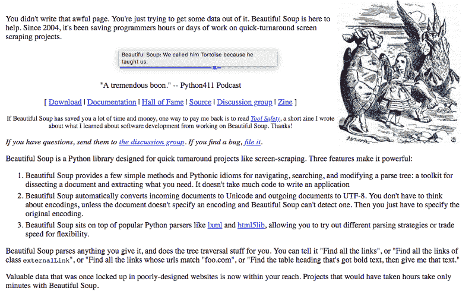
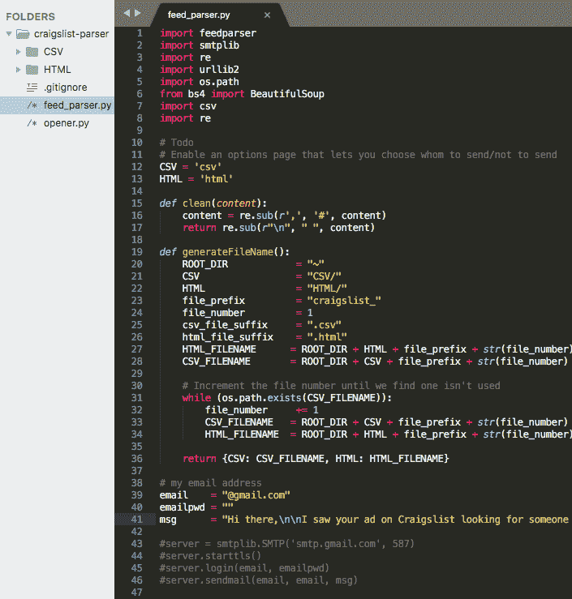

# 我是如何通过从头开始构建一个网络爬虫来实现求职自动化的

> 原文：<https://www.freecodecamp.org/news/how-i-built-a-web-crawler-to-automate-my-job-search-f825fb5af718/>

### 它是如何开始的故事

那是一个星期五的午夜，我的朋友们在外面玩得很开心，而我却被钉在电脑屏幕上打字。

奇怪的是，我并没有感到被冷落。

我在做一些我认为真正有趣和棒的事情。

我刚从大学毕业，需要一份工作。当我去西雅图的时候，我有一个装满大学课本和一些衣服的背包。我可以把我所有的东西放进我 2002 年本田思域的后备箱。

那时我不太喜欢社交，所以我决定用我知道的最好的方法来解决这个找工作的问题。我试图建立一个应用程序来为我做这件事，这篇文章是关于我是如何做的。？

### Craigslist 入门

我在自己的房间里，疯狂地开发一些软件，帮助我收集并回复那些在 Craigslist 上寻找软件工程师的人。Craigslist 本质上是互联网的市场，在那里你可以找到出售的东西、服务、社区帖子等等。

Craigslist

那时，我还没有构建一个完全成熟的应用程序。我在大学里做的大部分事情都是学术项目，包括构建和解析二叉树、计算机图形学和简单的语言处理模型。

我是相当的“新人”

也就是说，我一直听说这种新的“热门”编程语言叫做 Python。我对 Python 了解不多，但我想亲自动手，了解更多。

所以我将两者结合起来，决定使用这种新的编程语言来构建一个小应用程序。

### 构建(工作)原型的旅程

我有一台二手的明基笔记本电脑，是我去上大学时哥哥给我的，我用它来做开发。

无论如何，这都不是最好的开发环境。我使用的是 Python 2.4 和一个旧版本的 [Sublime text](https://www.sublimetext.com/2) ，然而从头开始编写应用程序的过程确实是一次令人兴奋的经历。

我还不知道我需要做什么。我尝试了各种各样的方法，看看哪些方法有效，我的第一个方法是找出如何轻松访问 Craigslist 数据。

我在 Craigslist 上查找他们是否有公开的 REST API。令我沮丧的是，他们没有。

然而，我找到了第二好的东西。

Craigslist 有一个 [RSS feed](https://www.craigslist.org/about/rss) 供个人使用。RSS 提要本质上是一个网站发出的更新的计算机可读摘要**。在这种情况下，RSS 提要允许我在新的工作列表发布时获取它们。这是**对我需求的完美**。**

Example of what an RSS feed looks like

接下来，我需要一种方法来阅读这些 RSS 提要。我不想自己手动浏览 RSS 提要，因为那样会浪费时间，而且和浏览 Craigslist 没什么区别。

大约在这个时候，我开始意识到谷歌的力量。有一个流传已久的笑话，软件工程师花了大部分时间在谷歌上寻找答案。我认为这肯定是有一定道理的。

谷歌了一下之后，我在 StackOverflow 上找到了这个有用的帖子，描述了如何搜索 Craiglist RSS 提要。这是 Craigslist 免费提供的一种过滤功能。我所要做的就是用我感兴趣的关键字传入一个特定的查询参数。

我专注于在西雅图寻找与软件相关的工作。然后，我输入这个特定的 URL，在西雅图查找包含关键字“软件”的列表。

> [https://seattle.craigslist.org/search/sss?format=rss&查询=软件](https://seattle.craigslist.org/search/sss?format=rss&query=software)

瞧！它运行得非常好。

Example RSS feed for Seattle with “software” in the title

### 我尝过的最美味的汤

然而，我不相信我的方法会奏效。

首先，**的上市数量有限**。我的数据并不包含**西雅图所有的招聘信息。返回的结果只是整体的一个子集。我想尽可能地广撒网，所以我需要知道所有的工作列表。**

第二，我意识到 RSS 提要**不包含任何联系信息**。那是令人失望的。我可以找到这些列表，但我无法联系到发帖者，除非我手动筛选这些列表。

Screenshot of the Craigslist reply link

我有很多技能和兴趣，但做重复性的体力工作不是其中之一。我本可以雇人帮我做的，但是我只能靠 1 美元的拉面勉强度日。我不能在这个副业上挥霍。

那是个死胡同。但这还不是结束。

### 连续迭代

从我第一次失败的尝试中，我了解到 Craigslist 有一个我可以过滤的 RSS feed，并且每个帖子都有一个到实际帖子本身的链接。

好吧，如果我能看到真正的帖子，也许我能从上面刮下电子邮件地址？？这意味着我需要想办法从最初的帖子中获取电子邮件地址。

我再次打开我信任的谷歌，搜索“解析网站的方法”

稍微谷歌了一下，发现了一个很酷的小 Python 工具，叫做[美汤](https://www.crummy.com/software/BeautifulSoup/)。它本质上是一个漂亮的工具，允许你解析整个 [DOM 树](https://www.w3schools.com/js/js_htmldom.asp)，并帮助你理解网页是如何构造的。

我的需求很简单:我需要一个易于使用的工具，让我可以从网页上收集数据。BeautifulSoup 勾选了两个框，我没有花更多的时间挑选最好的工具**，而是选择了一个有效的工具继续前进。这里有一张[做类似事情的备选方案列表](https://www.quora.com/What-are-some-good-Python-libraries-for-parsing-HTML-other-than-Beautiful-Soup)。**

**

BeautifulSoup’s Home page** 

> **旁注:我发现了这个很棒的教程，它讲述了如何使用 Python 和 BeautifulSoup 来抓取网站。如果你对学习如何刮痧感兴趣，那么我推荐你读一读。**

**有了这个新工具，我的工作流程一切就绪。**

**

My workflow** 

**我现在已经准备好处理下一个任务:从实际的帖子中抓取电子邮件地址。**

**现在，开源技术有一个很酷的地方。他们是免费的，工作很棒！这就像在炎热的夏天得到免费的冰淇淋，**和**新鲜出炉的巧克力曲奇。**

**BeautifulSoup 允许您在网页上搜索特定的 HTML 标签或标记。Craigslist 已经以一种很容易找到电子邮件地址的方式组织了他们的列表。这个标签类似于“电子邮件-回复-链接”，它基本上指出了电子邮件链接是可用的。**

**从那时起，一切都很容易。我依靠 BeautifulSoup 提供的内置功能，只需一些简单的操作，我就能很容易地从 Craigslist 帖子中找出电子邮件地址。**

### **把东西放在一起**

**一个小时左右，我就有了我的第一个 MVP。我建立了一个网络抓取器，可以收集电子邮件地址，并回复西雅图 100 英里半径范围内寻找软件工程师的人。**

**

Screenshot of the code** 

**我在原始脚本的基础上添加了各种插件，使工作变得更加容易。例如，我将结果保存到一个 CSV 和 HTML 页面中，这样我就可以快速解析它们。**

**当然，还缺少许多其他显著的功能，例如:**

*   **记录我发送的电子邮件地址的能力**
*   **防止向我已经联系过的人过度发送电子邮件的疲劳规则**
*   **特殊情况下，如一些电子邮件在显示前需要验证码，以阻止自动机器人(我就是这样)**
*   **Craigslist 不允许在他们的平台上使用 scrapers，所以如果我过于频繁地运行这个脚本，我就会被封禁。(我试着在各种 VPN 之间切换，试图“欺骗”Craigslist，但没有成功)，以及**
*   **我仍然无法检索到 Craigslist 上的所有帖子**

**最后一个是踢球的。但我想，如果一个帖子已经被搁置了一段时间，那么发布这个帖子的人可能就不会再看了。这是一个我可以接受的权衡。**

**整个体验感觉就像是一场俄罗斯方块的游戏。我知道我的最终目标是什么，我真正的挑战是将正确的部分组合在一起，以实现特定的最终目标。每一块拼图都带我踏上了不同的旅程。这很有挑战性，但也很愉快，而且我每走一步都学到了新的东西。**

### **经验教训**

**这是一次大开眼界的经历，我最终学到了更多关于互联网(和 Craigslist)如何工作的知识，各种不同的工具如何协同工作来解决一个问题，此外，我还得到了一个可以与朋友分享的很酷的小故事。**

**在某种程度上，这很像当今技术的工作方式。你发现了一个你需要解决的大而棘手的问题，但你看不到任何直接、明显的解决方法。你把这个棘手的大问题分解成多个不同的可管理的部分，然后一次解决一部分。**

**回想起来，我的问题是这样的:**我怎样才能在互联网上使用这个很棒的目录快速找到有特定兴趣的人**？当时没有已知的产品或解决方案可供我使用，所以我将它分成多个部分:**

1.  **查找平台上的所有列表**
2.  **收集每个列表的联系信息**
3.  **如果联系信息存在，请向他们发送电子邮件**

**事情就是这样。技术仅仅是达到目的的一种手段。如果我可以用 Excel 电子表格来做这件事，我会选择它。然而，我不是 Excel 专家，所以我选择了当时对我来说最有意义的方法。**

#### **需要改进的地方**

**我有很多地方可以改进:**

*   **挑了一门不太熟悉的语言开始，刚开始有个学习曲线。这并不太糟糕，因为 Python 非常容易掌握。我强烈推荐任何初学软件的爱好者把它作为第一语言。**
*   **过于依赖开源技术。开源软件也有自己的一系列问题。我使用的多个库不再处于开发中，所以我很早就遇到了问题。我不能导入一个库，否则库会因为看似无关紧要的原因而失败。**
*   **独自处理一个项目可能很有趣，但也会带来很多压力。你需要很大的动力来运送东西。这个项目很快也很容易，但我确实花了几个周末来增加改进。随着项目的进行，我开始失去动力和动力。找到工作后，我完全放弃了这个项目。**

### **我使用的资源和工具**

**Python 的搭便车指南——学习 Python 的好书。我推荐 Python 作为初学者的第一门编程语言，并在我的文章[这里](https://medium.freecodecamp.org/how-i-landed-offers-from-microsoft-amazon-and-twitter-without-an-ivy-league-degree-d62cfe286eb8)中讲述了我是如何用它获得多家顶级公司的聘用的。**

**每日编码问题(daily coding problem):这是一项向你的电子邮件发送每日编码问题的服务，有一些来自顶级科技公司的最新编程问题。使用我的优惠券代码 zhiachong，可以节省 10 美元！**

**beautiful soup——我用来构建网络爬虫的漂亮实用工具**

**[使用 Python 进行 web 抓取](https://amzn.to/2sa43xR)——学习如何使用 Python 进行 Web 抓取的有用指南。**

**精益创业(Lean Startup)——我从这本书中学到了快速原型制作和创建 MVP 来测试一个想法。我认为这里的想法适用于许多不同的领域，也帮助我完成了这个项目。**

**Evernote——我用 Evernote 把我的想法汇集在一起，写了这篇文章。强烈推荐它——我用它做基本上所有的事情。**

**[我的笔记本电脑](https://amzn.to/2s9sziy)——这是我目前的家用笔记本电脑，被设置为工作站。 **比** 更容易使用，但两者都只能用于一般的编程工作。**

****学分:****

**我的良师益友布兰登·奥布莱恩(Brandon O ' brien),感谢他对本文进行校对，并就如何改进这篇文章提供了宝贵的反馈。**

**Leon Tager 是我的同事和朋友，他给了我很多急需的财务智慧。**

**你可以在这里注册[来订阅行业新闻、随机花絮，并在我发表新文章时第一个知道。](http://eepurl.com/dnt9Sf)**

* * *

**阿智·钟是推特的一名软件工程师。他在西雅图的广告测量团队工作，为广告商测量广告影响和投资回报率。这个团队就是 [**招人**](https://careers.twitter.com/en/work-for-twitter/201803/software-engineer-backend-advertising-measurement.html) **！****

****你可以在**[**Twitter**](https://twitter.com/zhiachong)**和**[**LinkedIn**](https://www.linkedin.com/in/zhiachong/)**上找到他。****