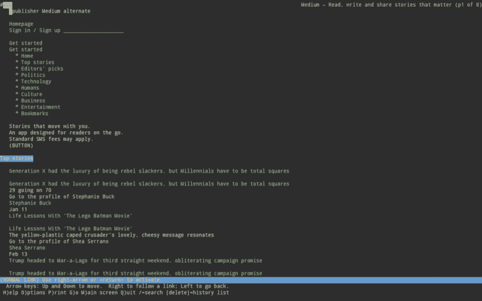
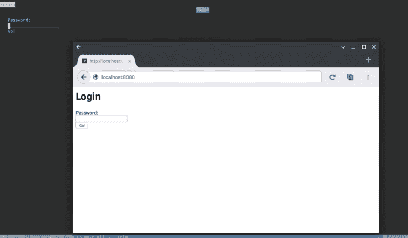
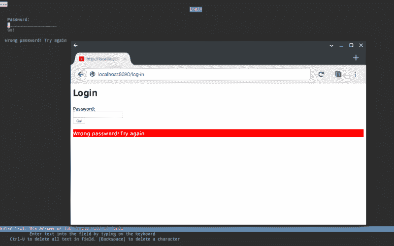
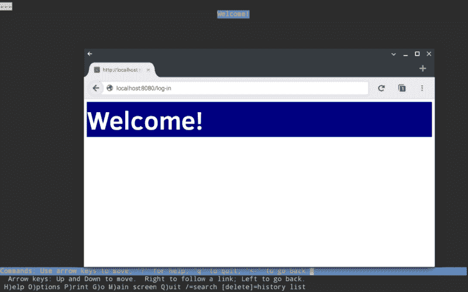

# 我如何在 ChromeOS 上使用 Go 构建网络服务器

> 原文：<https://www.freecodecamp.org/news/how-i-built-a-web-server-using-go-and-on-chromeos-3b83e4c2da5f/>

彼得·格里森

# 我如何在 ChromeOS 上使用 Go 构建网络服务器

#### Linux →ChromeOS →Android →Linux 仿真器


Image via [WikiMedia](https://upload.wikimedia.org/wikipedia/commons/6/69/Wikimedia_Foundation_Servers-8055_35.jpg)

“你到底为什么要弄个 Chromebook 来做网络开发？”是我偶尔被问到的问题。人们似乎不相信我能够在一台以简单易用著称的机器上自学全栈 web 开发。

我承认，当我在圣诞节前买回这东西时，我并不指望它能带来任何奇迹。只要它带有文本编辑器和互联网浏览器，我就认为它是学习前端 web 开发基础知识和在旅途中观看 YouTube 的一种廉价、便携的方式。我也被整个“云计算”概念所说服(那是未来的事情)。

事实证明，我对这个小机器的能力感到惊喜。它启动速度快得不可思议，电池寿命很长，在无处不在的“云”的帮助下，几乎可以做你对任何其他机器的预期。此外，我选择的型号配有触摸屏，可以折叠成各种瑜伽姿势，给你一个平板电脑或“帐篷”，或任何你喜欢的配置，如果有的话，看起来很酷。

然而，在过去的几周里，我对后端开发产生了更大的兴趣(部分原因是我和 CSS 之间的矛盾关系)。我读过如何在 Chromebook 上安装 Ubuntu Linux(如果我理解正确的话，ChromeOS 本身基本上是建立在底层 Linux 内核上的)。我可能会这样做，但这似乎是一个稍微复杂的过程，需要切换到开发者模式，清除本地存储，并禁用 ChromeOS 已知的所有良好的安全功能。我决定寻找一个替代方案。

我发现了一个非常有效的方法。你看，谷歌最近给一些 Chromebook 型号带来了 Android 应用程序——除了一些设计/UX 问题，任何在你的 Android 手机上运行的东西都应该可以在 ChromeOS 上流畅运行。我安装的一个这样的应用是[Termux](https://termux.com/)——一个用于 Android 的 Linux 模拟器，不需要根。过去几天我一直在玩它，可以说，我印象深刻。[弗雷德里克·福瓦尔](https://www.freecodecamp.org/news/how-i-built-a-web-server-using-go-and-on-chromeos-3b83e4c2da5f/undefined)完成了一项令人难以置信的工作。

我开始阅读由[奥雷连·吉罗德](https://www.freecodecamp.org/news/how-i-built-a-web-server-using-go-and-on-chromeos-3b83e4c2da5f/undefined)写的两篇[文章](https://medium.freecodecamp.com/building-a-node-js-application-on-android-part-1-termux-vim-and-node-js-dfa90c28958f)——然后嘭！在我喝完早晨的咖啡之前，我已经在我的 Chromebook 上本地安装并运行了 Node.js 服务器和 NeDB 数据库——不需要可怕的开发人员模式！如果你有一个 Android 设备，我完全推荐你给 Aurélien 的教程做书签，并尝试一下。几分钟后，Node.js 服务器就会在您的手机上运行。

现在，我对 Node 已经很满意了，但我也有兴趣尝试一些其他的服务器端语言——在缩小范围并选择一种作为重点之前，看看有哪些选择。我一直在阅读的一种语言是谷歌早在 2009 年推出的 [Go](https://tour.golang.org/welcome/1) 。它最近表现不错，越来越受欢迎——事实上，它已经被评为 2016 年[年度编程语言](http://insights.dice.com/2017/01/10/go-tiobe-programming-language-2016/)。

Go 在某些方面类似于 C 和 C++这样的语言，它的设计确实受到了它们的影响。然而，最初创建 Go 的主要动机是不喜欢这些历史悠久的语言的复杂性。因此，Go 有意成为一种使用起来简单得多的语言。

#### 有多简单？

例如，围棋中没有“while”循环。不，说到循环，你只有一个选择:for 循环。

```
//basically a 'while' loop:
for i < 1000 {
  //something
  i++
  }
```

类型推断是可选的。你可以用很长的方法来声明和初始化一个变量，或者走捷径隐式地分配类型。

```
var x int = 2

//is the same as:

x := 2
```

“If”和“else”语句非常简单:

```
x := 5

if x > 10 {
  fmt.Println("Greater than 10")
} else {
  fmt.Println("Less than or equal to 10")
}
```

Go 的编译速度也很快，并且在标准库中提供了各种有用的包，这些包在网上有很好的文档记录。它已经被用于许多[项目](https://en.wikipedia.org/wiki/Go_(programming_language)#Projects_using_Go)，包括一些家喻户晓的名字，如谷歌、Dropbox、Soundcloud、Twitch 和优步。

我推断，如果对他们来说足够好，它可能值得看一看。对于第一次涉足后端开发的任何人，我已经整理了一个小教程，基于我使用 Termux 对 Go 的实验。如果你有一个 Android 设备，或者一个可以访问 Play Store 的 Chromebook，那么安装并运行 Termux，我们就可以开始了。

如果您有一个传统的 Linux 设备，也可以随意加入！服务器程序本身的指令应该可以在任何支持 Go 的平台上正常工作。

#### 和泰莫一起去吧

Termux 和其他 Android 应用一样，下载和安装都非常简单。只需搜索 Play Store，然后点击安装。一旦准备好了，就打开它。您应该会看到一个漂亮的空白命令行界面。我强烈建议使用物理键盘(内置、微型 USB 或蓝牙连接)，但如果你手头没有，我听说过另一款名为 Hacker's Keyboard 的 Android 应用程序。

正如 Aurélien 去年的教程所述，Termux 几乎没有预装。在终端中运行以下命令:

```
$ apt update$ apt upgrade
$ apt install coreutils
```

很好。一切都是最新的，coreutils 将帮助您更轻松地浏览文件系统。让我们检查一下我们在目录树中的位置。

```
$ pwd
```

这将返回一个路径名，显示您当前在目录中的位置。如果我们不在那里，让我们导航到“home”文件夹，看看里面有什么:

```
$ cd $HOME && ls
```

好了，让我们为我们的围棋教程创建一个新目录，并在那里导航。然后，我们可以创建一个名为“server.go”的新文件。

```
$ mkdir go-tutorial && cd go-tutorial
$ touch server.go
```

如果我们键入“ls”，我们将在目录中看到这一个文件。现在，让我们给自己弄一个文本编辑器。Aurélien 的教程向您介绍了 Vim，如果您更喜欢使用它，那么尽一切可能使用它。一个稍微“初学者友好”的编辑器，我将在这里使用，是一个叫做 nano 的编辑器。让我们安装它，并打开我们的 server.go 文件:

```
$ apt install nano
$ nano server.go
```

太好了！现在我们可以开始键入尽可能多的代码。但在此之前，让我们安装 Go 编译器，因为我们需要它来让我们的代码有用。使用 Ctrl+X 退出 nano，并从命令行键入:

```
$ apt install golang
```

现在，让我们回到 nano，开始编写我们的服务器代码！

#### 构建一个简单的 Web 服务器

我们将编写一个简单的程序来启动服务器，并提供一个 HTML 页面，让用户输入密码登录并看到一条欢迎消息(如果密码错误，则显示“对不起，再试一次”类型的消息)。在 nano 中，从以下内容开始:

```
//Build a web server

package main

import (
  "fmt"
  "net/http"
  )
```

我们所做的是创建一个包。Go 程序总是以包的形式运行。这是一种存储和组织代码的方式，让你可以方便快捷地调用其他包中的函数。事实上，这是我们接下来要写的东西。我们已经告诉 Go 从标准库的“net”目录中导入“fmt”包和“http”包。这使我们能够访问一些函数，这些函数让我们能够处理“格式化的 I/O”以及 HTTP 请求和响应。

现在，让我们把这个东西放到网上。往下几行，让我们编写下面的代码:

```
func main() {
  http.ListenAndServe(":8080",nil)
  fmt.Println("Server is listening at port 8080")
  }
```

比如 C，C++，Java 等等。，Go 程序用' main()'函数输入。我们已经告诉服务器在端口 8080 监听请求(尽管可以随意选择不同的号码)，并打印出一条消息让我们知道它正在做什么。

暂时就这样吧！让我们保存文件(Ctrl+O)，退出(Ctrl+X)并运行我们的程序。在命令行中，键入:

```
go run server.go
```

这将要求 Go 编译器编译并运行程序。短暂停顿后，程序应该会运行。您将有望看到以下输出:

```
Server is listening at port 8080
```

太棒了。您的服务器正在端口 8080 监听请求。不幸的是，它不知道如何处理收到的任何请求，因为我们没有告诉它如何响应。这是下一步。用 Ctrl+C 中断服务器程序，在 nano 中重新打开 server.go。

#### 发送响应

我们需要服务器来“处理”请求，并写回适当的响应。令人欣慰的是，我们导入的“http”包使这变得很容易。

为了可读性，让我们在 import()语句和 main()函数之间插入下面的代码。然而，我们可以在 main()函数下面继续，一切都会好的。按你的方式做！

无论如何，让我们写一个处理函数。

```
func handler (write http.ResponseWriter, req *http.Request) {
  fmt.Fprint(write, "<h1>Hello!</h1>")
  }
```

这个函数有两个参数，*写*和*请求*。这些被分配了类型 *ResponseWriter* 和 **Request* ，它们在‘http’包中定义。然后我们要求服务器写一些 HTML 作为响应。

为了使用这个函数，我们需要在 main()函数中调用它。在下面添加**粗体**字体的代码:

```
func main() {
  http.ListenAndServe(":8080",nil)
  fmt.Println("Server is listening at port 8080")
  http.HandleFunc("/", handler)
  }
```

我们添加的代码行从“http”包中调用 HandleFunc()。这需要两个参数。第一个是字符串，第二个是我们刚刚写的 handler()函数。我们要求服务器用 handler()函数处理所有对 web 根目录“/”的请求。

保存并关闭 server.go，然后从控制台再次运行服务器。

```
go run server.go
```

同样，我们应该看到输出消息，让我们知道服务器正在监听请求。好吧，我们为什么不给它发个请求呢？只要打开你的网络浏览器，访问 [http://localhost:8080/](http://localhost:8080) 。

Chromebooks 对于应该使用哪种浏览器很有主见，但我发现 Chrome 在连接任何本地主机端口时都有些不合作。从 Play Store 安装 Mozilla Firefox for Android 应用程序解决了这个问题。

或者，如果你想完全呆在 Termux(为什么不呢？)，那就去看看 Lynx 吧。这是一个基于文本的浏览器，自 1992 年以来一直存在。没有图像，没有 CSS，当然也没有 JavaScript。但是对于本教程的目的来说，它已经很好地完成了工作。安装并运行:

```
$ apt install lynx
$ lynx localhost:8080
```



Medium’s homepage, as viewed in the Lynx browser running in Termux.

如果一切正常，您应该会在您选择的浏览器中看到一个标题“Hello！”如果没有，请返回 nano 并查看 server.go。我第一次犯的错误包括在 import()语句中使用花括号{}而不是括号。还有几个伪装成点的逗号(也许我应该使用 Ctrl+Alt+'+'来增加 Termux 中的字体大小)。

#### 世界上最独家的网站

我们的服务器现在用一行简短的 HTML 来响应 HTTP 请求。不完全是下一个脸书，但比以前更近了一步。让我们把它变得更有趣一点。

概括一下:我们将制作一个要求用户输入密码的页面。如果密码错误，用户会收到一条警告消息。如果它是正确的，那么用户会收到一条很大的消息，说“欢迎！”因为这是你自己的服务器，在你自己的机器上，只有你知道密码，这将是一个非常独家的网站。

首先，让我们让 HTML 响应更有趣一点。回到我们之前写的`handler()`函数。粘贴所有用**粗体**表示的代码，代替已经存在的代码(都是一行)。小心引号！我用双引号开始和结束字符串，在 HTML 部分使用单引号。确保你始终如一。

```
func handler (write http.ResponseWriter, req *http.Request) {
  fmt.Fprint(write, "<h1>Login</h1><form action='/log-in/' method='POST'> Password:<br> <input type='password' name='pass'><br> <input type='submit' value='Go!'></form>")
  }
```

当我们运行服务器时，HTML 应该呈现以下页面:



Foreground: Mozilla Firefox for Android; Background: Lynx for Termux

现在，我意识到我假设你对 HTML 有点熟悉。简而言之，我们只有一个标题和一个表单。表单的“action”属性称为“/log-in/”，其方法设置为 POST。有两个输入字段:一个用于输入密码，另一个用于提交表单。密码字段被命名为“pass”。我们以后需要参考这些名字。

那么，如果我们输入密码并提交，会发生什么呢？嗯，我们正在向服务器发出另一个 HTTP 请求("/log-in/")，所以我们需要编写另一个函数来处理这个请求。回到 Termux，在你选择的文本编辑器中打开 server.go。

我们将创建另一个函数(就我个人而言，我会把它写在 handler()和 main()之间，但是做任何适合你的事情)。这是另一个处理 HTTP 请求的函数——这一次是“/log in/”请求，每当用户提交我们前面制作的表单时都会发出请求。

```
func loginHandler (write http.ResponseWriter, req *http.Request){
   password := req.FormValue("pass")
      if password == "let-me-in" { 
        fmt.Fprint(write, "<h1>Welcome!</h1>")
      } else {
        fmt.Fprint(write, "<h3>Wrong password! Try again.</h3>")
        }
   }
```

和以前一样，这个函数有两个参数， *write* 和 *req* ，它们的类型与“http”包中定义的类型相同。

然后我们创建一个名为 *password* 的变量，我们将其设置为等于请求表单的输入字段“pass”的“值”。注意使用“:=”的隐式类型赋值？我们可以这样做，因为密码字段的值将始终作为字符串发送。

接下来是一个“if”语句，使用“==”比较运算符来检查*密码*是否与字符串“let-me-in”相同。当然，这是我们定义正确密码的方式。你可以随意改变这个字符串。

如果字符串*和*相同，你就成功了！现在，我们正在打印一个无聊的“欢迎”信息。我们马上会改变这一点。

否则，如果字符串*不*相同，我们将打印出一条“重试”消息。同样，我们可以让它变得更有趣一点。首先，如果用户仍然可以使用密码表单，这将非常有用。在**粗体**中添加以下代码。所有这一切，是从以前的 HTML 相同的密码形式。

```
func loginHandler (write http.ResponseWriter, req *http.Request){
  password := req.FormValue("pass")
  if password == "let-me-in" {
    fmt.Fprint(write, "<h1>Welcome!</h1>")
    } else {
      fmt.Fprint(write, "<h1>Login</h1><form action='/log-in/' method='POST'> Password:<br> <input type='password' name='pass'><br> <input type='submit' value='Go!'></form>;<h3 style='color: white; background-color: red'>Wrong password! Try again.</h3>")
      }
    }
```

我还为“重试”消息添加了一些简单的样式。完全可选，但为什么不呢？让我们对“欢迎”消息做同样的事情:

```
func loginHandler (write http.ResponseWriter, req *http.Request){
  password := req.FormValue("pass")
  if password == "let-me-in" {
    fmt.Fprint(write, "<h1 style='color: white; background-color: navy; font-size: 72px'>Welcome!</h1>")
  } else {
    fmt.Fprint(write, "<h1>Login</h1><form action='/log-in/' method='POST'> Password:<br> <input type='password' name='pass'><br> <input type='submit' value='Go!'></form><h3 style='color: white; background-color: red'>Wrong password! Try again.</h3>")
    }
  }
```

快到了！我们已经写出了 loginHandler()函数，但是在 main()函数中没有引用它。添加以下**粗体**行代码:

```
func main() {
  http.ListenAndServe(":8080",nil)
  fmt.Println("Server is listening at port 8080")
  http.HandleFunc("/", handler)
  http.HandleFunc("/log-in/", loginHandler)
  }
```

那里！我们现在已经告诉服务器，如果它收到“/log in/”请求(每当用户单击提交按钮时就会收到请求)，使用`loginHandler()`函数做出响应。我们完了！server.go 中的整个代码应该如下所示:

```
//Build a web server
package main
import (
  "fmt"
  "net/http"
  )

func handler (write http.ResponseWriter, req *http.Request)
  fmt.Fprint(write, "&lt;h1>Login</h1><form action='/log-in/' method='POST'> Password:<br> <input type='password' name='pass'><br> <input type='submit' value='Go!'></form>")
  }

func loginHandler (write http.ResponseWriter, req *http.Request){
  password := req.FormValue("pass")
  if password == "let-me-in" {
    fmt.Fprint(write, "<h1 style='color: white;
    background-color: navy; font-size: 72px'>Welcome!</h1>")
    } else {
      fmt.Fprint(write, "<h1>Login</h1><form action='/log-in/' method='POST'> Password:<br> <input type='password' name='pass'><br> <input type='submit' value='Go!'></form><h3 style='color: white; background-color: red'>Wrong password! Try again.</h3>"
      )
      }
    }

func main() {
  http.ListenAndServe(":8080",nil)
  fmt.Println("Server is listening at port 8080")
  http.HandleFunc("/", handler)
  http.HandleFunc("/log-in/", loginHandler)
  }
```

保存并退出 nano，从命令行让 Go 编译器*构建*我们的服务器。这个命令编译程序一次，之后我们可以随时运行它。

```
go build server.go
```

给它一点时间进行编译，然后输入以下命令:

```
./server
```

你应该得到通常的“倾听”信息。现在，如果你进入浏览器并访问 [http://localhost:8080](http://localhost:8080) (或者你使用的任何端口号)，你将被要求输入密码。如果输入错误，我们会得到以下结果:



Nope

然而，如果我们输入正确的密码:



Firefox appears a little more enthusiastic than Lynx…

#### 结束语

如果你已经读到这里，我希望你喜欢这个教程，并且觉得它很有帮助。我把它推销给和我处境相似的读者——对整个 web 开发有点陌生，并且有兴趣了解更多关于它在服务器端幕后是如何工作的。

当然，我们在这里制作的简单登录页面还有很长的路要走，才值得大书特书。你不会真的像我们在这里所做的那样将 html 编写到处理函数中(Go 的 HTML 包有一些很好的模板选项，我将会深入研究)，你也不会在‘if’语句中定义正确的密码。最好有一个密码(和用户名)数据库，每次服务器收到登录请求时都要查询这个数据库。

为此，Termux 提供了一个 SQLite 包，以及 Node.js 中可用的各种数据库包。本教程的一个很酷的扩展是创建一个用户名和密码的数据库，并允许添加新用户。首先添加另一个输入字段，并修改 loginHandler()函数。

我已经表达了我对 Termux 的看法——它非常出色，我希望随着更多软件包的推出，它会越来越好。除了 Go 和 Node.js，我还成功地用 C、C++、CoffeeScript、PHP 和 Python 3.6 编写和编译/运行了简单的程序，还有其他语言我还没有研究过(有人喜欢 Erlang/Lua/PicoLisp 吗？)

至于围棋，我的第一次遭遇是积极的。我喜欢它对简单性的关注，我喜欢它的语法，它的文档也很容易理解，同时也推动了我的理解。对于这个问题，一个相对初学者的意见是值得的，它感觉像是 C++和 Python 的结合。在某种程度上，这可能正是它的意思！