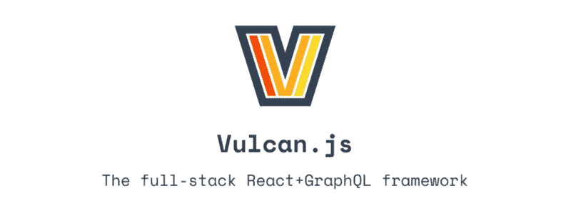
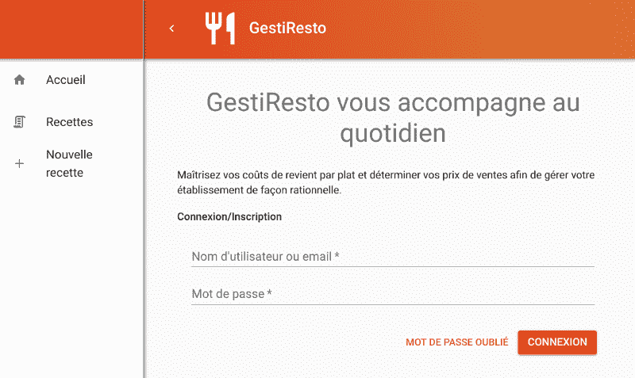
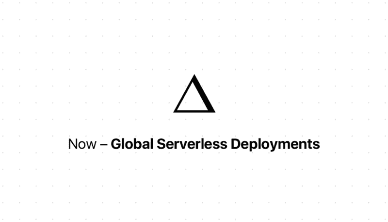
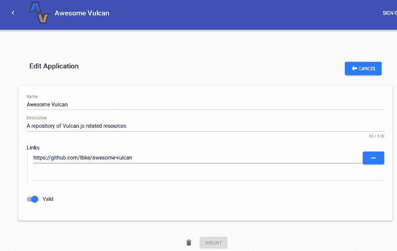
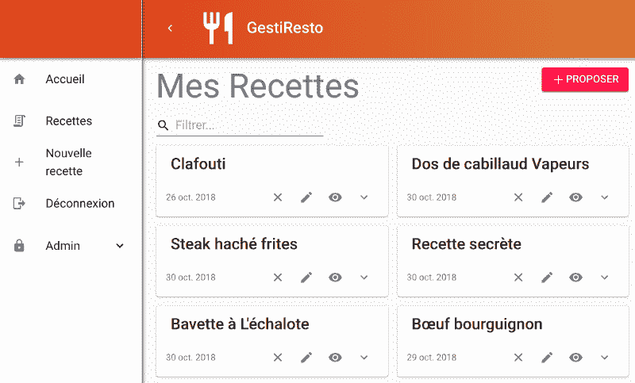

# 我如何在四天内用 Vulcan.js 建立一个应用程序

> 原文：<https://www.freecodecamp.org/news/how-i-built-an-app-with-vulcan-js-in-four-days-6368814077b1/>

几个月前，当我发表“ [Vulcan:一个应用的 15 天](https://hackernoon.com/the-vulcan-js-challenge-15-days-for-an-app-e3735d1e3d4c)”时，我是多么的没有野心啊！15 天就是 3 周的工作。如果包括受孕时间，那就是延迟一个月。如果我们能把它减少到一个*周*会怎么样？如果我们能在*几天*内开发出生产就绪的应用程序会怎么样？以下是我们实现这一目标的方式。

### 第 0 天:一些背景

#### 不要仅仅因为你比别人更快地产生草率的代码，就称自己为初创公司

我经营一家名为 LBKE 的开发和咨询公司。我们对有助于在非常有限的时间内生成高质量应用程序的技术非常感兴趣。想想 React Native+Expo for mobile，或者 Meteor for web applications。

多年来，最低价值产品(MVP)的预期质量大幅提升。人们受够了作为“产品”出售的低质量原型。

现在，他们希望他们的软件没有 bug(没门！)，他们想要一个好的 UX(他们是多么挑剔啊！)，他们想要真正满足他们需求的工具(唉！).当然，他们不想为此付出更多。

#### 走向 4 天应用程序

对于企业家来说，设计和制造这样一个最基本的可爱的产品是一项繁重的工作。但是钱很紧，时间就是金钱，所以你必须明智地使用它。

我们的目标是:能够在 4 天内生成一个 SaaS 应用程序。我们并不是指一款不再需要进一步开发的一次性应用。我们认为，设计良好的技术应该允许长期开发和非常快速的开发:扩大规模，缩小规模*。对于大多数项目，不需要原型技术。除非你造了宇宙飞船，但你没有，是吗？*

*此外，我们不喜欢依赖第三方服务/软件，点击几下就弹出网站。如果你的产品是真正创新的，你可能会觉得被这种服务限制得很厉害。*

*那么，我们如何在不使用魔杖的情况下实现这一奇迹呢？让我们通过一个真实的例子来发现它，GestiResto 是一个帮助餐馆老板管理他们的食谱的 web 应用程序。附注:我住在法国，我们不会拿食物开玩笑，所以我真的很重视这个项目。*

### *第一天:挑选我们的宇宙飞船*

#### *见见 Vulcan.js，又名类固醇上的流星*

*Meteor 是著名的全栈 JavaScript 框架。从一开始，它就一直强调生产力和开发者体验。它开创了许多令人敬畏的特性和模式，比如同构开发(重用相同的代码服务器端和客户端)。*

*[Vulcan.js](http://vulcanjs.org/) 基本上是 Meteor 的好元素，加上 JavaScript 生态系统的好元素，在一个框架里。它依赖于最新的技术:React 用于前端，Apollo (GraphQL)用于客户端/服务器通信。*

*

Join us on Slack!* 

*作为奖励，它包括了许多最常见功能的包和例子(发送时事通讯，添加论坛等。).火神是著名的流星应用程序/框架望远镜的直系孙辈，它是由 [Sacha Greif](https://www.freecodecamp.org/news/how-i-built-an-app-with-vulcan-js-in-four-days-6368814077b1/undefined) 创建的。因此，尽管它是现代化的，但它受益于多年的经验。*

*如果你想更多地了解 Vulcan 以及它如何帮助缩短开发时间，你可以查看我在 DailyJS 上的前一篇文章。*

*所以，Vulcan.js 绝对是满足我们自己设定的 4 天期限的可靠候选！*

#### *开箱即用的用户管理系统*

*火神最受喜爱的一个特性是它的帐号系统，它继承了流星。它包括注册/登录/注销，权限管理，注册/忘记密码工作流程(+程序化的电子邮件发送)，以及一个漂亮的用户界面。哦，而且添加第三方认证服务也很容易，比如 [Google Oauth](https://medium.com/@teaganatwater/setting-up-google-oauth-in-vulcanjs-aa53c6010d21) 。*

*

The day 1 application. The authentication system is fully functional at this point. Material design can be obtained with the [vulcan:material-ui](https://github.com/ErikDakoda/vulcan-material-ui) and [vulcan:more-material-ui](https://github.com/lbke/vulcan-more-material-ui) packages.* 

*账户管理确实是你在应用生命周期的早期阶段不想考虑的事情。设置 Passport.js 已经浪费了多少时间！Auth0 等付费认证服务的量说明这个问题还没有解决，所以真的是一个很好看的功能。*

*所以，我们的第一天过得很好。我们现在有了一个完整的用户管理系统，包括数据库、服务器、UI 和后台，我们用剩下的时间建立了一个不错的材料 UI 布局。*

**

### *第二天:主持*

#### *在 AWS 上托管流星*

*为什么已经在第二天举办了？因为生活告诉我们，在生产的最后一天测试你的应用是一个非常糟糕的主意。在敏捷的方式中，一个特性只有在现实生活中得到验证时才能实现。因此，如果我们没有在生产环境中运行该应用程序，我们就不能认为它已经设置好了。*

*Meteor Up 是一个很棒的工具，可以在远程服务器上自动部署 Meteor 应用程序(Vulcan 应用程序也是如此)。它处理一切，从用 Docker 容器化应用程序到用 Let's Encrypt 生成 SSL 证书。设置很简单，部署是一行命令。它几乎没有任何缺点。*

*我选了 AWS 做主持。它的一大优势是提供 12 个月的免费服务。我必须承认，我在设置我的第一个 EC2 实例时遇到了困难。然而，网上有许多教程，值得最初的麻烦。此外，我目前正在编写一个包，可以在 AWS S3 上对 MongoDB 数据库进行每日备份，以确保您的数据安全。*

#### *Zeit 的 Now + Mongolab 上的一款分期应用*

*迟早，你将需要测试你的应用程序在生产中的工作情况，而不需要实际把它发送到生产中。这就是我们所说的暂存环境。你也可以使用 AWS，但是让我们尝试一个免费的解决方案来降低成本。*

*

Cheers to all companies that provide free services and contribute to open source.* 

*Zeit 的 Now 服务非常适合这种用途。它提供免费托管。您可以对数据库使用 mLab，因为它也提供了一个免费的沙盒环境。老实说，我在这里没什么可说的，因为设置就像 ABC 一样简单，这里有完整的[文档](http://docs.vulcanjs.org/deployment.html#Meteor-Now)。一只虫子都没有。*如果没有 bug，我作为开发人员的目的是什么？？？**

*好了，在第 2 天结束时，我们的应用程序已投入生产，我们有了一个中间演示环境。不错！这很酷，因为花在一般特性上的时间越少，花在有价值特性上的时间就越多。*

### *第三天:商业逻辑*

#### *一个应用程序是一堆表格和列表*

*现在，让我们言归正传。应用程序的大部分组件可以分为三大类:列表、表单和细节。这种模式适用于很多网站。*

**

*参见 Medium:主页包含一个文章列表。这一页是你正在阅读的文章的“细节”页。在底部，你会发现一个带有评论表的评论列表。甚至左边的“掌声”按钮(我邀请你彻底点击)也是一个简单的表单类组件。*

*好消息:Vulcan 包含了大量的助手来帮助创建列表、表单和细节组件。它包括漂亮的图形解析器和反应 hoc。你几乎不需要自己写。甚至还有一些开箱即用的 React 组件。其中最先进的是 SmartForm，它可以为任何集合自动生成可定制的创建/编辑表单。*

*我不会列出 Vulcan.js 必须提供的所有特性，但基本上你可以放心地相信它会使你的开发过程真正快速。*

#### *创建一个配方(或提出一个应用程序或发表一篇文章或……)*

*在 GestiResto 中，两个主要功能是创建和列出食谱。配方创建表必须显示统计数据。细节是保密的，所以这里有一个为 [Awesome Vulcan](https://www.awesome-vulcan.com) 开发的等价表单的截图。*

*但这没有什么区别，因为关键在于:Vulcan 可以自动生成现成的表格，用于您可以想象的任何类型的数据，无论是食谱还是直升机。我是说直升机的 JSON 模型。*

*

This form has been auto-generated using Vulcan core SmartForm component. The “Links” input is a custom React component tailored for our specific needs.* 

*食谱清单甚至更简单。我们专注于构建一个漂亮的`RecipeItem`，允许用户快速预览食谱信息，以及触发一些常见的动作(导出、删除……)。当然，它包括基于文本的搜索输入，是免费的。*

*

*No, I am never ever going to give you access to the “Secret Recipe”. Except, maybe, if you clap for this article.** **

### *第四天:交付！*

*由于我们在第 3 天完成了大部分有价值的工作，我们剩下最后一天来清理和改进应用程序。现在我们可以实现喜爱的特性:一个自动计算食谱最终价格的组件，一个生成漂亮的 PDF 导出的按钮，以及一个与众不同的主页。*

*

*Look how happy is our chef! That’s because his app is built on 100% organic-open-source technologies.** 

*最终，我们到了第五天。客户刚刚测试了昨天晚上交付的应用程序，并对您说:“我已经测试了该应用程序，它很好！我想到在页面 Y 中添加特性 X，在你看来添加组件 Z 需要多长时间？…".然后你知道你做得很好！*

### *想在 4 天内搭建自己的 app？*

*看看我们的开源应用[牛逼的 Vulcan](https://www.awesome-vulcan.com) 。它为具有材质 UI 外观的专业应用程序提供了一个可重用的基础。它还演示了我们实现的几个包的用法。*

*我希望它能帮助你迈向 4 天申请之旅！*

*

我是法国公司 Lebrun Burel 知识工程(LBKE)的联合创始人——[https://www.lebrun-burel.com](https://www.lebrun-burel.com)

*总是乐于谈论代码、机器学习、创新创业！**