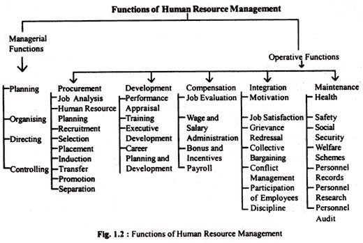
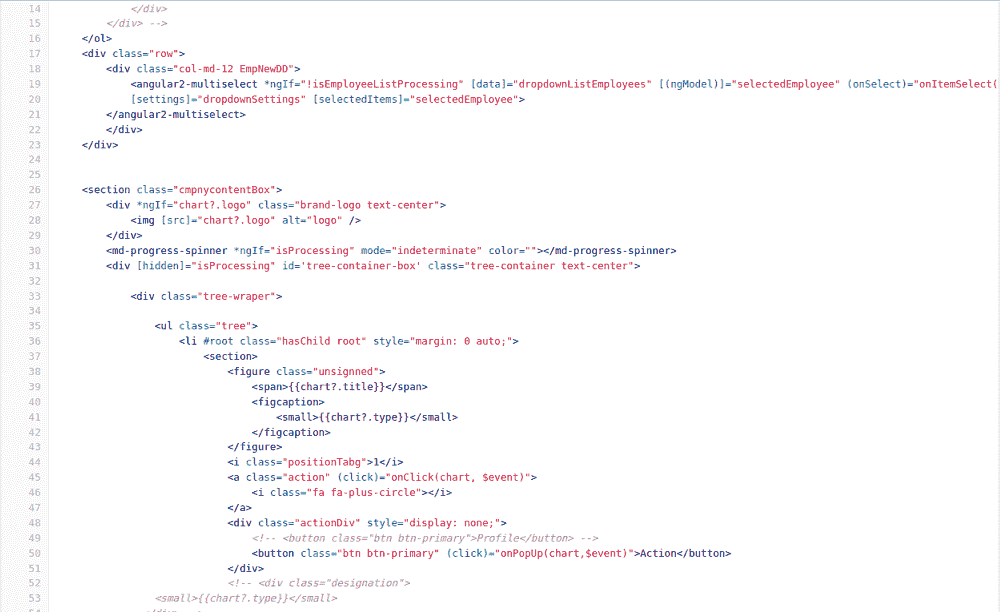
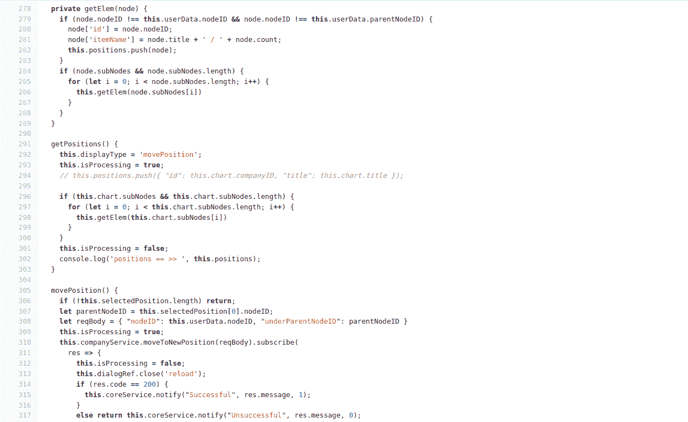
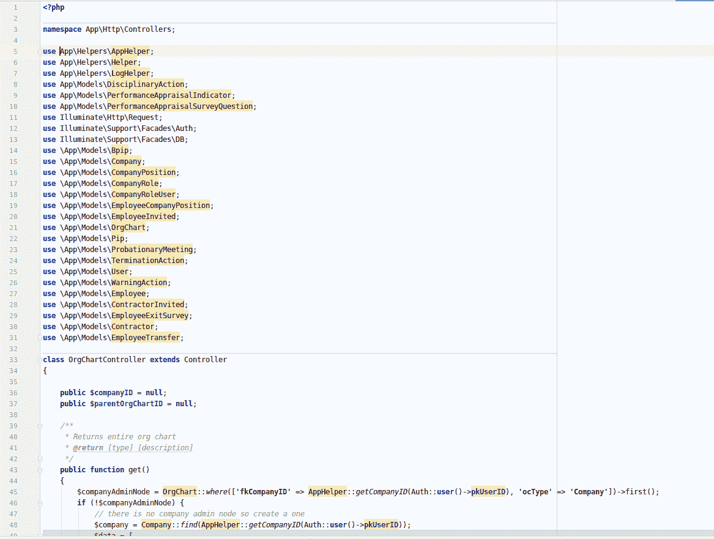
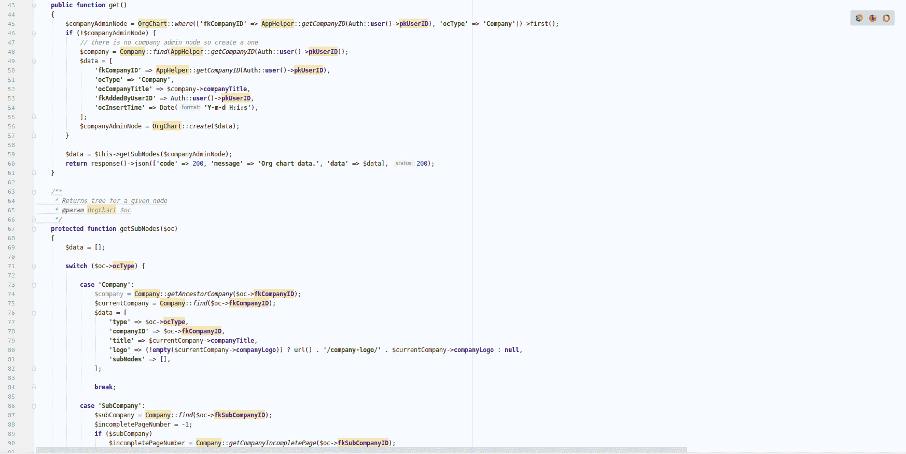
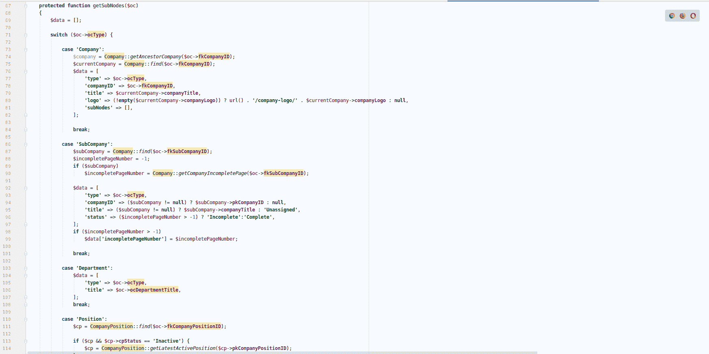
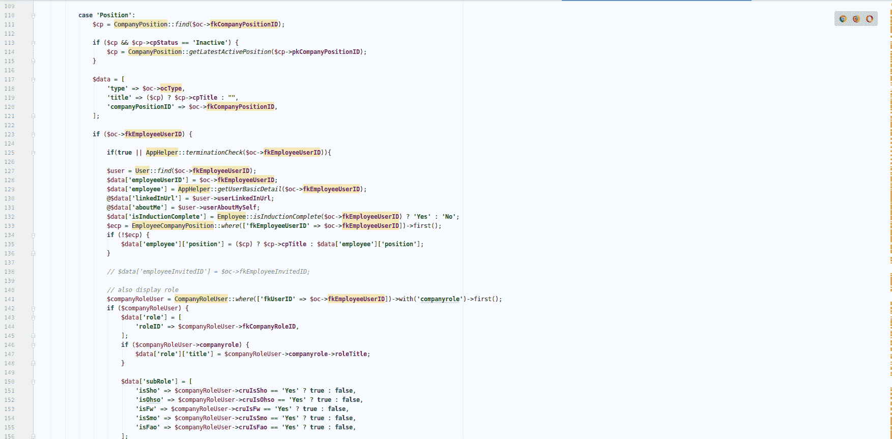
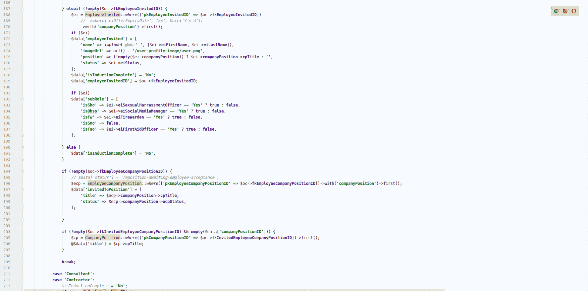
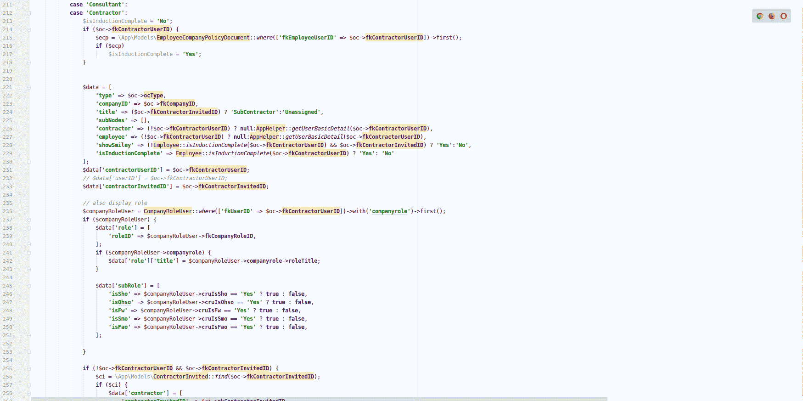
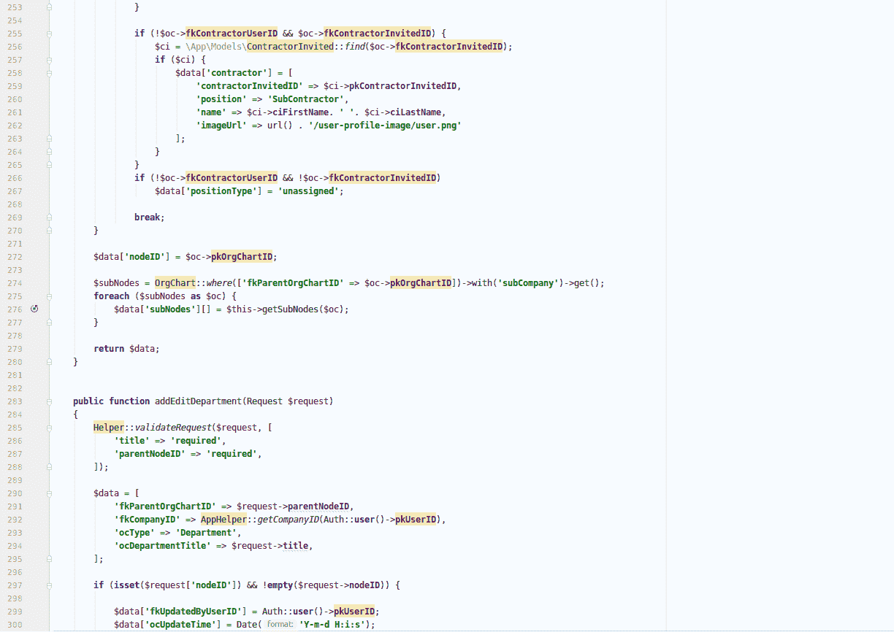

# 我如何在 Angular 4 和 Magento 上建立人力资源门户

> 原文：<https://www.freecodecamp.org/news/how-i-built-an-online-hrm-management-portal-on-angular-4-magento/>

有时候尝试新技术混搭会创造奇迹。Magento 2 + Angular 4 都是非常普遍的话题，许多人认为它们是开发行业的未来。

比如我最近用 Magento + Angular 4 搭建了一个超高效的[人力资源管理门户](https://www.valuecoders.com/case-studies/hr-management-portal)。

## 用最好的例子学习

人力资源门户最受欢迎的特性之一是“及时管理多样化的需求”。这意味着人力资源部门需要一个软件来管理整个员工绩效生命周期和其他人力资源活动。例如，处理员工入职、绩效评估、培训和发展、休假管理、申诉管理、纪律程序等。然后他们回顾最后的结果。

> 我建立的人力资源门户是一个直观的在线管理软件，据报道比其他工具的输出高 90%。然而，它遭受了许多挑战，如软件速度、输出质量和及时性。

### 挑战

用户通常以组合的形式输入许多细节，并在步骤 1 和步骤 2 之间跳转。每当用户在不同的选项卡之间跳转时，雇员的全部详细信息都会被重新加载。这很烦人，用户弃用的几率也很高。

这样一个独立的人力资源门户网站的原型工作得非常好。然而，开发它是一项复杂的任务。我们的开发者不得不把 AngularJS 和 Magento (PHP)结合起来作为最后的手段。

我的公司 [ValueCoders 软件开发公司](https://www.valuecoders.com/)是 IT 和软件解决方案领域的全球领导者，它有自己的开发团队，在这个人力资源门户网站上绞尽脑汁。

## 为什么 Magento 用 Angular 4 做 HR 门户？

在来找我们之前，我们的客户已经收到了不同开发机构的报价。作为友好的帮助，我的团队被要求为他们的人力资源门户审查所有这些想法。但是，我惊讶地看到他们中的一个人只发了一件事，他们将使用基于 typescript 的框架 Angular 来构建人力资源门户。

这还不是全部。他们甚至试图掩盖这样一个事实，即这项技术不足以建立人力资源门户。相反，他们推广了自己的品牌，并提出了一个价格，但这个价格并不能证明制作一个具有高质量主张的在线人力资源门户网站是合理的。

**问题的关键是为什么我们在 HR portal 中使用 Magento 和 AngularJS。**

毫无疑问，Magento 是用 PHP 编写的最流行的开源 CMS 系统之一，它证明了每个电子门户都必须是独一无二的。凭借其开箱即用的功能、开源架构和 REST API，Magento 为您的应用程序提供了无与伦比的定制和第三方集成能力，这是您做梦也想不到的。

然而，互联网连接、智能手机和平板电脑的兴起直接影响了电子商务 CMS 市场。如今，客户不仅希望电子门户或人力资源门户独一无二，还希望它能够快速、无缝地工作。试图给网站带来原生的感觉是 AngularJS 这样的 MVC JavaScript 框架的最大优势。有人称赞它是电子商务发展行业的未来，也有人称之为时髦的噱头。

拥有 MVC 框架意味着客户可以从一页到另一页或者一个视图一个视图地浏览人力资源门户，而不是像浏览一本书一样。这意味着用户不是刷新整个网页，而是导航到一个内部页面，只有相关的部分会被更新。结果是人力资源门户的加载速度非常快，因为网站的内页永远不会加载。

解释 AngularJS 和 Magento 的全部内容超出了本文的范围，但是我们将查看快速代码片段以获得关于 HRM 教程的综合指南。

在我们讨论更多的技术细节之前，先简单介绍一下我们在这里讨论的人力资源门户的类型。

## 人力资源门户的功能

该客户端是澳大利亚领先的 HRIS 平台，只需点击一个按钮即可管理整个员工生命周期。它们有助于集中人力资源活动，并通过大量出色的功能提高您的业务效率。

在与客户进行了一些讨论后，一些规格具体化了:

*   开发一个人力资源门户网站，用于管理和促进企业人力资源部门的所有功能，包括工资、绩效、员工管理、招聘、培训等。
*   客户端应该是强大的，能够迅速管理不同的需求。
*   开发一个人力资源门户网站，提供智能的方式来管理人力资源管理，节省金钱和时间。
*   没有损失网站的质量。

对于一个人力资源门户网站来说，这些都是非常好的特性。这正是我们的客户想要从我们这里得到的新的技术混搭。因此，如果你想知道最终结果，这里有一个关于人力资源门户的 Angular 4 编码的概述。

这就是我尝试去做的。中了大奖。现在我已经介绍了所有的上下文相关的东西，我终于可以让你了解更多的技术内容了。

显示了人力资源门户的一个功能，即组织结构或树形图，用户可以通过输入员工 id、姓名、部门或运营类型来查看员工的完整详细信息。该工具为您提供了一种使用嵌套图形显示分层数据的方法，只需单击一次 enter tab 键。

### 让我们用 Angular 4 编码:

Coding on Angular 4 For Organizational Chart/Employee Details

Coding on Angular 4 For Organizational Chart/Employee Details

> 在使用 Angular 4 准备好人力资源门户基础之后，第一个挑战是在不同的开发环境中添加特性。

### 这是 PHP 代码的另一个例子:

考虑到上面的例子，希望这将节省一些人在编码上花费的大量时间和精力，使这种类型的人力资源门户为您的业务做好准备。

## 总结我的经验

这个人力资源门户项目教会了我在向应用商店提交新版本之前，对软件解决方案的持续集成、部署和监控。然而，几件简单的事情我仍然认为是必要的:

*   客户公司总是希望自动化一切可以自动化的东西。只有开发团队才能做到这一点。所以我决定雇佣在这个行业有丰富经验的 Angular 开发人员，让开发过程尽可能简单。
*   如果在开发人力资源门户的过程中有一件事是你可以依靠的，那就是在你开始实际的应用程序/web 开发过程之前，你会得到专业开发人员的帮助。

诚然，技术是不断变化的，远非完美。但是我和许多其他开发人员会毫不犹豫地反复使用它们。与往常一样，如果您在人力资源门户开发方面寻求任何帮助，请随时[联系](https://www.valuecoders.com/contact)。

此外，如果你正在寻找有经验的 Angular 开发人员(T1)、Magento 开发人员(T3)并有兴趣为你的下一个人力资源门户项目雇佣他们，ValueCoders 软件开发团队将为你提供帮助！

> 在 Twitter 上与我联系，了解更多关于未来帖子/教程的更新:[https://twitter.com/ValueCoders](https://twitter.com/ValueCoders)