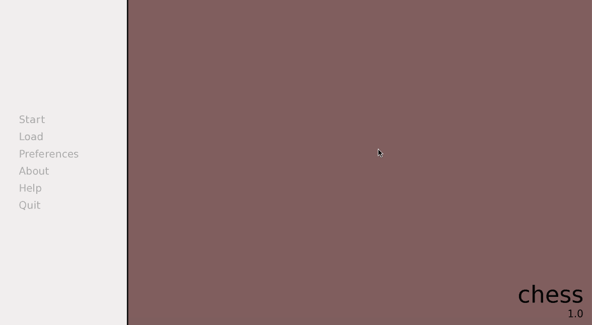
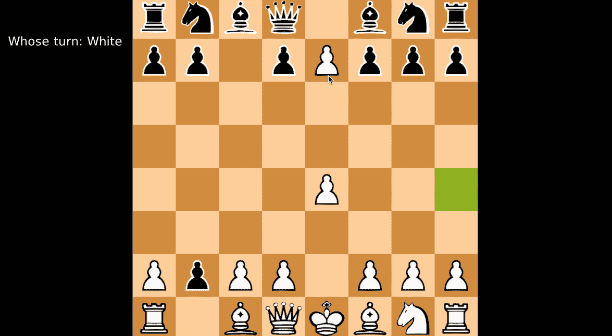
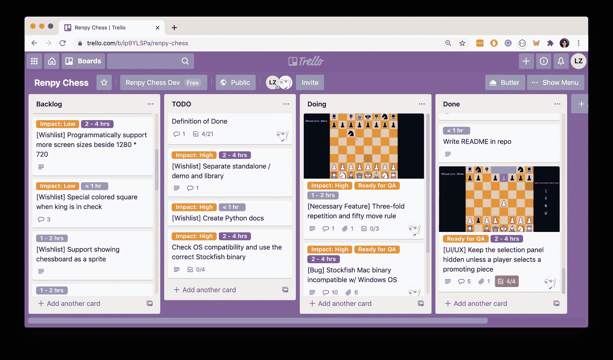
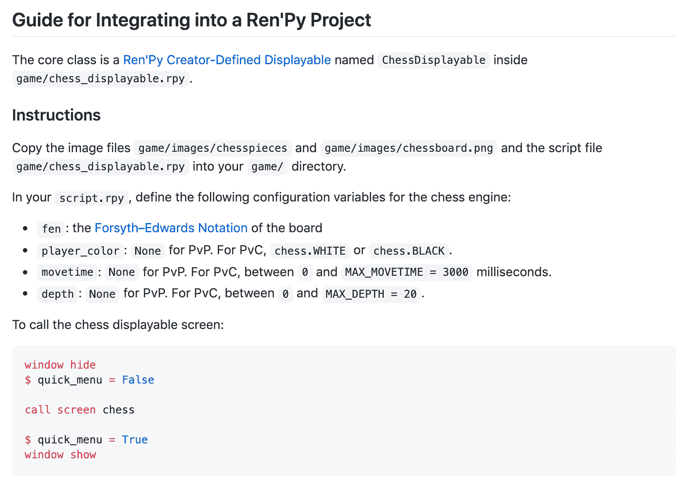
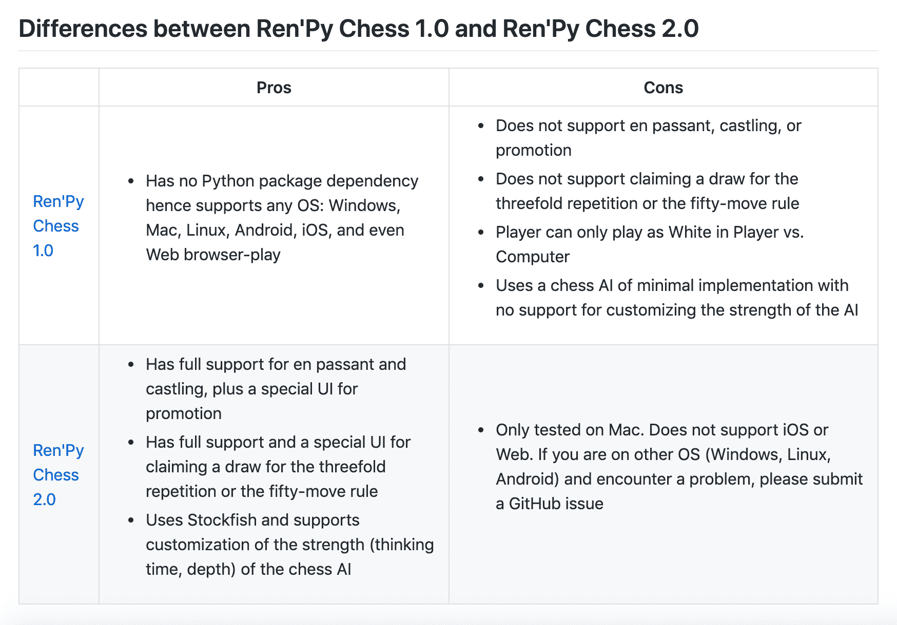

# 我如何构建我的单人项目:一个流行游戏开发引擎的象棋引擎

> 原文：<https://www.freecodecamp.org/news/how-i-built-my-one-person-open-source-project/>

我最近完成了我的一个暑期项目:[一个象棋 GUI 引擎](https://github.com/RuolinZheng08/renpy-chess)，它是使用 [Ren'Py 视觉小说游戏开发引擎](http://renpy.org/)和 [python-chess](https://github.com/niklasf/python-chess) 库构建的。

这个引擎将被集成到一个动力学小说游戏中， [*黎明之风*](https://madeleine-chai.itch.io/the-wind-at-dawn) ，在那个游戏完成的时候。

在这篇文章中，我想分享一些关键的学习，技术的和非技术的，这是我在一个月内从开始到结束推动这个单人项目时收集的。

[My Chess Engine Project on GitHub](https://github.com/RuolinZheng08/renpy-chess)

## 欣赏重写旧代码的价值

对于学校的 CS 项目，我很少有机会或经历需要重新审视我的代码。

然而，当我从事我热爱的项目时，情况并非如此:我喜欢抓住每一个机会来提高它们的可用性和可重用性，希望我的代码对其他开发人员有价值。

这个象棋引擎基于[一个我在大学第一个暑假自学 Python 时用 Ren'Py 和 vanilla Python](https://github.com/RuolinZheng08/renpy-chess-engine) 创建的象棋引擎。

反过来，这个旧的象棋引擎是基于我大学 CS 入门课上的一个项目(一个用函数式编程语言球拍编写的象棋 GUI 游戏)。也就是说，我已经重写了两次代码来生成这个最终的象棋引擎。

在我的第一次重写中，我只是简单地“翻译”了国际象棋的逻辑(决定一步棋是否合法，残局条件，等等。)从球拍到蟒蛇。我还尝试了面向对象编程，根据在线教程编写了一个 minimax chess AI，并在 Ren'Py 中实现了 GUI。

由于我只知道国际象棋的基本知识，并根据我的学校项目评分规范编写了我的国际象棋逻辑，我的第一个国际象棋引擎不支持特殊的移动，如途中，阉割，或推广。

为了在我的第二次重写中解决这个问题，我研究了开源 Python 库并找到了 [python-chess](https://github.com/niklasf/python-chess) ，这是一个完全支持国际象棋走法和残局条件的库，比如在出现三重重复时要求和棋。

最重要的是，它还集成了 [Stockfish](https://stockfishchess.org/) ，一个国际象棋人工智能，这种集成将使我的国际象棋引擎能够配置国际象棋人工智能的强度。

这两个特性为我的 chess engine 版本增加了巨大的价值，并允许我专注于我的重写的更重要的方面，我将在下面描述。

## 阅读文档并牢记兼容性

在开始设计和编写代码之前，浏览一下项目所需的库文档已经成为我的习惯。这有助于我评估任何可能出现的依赖性和兼容性问题。

[这个 Ren'Py GitHub 问题](https://github.com/renpy/renpy/issues/2003)指出了一个事实，Ren'Py 使用的是 Python 2，还没有移植到 Python 3。所以我意识到我需要一个支持 Python 2 的 python-chess 版本，[，因为最新版本只支持 Python 3.7+](https://python-chess.readthedocs.io/en/latest/#features) 。

好在[0 . 23 . 10 版本](https://python-chess.readthedocs.io/en/v0.23.10/index.html#features)同时支持 Python 2.7 和 Python 3.4+。我最终选择了 0.23.11 版本，因为这是最后一个仍然支持 Python 2.7 的版本。

解决了依赖性和兼容性问题后，我准备继续进行设计和编码。

## 遵循软件工程最佳实践

注意:本节提到的很多术语来自于[敏捷/Scrum](https://en.wikipedia.org/wiki/Scrum_%28software_development%29) 。

### 收集项目设计的功能需求

虽然直接进入编码很有诱惑力，但我怎么强调设计的重要性都不为过。

将设计视为一个高层次的路线图，它清晰地描绘了项目的起点、里程碑和终点。这让开发人员在深入复杂的实现细节时可以参考。

这对于课外项目尤其重要，因为它们通常没有详细的、高度技术性的规范，而大多数学校项目有。

对于我的象棋引擎，我确定了以下重写/附加功能:

*   集成来自 python-chess 的象棋逻辑
*   在我的 Ren'Py GUI 代码中，用 python-chess 的象棋逻辑和 Stockfish APIs 替换我编写的象棋逻辑和象棋 AI
*   支持各种游戏模式:玩家对玩家，玩家对电脑(玩家可以选择扮演黑或白)，通过调整 Stockfish 的配置参数来调整国际象棋人工智能的强度
*   开发一个用于典当推广的玩家界面
*   开发一个在三重重复或五十步棋规则的情况下要求和棋的人型 GUI

### 开发一个概念验证原型

概念验证(POC)原型帮助我评估实现所需功能所需的时间和精力。

对于我的象棋引擎 POC，我将 python-chess 与我最初的 Ren'Py GUI 代码集成在一起。我确保它的功能集是最小的，但易于扩展:

*   我将 python-chess 与我最初的 Ren'Py GUI 代码集成在一起，并且能够四处移动棋子
*   我只实现了玩家对玩家，以推迟集成国际象棋人工智能的 Stockfish
*   我只允许非升级移动，以便推迟开发兵升级的 GUI

### 确定项目的就绪定义和完成定义

我的项目对 Ready (DoR)的定义自然来自于我对库版本兼容性和 POC 的初步调查。

同时，我的项目对 Done (DoD)的定义遵循了我在设计阶段确定的特性需求。

### 交付最低限度的可行产品，或者更好，最低限度的可爱产品

Promotion UI

当我在设计阶段收集需求时，我知道我的项目有很多挑战性的目标——可能比我能完成的还要多。

因此，对我来说，实现一组非常基本的必需特性，交付一个最小可行产品(MVP ),并收集反馈来迭代它是非常重要的。

更好的是，我想在我的第一次迭代中交付一个最小可爱的产品(MLP)。微小的区别在于，MVP 只需要功能特性，而 MLP 通过设计拥有可爱的用户体验。

例如，为了实现棋子升级，对于一个 MVP，我可以让用户按不同的键来选择他们想要升级的棋子类型(比如 B 代表主教，K 代表骑士)。

对于一个 MLP，我会实现一个带有块型按钮的 UI，当鼠标悬停或被选中时，按钮会改变颜色。

## 做自己的项目经理

如果您发现跟踪功能列表(加上不断增长的错误和修复列表)令人不知所措，那么您并不孤单。是时候自己做项目经理了。

我发现 Trello 对于单人项目和大型团队项目来说都是一个令人惊奇的工具。

对于一个编码项目，我通常是这样组织我的 Trello 板的:

The Trello Board for My Chess Engine Project

有四个列表:**待办事项**(待分类的特性)**待办事项**、**正在做**，以及**已经完成。**

有彩色编码标签:

*   **准备好问答:**一个红色标签，以引起队友的注意
*   **影响:**低(黄色)对高(橙色)，由某个特性或错误修复将产生的影响量决定。例如，轻微错位的 UI 面板影响很小，而确定性崩溃的 bug 影响很大。
*   **实施所需时间的估计值:**普通(< 1 小时，蓝绿色)、中等(1-2 小时，浅蓝色)和困难(2-4 小时，深蓝色)。
    我的另一个经验法则是，如果我估计一张卡需要 4 个多小时才能实现，我可能应该把它分解成几张更细粒度的卡。
*   颜色是一个很好的视觉提示:我总是先处理带有橙色和蓝绿色标签的卡片(影响力大，投入时间少)，然后再处理带有黄色和困难标签的卡片(影响力小，投入时间多)。

## 写文档，反思你的学习

把每一张 Trello 卡从 TODO 推到 Doing 再推到 Done，修复了每一个讨厌的 bug，是不是终于到了宣布项目完成的时候了？是也不是。

为了最大限度地从项目中学习，我发现反思我的收获、技术或软技能是非常值得的:

1.  在 GitHub 项目资源库中编写一个清晰、简洁的自述文件。这有助于其他开发人员理解并对项目感兴趣。
2.  写一篇关于更高层次方面的博文(像我现在写的这篇)，例如，架构概述、功能设计、挑战和解决方案等等。

My README Section about Integrating My Chess Engine into Other Game Projects

My README Section Comparing the Two Versions of My Chess Engine

### 学分和链接

非常感谢 Tim Min 促使我参与这个项目，感谢他在 Trello 董事会上的贡献(新功能想法+ QA ),感谢他让我负责。蒂姆是动能小说游戏**的作者。**

*   *[我的象棋引擎 GitHub 资源库](https://github.com/RuolinZheng08/renpy-chess)*
*   *[国际象棋引擎项目的公共 Trello 板](https://trello.com/b/ip9YLSPa/renpy-chess)*
*   *[Ren'Py:一个视觉小说游戏开发引擎](https://www.renpy.org/)*
*   *[python-chess:一个纯 python 象棋库](https://python-chess.readthedocs.io/en/latest/)*

*让我们保持联系！在 [LinkedIn](https://www.linkedin.com/in/ruolin-zheng/) 、 [GitHub](https://github.com/RuolinZheng08) 、 [Medium](https://medium.com/@ruolinzheng) 与我联系，或者查看[我的个人网站](https://ruolinzheng08.github.io/)。*