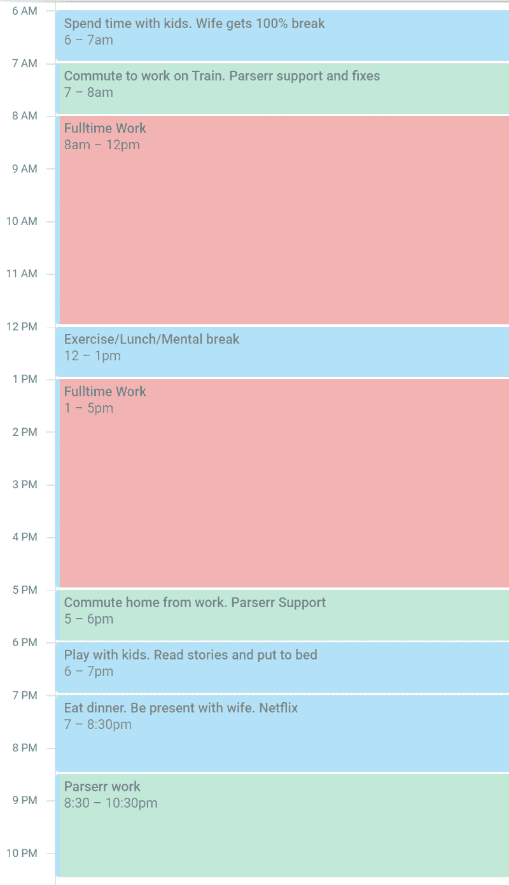

# 我是如何用一份全职工作、合伙人和 3 岁的双胞胎男孩打造我的产品的

> 原文：<https://www.freecodecamp.org/news/how-i-built-my-product-with-a-full-time-job-partner-and-3-year-old-twin-boys-f354432ff2a7/>

作者:考特尼

# 我是如何用一份全职工作、合伙人和 3 岁的双胞胎男孩打造我的产品的

如果你已经打开了这篇文章，那么我假设你或者正处于类似的情况，想知道这是否只是一个点击诱饵？或者你可能认为这是不可能的。我想告诉你这是真的，在这篇文章中我会告诉你怎么做。所以让我们开始吧。

2015 年 12 月，我推出了[parser RR](https://parserr.com)，这是一款电子邮件解析器，可以让你将收到的电子邮件转化为有用的数据，供其他各种第三方系统使用。您可以使用该工具提取电子邮件中存储的任何内容，例如发送到电子邮件的网站查询、入站销售线索电子邮件，甚至是食品订单。一旦提取出来，Parserr 就可以非常容易地将数据转移到第三方系统中，包括 Excel、Google sheets、CRM 等等。

Parserr 的每月经常性收入(T1)(MRR)在 5 位数出头。

这是我第 26 次尝试开展网上业务(可以追溯到 2006 年)，也是 9 年来我第二次至少赚了 1 美元。？

我的第一个真正赚钱的业务是 2013 年推出的电子商务业务。改天再说吧。

直到 2015 年，我还是一个在线的 [wantrepreneur](https://www.urbandictionary.com/define.php?term=wantrepreneur) ，花更多的时间在他们的书中阅读别人的成功，听他们在 [Mixergy](https://mixergy.com/) 上谈论这些成功。即使我从别人那里获得了足够的信心，我最终也只会造出一个没人想要的产品，或者只是造出一些我不屑于营销或销售的东西。

问题是，我是一个内向的人，我听从每个人的建议，而不是我的直觉。听听 Mixergy，或者读一读 896 本关于成功创始人的不同传记，确实应该是一种想法刺激练习。但相反，我认为这些创始人提供的建议是上帝说的真理。

我意识到我的情况和另一个创始人的情况完全不同。这也意味着对杰克·多西或罗布·沃林有效的方法可能对我无效。这就是为什么我想再次向阅读这篇文章的人强调，对我有用的东西，不一定对你有用。

但是，我敢打赌，你们中的一些人:

*   内向的人
*   父亲或母亲
*   丈夫还是妻子
*   一边全职工作，一边四处奔波
*   不顾一切地摆脱为他人的财富而奴役？

如果是这样的话，还有一条前进的道路。但是你需要对你的时间无情！

#### 构建解析器

我不打算在这里深究产品构建的方式和内容。可以说，我假设大多数阅读本文的人都有构建产品的经验。互联网上有很多关于产品市场适应性的建议，只发布 MVP 而不加载特性。

我听过的关于推出产品的最好建议是雷德·霍夫曼的建议:

> 如果你对你产品的第一个版本不感到尴尬，那么你已经推出太晚了。

我认为这种情绪可能有点极端，但它迫使人们不断思考你是否需要你正在开发的功能。

[parser RR](https://parserr.com)来自以前的一些咨询客户，他们需要从各种收到的电子邮件日志文件报告和其他文档中自动获取数据到 SharePoint 中。

第一个版本就是这么做的，太可怕了。

*   没有定价。
*   没有网站。
*   没有登录。
*   没有定价页面。

第一个客户真的不关心用户体验。你的也不知道。他们只是想让产品做到罐头上说的那样。这只花了我 10 天时间。

试着想象你的客户需要什么样的 MVP，而不是你觉得他们想要什么。那是以后的事。从第一个可怕的版本开始，我就一直在重复这个产品。我现在也是！

#### 我如何找到付费客户？

在阅读了 896 本书并提出了 25 个先前的想法后，你开始意识到从营销/销售的角度来看什么对你有用，什么没用。我不后悔这 9 年。我只是觉得我学得很慢。这没关系。

我并不缺乏编码(构建)的动力。我只是不能在顾客面前得到它。你需要媒介来传递你的产品。但我坚信它需要适合你的个性。

在 9 年的建立和失败中，我尝试了每一种让我的产品出现在人们面前的方法:

*   [基金会的](https://thefoundation.com/)想法提取方法(与潜在客户随时通话)
*   购买谷歌、脸书和 LinkedIn 的广告
*   启动产品搜索
*   寻找联合创始人，以卸下销售责任
*   在特定行业活动中展出
*   冷邮件

他们都失败了…对我来说是这样。相反，对我有用的是 **SEO** 和**市场**，我将在下面简要介绍它们。

#### 搜索引擎优化(SEO)

我把 SEO 称为*内向者营销*的方法。

SEO 不是在工作场所打电话骚扰某人，在他们的 LinkedIn/脸书 feed 上强迫他们，或者得到 10，000 个错误的观众，而是让你的客户来找你，而不是相反。他们称之为内部销售。出站让我觉得恶心。

向这些正在寻找你的解决方案的人销售会非常容易。然而，这伴随着一些警告:

1.  在谷歌上排名很好需要很长一段时间。至少给自己 3 个月的时间。
2.  根据你的定位，竞争通常很激烈。
3.  它需要你生产像样的内容(雇人——我可以推荐几个赢家)，并产生优质的反向链接到你创建的内容。不要走捷径。DA 40+仅带 DoFollow 链接。通过外展的客人发帖来建立这些。不要自己动手。雇佣某人进行[的升级工作](https://www.upwork.com/)。(场外搜索引擎优化)
4.  它需要你相应地优化你的网站(现场搜索引擎优化)

我通过 [Google Keyword Planner](https://adwords.google.com/ko/KeywordPlanner/Standalone/Home?__u=3099008739&__c=7374667299&authuser=2&__o=awsm#start) 之类的工具确定了我要追求的关键词，然后用 [Semrush](https://semrush.com) 之类的工具分析我竞争对手的关键词，找到其他相关关键词。然后，很明显，帕瑟尔有一条前进的道路，我知道我需要把注意力放在哪里。

#### 市场

这是另一颗宝石，也是内向者的梦想。

帕瑟尔很幸运地在微软 Flow 起步阶段加入了它。Microsoft Flow 类似于 Zapier，因为它连接云应用程序并自动化它们之间的流程和工作流。

Flow 和 Zapier 在为 Parserr 提供稳定的温暖的内向销售线索方面发挥了至关重要的作用。优化我们的入职体验以适应这些工具有助于转化，在转化之前，我与客户相处的平均时间是 27 分钟。

潜在客户从他们也选择进入的市场选择你的服务，意味着转换为付费客户的可能性要大得多。没有骚扰。只是想解决业务问题的客户。

#### 耐心和时间管理

现在来看这个故事的关键。除了我上面使用的营销方法，时间管理和耐心绝对是成功所必需的，尤其是如果你像我一样，有很多其他的承诺。

#### 耐心

如果你相信其他曲棍球棒类型的文章，如“我如何在 3 个月内构建我的 SAAS 达到 7 位数”，那么你最好现在就去探索一下。就我个人而言，我认为这都是非常无益的建议。而这篇文章应该和帕瑟尔的成长曲线一样无聊。

我已经为此努力了 9 年。在过去的 12 个月里，我已经多次醒来憎恨帕瑟尔。我已经试着卖了两次了。我曾七次试图搁置它，一次敲打桌子，三次通宵工作不睡觉。

帕瑟尔所取得的一切都是通过耐心、坚持和一致性取得的。SaaS 的工作没有什么华而不实的。帕瑟尔没有任何华而不实之处。没有快速增长的捷径。

在 AppSumo 上的大规模产品发布或巨大折扣实际上只是“昙花一现”式的解决方案，给人一种虚假的增长错觉。我所努力做的就是提供良好的服务，并很好地解决电子邮件解析问题。收入会来的。

#### 时间管理

为了有效地管理和发展业务，我知道时间管理将发挥重要作用，我必须正确设定我的优先事项:

1.  食物、水和睡眠
2.  孩子和妻子(或者说妻子和孩子)？
3.  全职工作
4.  句法分析程序

这很难接受，但却势在必行。如果你理解马斯洛的需求层次理论，你就会知道生理需求和安全需求是人类生存的核心。

如果你不睡觉，或者睡眠不足，你就不能集中注意力。如果你不吃东西，或者暴饮暴食，你就无法集中注意力。如果你吃得不好，你就不能集中注意力。

如果你忽视了这些需求，结局不会好。

如果你和你的直系亲属关系紧张或不存在，没有任何生意会让你快乐。个人安全和*情感安全*最为重要(安全需求-马斯洛)。如果你优先考虑你的生意，你会优先考虑人类的核心需求。不要这样做。

如果你忽视了这些需求，结局不会好。

事实证明，如果你专注于用健康的身心优化你的时间，你每天可以在你的兼职项目上做大约 4 个小时的工作。当你全职工作时，努力工作。永远不要在工作中做你的兼职项目。记住，你的工资可以买到更多的安全和保障。

这是我典型的一天:

A typical day. Remember though. You’re not a machine. A break from this boring routine is fine!

在周末，我通常会:

*   **周六上午 6:30-7:30:**parser r 支持请求
*   **周六早 8 点-晚 12 点:**孩子。在外面，玩得很开心，没带手机。妻子休息了。
*   **周六中午 12 点-晚上 7 点:**打网球/运动
*   **周日上午 6:30-7:30:**parser r 支持请求
*   **周日早 8 点-晚 12 点:**儿童。在外面，玩得很开心，没带手机。像一家人一样在一起
*   **周日中午 12 点-晚上 7 点:**混。打扫花园&屋。一些和孩子们在一起的时间。一点点编码

我住在澳大利亚东海岸，所以清晨和傍晚是支持美国大多数客户时区的最佳时间。

你需要对你的时间毫不留情。像我上面一样写下你是如何度过时间的。但最重要的是记住，你不是一台机器。让自己休息一下。耐心和一致性是关键。

#### 结论

记住。这是对我有用的。

它对你可能有用，也可能没用。没有公式。有细心的时间管理和耐心。有一点运气。有一点时机！

如果你愿意帮助我提高 Parserr，请在你最喜欢的社交媒体引擎上分享这篇文章。

如果你想问我任何问题，我很乐意在下面的评论中回答。