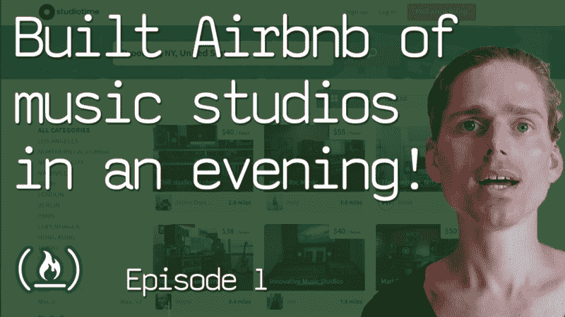
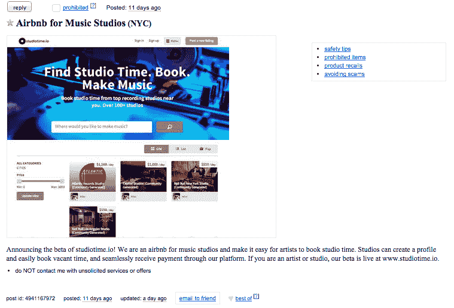
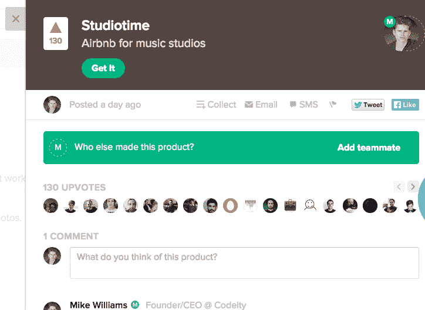
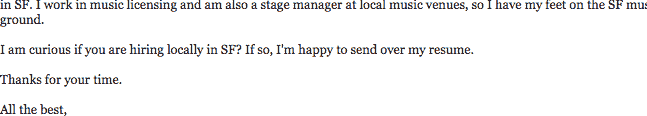
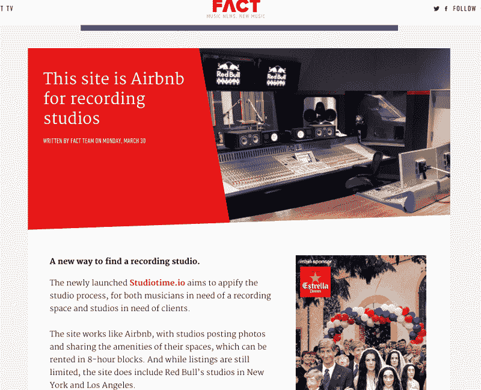

# 我如何在一个晚上建立起音乐工作室的 Airbnb

> 原文：<https://www.freecodecamp.org/news/how-i-built-the-airbnb-of-music-studios-in-an-evening-part-1-742b47bc09c2/>

作者:迈克·威廉姆斯

# 我如何在一个晚上建立起音乐工作室的 Airbnb

This is Part 1 of my [How I series](https://youtu.be/IZGlnImsrxc) with freeCodeCamp I’m excited to share!

有时候你会想到一个你知道必须要实现的想法。这就是我想出的 [Studiotime](http://www.studiotime.io) 的情况，它最初是一个简单的市场想法，供艺术家预订音乐工作室。今天，它是音乐工作室最大的在线市场！

### 最初的构思阶段

一天晚上，Studiotime 的想法出现在我的脑海中，我立即开始搜索[产品搜索](http://www.producthunt.com/posts/studiotime)和“ [Airbnb for x](http://www.producthunt.com/producthunt/collections/airbnb-for-x) ”系列。我想我会发现这个想法已经形成了。然而，令我惊讶的是，我找不到任何类似的东西。那是我致力于建立 Studiotime 的时刻。

作为一名连续创客和企业家，当我开始项目时，我试图有一个过程和工作流程，以便我可以优化时间和资源。在这种情况下，我几乎没有资源或帮助，因此我为创建 [Studiotime](http://www.studiotime.io) 设置了以下规则:

1.  在几分钟内想出一个朗朗上口的名字和标志。不要探索 MVP 的设计/品牌计划。
2.  尽可能使用现有的技术/代码，不要在技术方面重新发明共享经济市场(我用了 [Sharetribe](http://bit.ly/2wD5cTG) )。
3.  从想法到功能原型不应超过一个晚上，这将是截止日期。一旦我投入到建设中，我就取消了晚餐计划。到晚上结束时，我会有一个工作室时间的 MVP，或者我会把这个想法放在一边，这样我就可以专注于工作周期间用 [Thinkbox](http://www.thinkbox.io) 处理日常工作。
4.  在 [Studiotime](http://www.studiotime.io) 的晚间构建之后，第二天我会试图说服几个业内朋友注册，这样我就可以证实这个概念的必要性。

### 构建 MVP

在白板上写下这些规则后(为了便于说明)，我绘制了用户帐户创建的基本流程，列出了工作室、请求和预订工作室，以及其他需要定义的流程。我可以用这些作为修改 Sharetribe 平台的指南。一旦我有了这些流，大部分时间都花在了配置列表和信息上，这些都是满足我对 Studiotime 的需求所需要的。 [Sharetribe](http://bit.ly/2wD5cTG) 最初不是为预订或租赁而配置的，而是专注于销售商品和服务。我需要删除任何功能，并针对 Studiotime 的用例进行优化。

Modifying the studio listing fields, filters, and other specific data for Studiotime on the [Sharetribe](http://bit.ly/2wD5cTG) platform’s admin panel.

除了最初的设置、修改和测试，我忍住了进一步定制的冲动，并在那天晚上凌晨 1 点左右完成了最初的 MVP。

### 获得第一批用户并建立初始市场供应

第二天，我向音乐行业的几个朋友提到了 Studiotime，他们震惊地发现没有其他人已经建立了这个(像我第一次那样)。他们也不相信我是真正建造它的人，这提供了更多的证据证明确实需要它。有几个也报名了，所以是第一批 Studiotime 用户！

由于这是一个星期五，我忙于运行 Thinkbox，我没有在营销计划上花太多时间。我只能挤出时间在我的社交网站上发布关于 Studiotime 的消息，并继续和一些我之前联系过的朋友聊天。另外，那天晚上我设法在 Craigslist 上发了一些帖子。周六，我在 Craigslist 上找到了工作室，并与他们联系，试图让他们注册 Studiotime(库存)。

Original posting on Craigslist for Studiotime. This generated a few users over the weekend before our Product Hunt launch on Monday.

除了这个 Craigslist 项目，我还使用了 [Twitter](http://www.twitter.com/studiotimeio) ，在那里我向行业影响者和媒体发布了推文，让他们了解了 [Studiotime](http://www.studiotime.io) 。我的目标是在第二天发布产品搜索之前建立知名度并引起一些兴趣，我希望我能真正引起他们的注意。结果并不令人印象深刻，但我确实在 Studiotime 上有了最初的几个工作室和用户，这对发布会很有帮助。

此时，该网站仍在测试 URL 上，但我决定购买 [www.studiotime.io](http://www.studiotime.io.) 并在周日晚上提交给[产品搜索](http://www.producthunt.com/posts/studiotime)。由于我使用了 [Sharetribe](http://bit.ly/2wD5cTG) 而不是从头开始构建，我并不急于分享我已经将它提交给 Product Hunt，因为其他制造商通常会提交定制版本。那天晚上，我在产品搜索发布会的兴奋中入睡。

### 产品搜寻发布会

周一早上开始检查[产品搜寻](http://www.producthunt.com/posts/studiotime)。令我惊讶的是，有一些支持票和一点初始牵引力！到午餐时间，我开始收到数百名新用户的电子邮件通知，甚至有人在欧洲要求将他们的工作室添加到网站上。因为我只考虑过把洛杉矶和纽约作为开始的城市，所以我为当时没有预料到的城市的工作室建立了一个等候名单。

We received 130 upvotes on Product Hunt!

快进到 [Product Hunt](http://www.producthunt.com/posts/studiotime) 发布当天的下午 6 点，Studiotime 已经有超过 1k 的用户了！我们有工作室签约，有一个不断增长的艺术家社区，甚至有一个我们尚未服务的市场中工作室的等候名单。我们甚至有人给我发邮件，要求成为 Studiotime 的形象大使，还问我们(我)是否在招人！

Just one of the emails I received asking if we were hiring from music industry professionals.

### 当媒体报道你的时候

到了周一晚上，我在想，这一周我的副业有了一个很好的开始，它可能会在未来产生进一步的兴趣。让我惊讶的是(再次！)[事实杂志](http://www.factmag.com/2015/03/30/this-site-is-airbnb-for-recording-studios/)找到了我们，写了一篇关于 Studiotime 的文章，为网站带来了巨大的流量。

我知道，仅 Product Hunt 上的 130 次投票并不属于第一批 1000 名用户，这篇文章只是一系列媒体报道、博客和音乐行业其他人注意到 Studiotime 的开始。周末的外展努力、产品搜寻意识和口口相传都让我们成为音乐行业的焦点。BBC、 [Hypebeast、](https://hypebeast.com/2015/4/theres-an-airbnb-for-recording-studios-now)、Forbes 以及超过 [50 家其他媒体和博客](https://listings.studiotime.io/en/infos/about)都报道了我们。

在几乎没有资源的情况下，但利用流程、策略和速度，我能够在一个晚上将 Studiotime 从一个想法变成 MVP，然后在几个小时内产生成千上万的用户和初始牵引力。

> 想看更多细节的视频吗？观看这段 12 分钟的视频，我将分享更多内容:

这是关于 Studiotime 系列的第二部分:[我如何占领世界上最大的音乐工作室市场](https://medium.freecodecamp.org/how-i-scaled-the-worlds-largest-music-studio-marketplace-75a90e5d551b)