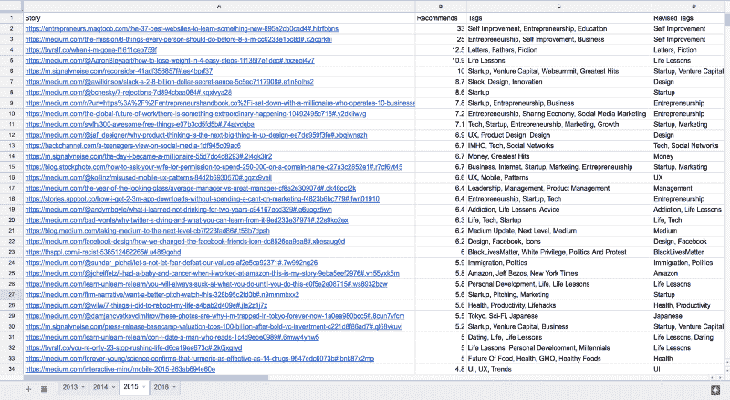
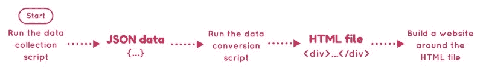
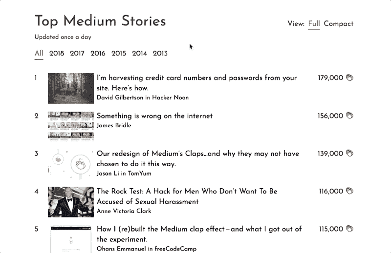
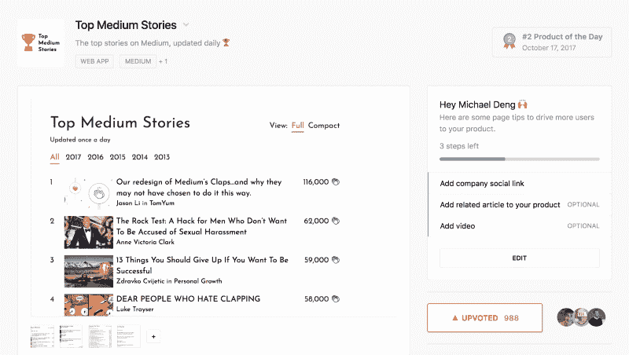
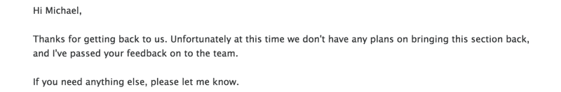

# 我是如何用有史以来最热门的媒体故事建立排行榜的？以及它是如何差点死掉的。

> 原文：<https://www.freecodecamp.org/news/how-i-built-top-medium-stories-e07a32cf5255/>

去年，我建立了“顶级媒体故事”——一个展示媒体有史以来顶级故事的网站。这是一个关于一个孤独的开发者如何搜集了成千上万个故事并遇到看似致命的障碍的故事。

*剧透预警:人生自有出路。您可以在[TopMediumStories.com](https://topmediumstories.com/)查看每日更新的排行榜。*

### 我为什么要做这个？

作为 Medium 的长期读者，我一直很好奇最受欢迎的故事是什么。虽然个性化的订阅源和主题页面展现了许多精彩的故事，但也有许多故事被遗漏了。

为了挖掘埋藏在 Medium 编年史中的宝石，我在 2017 年初设定了一个新目标:我要在 Medium 上找到有史以来最受欢迎的故事，并与世界其他地方分享。

我的目标最终是发布我的年度顶级媒体故事清单。

我手动编辑这些故事，这是一项非常累人的工作。在一周的时间里，我访问了自 2014 年 9 月 10 日(头条新闻功能首次推出)以来的每个头条新闻页面。为了找到更早的故事，我使用回溯机翻遍了出版物档案，以获取中页的古代副本。

我为我找到的每个故事建立了一个巨大的电子表格。这是一大堆令人麻木的工作，但我为结果感到自豪。



A small section of the colossal spreadsheet ?

但我的自豪感是短暂的，因为这份名单很快就过时了。我想让它保持最新，但手动这样做是不可能的。

然后，我恍然大悟。我已经确定了第一次收集数据的手动步骤。我没有理由不能用代码自动完成这些步骤。因此，我决定把这个列表变成一个动态网站。

### 自动化数据收集

为了实现上述手动步骤的自动化，我使用 Python [Scrapy](https://scrapy.org/) 编写了一个 web scraper。

自 2014 年 9 月 10 日以来,“刮刀”搜索了每一个热门故事页面，并将它看到的任何故事都扔进了 Python 字典。然后，字典根据每个故事收到的点击次数进行排序，并写入一个 JSON 文件。(掌声是 Medium 的“赞”或“支持票”，读者可以给一个故事 50 次掌声。)

下面是 JSON 文件的一个片段:

```
[  “We fired our top talent. Best decision we ever made.”,   {    “recommends”: 79000.0,     “pub_url”: “https://medium.freecodecamp.org",     “author”: “Jonathan Sol\u00f3rzano-Hamilton”,     “image”: “https://cdn-media-1.freecodecamp.org/images/1*4hU3Xn7wunA81I3v17JIrg.jpeg",     “year”: “2017”,     “story_url”: “https://medium.freecodecamp.org/we-fired-our-top-talent-best-decision-we-ever-made-4c0a99728fde",     “pub”: “freeCodeCamp”,     “author_url”: “https://medium.freecodecamp.org/@peachpie"  }],...
```

在构建刮刀之前，我检查了 Medium 的 [robots.txt](https://medium.com/robots.txt) 文件，以验证我没有违反任何政策。我还将抓取速度设置得很慢(每次请求间隔 2 秒)，这样抓取器就不会攻击 Medium 的服务器。

#### 将数据转换为 HTML

下一步是将 JSON 文件转换成 HTML，以便在 web 页面上显示故事。

我安装了 [BeautifulSoup](https://www.crummy.com/software/BeautifulSoup/) 来做这个。首先，我用空表和空行构建了一个 HTML 模板。然后，我编写了一个脚本，使用 BeautifulSoup 从 JSON 文件中填充模板。

有了一个包含我想展示的所有故事的基本 HTML 文件，就该创建实际的网站了。



### 建立一个很棒的网站

在规划网站时，我有三个目标:

#### 1.简约优雅的设计

设计语言以大量空白和高对比度文本为中心。这样，焦点就在它试图突出的故事上，而不是网站本身的美学上。

我还添加了一个“紧凑”的视图模式，可以在网站上隐藏特征图片。这使得读者可以轻松浏览列表。


“Compact” mode

#### 2.快的

网站的第一个版本相当缓慢。这是因为它试图一次加载数百个特征图像。

为了解决这个问题，我使用了“延迟加载”当你登陆网站时，只有“全部”下面的前 50 个故事被载入。如果你想看更多的故事，你必须点击“加载更多”这种设计模式大大减少了初始加载时间。

此外，为了让导航感觉更灵敏，我把这个网站设计成了一个单页的 web 应用程序。当你点击一个按钮时，你不会导航到另一个 HTML 页面。相反，jQuery 会即时切换视图。



Responsive navigation and lazy loading in action

#### 3.轻量级选手

为了保持网站简洁，我选择放弃最流行的前端库。我没有使用 Bootstrap，并将 JavaScript/jQuery 的使用保持在最低水平。

看一眼项目回购就可以发现一个非常简单的设置。几个 HTML 文件、一个 CSS 文件、几个脚本和一些数据文件。

因此，网站没有太多可移动的部分和依赖关系。维护和调试非常简单。

### **测试和发射**

我和几个朋友分享了原型，并让他们把它拆开。根据他们的反馈，我对设计进行了两次迭代。然后，我开始寻找产品。

那天晚上我几乎无法入睡。我仍然记得不断刷新页面，检查新的评论，直到我筋疲力尽。

第二天早上，我爬下床，打开我的电脑。我简直不敢相信自己的眼睛！Top Medium Stories 位于 Product Hunt 主页的顶部。最终，它被评为当天的第二名产品。



[Product Hunt page for Top Medium Stories](https://www.producthunt.com/posts/top-medium-stories)

### 媒体高层故事的突然死亡

产品发布会超出了我最大的期望，我高兴了很长时间。但是我知道我还没有完成，直到我在 Medium 上分享了我的项目。我半年前开始写这个帖子，几周前终于写完了。出版它让我兴奋不已。

在提交之前，我决定再次运行数据收集脚本来更新网站。

剧本彻底失败了。

“没什么大不了的。我想，要么是媒体停电了，要么是我的互联网坏了。但是我错了。当我意识到实际发生了什么，我跌坐在我的椅子上，沮丧地用手指拖着我的脸。

我不骗你，两天前媒体已经从他们的网站上删除了头条新闻。他们破坏了我的刮刀赖以运行的页面！

我立即给 Medium 发了电子邮件，请他们考虑恢复头条新闻页面。我没有得到我想要的回应。



但我没有责怪他们。我的网站没有得到官方支持——他们没有义务做任何事情。即使他们没有做这个特别的改变，最终他们的一个更新会破坏我的网站。这是不可避免的。

我感到绝望。由于网站不能再更新了，它只不过是一个很快就会过时的静态列表。在我看来，Top Medium Stories 在上市时就已经死了。

### 新生命的萌芽

有一段时间，我从事其他工作，根本不看顶级媒体的报道。但我无法停止思考网站未完成的故事。我想发表一篇验尸报告——即使它没有一个美好的结局。这似乎是结束这个项目的好方法。

我以下面的话结束了这篇文章:

> “所以，我希望你喜欢阅读关于顶级媒体的故事。这是一次令人惊奇的经历，我为我所做的感到骄傲——我很抱歉不得不以这种方式结束。总会有一些你无法预测或控制的事情，它们可以在一瞬间抹去你的工作。这就是生活。”

当我盯着我完成的草稿时，我意识到了一些事情。我讨厌悲伤的结局。

突然，我的目光锁定了我之前提到的那个 JSON blob。

```
[  “We fired our top talent. Best decision we ever made.”,   {    “recommends”: 79000.0,     “pub_url”: “https://medium.freecodecamp.org",     “author”: “Jonathan Sol\u00f3rzano-Hamilton”,     “image”: “https://cdn-media-1.freecodecamp.org/images/1*4hU3Xn7wunA81I3v17JIrg.jpeg",     “year”: “2017”,     “story_url”: “https://medium.freecodecamp.org/we-fired-our-top-talent-best-decision-we-ever-made-4c0a99728fde",     “pub”: “freeCodeCamp”,     “author_url”: “https://medium.freecodecamp.org/@peachpie"  }],...
```

我得到了一个启示。我不需要头条新闻页面来更新网站。相反，我可以访问 JSON 文件中的每个 url，并直接从故事的网页中提取数据。

为了获取新的故事，我可以在媒体页面上抓取新的流行新闻，这将为我提供最近出版的热门故事。

在重构了我的代码之后，我意识到了一些事情:并不是每一个流行的新故事最终都会在大众媒体页面上展示。因此，如果你碰巧读到一个你认为应该登上《顶级媒体故事》但却没有的故事，请告诉我。只要把故事的网址发给**michaeldeng18@gmail.com**，我会马上添加进去。齐心协力，我们可以确保排行榜尽可能全面。

总有一天 Medium 会完全限制抓取，甚至发布他们自己的故事排名。这些变化中的任何一个都可能让顶级媒体故事过时。

但与此同时，我会继续维护 Top Medium Stories，这是发现精彩故事的最佳网站。

如果到目前为止你还没有看过顶级媒体故事，[去看看吧](https://topmediumstories.com/)！如果这个网站能帮助你找到那些你从未偶然发现的非凡故事，我会非常高兴。

感谢阅读！