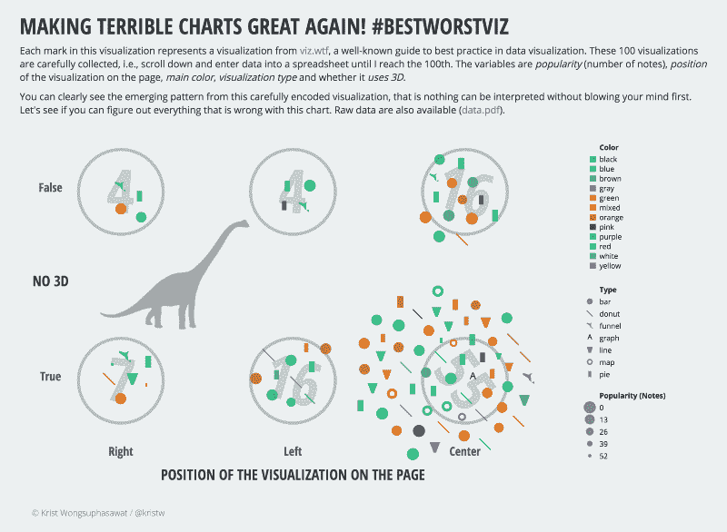

# 我如何精心制作一个真正可怕的数据可视化

> 原文：<https://www.freecodecamp.org/news/how-i-carefully-crafted-a-terrible-visualization-2c8e06d50ebb/>

作者:克里斯特·旺苏帕萨瓦特

# 我如何精心制作一个真正可怕的数据可视化

是的，你没看错。我将解释我是如何故意拼凑出一个非常糟糕的视觉效果的。

visualisingdata.com 的安迪·基尔克发布了一个有趣的竞赛，挑战每个人想出 T2 的“最佳最差视频”当然，我这样做的动机之一是赢得一本他的书。但竞赛本身也是一项深思熟虑的练习。

当谈到极其糟糕的可视化效果时，刻板印象通常涉及到 *3D 饼图、* *彩虹调色板*和糟糕的字体、布局和颜色选择。

在我看来，糟糕的视觉化并不仅仅如此。我心中的目标是创造一个看起来完全无害，但会折磨你的大脑，直到你意识到整个事情是多么荒谬可笑。

我从 [viz.wtf](http://viz.wtf/) 上的可视化中收集数据，并画出每个标记来代表其中一个可视化及其属性。锻炼你的 WTF 腺体的示例问题有:

*   这些可视化效果最常见的颜色是什么？
*   饼状图在哪里？
*   你能指出最不受欢迎的作品吗？
*   3D 多久用一次？
*   有什么规律吗？

在阅读下一部分之前，试着自己找出这张图表的所有问题。

### 概念

主要想法是在感知上制造冲突，扰乱观众的认知思维。

糟糕的可视化通常在视觉编码和数据之间存在不匹配，例如对数值的不可比区域(3D pie)进行编码。这些不匹配让观众无事可做，只能挠头，然后放弃可视化，因为这需要太多的努力来理解它。

我想让 bad 更上一层楼，灵感来自于堆栈溢出问题中我最喜欢的一个回答，“[你遇到过的源代码中最好的注释是什么？](http://stackoverflow.com/questions/184618/what-is-the-best-comment-in-source-code-you-have-ever-encountered)

> #定义真假
> //快乐调试冤大头

我的目标是做一些看起来可以被解释的东西，但是会与我们之前的知识产生强烈的冲突，这几乎是不可能克服的。为了做到这一点，我选择了非常直接的编码方式，比如用颜色代表颜色，用位置代表位置，然后违反直觉地设置映射，这样我就可以彻底扰乱观众的思维。

### 数据

我在寻找一个好的数据集来尝试这个想法，但没有找到一个我真正喜欢的。然后我有了一个想法，创建一个糟糕的可视化效果，糟糕的可视化效果，递归地是不好的，所以我从 [viz.wtf](http://viz.wtf/) 手动收集了一些数据

### 以下是我在这张表上犯下的所有罪行:

1.  我用颜色来表示颜色，但不保证它们会是同一个颜色。因此，*绿色*就是新的*黑色*。
2.  我也没有添加足够的独特颜色，所以有重复。例如，*红色*和*蓝色*都用*绿色*表示。(一开始这不是故意的，后来让事情看起来更糟所以我留着。)
3.  “混合”颜色有一个特例，因为我不能决定用什么颜色来编码。结果，这些“混合”的视觉化图像中的每一个都接收到随机选择的颜色。
4.  我用 position 来表示位置，但确保它们永远不会匹配。有了它，右边就是左边。
5.  我使用形状来表示图表类型，但确保它们从不匹配。因此，条形图是一个圆，而饼图看起来像一个条形。
6.  我用大小来编码受欢迎程度，但是用了一个相反的尺度，最大的大小意味着零。
7.  我把轴标签做得比需要的更复杂。没有 3D？真的还是假的？
8.  我用度数来旋转每个大数字的值。这个是无意义的编码。
9.  巨大数字周围的圆圈没有任何意义。它们不表示边界。
10.  如果你把所有的数字加起来，实际上有 102 个可视化，而不是 100 个。
11.  我加了一只恐龙。因为我可以。
12.  最后，有一个原始数据的链接，以 PDF 格式自豪地分享。

如果你发现了我忽略的这个可视化的其他可怕的方面，请随时在下面留下回应，或者发推特给我。