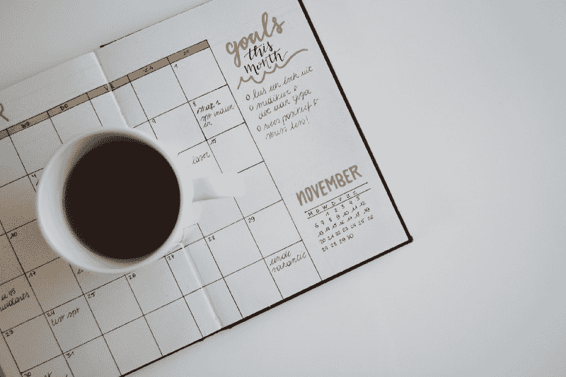

# 我如何通过每天编码 30 分钟来完成#100DaysOfCode 挑战

> 原文：<https://www.freecodecamp.org/news/how-i-completed-the-100daysofcode-challenge-by-coding-30-minutes-a-day-d7c6dca80f09/>

作者:西比尔·瑟尔

# 我如何通过每天编码 30 分钟来完成#100DaysOfCode 挑战

Photo by [rawpixel.com](https://unsplash.com/@rawpixel?utm_source=medium&utm_medium=referral) on [Unsplash](https://unsplash.com?utm_source=medium&utm_medium=referral)

回到 10 月份，我真的很沮丧。我刚刚完成了计算机科学的硕士学位，开始了一份新工作，与我的硕士学位不同，这份工作几乎不涉及编程。这是技术性的，我正在学习大量令人惊奇的新东西，但我慢慢感到我的编程能力正在消失。

去年夏天我在 Twitter 上更加活跃，我遇到了由亚历山大·卡拉威发起的#100DaysOfCode 挑战。这是一个简单的挑战，也是它如此成功的原因:每天至少花一个小时写代码，并写日志/微博来让自己负责。

快进到今天，我已经完成了#100DaysOfCode 挑战，即 freeCodeCamp 前端认证，我的第二个#100DaysOfCode 已经进行了一半。我是怎么做到的？所有这一切的关键是**小而分块的可衡量目标，以及一致性** *。*

#### 决定一个合理的每日目标

有一份全职工作，并志愿参加许多其他活动，如在 CodeFirst 教书:女孩们意味着我不能每晚投入 1 - 2 个小时。在漫长的一天工作结束时(通常是在又花了两个小时做了一些其他事情，如志愿活动或锻炼后)，我筋疲力尽，想休息一下，为下一个工作日充电。毕竟，睡眠是很重要的，我们都需要睡眠来达到最佳状态。

考虑到所有这些，我只留出 30 分钟作为第一轮挑战的每日目标。你可能会问，为什么是这个神奇的数字？午休时可以很容易地腾出半小时。它可以是你在旅途中听技术播客的时间。或者，如果你不能在家编写代码，你可以花 30 分钟在应用程序上学习。

即使在我最忙的日子里，30 分钟也是可以做到的。为自己设定雄心勃勃但实际上可以实现的目标是保持 100 天连胜和不放弃自己设定的目标的关键。

Photo by [Estée Janssens](https://unsplash.com/@esteejanssens?utm_source=medium&utm_medium=referral) on [Unsplash](https://unsplash.com?utm_source=medium&utm_medium=referral)

#### #100DaysOfCode 是你的个人挑战

我见过很多人给自己设定了过于雄心勃勃的目标，却意识到生活可能会阻碍他们。有些人对自己非常严格，如果他们连续 70 天没有完成编码，就会宣布挑战失败。

在我看来，为了适应你的生活方式，稍微变通一下规则不仅重要，而且是必要的，这样才能度过挑战，保持积极的心态。生活就是这样，你可能得了流感，个人情况让你在 2 - 3 天内不能编程，或者干脆忘记一天。没关系，只要你回到正轨。

有时候，人们会因为做得不够而自责，并感到沮丧，我自己也多次有这种感觉。但是，不要忘记#100DaysOfCode 是你的个人挑战。你为自己决定规则、环境、约束和奖励。不要被那些看起来学得更快、学得更多或构建看起来更好的项目的人分散注意力。每个人的旅程都是不同的，我们每个人都有自己的战斗要打。

我的个人目标是在第一轮结束前完成我的 freeCodeCamp 前端认证，这个目标有点太大了。我没能成功，但我差一点就成功了，我仍然认为这次挑战是一次惊人的成功。

在此期间，我建立了七个项目，并建立了我的个人投资组合。我与志趣相投的人建立了网络，提高了我的代码质量，并通过播客、书籍和媒体文章学到了很多东西——所有这一切都只花了 30 个阿敏日。

Photo by [Mikito Tateisi](https://unsplash.com/@tateisimikito?utm_source=medium&utm_medium=referral) on [Unsplash](https://unsplash.com?utm_source=medium&utm_medium=referral)

#### 坚持下去——即使很难

有些日子你会觉得不可战胜，时间会在瞬间流逝。有时候，仅仅激励自己学习 30 分钟就感觉像是一件绝对的苦差事。这是正常的。给自己设定可实现的目标意味着即使在那些日子里，你也会觉得自己已经达到了目标。

例如，你可能在工作中度过了糟糕的一天，或者总体上感觉不太好，但是你仍然会达到那天的目标。小块的成功，每天都是可以实现的。如果你设法完成了超过 30 个阿敏日，那就太棒了——你正处于**火** *之中。*

我打算在完成第一轮#100DaysOfCode 和休息后暂停一下，我准备好了感到筋疲力尽。令人惊讶的是，这些感觉都没有到来，相反，我想知道接下来要建立什么或者从现在开始要学习什么。

我已经变得如此习惯于每天编程，习惯于每天学习，以至于我有一种持续下去的强烈愿望。

这就是为什么我在第一轮之后差不多两天就开始了第二轮，之后就再也没有回头。比较我从 10 月份开始以来的过去 150 天里学到的东西和建立的东西是一个很好的练习，并向我展示了我每天采取的所有这些微小的步骤都带我到了我最终想要的地方。坚持是学习和掌握任何事情的关键，如果你坚持不懈，你会获得成就感。

#### 分享你的成功

在推特上发布你的进展也是挑战的一个重要部分，这可能是我有时坚持下去的唯一原因。一开始，在推特上发布我的进展对我来说有点奇怪。但最终，我开始每天庆祝我的小小里程碑。

我也没有在 GitHub 上写日志，而是用 Twitter 作为我的个人日志来回顾我所学到的东西。最神奇的是你从#100DaysOfCode 社区得到的不断反馈和欢呼。通过参加挑战，我发现了许多可爱而有才华的人，我的大部分灵感都来自他们。我试着鼓励人们，并在每天的大量更新中留下心声，因为我知道他们对我有多重要。尤其是当你觉得自己渺小和无足轻重的时候，来自社区的一些积极的东西会有很大的帮助。

我们一起学得更好，通过分享知识、成功和积极性，我们可以从彼此身上学到很多东西。#100DaysOfCode 也不例外。每天加入成千上万的学习者，并被激励去实现你的个人目标。相信我，你不会后悔的。