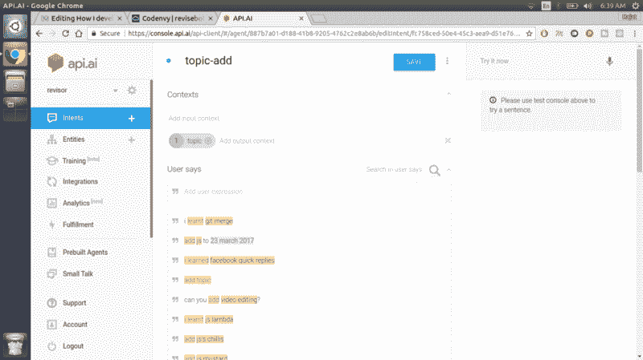
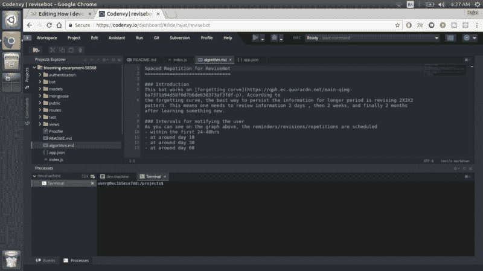
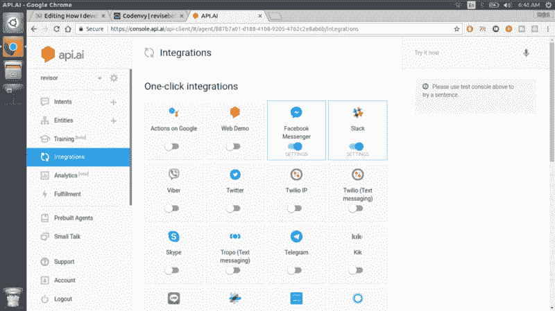
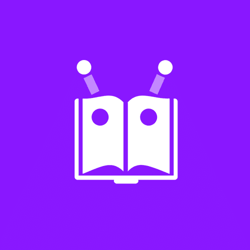

# 我是如何完全在云中设计、开发和部署聊天机器人的

> 原文：<https://www.freecodecamp.org/news/how-i-designed-developed-and-deployed-a-chatbot-entirely-in-the-cloud-a60614eb94f2/>

作者 Rajat Saxena

# 我是如何完全在云中设计、开发和部署聊天机器人的

这一切都始于几个月前我在 YouTube 上录制的一段视频。在这篇文章中，我谈到了刻意修改的重要性。这有助于你更长时间地记住一些东西，并给你修改重要项目的技巧。如果你还没有，请[在这里观看](https://youtu.be/SvOzfgptqhM)。

在视频中，我谈到了你应该多久复习一次，遗忘曲线到底是什么，以及为什么你应该关心它。

除了视频，我想给你们一个合适的工具，这样你们可以更好地复习。作为一名开发人员，我的自然反应是“让我们写一个应用程序吧！”

但是如果你读过我的另一篇文章，关于[为什么本地应用注定要失败](https://hackernoon.com/mobile-apps-are-doomed-i-repeat-mobile-apps-are-doomed-3cf80193819f)，你就会知道我有点不愿意为此写一个独立的应用。我后退一步，分析了形势。我需要一个后端来存储用户数据，一个前端来收集和显示这些数据。

我希望用户尽可能无摩擦。强迫用户下载一个新的应用程序是很难的。如果我建立一个聊天机器人，它将服务于这个目的，我不需要说服任何人下载任何东西。我还会节省一些时间，因为我不必构建一个独立的客户端应用程序，也不必经历应用程序商店的流程。

你可以试试我做的机器人[这里](https://blooming-escarpment-58368.herokuapp.com/)。

我们开门见山，说说流程吧。继续读下去，看看我的聊天机器人是如何从一个想法变成一个完全可用的产品的——完全使用基于云的工具。

### 问题 1:人工智能和自然语言处理

自然语言处理(NLP)和人工智能是任何智能聊天机器人不可或缺的组成部分。所以，我从一开始就知道，我需要人工智能和自然语言处理来让我的机器人变得“智能”和你可以交谈的东西。它也应该明白你在要求它做什么。我来自一个全栈开发背景，我对机器学习、人工智能或 NLP 毫无经验。但是对这个机器人来说，所有这些东西都是必需品。

作为一名技术爱好者，我总是密切关注 Biggies 正在推出的工具和库。我知道脸书发布的在线 API[wit . ai](https://wit.ai/)，用于在你的应用和机器人中启用 NLP。我用它玩了一会儿，但发现它特别难。

我赶紧搜索其他替代品，找到了 [Api.ai](https://api.ai/) 。我试用了一下，发现它对开发人员更友好，所以我就用了它。

下面是你对这些人工智能应用编程接口的具体操作:

1.  首先，你写下你的机器人和一个人之间可能发生的对话。
2.  基于这个对话，你创建一个专属的流程图(或者类似的东西)来处理对话的所有结果。
3.  您可以对 Api.ai 代理进行编程，以使用其仪表板处理所有预定义的结果。这很简单——一旦你学会了。

**注意:**如果 API.ai 的内置处理程序不能处理您的用例，您可以调用驻留在您的安全后端中的自定义逻辑。在 Revisebot 的例子中，我存储每个用户的学习历史，并计算用户下一步应该修改什么主题。这需要定制计算和持久化机制。

Revisebot’s NLP using Api.ai

Api.ai 还提供了一些预建的代理，如 small talk 和 weather 代理，可以回答用户关于天气和其他话题的查询。这些都是即插即用的东西，你可以随时在你的聊天机器人中使用。

由于 Revisebot 需要处理定制用例，我不得不写一些代码。是时候生产一些 JavaScript/Node.js 代码了。耶！

### 探索 2:云托管

我是[数字海洋](https://www.digitalocean.com)的长期用户，但它的最低费用约为 6 美元/月。因为我不希望从 Revisebot 上赚钱，所以在 Digital Ocean 上托管它没有意义。我每个月都会赔钱。

为了这个项目，我需要一个免费的云主机。我知道 Firebase 提供免费托管服务(我过去也用过)。我也使用过[的开放式轮班](https://www.openshift.com)，用于其他项目(主要是[的拉腊维尔](https://laravel.com/))。但我认为谷歌搜索一些其他替代方案是个好主意，至少为了 Node.js。

就在那时，我看到了 Heroku 和它的免费计划。

很快，我了解到 Heroku 的 Node.js 集成非常棒。因此，我阅读了他们的文档，并在他们的免费 dynamo 上快速开发了一个 Node.js 应用程序。这足够满足我的需求了。它唯一的限制是它会休眠一段时间，所以当发电机从休眠中醒来时，第一个 API 调用可能会失败。但是我调整了我的聊天机器人来应对这种情况。

### 任务 3:云中的 MongoDB

我一直在考虑学习一些 MongoDB。所以我决定用 MongoDB 作为我聊天机器人的数据库。聊天应用是 MongoDB 基于文档的存储系统的一个很好的用例。

当我发现 Heroku 不免费提供 MongoDB 集成时，我的计划遇到了一个小小的障碍。别担心——我回到我的朋友谷歌，搜索“免费的 MongoDB 云”

这就是我如何知道[mlab](https://mlab.com/)的，它在云中提供免费的 MongoDB 实例。

他们的免费计划不推荐用于生产就绪的应用程序，但没关系。反正我要用免费计划运行我的聊天机器人。

### 任务 4:云集成开发环境

我的计划是在我的全职工作结束后，利用任何空闲时间编写整个程序。正因为如此，我需要从任何地方编码的灵活性。因此，我的开发人员工作空间需要驻留在云中，我可以从任何有互联网的地方加载。

我使用基于云的 ide 已经有一段时间了，体验是复杂的。Nitrous.io 很棒，但他们关闭了它。:(在尝试了一些在线 ide 如 [cloud9](https://c9.io/) 和 [codeanywhere](https://codeanywhere.com/) 之后，我发现最稳定和对开发者友好的是 [Codenvy](https://codenvy.io) 。它提供了工作空间，你可以按照自己的意愿创建或销毁。

所以我在 Codenvy 中创建了一个新的基于 Ubuntu 的工作空间，并马上安装了 node、npm、git 和 curl。Codenvy 也提供了一个终端，所以 Linux 用户感觉就像在家里一样。我在云中的开发人员工作区已经设置好了。

接下来，我**从 Heroku git 克隆了**我的项目的存储库，并使用。 *env* 文件。正如你在下面的截图中看到的，*blooming-escarpment-58368*是我的 Heroku Node.js 项目。

Coding revisebot in Codenvy.io

### 任务 5:将聊天机器人与社交媒体 API 相结合

聊天机器人本应与 Facebook Messenger 和 Slack 配合使用。我必须学习这两个平台的开发人员 API，并设置我的开发机器来测试 API 调用。幸运的是， [Api.ai](https://api.ai) 还提供了与大多数社交媒体平台的简单一键式集成。你只需要按照他们的文档把你的聊天机器人带到指定的平台上。

Social Media Integration for Revisebot

正如你在上面的截图中看到的，截至目前，我已经将 Revisebot 与 Facebook Messenger 和 Slack 集成在一起。这一步不会花很长时间，相信我。

使用这些工具，我能够编写、测试和部署我的聊天机器人的整个生态系统(数据库、应用层、前端和人工智能代理)，以响应用户的查询。

但是为了使 Revisebot 成为一个完整的成品，还剩下一些部分。

### 问题 6:源代码管理

虽然我是这个聊天机器人的唯一开发者，但我需要将代码存储在安全的地方。对于源代码和版本控制管理来说，Git 是一个显而易见的选择，但是 GitHub 没有提供免费的私有存储库。Revisebot 不应该是一个开源项目，所以我不能把源代码放在那里。此外，由于我没有使用本地开发机器，我不能使用任何本地 git repo 来存储我的代码。

以前，我和 bitbucket.org 一起玩耍。我知道他们提供了一个**免费的私有库，**，但是不确定他们是否还提供这样的计划。我去了他们的网站，发现确实如此。剩下的就不言自明了。

### 任务 7:图形资产

设计和图形是任何数码产品的核心。我需要我的聊天机器人的脸书页面，Slack 应用商店列表和主页的标志，背景图像和封面图像。

我根本不是设计师，所以我需要一些帮助。我必须选择调色板和图标，混合形状来创建一个标志，等等。

幸运的是，有一个非常有用的工具叫做 [Canva](https://www.canva.com/) 。

它为社交媒体、YouTube 和徽标提供现成的设计模板，您可以根据自己的需求进行定制。我创造了 Revisebot 的标志，完全在 Canva，使用自由形状和一些创意。我觉得我做得很好。

Revisebot’s Logo, built using Canva.com

我还用他们的一些免费模板为 Revisebot 创建了其他视觉资产，比如脸书封面图片。

这就是我如何编码和部署一个完全工作的聊天机器人，它可以帮助你安排你的复习，完全在云端。

运行这项服务的成本正好是 0 美元。

如果你对我的项目有任何问题，请告诉我。

*没有本地机器参与制作这个聊天机器人。

如果你喜欢这个帖子，请给我一些掌声，并关注我的更多帖子。如果你喜欢开发数字化的东西，你也应该订阅我的 YouTube 频道。

#### [推特](https://twitter.com/rajat1saxena) | [YouTube](https://www.youtube.com/channel/UCUmQhjjF9bsIaVDJUHSIIKw) | [雷恩工作室](https://medium.com/rayn-studios)

直到下一次…