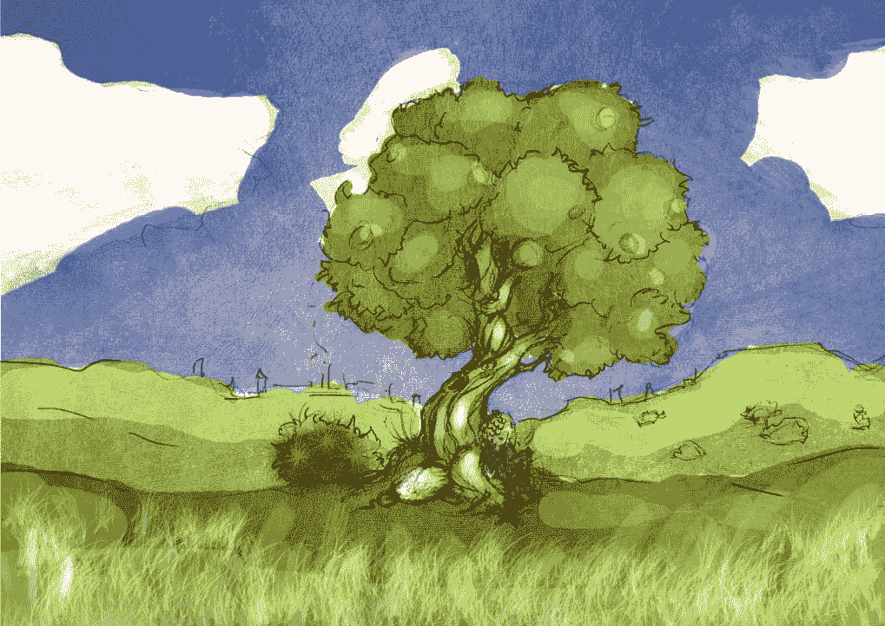
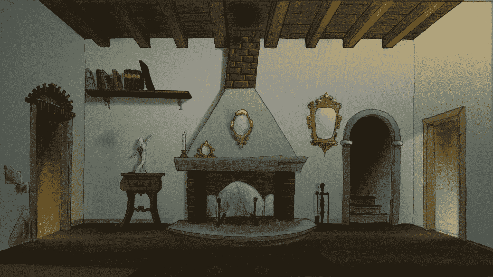
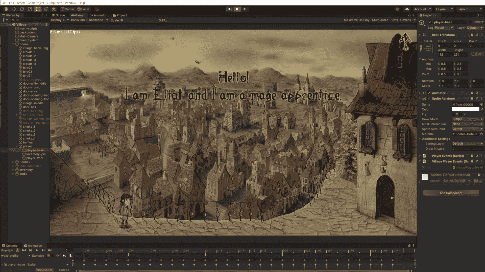
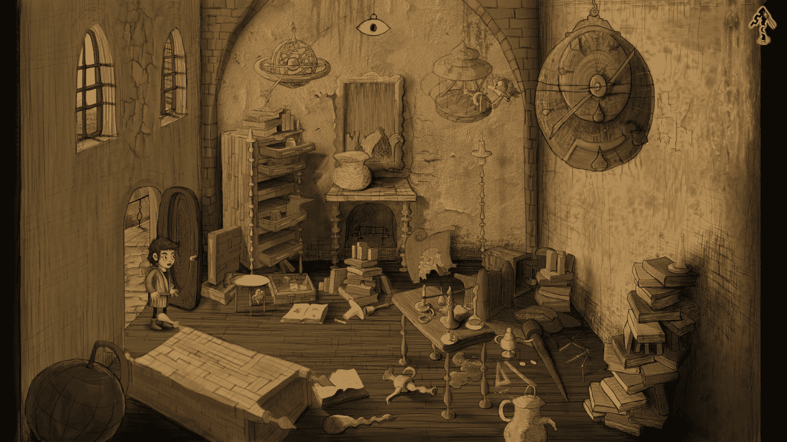
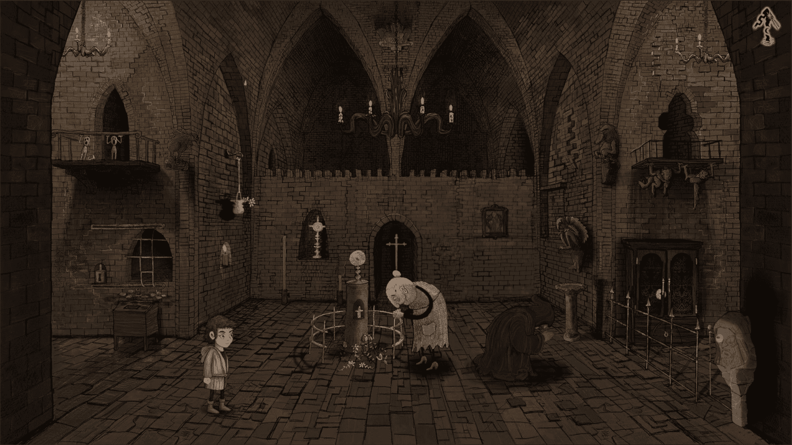
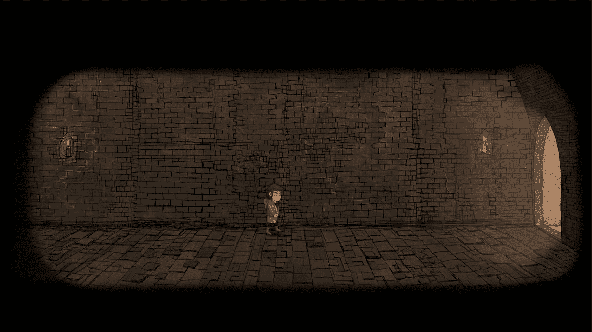
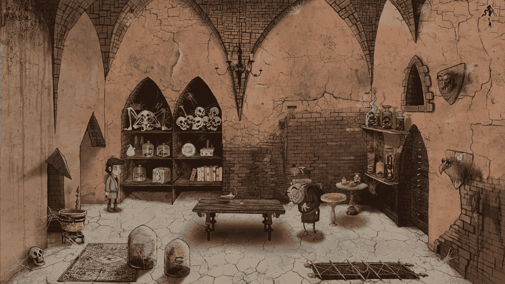
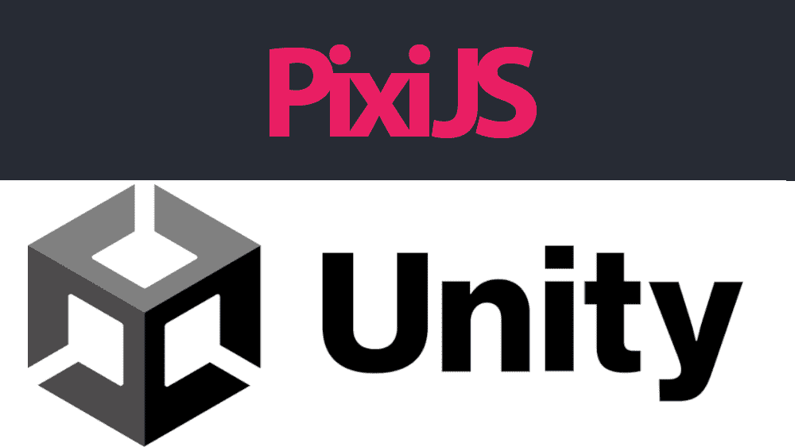

# 我如何开发我的第一个冒险游戏

> 原文：<https://www.freecodecamp.org/news/how-i-developed-my-first-game/>

很难说清楚我创建 Occulto(一款点击冒险游戏)的旅程是从什么时候开始的。但我心中有一个重要的日子:

2018 年 5 月 3 日。

有一件事让事情有了进展:

> 你好，安德里亚。抱歉打扰你。我想学习如何开发应用程序。我疯了吗？

> 我(安德里亚):
> 嗯...我没有你的号码...你是谁？

现在看那两条 WhatsApp 的消息让我会心一笑。但是还有另外两条有趣的信息:

第一，那是 2018 年 5 月。现在是 2022 年...三年零几个月后，我们发布了我们的第一个游戏演示。所以，是的，我们花了 3 年时间来发布一个演示。

但我们现在正以稳定的速度生产，在 2023 年的前几个月，我们将发布整个游戏。

也就是说，如果你打算自己开发一款游戏，不一定要花 4 年时间…我有一些建议，希望能有所帮助！

第二，一个 app——每个人都想做一个 app。我们真的需要另一个应用程序吗？用游戏来代替怎么样？我的意思是:冒险游戏就像一本书，你安装它，玩它，享受它，最终卸载它。这不是又一个污染手机内存的应用程序。

在开始之前，让我后退一步，解释一下这篇文章是关于什么的。

## 我们将在本文中讨论的是

这篇文章是关于我(Andrea)和 Luigi 如何开发我们的第一个冒险游戏 *Occulto* 。

它将涵盖项目的一些技术方面，以及我们如何管理创建和开发它。我将讨论旅途中的心理和实践部分。

我还将对使用 web 技术(如 WebGL)进行开发和使用 Unity 2D 进行简单的比较。

这篇文章包括:

*   一个简短的故事，关于我对冒险 P&C 游戏的热情，以及我如何结束开发自己的游戏。
*   一个关于*占领*的部分，我正在开发的游戏
*   技术部分比较了 web 技术和 Unity 2D
*   一个关于我在这个过程中学到的东西的部分，如果你正在创建你自己的游戏，还有一些建议。

## 我是如何进入冒险游戏的

很多年前，一个好朋友给我介绍了 [Machinarium](https://amanita-design.net/games/machinarium.html) 。Machinarium 是我玩过的最好的冒险游戏之一。

在我完成它之后，我觉得有必要创建自己的冒险游戏。这种感觉不是即时的，而是随着时间的推移变得越来越强烈。最终，它让我找到了 Luigi，并真正能够创建自己的独立游戏。

### 第一次冒险游戏尝试



在我第一次尝试构建游戏时，我联系了一些朋友，并创建了一个小团队，他们热衷于创建一个艺术化的 P&C 游戏。

我们设法制作了第一个场景的草图(见上图)。这个主意是让一个苹果落到正在树下休息的牛顿的头上。

我用 [Playn Java 框架](https://github.com/playn/playn)用 Java 写的，导出到 Android，iOS，web。当时我是一名 Java 开发人员。Playn 仍然是一个活跃的项目，如果你正在寻找一个 Java 2D 游戏框架，它可能值得考虑。

这第一次尝试并没有持续多久。我们一起吃了顿饭，并请两个朋友给我们展示了一个游戏的故事草稿。然后我没有从其他人那里得到任何反馈，这个项目就消失了。

### 第二次尝试


在我的第二次尝试中，我设法创造了四个场景，并在其中做了一些游戏。但是这个项目失败了，因为我没有准备好领导这个项目。你很快就会读到。

下面你可以看到一个游戏场景的图像。这是一部现代版的《小红帽小红帽》(如果狼不坏的话:)。



## 第三次也是最后一次冒险游戏尝试:占领

开发 *Occulto* 是我第三次尝试开发冒险游戏——希望这次能成功！



Unity Editor: 1° Village

### 游戏简介

这是一个美丽的早晨，年轻的法师学徒艾略特要去他的导师的工作室上一堂关于魔法药水的课。从一开始就有问题:为什么大法官不开门？

画室里乱七八糟，一张纸条告诉艾略特去村里的教堂。这是怎么回事？大法官在哪里？



2° Magister studio

你会帮助艾略特寻找他的导师，并重新获得一本名为“从未写过的书”的强大禁书，这本书是一个邪恶的人物试图窃取的旅程吗？

演示由四个场景组成:



3° Monastery

修道院和一个僧侣的私人工作室之间有一条秘密通道。



4° Secret passage

下面你可以看到演示的最后一个场景。



5° Monk private studio

## 我用来制作冒险游戏的技术



我们最初使用 [Pixi 开发*occulture to*。JS](https://pixijs.com/) 和 HTML。后来，我使用编辑器中默认包含的 2D 特性切换到 Unity。

由于这篇文章很长，我就不详细介绍代码了。但是我会提供一个我们使用的技术和创造游戏的过程的描述。

我计划为技术部分写第二篇文章。

我们由三个人组成:

*   我，Andrea，开发人员和项目/技术经理。我也参与故事和游戏/谜语的设计。我是一名软件工程师。
*   设计和绘制场景的出色艺术设计师 Luigi。他还负责游戏的故事和游戏性。如果你喜欢上面的插图，那么你喜欢 Luigi 的作品:)。他毕业于数学系。
*   安东尼奥是音乐和声音设计师。他是一名软件工程师。

Luigi 使用 Photoshop T1 绘制场景，并使用 T2 特效 T3 制作动画。然后，他将所有内容导出为图像(jpg 和 png ),我稍后将使用这些图像来组合场景。

此外，安东尼奥为我提供了场景的声音和音乐。我们目前使用的是 mp3 文件，但我们计划将来改用 FMOD。

该游戏使用 FHD (1920x1080)图像，也可以在低端移动设备上运行。如果你想在一个有 1 GB 内存的设备上运行，你需要减少 FHD 图像的数量。如果您在内存中加载超过 50/60 的 FHD 图像，游戏可能会在内存不足的设备上崩溃。

在正常的 Unity 内存管理中，整个场景都被加载到内存中，所以你必须注意你添加到场景中的东西。

减少内存印记的一个简单而经典的解决方案是为动画使用精灵表。大多数情况下，一个动画适合 2048x2048 的精灵。我使用[纹理打包器](https://www.codeandweb.com/texturepacker)在 Unity 中创建并导入动画精灵。

此外，我使用 [ImageMagick](https://imagemagick.org/index.php) [CLI](https://en.wikipedia.org/wiki/Command-line_interface) 来修剪内部有对象的图像。我的输入是一个 FHD 透明的 PNG 文件，里面有一个对象放在正确的位置。然后我用:

```
magick mogrify -trim -verbose *.png > trim.txt
```

修剪图像并获得物体的精确位置。

最后，我将修剪后的图像添加到场景中，并使用我制作的脚本将坐标映射到 Unity 场景的 x，y 值。

通过修剪和使用 sprite-sheets，我解决了所有的内存问题。更小的图像也意味着加载场景的时间更短。在廉价的移动设备中，加载一个场景可能需要 5 或 6 秒钟(而在更强大的设备中，只需要不到一秒钟)。

关于 fps 和性能，Unity 很好——所以基本上你不用做什么特别的事情。你只需要避免糟糕的设计。并且注意[时间复杂度](https://en.wikipedia.org/wiki/Time_complexity)。例如，避免在游戏循环的每一个节拍上搜索一个元素。

正如我前面提到的，我正计划写一篇关于我如何使用 Unity 2D 开发游戏的科技文章。如果您感兴趣，请关注我或关注我们的某个社交账户。

### Unity vs WebGL

即使我使用了这两种技术，我也不是专家(这是我的第一个游戏)。所以下面我将只列出这两种技术的一些优点和缺点。

#### WebGL 的优点

*   用[电容](https://capacitorjs.com/)或[电子](https://www.electronjs.org/)便于随处移植。
*   程序员友好: [PixiJS](https://pixijs.com/) 让它变得非常容易。
*   如果你需要一个网络响应版本，这几乎是唯一可行的解决方案。
*   持续集成和交付到 web 非常容易，因为输出是一堆文件。
*   Web 开发已经成熟，你可以访问大量的库、实用程序以及 web packers，比如 [Webpack](https://webpack.js.org/) 。
*   使用 Git，协作非常容易且成熟。Unity 中有一些关于协作的东西，我没有探究。不知道两个人在同一个现场工作会怎么样。

#### WebGL 的缺点

*   与更原生的框架相比，性能稍低。
*   受制于 WebViews bugs(你无法解决)。
*   对于不懂 web 开发的程序员来说，这可能很难。
*   WebViews 似乎还没有准备好完美支持 WebGL。这款游戏在我的 Neffos 上运行不太好，谁知道它在哪些设备上出现了问题。也许 WebViews 还没有为游戏做好准备，但他们肯定已经为 HTML 和混合应用做好了准备。

#### 统一的优点

*   图形编辑器:更容易可视化/更新场景和微调。
*   简单而完整:它几乎拥有您需要的一切。
*   良好的性能:即使在 1920 x 1080 分辨率的低端设备上也能达到 60 fps。
*   跨平台，但是 WebGL 版本在手机上效果不好。
*   很多独立游戏都是用 Unity 制作的。如果 Unity 团队引入了一个 bug，它会很快被发现。

#### 统一的弊端

*   图形编辑器:你需要在你将要使用的每台电脑上安装一个更新的 Unity 编辑器。对于 Linux 来说就没那么简单了。
*   [封闭许可证](https://store.unity.com/compare-plans)但如果你在过去 12 个月里赚到 10 万美元，它有一个免费等级。
*   目前，移动网络版本还没有得到官方支持。
*   Linux Unity editor 是 alpha 版(经过多次尝试，我成功地让它工作了)。
*   没有太多关于它的有用信息:我阅读的大多数寻找特定主题帮助的帖子质量很低或者是视频。这与堆栈溢出质量相差甚远。但是文档做得很好。

请记住，本节并不打算对 Unity 3D 和 WebGl 框架进行详尽的比较。根据你的目标，一种技术可能比另一种更好。

也就是说，即使我是一名网络开发人员，我也必须承认 Unity 对于开发 2D 游戏(我猜 3D 游戏也是如此)来说非常棒。

## 我在建造占领区时学到了什么


### 需要有人来领导这个项目

这是我的第一个见解:如果是你向其他人提议一个项目(一个游戏、一个应用程序或其他什么)，他们会认为你会领导这个项目。

当时我认为我只是一个程序员，并不像一个项目负责人。如果有人不积极关注项目中的每个人，这是行不通的。

### 有正确的态度

对参与项目的人有正确的态度是很重要的。你还需要了解他们是否有生产力。

在这种情况下，“富有成效的”与它在工作中的含义不同。生产性的意思是“实际上能够生产”。在工作中，它意味着你生产了多少，你的产出有多好。

在我继续之前，让我给你讲个故事:

在着手开发游戏之前，我决定帮助一个家伙开发他的桌游界面。我这样做是因为我认为他发明的游戏是一个很好的游戏，其中有一些精彩的部分。

在这种情况下，我是开发人员，他领导项目(作为一个游戏的发明者，并不意味着你也是一个优秀的项目领导者)。

一开始一切都很好，我喜欢开发游戏。此外，我还在学习 React，我用它作为构建游戏应用的框架。(这是一款棋盘游戏，不是经典游戏，所以 React 是一个不错的选择，而且它有很多页面，不仅仅是游戏页面)。

然后事情开始变得奇怪:他开始要求截止日期，抱怨开发的延迟，并要求我认为在游戏的第一个版本中并不真正有用的功能。

最后没成，我也没办法和他好好合作，所以我屏蔽了所有的交流。还记得我免费为他的游戏工作，我甚至解决了一个导致游戏后端停止工作的讨厌的 bug。

那么，为什么是这个故事？告诉你和一群朋友一起做游戏和你在工作中做的是非常不同的工作。一些建议:

*   **不要把人逼得太紧**:如果你做游戏是为了好玩，那它一定很好玩。激励人们并帮助他们。他们(像你一样)正在为一个他们相信的项目免费工作。
*   **不要表现得像个老板**:即使你指挥并遵循游戏的每一步，人们也应该更多地把你当成一个项目经理/团队领导，而不是老板。

### 业余时间工作

能够“富有成效”也适用于你。你能在业余时间玩这个游戏吗？你能提供稳定的产出，而不需要长时间离开项目吗？

这是我在之前的尝试中遇到的第一个障碍。我不能提供一个持续的、及时的输出，人们认为这个项目要崩溃了。

在这种情况下，作为一名程序员，尽快整合你的其他团队成员的输出(图像、动画和声音)是很重要的。如果人们看到自己的工作很快融入到游戏中，他们会更加投入。同样，你越早整合他人的工作，你就能越早发现并解决问题。

### 尽可能多地移除障碍

为了在业余时间工作，你必须减少或消除所有的障碍。这些可以是物理(缓慢的计算机，太小的屏幕，...)还是心理。心理因素是最微妙的。我将试着列举其中一些:

不工作的罪恶感:这很难，我认为这是辞职的主要原因之一。你必须喜欢做你的项目。因此，截止日期、推动他人提高产量、威胁(比如“如果你工作得不够，你就出局”)都不起作用。

更好的办法是激励人们，帮助他们理解是什么阻碍了他们(或你)产生一些产出。

阻碍你实际工作的障碍:你可能会想“我想完成我开始做的事情，我想我可以在 10 分钟内完成它。”然后你会想:“但是个人电脑很慢，而且要花很长时间才能启动...可能是明天，现在我就在 Instagram 上农奴”。

重要的是，当你认为你可以在游戏中做一点工作时，你实际上可以没有任何延迟或障碍地做到这一点。

太累而无法继续玩游戏:的确，你不能过度劳累。在你工作的多少和休息的多少之间找到平衡是很重要的。但是避免长时间不玩游戏也很重要。

我注意到一些小的动作会有所帮助:比如对我来说，启动 Unity 编辑器就足够了，这样可以增加我在游戏中工作的机会。

**与他人分享你的成果**:尽管非技术人员可能不完全理解你在做什么(反之亦然)，但说明你解决了一个性能问题，或者你减少了包的大小，这是令人满意的。

事实上，在敏捷方法中，告诉你已经做了什么和将要做什么是要点之一。

**坚持**。不是所有的事情都会很容易。你必须坚持下去。即使你可能是因为激情而制作游戏，这仍然需要大量的工作，有时你必须坚持不懈，克服问题/障碍。你可能在工作中一直这样做，你也可以在游戏中这样做。

不是每个时刻都是快乐的时刻。想象一下，当我发现即将发布的演示在一些移动设备上无法运行，我不得不重写 Unity 中的所有内容。我确实度过了一个糟糕的周末。

但后来我设法改变了我的态度，从团结开始，并重新获得了在游戏中工作的乐趣。

幸运的是，我在游戏中的伙伴 Luigi 理解这一点，并同意我们需要推迟游戏演示的发布日期。虽然写这个演示花了很多时间(如果从第一次提交算起，是 2 年)，但我花了 3 个月重写它。

### 专注于开发游戏

非常重要的是专注于制作游戏，而不是游戏的框架。

作为一名程序员，你可能想写更多不必要的代码，并使用你喜欢的语言。根据您的需求选择框架(跨平台？2D 还是 3D？...)并尝试开发一个简单的关卡来了解自己是否做出了正确的选择。

当你开始的时候，你不一定对构建一个游戏的可能框架/技术有一个清晰的认识——而且有很多。此外，你会偏向于某些语言/功能。

关于这一点，我可以告诉你我犯的两个错误:

我一开始用的是 PixiJS 和 HTML 技术。与你想的相反，我甚至可以在中等性能的移动设备上以 FHD (1920x1080)的分辨率达到 60 fps。

这是因为大部分工作是由 WebGL 完成的。但在某一点上，当我使用 Capacitor (webview)将游戏移植到移动应用程序时，游戏开始在我的旧手机(Neffos X1 Max)上闪烁。但它在浏览器和我的其他手机上运行良好。甚至在我的摩托罗拉 Moto G 第一代(2013 年低端设备)上。

我应该早点在移动设备上测试(不仅仅是浏览器)。此外，游戏在我的低端设备 Moto G 上也不流畅(尽管它的运行速度接近 30 fps)。

我决定，我希望我的游戏即使在低端设备上也能流畅运行，所以我换成了 Unity 2D。Unity 被很多独立游戏开发者使用，C#也相当容易。我没有尝试虚幻引擎，因为我对 C++太生疏了。现在它在我的 Moto G 上也能流畅运行(60 FPS)。

第二件几乎是错误的事情是，我开发了一个库，在有多边形洞的多边形区域上寻找最短路径。[这里](https://github.com/Kouty/shortest-path-polygon-area)你可以找到 JS 代码(我已经移植到 C#上了，但是还没有在 GitHub 上发布)。

我花了 3 次尝试让它正常工作，花了很多时间。幸运的是，在我开始开发*occulture to*的时候，这个库已经准备好并开始工作了。现在我可以画出可行走的区域，让主角在里面移动，避开障碍物(多边形洞)。

事实是，拥有一个在可步行区域内移动东西的算法并不是绝对必要的，最好专注于实际制作游戏。其他 P&C 游戏不使用这一功能，它们只是沿着预定义的路径移动角色。

所以，在你着手做一些对游戏来说不是绝对必要的事情之前，看看你是否能找到一些已经实现的东西，或者它是否真的值得。

### 发布游戏的一个场景版本

在你选择了正确的框架后，选择一个场景，开发整个游戏，这个游戏包括一个场景，一个菜单和每个跨场景的 UI 组件。重要的是学会你需要的一切，并尽快发现问题。

还有，把游戏提交给你要用的商店进行内测(不公开)。是的，从开发到发布(私下)游戏，做一切必要的事情。

当我在 iOS 上发布游戏演示时，有一个动画不起作用。它可以在 Android，桌面，甚至是 iPhone 上使用开发者版本。所以是的，你需要尽快测试一切，甚至是发布的过程。

我错误地首先开发了整个演示(四个场景，加上菜单和一些其他屏幕)，只是为了发现 WebGL 技术不是我游戏的正确选择。

## 最终注释

我希望你喜欢阅读这篇文章，并找到一些有趣的建议。也许当我出版了整个游戏后，我会写另一篇文章，分享其他见解。

如果你对 *[占领](https://www.sirioartgames.com/)* 游戏感兴趣，请关注我们:

*   推特:[https://twitter.com/SirioArtGames](https://twitter.com/SirioArtGames)
*   insta gram:[https://www.instagram.com/sirioartgames](https://www.instagram.com/sirioartgames/)
*   我们的网站:[https://www.sirioartgames.com](https://www.sirioartgames.com/)

或者[试试试玩](http://onelink.to/mxsak4):【http://onelink.to/occulto】T2！