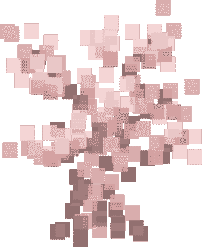
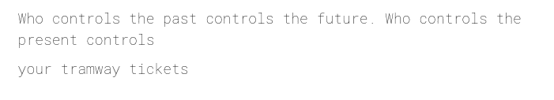
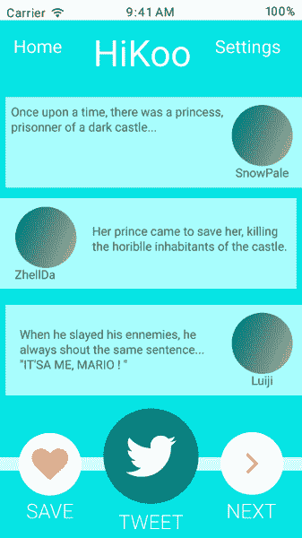
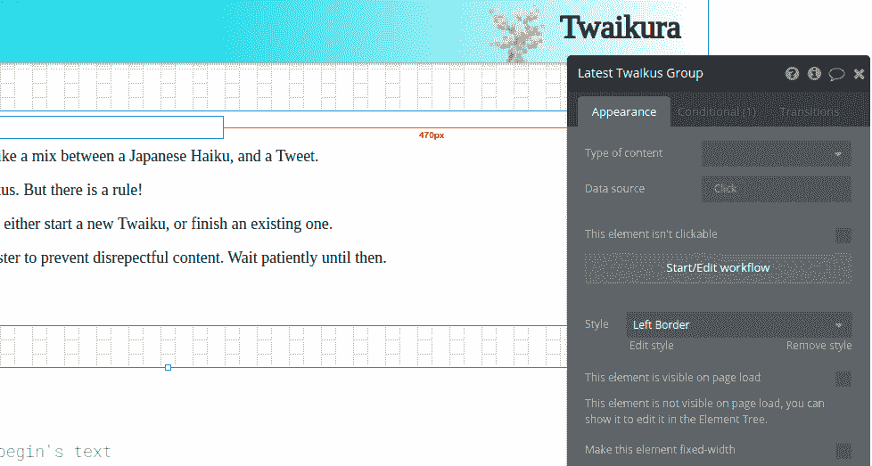
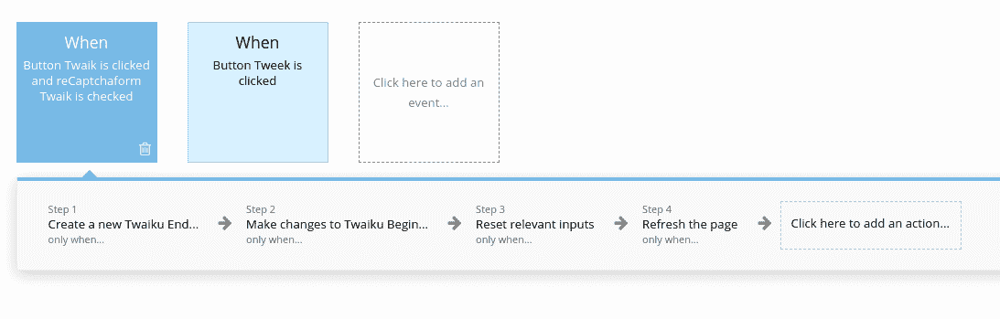
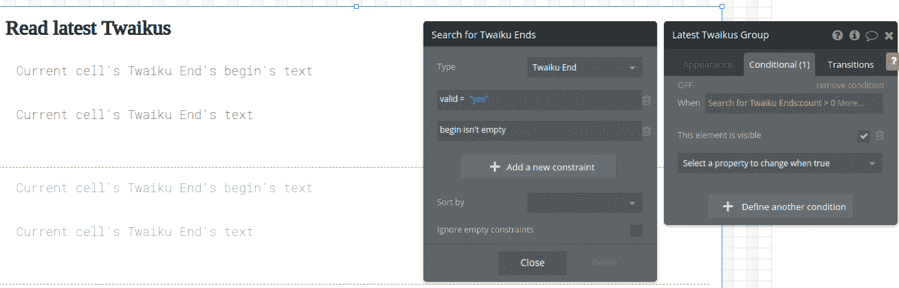

# 我为什么没有编写一个协作写作应用程序

> 原文：<https://www.freecodecamp.org/news/how-i-did-not-code-a-collaborative-writing-app/>

## Twaikura，俳句，但更有趣

简单如 ABC:网上的某个陌生人开始一个 120 字的故事，网上的某个陌生人完成它。这就形成了 Twaiku (tweet + haiku)。特瓦库斯可以是有趣的，严肃的，艺术的，这取决于你。

因此，作为一名开发人员，实现这样的东西应该不难，对吗？是的，但不是。这是一个我花了很多年才创造出 Twaikura 的故事，而你可以在几个小时内完成同样的事情。

## 回到 TwentyParts 以及它从未存在的原因

TwentyParts 是我在 2015 年的第一个“创业概念”。正如你可能猜到的，这个想法是把一个故事分成 20 个部分，每个部分由不同的作者写。

当时我是一名计算机系的学生，花了两个月的时间才发布了初稿。结果是灾难性的。我甚至不知道“框架”的概念，想象一下代码。概念太复杂，界面不可用。

我没有放弃。几个月后，2016 年，我想出了简化版的 TwentyParts，HiKoo。我把一个故事的长度限制在 3 条推特上。我没有急于开发，而是使用一个名为 MarvelApp 的神奇工具创建了模拟。

现在我有了一个很棒的用户界面，但是没有可用的代码。又一个从未出现过的应用。

Looks good, doesn't work

快进到现在。我已经毕业了。我建立了自己的咨询公司，LBKE。我为多个客户开发了复杂的 SaaS 平台。我一直在想这个问题:

> 是什么阻止我再造 20 个零件，现在我很快，很熟练，而且过于自信？

毕竟，现在只需要一个完整的工作周。然而有一个问题:我不再是学生了。到处都有一个小时的空闲时间，一个“完整的工作周”可以持续几个月。太慢了。

## 如何快速编码:不要。

我已经彻底探索了快速 web 开发的领域。你可能读过我之前在 freeCodeCamp 上写的关于 [Vulcan 的文章，这是一个基于 Meteor 的框架，让我很有生产力。](https://www.freecodecamp.org/news/how-i-built-an-app-with-vulcan-js-in-four-days-6368814077b1/)

这些研究都让我得出相同的结论:最好的代码是你不写的代码。

有很多方法可以不写代码，即使对于一个开发人员来说也是如此。搭建、声明式编程、使用代码片段或使用 ORM 都是规避编写代码的方法。使用开源是另一个很好的例子。有些人甚至会认为开发人员有点懒——但他们不是吗？

然而，最基本的 web 开发技能仍然是必要的。这意味着仔细思考，大量的文档阅读，调试等等。最终，创建一个功能齐全的应用程序所需的时间只能减少这么多。

你猜怎么着使用大型框架来加速开发有时感觉像是欺骗。如果我没有这些技能呢？如果我不是开发者呢？除了拥抱“无代码方式”，我别无选择。这就是我所做的。

Relax, Code will be on vacation for the remainder of this article

## 面向非 web 开发人员的闪亮创新

过去，无代码解决方案非常糟糕。有限、难以扩展、专有、昂贵，清单很长。但是最近的一些工具开始变得有价值了。

我将特别关注泡沫。它的插件系统加上它的数据管理功能使它成为目前市场上最完整的解决方案。以下是一些关键特性以及我如何用它们来构建 Twaikura。

### 用户界面编辑器

Bubble 提出了一个 WYSIWYG 编辑器(所见即所得)来创建 app 用户界面。您可以将内容块放在任何您想要的地方，并配置它们的内容。

它是基于网格的，所以你可以有像素完美的对齐。它处理反应。所以你应该能够创造出你想要的复杂的设计。

Building Twaikura's interface using the WYSIWYG editor.

但老实说，我不是最大的粉丝。更准确地说，我不太擅长。这与编写 HTML/CSS 和使用基于 web 的设计工具(如 Figma)有很大不同，因此有一个学习曲线。

我最终坚持使用老式的 Windows 98 风格。只要有一点点想象力，你甚至可以相信它有某种“V a p o r w a v e”的美感。

### 在工作流程中思考

Bubble 给我印象最深的特点是它的“工作流”。它让你用可视化语言描述复杂的过程。它可以透明地混合数据管理(验证和存储 Twaiku，发送电子邮件)和用户体验(重置表单，刷新页面)。你不需要像在传统的 web 应用程序中那样，在头脑中把工作流程分为前端和后端。

Twaiku creation workflow

当用户想要提交 Twaiku 的第二部分时，触发该示例工作流。它将在数据库中创建一个“Twaiku End ”,将其与一个“Twaiku Begin”链接，并重置表单。我还可以显示一条成功消息，给一个版主发送一封邮件等等。在单个时间线中可视化整个工作流程非常直观。

### 完整的数据管理

Bubbles 带有一个关系数据库和完整的过滤功能。这意味着您可以轻松地创建表单和数据列表。例如，“读取最新 Twaikus”块将加载所有有效的 Twaikus。

插件可以帮助保护您的内容。例如，有一个 ReCaptcha 插件可以在几分钟内将验证码添加到你的表单中。这一点很重要，因为安全性通常会被留在原型制作阶段。恶意的机器人和黑客并不在乎你是一个“精益创业”,他们不会错过发送垃圾邮件或入侵你网站的机会。

## 几个小时的工作为一个应用程序的工作

我不会描述 Bubble 的所有特性，因为它还有很多。结论是，已经强大到可以写出 Twaikura 这样的 app 了。我没有写一大堆最终会被扔进垃圾箱的蹩脚代码，没有创造一个像弗兰肯斯坦的生物一样生动的视觉原型，我只是创造了一些有用的东西。

我的网站很棒吗？老实说，还没有。它起作用了吗？当然了。我很享受创建它的过程，它只花了我不超过几个小时的时间，而且我能够以最直接的方式测试这个概念。最长的部分是写这篇文章。

对于想学习 web 开发的人，我特别推荐无代码工具。一开始，花费大量时间来生成简单的特征会让人感到沮丧。在传统编程的同时使用无代码工具是保持乐趣的一种方式。这也很有启发性，因为，即使你不写代码，你也必须像一个开发者一样思考:设计有条件的工作流，构建数据库，验证表单...这是双赢。

我不会成为一个无代码的传播者，但是 Bubble 是对我的工具箱的一个很好的补充。它也可以是你的一个很好的补充！

谢谢你的阅读。如果你喜欢这篇文章，来试试泡泡应用吧，在[twaikura.com](http://twaikura.com)创建你的第一个 Twaiku！

