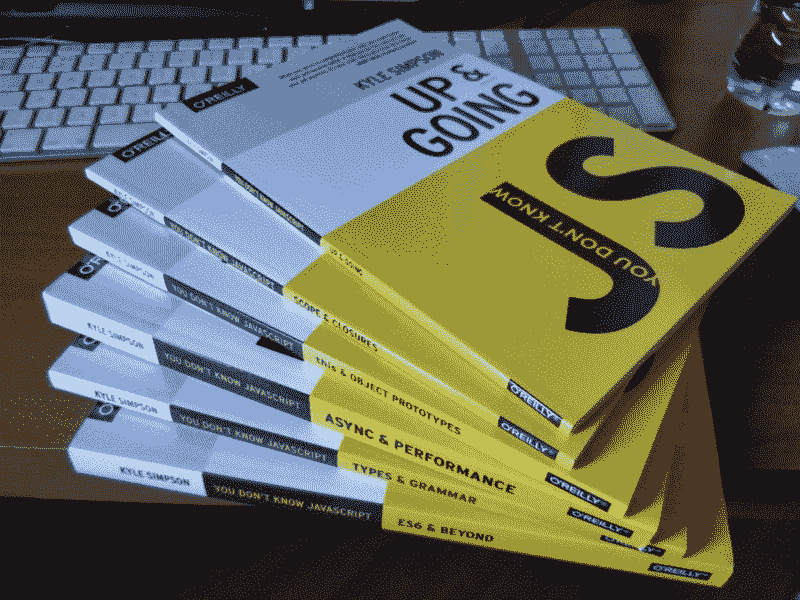
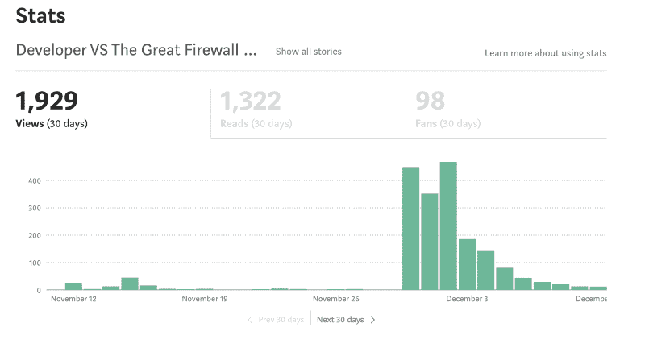
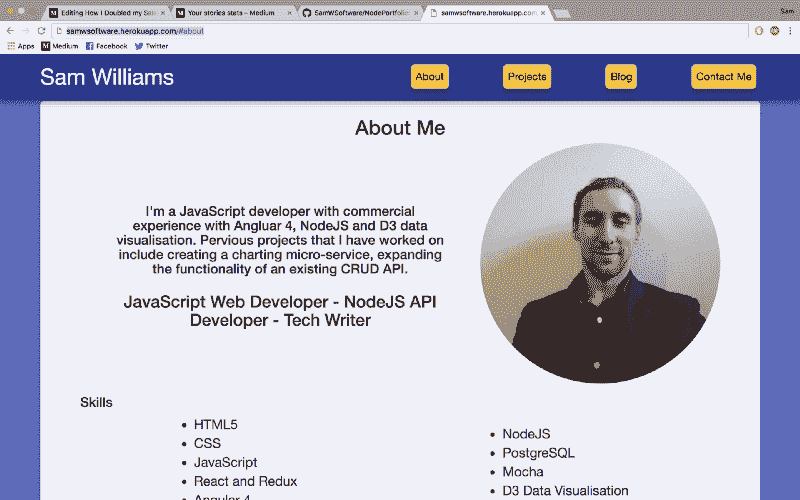

# 我是如何在五个月内把工资翻了一倍并找到一份令人惊叹的工作的

> 原文：<https://www.freecodecamp.org/news/how-i-doubled-my-salary-in-5-months-and-got-an-amazing-job-1110d1779e0b/>

作者:萨姆·威廉姆斯

# 我是如何在五个月内把工资翻了一倍并找到一份令人惊叹的工作的

六个月前，我辞去了初级 JavaScript 开发人员的工作，在东南亚旅行了五个月。回到英国不到一周，我就收到了三份工作邀请，并接受了一份薪水几乎是之前两倍的邀请。这不容易，但值得。我是这样做的。

#### 目标

我计划在东南亚旅行 3-6 个月，我知道我想在回国后找到一份更好的工作。我的初级 JavaScript 工作让我明白了三件事:

*   我喜欢编程，不仅是作为一种爱好，也是一份工作。
*   我喜欢后端开发工作，因为它从前端开发工作的 CSS 和视觉设计中删除。
*   我不太喜欢棱角分明。

有了这些知识，我开始为旅行结束时我想去的地方设定一个目标，以及为了达到那个目标我需要学习些什么。

我的目标是成为**中级全栈开发者**。

#### 侦察

为了成为我想成为的中级全栈开发人员，并找出我需要改进的地方，我寻找我真正想要的工作。我看到了他们对候选人的要求，以及他们所说的可取之处。

通过这项研究，我发现了大多数工作都需要的东西:

*   对 JavaScript 有深刻的理解
*   至少一个框架(通常是反作用的或有角度的)
*   创建 REST API 的能力(通常是 express)
*   了解一个或多个数据库(通常是 MongoDB 或 SQL)

#### 制定计划

有了这些信息，我知道我需要在几个关键领域提升自己的水平:

1.  我需要读完*你不知道 JS* 。这一系列书籍帮助我真正理解了 JavaScript 的基础知识，所以我认为这对学习更高级的东西很有帮助。
2.  我需要变得非常擅长一个前端框架。我研究了 Angular、Vue 和 React，并决定使用 React。我以前做过一点 React 并喜欢它，我不是 Angular 的粉丝，许多招聘广告都没有要求 Vue。
3.  虽然我几乎可以从头开始创建一个 express API，但我不是很有信心，只能做基本的工作。我需要全面提升我的游戏水平，尤其是如果我想要一份优先处理后端工作的工作。
4.  我可以继续使用关系数据库(postgreSQL)或者学习一个新的数据库。我决定学习 MongoDB，因为它非常受欢迎，并在我的简历中添加了 NoSQL 数据库。

我不确定我会旅行多久，所以我决定这样计划我的学习:

1.  边读*边学 React(和 Redux)你不懂的 JavaScript* 。
2.  更好地学习 express 和 MongoDB。
3.  用我学到的技能做点东西。
4.  学习其他的东西。

我这样做是有充分理由的。如果我在三个月后结束旅行，完成了第一项，但第二项还在进行中，那么我仍然可以申请中级开发人员的工作——他们只是被限制在主要是前端工作。

如果我先做后端学习，3 个月后我仍然不会对任何前端框架很有信心。这可能是每个中层工作的症结所在。我可以尝试申请一个仅后端开发人员的角色，但他们似乎都希望比我有更多的经验。

### 学习 React 和 Redux，阅读*你不知道的 JS*

我以前使用 Youtube 视频和普通网络教程做过一点 React，但这次我想确保我正确地学习了它。这让我从 Udemy 获得了 [*React JS 和 Redux:掌握 Web App*](https://www.udemy.com/react-js-and-redux-mastering-web-apps) 课程。

这个课程非常精彩，我在 React 上的一点点经验帮助很大，但是我没有使用 Redux 的经验。在本课程结束时，我觉得我已经可以构建一个相当复杂的网站，并且对 React 的语法和格式以及 Redux 的数据控制都很有信心。

这个课程花了我大约两周的时间来完成，但是我每周花一到两个小时来完成它。我在亚洲度假，所以这不是我的首要任务。

除了在我有笔记本电脑的时候学习课程，我还阅读了《你不知道的 JS》系列的最后几本书。我把在线版的 Github 储存在手机里，在攀登间隙休息的时候读了一遍。

有了一些真实世界的经验，我比上次尝试阅读这些书时明白了很多。像承诺这样的东西，如果你从来没有用过，真的很难理解。

### 更好地学习 express 和 MongoDB

现在我觉得创建前端很舒服，是时候提高我的后端技能了。

我再次决定参加一个业余课程。我发现，因为它们是完整的包，所以它进展得很好，并且倾向于覆盖整个过程。当然，你可以在 Youtube 或其他在线教程上免费学习所有相同的东西，但它们似乎从来没有涵盖一个完整的主题。

下一个问题是学哪门课程。有免费的也有付费的，有短的也有长的。

我决定投资自己，买一门课程(对于这么多的信息来说，10 美元是一笔很小的投资)，我设法将它缩小到大约 3 门课程。它们的长度从 7 小时到 25.5 小时不等。

我被 7 小时的课程所吸引——我可以在一两周内完成，同时还能享受我的假期。25 小时的课程显然需要更长的时间，但似乎涵盖了更多的主题。在旅行的这一点上，我决定只要银行余额允许，我就要旅行，所以我选择了 25 小时的课程。

#### [与 React: Fullstack Web 开发的节点](https://www.udemy.com/node-with-react-fullstack-web-development)

实际上，我已经在这里对这门[课程做了全面的回顾，这是一门很棒的课程。](https://medium.com/@samwsoftware/node-and-react-fullstack-course-review-d8672c8518eb)

之前做过 React 和 Redux 课程，React 的东西在重复。所以你不会浪费时间，你可以跳过你已经知道的视频，或者把视频放在 2 倍的速度上，然后“快速浏览”来复习或者查找任何有用的建议。

后端的东西是本课程擅长的地方。它涵盖了大量的主题，包括:oAuth、电子邮件处理、支付、API 密钥处理、MongoDB、mongoose 和高级部署。

这门课程如此之长的原因是它涵盖了**如此多的主题**在**如此详细。**这有好有坏，但我最终以 1.5 倍的速度观看了大部分视频，并在需要时暂停播放。

这门课比第一门课花的时间长，但我设法在大约 1.5 个月内完成了它。

### 我开始写作

在中国的某个时候，我决定写一篇关于在中国尝试发展是多么糟糕的文章。它被 freeCodeCamp 出版物接受，现在有 1.6K 的阅读量和 791 次鼓掌。我很惊讶人们读了我写的东西并且喜欢它。

The Stats for the first 30 days of my article. Can you work out when it got put on Free Code Camp?

我决定我要试着写更多关于我正在做的事情和我发现的很酷的事情的文章。这也让我在面试时有了一个很好的话题。

写博客也是记录你进步的好方法，可以让你看到你是如何进步的。

### 用我学到的技能做点东西

现在我有了所有我需要的工具，我想用它们创造一些东西。我已经旅行了三个半月，我希望我还能再旅行一至三个月。这意味着如果我回来后想尽快开始工作，我可能需要尽快开始考虑工作。

为了申请工作，我需要更新我的简历和作品集。这给了我一个很好的机会来使用我所学到的知识，使用 Node 和 React 构建一个新的投资组合。

这正是我所做的。这就是结果。我之前说过，我不是设计师，但是效果很好。我甚至使用 Wordpress API 在页面上发布博客文章。

我知道这个设计很糟糕，所以我把它贴在了网页设计评论的子编辑上。我得到了很多好的建议，其中大部分都是关于花几个月的时间研究和学习网页设计的基础知识。

我采纳的一个建议是利用现有的引导。这就产生了一个全新的网站，没有使用我以前用过的任何技巧，但是看起来不那么花哨了。

### 申请工作

我参观的下一个地方是老挝的一个偏远的登山区。我以为这意味着只有最低限度的电力和无线网络。这让我在老挝的两个星期里把我的笔记本电脑留在了曼谷。

到了老挝的露营地，才发现他们有 4G！我买了一张本地 sim 卡(1.5GB 两张，每多一 GB 89 便士)，上网还不错。这时，我知道我在老挝呆了两周，然后在回家前又在中国呆了大约四周。该去申请工作了。

#### 进步

在接下来的一个半月里，我申请了 50 多份工作，通过电子邮件和 LinkedIn 与大约 25 人进行了交谈，并设法在我回来后的一周内获得了五次面试机会。我的大部分互动都是通过电子邮件进行的，但是如果有人想直接打电话，我会尽最大努力满足他(我提前了八个小时)。

我认为进行一次真正的对话是改善你和他人之间关系的好方法，增加了他们邀请你面试或推荐你工作的机会。

如果你觉得和别人打电话或用 Skype 聊天不舒服，那么你可以坚持用电子邮件，但我认为你错过了提高机会。

### 建造更多的东西

有一次面试让我设想一下，如果一家公司的网站很糟糕，客户服务很少，我会为这家公司做些什么。这很酷，因为它促使我学习原型制作。我写了一系列的文章，讲述我是如何构建和充实网站的。你可以看网站[这里](https://golden-shoes.herokuapp.com/)看我的[文章这里](https://hackernoon.com/creating-a-shopping-app-from-scratch-part-1-352ebbd78655)。

我在这上面做的最后一件事是创建一个聊天机器人来返回订单。我不得不学习聊天机器人的工作原理，花了大约一周的时间才得到一个像样的工作版本。这是我得到这份工作的一个重要因素。

### 面谈

既然我已经安排好了这五次面试，我必须把它们转换成工作邀请。

#### 准备

我写过关于[准备 JavaScript 面试](https://medium.freecodecamp.org/5-top-sites-for-javascript-interview-preparation-71b48e9a6c8a)和[掌握面试流程](https://medium.com/@samwsoftware/how-to-secure-the-job-of-your-dreams-by-smashing-your-interview-61f38b7cdd0e)的文章。我确保我勾选了每一个方框。

我知道我想要强调的所有要点，如何回答关于我的弱点和每个公司都做了什么的问题。

#### 面试

我一直很擅长面试，尽管我天生内向。我不得不教自己表现得更加外向，与面试我的人交往。如果你发现自己在面试中表现得害羞和矜持，我建议你找一本关于情商和如何表现得更自信的书。

我在四分之三的面试中进行了技术测试(另外两次是在网上进行的)，我的准备得到了回报。有一些小失误，但是我通过我的思考，很好地完成了所有的任务。

### 报价和谈判

从我的前三次面试中，我得到了两份工作机会。第四次面试后，我知道他们不适合我，所以让他们知道我不会考虑他们的录用。如果你遇到类似的情况，如果你知道你不会接受他们的提议，尽量不要误导他们。

现在有两家公司向我发出了邀请，他们非常想雇用我。是谈判的时候了。我从来不擅长谈判或提出更多要求，但我读了几篇文章后决定这样做。

> 你可能会对自己说:“*嗯，我不想设定太高的期望，而且这个提议已经很慷慨了，所以我应该接受。*
> **号商议。**

> 或者可能是:“*我不想一开始就出师不利，看起来对我未来的雇主很贪婪。*
> **号商议。**

> *“但是这家公司很小——”*
> **不，闭嘴。协商。**

从[谈工作的十条规则](https://medium.freecodecamp.org/ten-rules-for-negotiating-a-job-offer-ee17cccbdab6)。如果你要找工作，我建议你读一读。

我肯定没有做得很完美(甚至没有做得那么好)，但我确实做了几件事情，增强了我的实力。我有两个同等的报价，但我更喜欢一家公司。我给自己写了一个小剧本，然后(在做了一些呼吸练习让自己平静下来之后)我给我喜欢的公司的主管打了电话。

> 你好戴夫。我打电话来告诉你我的最新进展。谢谢你给了我一份工作，我很高兴你认为我也非常适合这个公司。我收到了另一个非常好的报价，我会在这个周末做出决定，在周一中午 12 点之前告诉你。
> 有一件事可以真正加强报价。我将会被重新安置到我工作的任何地方，一些关于重新安置费用的帮助将会是惊人的。

结果并不完全是那样，但它帮了大忙。我感谢他们的提议，告诉他们做出决定的最后期限，并要求改善提议，而不只是要求更高的工资。

### 摘要

我发现我需要什么才能得到我想要的工作。我用这个创建了一个计划，然后使用付费在线课程来加快学习过程。

我申请了很多工作，得到了五次面试机会。我谈妥了我最喜欢的两家公司的报价。

我已经在 [MissionLabs](https://www.missionlabs.co.uk/) 工作了两周，我很喜欢它！

> 阅读下一篇→ [想要成功？投资自己](https://medium.com/@samwsoftware/want-success-invest-in-yourself-ebdafce7865c)

如果您喜欢这篇文章，并发现其中有任何有用的内容，请点击“鼓掌”按钮，关注我以获取更多的技术和开发文章！

