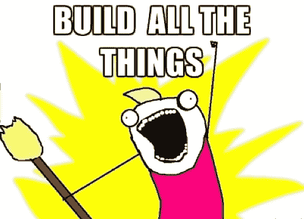
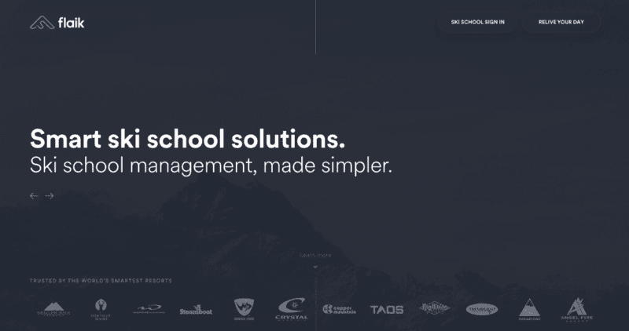
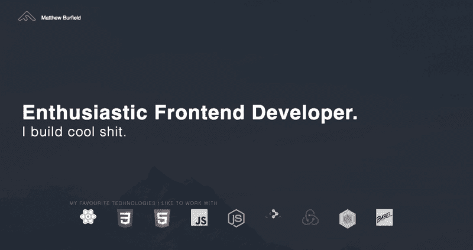

# 我是如何在短短 8 个月内获得中级前端开发人员职位的

> 原文：<https://www.freecodecamp.org/news/how-i-got-a-mid-senior-front-end-dev-role-in-8-months-9b0bc5f50e7d/>

马修·伯菲尔德

# 我是如何在短短 8 个月内获得中级前端开发人员职位的

三周前，我在一家初创公司找到了一份中层前端开发人员的工作。我们的前端堆栈是 React、Redux、Flow、immutable . js——这些都是我喜欢的很棒的东西！

大约 8 个月前，我开始真正学习 JavaScript。(在此之前，我只知道在绝对必要的时候，用足够多的 JavaScript 来拼凑丑陋的脚本)。

我在过去 8 个月的发展可以分为三个截然不同的阶段，我想与你分享。我希望它对你有所帮助。

### 阶段 0

*   物理学学士学位和信息技术硕士学位
*   4 年软件配置 IT 经验

如果你是 web 开发的新手，你可能无法理解我的故事，因为这些资格看起来很高级。

我有两个大学学位(其中一个是 IT 专业)，并且已经有了 4 年的 IT 经验。见鬼，我以前工作的头衔是“高级开发人员”，所以我应该是对的吧？

一年前，经过一年的旅行，我申请在哥伦比亚教英语作为第二语言。我的计划是，在我找到下一个合适的职业发展方向的同时，做一年那样的工作。但我的教学职位还有 6 个月才开始。在我等待的时候，我想我会四处寻找一些临时工作，所以我打电话给一名 IT 招聘人员。

在电话里谈论我的技术能力时，我没有很大的信心。招聘人员告诉我，我应该通过 Codecademy 来提升自己的技能，我照做了。我匆匆学完了所有的课程。

这在当时都是有意义的，但我实际上无法将我所学的应用到真实的项目中。这个信息不可靠。就像他们说的，左耳进右耳出。

最终，我偶然发现了 freeCodeCamp。我接受了学习如何构建全栈应用，然后构建非盈利应用的概念！

### 第一阶段

*   freeCodeCamp 前端证书 1(2016 年 10 月 27 日-2016 年 12 月 29 日)
*   人生大事:爷爷得了癌症/搬到新西兰
*   与招聘人员交谈

我在 2016 年 10 月创办了 freeCodeCamp，正在通过前端证书进行比赛。12 月，我得知我的祖父被诊断出患有前列腺癌。他们说他可能活不到圣诞节，所以我搬回新西兰和他在一起。

爷爷最终比我们被告知的一个月活得更久。我陪了他两个月，白天照顾他。我在早上和晚上花了几个小时完成 freeCodeCamp 的前端练习。

我完成前端证书差不多两个月了。

我已经创建了一个投资组合，并更新了我的 LinkedIn。很快我就收到了一些招聘人员发来的信息！太好了。当我回到澳大利亚时，我安排了一些面试，并渴望开始面试一些工作。

### 第二阶段

*   freeCodeCamp 数据-Viz 证书
*   把一切都推给 Github
*   当地免费代码营聚会(周六)
*   阿清
*   JavaScript 和 React 会议
*   黑客马拉松

招聘人员似乎很想和我见面。也许他们被我以前作为“高级开发人员”的经历所吸引(“嘿，看，有个高级开发人员！”).但是在与我交谈并了解了我的工作经验和开发技能(或缺乏这些技能)后，他们都给我找了麻烦。

我意识到我之前的角色不符合招聘人员对高级开发人员的期望。我把我的 LinkedIn 职位更新为开发人员。在与自己进行了一次坦诚的对话后，我再次更新了配置器。我认为我在以前的工作中根本没有发展。

我坚持不懈。

我从 freeCodeCamp 数据可视化证书开始。在 React 的初始学习曲线之后，我喜欢在其中进行开发。我决定要专注于此。

我每天至少花 4 个小时在 freeCodeCamp 项目或其他兼职项目上。我一个人编码变得越来越孤独，我对我写的代码没有真正的验证。我开始寻找其他的学习途径，建立自己的人际网络。

### 当地免费代码营聚会

在大多数社交场合，我一般都还好。但有时社交焦虑会战胜我，尤其是当我开始过度思考的时候。我第一次去当地的 freeCodeCamp 聚会是在一个周六的早上。我只是坐在外面。我真的没有勇气进去。愚蠢和不理智，我知道…

幸运的是，我在接下来的一周又回去了，还没来得及停下来想这件事，我就走进了那扇门。从那以后我就一直回去！

我想分享这个故事，因为这些社交场合对我来说并不总是那么容易。但是我知道会见其他开发人员会帮助我成为一名更好的开发人员。这也将有助于我得到我想要的前端开发工作。

### JavaScript 和 React 会议

我去了每周一次的当地自由代码营会议。我也开始参加来自 www.meetup.com 的聚会，包括 JavaScript 和 React。

起初我没有和任何人说话，但随着时间的推移，我开始遇到每周都去的常客。我当地聚会上的其他一些免费代码营员也开始去了。

我认为与其他开发人员的交流和会面被低估了。除了提问，我还得到了关于我所在城市的科技公司在使用/流行什么类型的提示。

### 黑客马拉松

黑客马拉松(通常)是持续整个周末的活动。您构建或原型化解决问题或使用特定数据集的产品。在黑客马拉松开始之前，你不会被告知这个项目。(也就是说，你不能提前开始，因为你还不知道自己要做什么)。

我早就想参加黑客马拉松了。我不想成为“开发人员”,我的团队期望我开发一些很酷的东西。我觉得我没有这方面的专业知识。

我现在可以告诉你这不会发生。任何人都可以在黑客马拉松中提供帮助！甚至是从未编码过的人，没有任何设计技巧或技术能力。黑客马拉松充满活力和热情的人数是不真实的。他们热爱自己的工作。

那种类型的能量是惊人的，我发现在我参加一个活动后，它肯定会感染我。我总是能学到很多新东西，之后的几周我都超级兴奋/有动力。更不用说这是放在简历上很酷的东西。此外，你可能会带着另一个很酷的项目离开，你可以将它添加到你的投资组合中！

### 阿清

也是在这个阶段，我发现了 [Chingu 的同伴](https://chingu-cohorts.github.io/chingu-directory/)。chingu 群组是一个由有抱负的开发人员组成的社区，他们在寻求学习的过程中互相帮助。他们一边学习，一边一起制作很酷的东西。当我刚开始做 Chingu 的时候，我有很多空闲时间。我失业了，正在全职学习编码，所以我注册了所有的构建学习项目！

只是在我开始这些项目之后，我才知道什么是结对编程。我知道了什么是特雷罗板。我认识到安排会议并把它们放在我的日历上是多么重要。我了解了 GitHub/Trello 与 slack 的集成。我学会了如何应对其他人不同于我的代码编写风格。你可以从与他人的合作中学到很多东西，而这些是你独自工作时所学不到的。

在构建学习型项目期间，我的积极性很高。当你有其他人让你负责时，尤其如此。

项目包括一个 gif slack 机器人、一个帮助批量邀请人们进入私人频道的 [slack 机器人](https://matthew-burfield.github.io//project/private-channel-slack-bot/)，以及一个《超级马里奥兄弟》第一关的克隆版

@tropicalchancer 甚至有一周给我颁发了“本周 Chingu”。

### 第 3 阶段

*   得到我梦寐以求的前端开发工作

我已经到了招聘人员开始注意我的时候了。我已经建立了一个坚实的项目组合。招聘人员和公司向我发送编程/算法挑战。我做得很好。

我开始得到一些可靠的面试机会，但一直没有找到我想要的工作。

一位招聘人员帮我在一家数字代理公司找到了工作。他们需要帮助完成一个即将超过截止日期的 react 项目。这是一份按天计算的合同，他们说如果我从第一天起就没有效率，那么他们会让我走。这在上下文中是有意义的，因为他们需要完成那个项目。

原来他们对我的工作很满意！这给了我信心，因为我知道我可以加入一个现有的团队，并从第一天起就做出贡献。

他们甚至给了我一份全职工作。然而，我拒绝了他们。我喜欢在 react 项目上工作。但是在数码公司工作不允许我像自己想的那样专攻。我可能会做一些像 WordPress 插件这样的事情(唉！).另外，我还有一个面试，有一份工作我很想申请。

我想申请的工作是一家初创公司的中高级前端 react 开发人员。我的第一个想法是“该死的这个地方看起来真棒！但可能远远超出我的技能水平”。

我差点没申请。我最初的计划是问他们的一个开发人员是否愿意一起喝杯咖啡。我可以问他们我现在应该做什么样的事情，这样 6 个月后，我就可以胜任在那里工作了。

我不记得我为什么改变了主意，但在某个时候，我决定，“去他妈的，我要去申请！”。

我知道我没有其他申请这个职位的开发人员那么多经验。我也知道我必须采取打破常规的方法。

我觉得他们的网页很酷。所以我决定采取另一个 Chingu 成员( [@coffeecraftcode](http://twitter.com/coffeecraftcode) )采取的方法。我把我的简历建成了一个网站，复制了我申请的公司网站的设计。

你可以在她的文章中了解更多关于这种方法的信息。

如果你想看对比:

这里是[他们的网站](https://www.google.com/url?q=http://flaik.com&sa=D&ust=1501072095669000&usg=AFQjCNGRWEVfv1WDrl8dcXxoZYypg-TvPg)，这里是[我的简历](https://www.google.com/url?q=http://matthew-burfield.github.io/flaik_cv&sa=D&ust=1501072095669000&usg=AFQjCNFgtHAzt8ar9rmR1pXG26OJ7fSPbQ)，或者看下面截图

我把它建成了一个小小的单页 react 应用程序，他们很喜欢它！我得到这份工作后，他们说我是首选申请人，尽管我没有其他人那么多经验。

在准备面试时，我准备为自己没有多少经验辩护。令人惊讶的是，根本没有提到这一点。他们问了我一些高层次的问题，但整个面试感觉更像是一次随意的聊天。

他们已经检查了我的项目组合，看了我的代码，所以他们对我的能力很满意。他们只是想看看我是否是一个好的文化适应者，一个他们愿意每天一起工作的人。

原来如此。我的故事从 2016 年 10 月下旬开始，到现在，我得到了我的第一份前端开发者工作！我希望你喜欢你的休息，现在回到编码！；)

