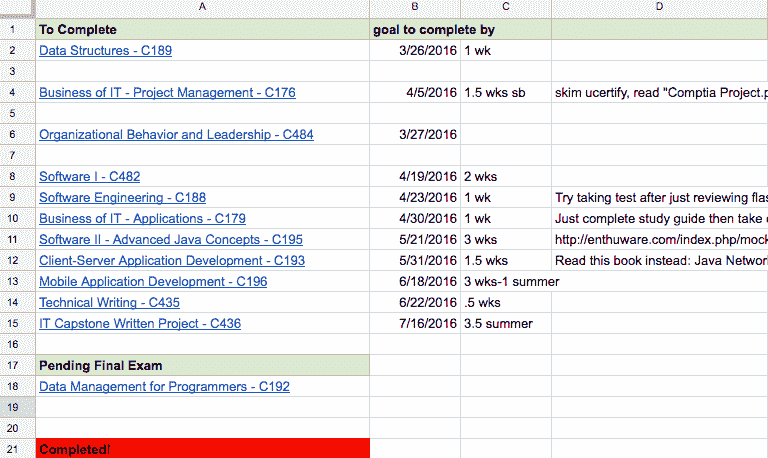
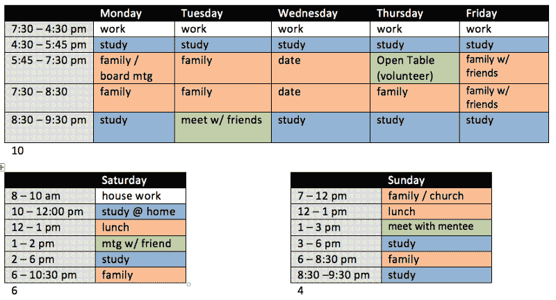
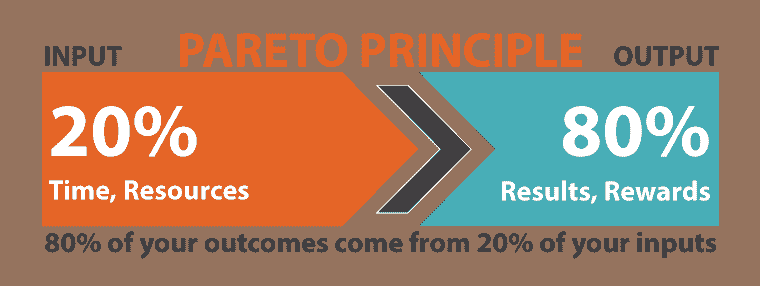

# 我是如何在工作和抚养两个孩子的同时，在短短一年内获得第二个学位和 5 个开发人员认证的

> 原文：<https://www.freecodecamp.org/news/how-i-got-a-second-degree-and-earned-5-developer-certifications-in-just-one-year-while-working-and-2b902ee291ab/>

> “标准速度是为傻瓜准备的。这个系统被设计成任何人都能跟上。如果你比“任何人”都更有动力——你可以做得比任何人预期的都多。这适用于生活的方方面面——不仅仅是学校。”——德里克·西弗斯，CD Baby 创始人

学习编码可能具有挑战性——尤其是当你有工作和有小孩的家庭的时候。尽管如此，我还是认为标准配速不适合我。

我写这一切的目的不是吹牛——尽管我对这些成就非常自豪。我的目标是让你相信标准配速也不适合你。

过去一年我做了很多。我获得了两个 Oracle Java 认证，两个 CompTia 认证，以及 freeCodeCamp 的前端认证。每一个都需要大多数人好几个月的准备，但是我只用了三个星期就完成了。

最后但同样重要的是，在不到六个月的时间里，我完成了所有必要的课程，获得了一所认证大学的软件开发第二个学士学位。

我做这些都是因为我全职工作，经常和我的妻子和两个年幼的孩子在一起，并且在我的社区做志愿者。

实现这一切的关键之一是一个了不起的、支持你的配偶。？

但是也有一些其他的帮助。

### 你的动机是什么？

当了五年的 K-12 教师后，我意识到我不想在学校里度过余生。

我喜欢教学中的教学部分，但我讨厌教学中强迫孩子们做他们不想做的事情。我所在的城市学区的课堂管理对我来说压力很大。我也对整个教育体系不再抱有幻想。我们似乎在让学生为不再存在的工作做准备。

我一直对编码感兴趣，甚至有时用 Scratch 和 Code.org 教我的学生基本编码。我决定是时候学习足够的知识来做全职工作了。

想要一份新工作是巨大的动力。我在教学岗位上度过的每一天都是一种激励，让我不断推动自己朝着目标前进。

### 研究，研究，研究

重要的是不要急于学习。不是所有的学校或学习资源都是平等的，错误的选择会对你实现目标的能力产生很大的影响。

我试图确定什么样的学习方法最适合我和我的家人。虽然我知道进入科技行业有很多方法，但我还是决定走一条有点传统的路线:学士学位。我知道我已经有一些课要转到新的项目中去了。我调查了许多学校，但我决定选择西部州长大学，原因如下:

1.  这一切都是在线的，所以我不必从我的家人那里花时间来交通。
2.  你可以按照自己的节奏工作，所以我知道我可以很快完成。一旦你完成了一门课的所有作业和考试，你就可以马上进入下一门课。
3.  成本很低，大约每六个月 3000 美元。
4.  它是著名的、被认可的，并且得到了奥巴马总统和比尔盖茨的推荐。
5.  该学位包括行业认可的认证。我知道这些会增加我所受教育的可信度。

### 超越抱负和目标

起初，我的目标是在一年内完成我的整个学士学位。项目开始一个月后，我决定修改我的目标，在六个月内完成。

正是在这一点上，我做了最有助于我快速完成目标的事情:我制定了一个完成每门课的具体时间表，这样我就可以在 6 个月内完成。

根据课程要求，我为每堂课安排了 1 到 3 周的时间。我也在那时制定了计划，关于我将如何非常快地结束每一节课。在整个学习过程中有许多子目标非常有助于确保我保持在正确的轨道上。

Section of actual spreadsheet I used to plan for classes.

雄心勃勃的目标很重要。这些给了我额外的动力来鞭策自己。《消费者研究杂志》的一项研究表明，雄心勃勃的目标会让人更快乐。我最终满足或超过了所有我自己设定的最后期限，这绝对让我开心！

### 详细时间表

我制定了一个详细的每周时间表，帮助我在不忽视家庭和其他责任的情况下花大量时间学习。我安排了家庭时间、志愿者时间、和朋友在一起的时间，甚至每周约会之夜！

The schedule I created at the beginning of my degree. I have an even more detailed schedule now.

一份详细的时间表帮助我确保我的生活保持平衡。然而，有一件事我没有放在我的日程表上:电视。

在我攻读学位的整个过程中，我只看了 3 集电视。我的日程安排得很紧，所以我可以实现我的目标，所以我没有时间看电视。此外，花在看电视上的时间意味着和家人在一起的时间减少了。毕业后，我继续限制看电视，这样我就可以专注于编程。

为了实现我的目标，放弃一些东西对我来说很重要。

### 别理那些讨厌的人！

西部州长大学的每个学生都有一个导师。学生们每周都和他们的导师通电话，以帮助他们保持正轨。每当我和我的导师分享我的目标时，她都试图鼓励我变得更理性一点。

我没有变得更理智，而是决定设定更荒谬的目标。我知道她本意是好的，但我决定忽略她的警告，不再与她分享我的目标。

我发现，如果某些人不鼓励我，有时不与他们分享目标是有帮助的。

### 最大化时间

除了安排时间学习软件开发，我还找到了适应更多学习的方法。例如，我利用大部分午休时间学习。此外，我经常把笔记放在口袋里，一有空就可以回顾一下。

我做过的另一件事(现在仍在做)是从我的教学工作中抽出几天时间来完成我的课程或编程项目。在完成我的学位时，当我知道我有更难通过的课程时，我把我的休息日安排在我的时间表中。

我试着不断地重新评估我的时间表和我如何度过我的时间，这样我可以有更大的效率。

我过去常常在我的孩子睡觉后写很多代码。然而，我注意到在一天结束的时候，我的大脑不像以前那样工作了。我调整了我的睡眠时间表，所以我现在晚上 9 点左右睡觉，早上 4 点起床编码(并制作[训练视频](https://www.youtube.com/playlist?list=PLWKjhJtqVAbmoiNlqLJg1gxEjEuKHHcn_))。这听起来可能有点疯狂，但它极大地提高了我的生产力。

### 学习别人做什么

我花了很多时间在我大学的 Reddit 页面和各种论坛上阅读其他人做的有助于他们学习的事情。对于行业认证，有更多的资源可以提供帮助。这让我可以更好地计划最快的完成方式。

几乎总会有人比你先走一步，识别他们并向他们学习是很重要的。

在学习 freeCodeCamp 课程时，向他人学习也很有帮助。社区中有经验的人总是愿意在他们的论坛和社区聊天室中提供帮助或建议。

### 直接发货吧！

*发货*就是把完成的产品发出去。

有很多次，我想知道我是否需要投入更多的时间在项目或学习上。然后我会意识到，如果我想在自己设定的期限内完成任务，我没有时间。

我的最后期限迫使我在完全准备好之前行动，这绝对有回报。

我发现把项目拿出来比让它们完美更重要。如果你试图确保一切都恰到好处，你可能永远也完成不了。如有疑问，请发货！

### 80/20 法则

80/20 法则指出，对于许多事件，大约 80%的结果来自 20%的原因。在学习软件开发的时候，这意味着大约 20%的学习内容会包含你实际会用到的 80%左右的内容。如果你只关注前 20%的人，你可以节省很多时间。

对于我的学位，我只阅读了 20-30%的要求内容。根据 80/20 法则，这足以理解超过 80%的主题。

诀窍在于决定关注哪 20%。我经常问自己，“如果我在设计考试，我会包括这些材料吗？”

真的，在学习任何东西的时候，你都应该问问自己，这是不是那 20%的学习内容的一部分，会给你 80%的价值。

这与即时信息的概念有关。学一些近期不打算用的东西通常没什么好处，尤其是你的记忆力和我一样差的时候。？当我在做项目的时候，我试着去了解我需要什么来完成这个项目。

雇主通常更关心你创建的项目，而不是你如何学习编码。记住这个事实会帮助你决定如何最好地利用你的时间。

### 保持事情向前发展

一旦我的学位完成，我没有从学习中抽出任何时间。我意识到项目的重要性，所以我直接进入 freeCodeCamp，开始创建个人项目来建立我的投资组合。我能够继续运用我在完成学士学位时使用的所有策略。

当我决定开始创作 JavaScript 培训视频时，我也继续使用这些策略。现在我几乎每天都在 [freeCodeCamp YouTube 频道](https://www.youtube.com/channel/UC8butISFwT-Wl7EV0hUK0BQ)上发布 JavaScript 培训视频。

如果你对我为快速完成 WGU 学位所做的具体事情感兴趣，你可以看看这篇博文。

希望我用的一些策略也能对你有所帮助，即使你的生活和我一样忙碌。

记住:标准配速是为傻瓜准备的。你可以做得更好！

> **** *更新***** 我新推出的关于软件算法的视频课程现已上线！查看曼宁出版物中的[算法。使用代码' **39carnes** '享受我的课程 39%的优惠！](https://www.manning.com/livevideo/algorithms-in-motion?a_aid=algmotion&a_bid=9022d293)