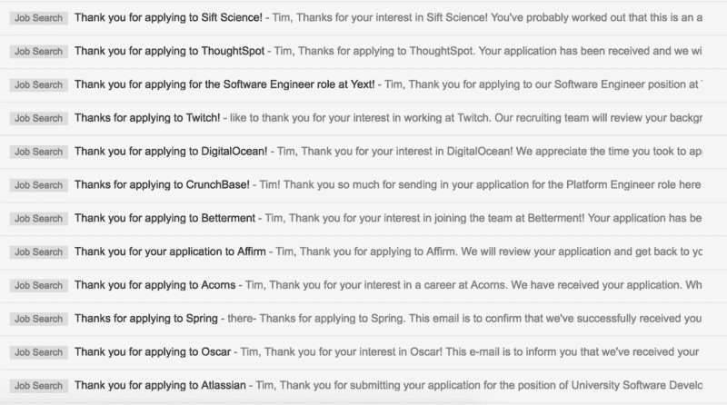

# 我是如何在没有实习经历的情况下从大学毕业后找到第一份开发工作的

> 原文：<https://www.freecodecamp.org/news/how-i-got-my-first-developer-job-with-no-internships-straight-out-of-college-814d0eea1e4c/>

蒂姆·帕克

# **我是如何在没有实习经历的情况下从大学毕业后找到我的第一份开发工作的**

#### **5 个关键因素会让你的求职变得与众不同**

My many suitors.

### 离开学校找工作很难。

尤其是当其他应届毕业生似乎从大二就开始在谷歌、脸书或亚马逊(或这三家)实习的时候。相信我，我知道。当我今年年初开始找工作时，我发出了 93 份求职申请，其中有 2 份(T2)得到了全职工作。**这意味着从申请到全职工作的转换率约为 2%。**

一点背景…

我毕业于一所中等学校，成绩中等，总共零实习。我得了 A，B，C，还有几个 D(向我的父母道歉)——严格地说，我是在这个群体的中间。

关键是，我并不突出。那么为什么有人会在[这个竞争最激烈的就业市场之一雇佣我呢](https://www.glassdoor.com/blog/20-in-demand-jobs-with-the-most-competition/)？实际上，有成千上万更合格的候选人可供公司选择。

回顾过去，有 5 个关键因素促成了我最终的就业。我试图把我学到的东西提炼成相当普通的属性。不管你是像我一样的计算机科学毕业生，还是想转行的[小学老师，这些都适用。](https://www.themuse.com/advice/how-i-went-from-a-career-in-education-to-an-employed-software-engineer-in-4-months)

所以，事不宜迟，以下是获得你第一份科技工作的 5 个关键要素(无实习版)。

### 元素#1:持久性

[Imgur](https://imgur.com/gallery/xByII)

如前所述，我收到了 93 份申请中的 2 份。这大约是 2%的转换率(或者每份报价 46 次被拒)。也就是说，除非你是工程大神，**否则你会面临很多拒绝**。它会变得令人沮丧。

请记住，一家公司拒绝一名候选人的原因有很多。那不是你能控制的。例如，裁员、内部重组。

所以**别往心里去**继续运输。谁知道呢？也许你发送的下一份申请会让你得到一份工作。**不要犯过早放弃、错过下一份工作的错误。**

### 要素 2:勤奋

Courtesy of [GIPHY](https://gph.is/2fXupOE)

#### 练习，练习，练习。

技术面试很简单——你要么符合招聘标准，要么不符合。这意味着你必须为即将到来的面试做好准备。对我来说，这意味着在我招聘的 3 个月里，每天要准备 2-4 个小时的面试。

你可能没有那么多时间，但关键是，确保你为你得到的机会做好了最大的准备——因为如果你的工作申请和我的有任何相似之处，那么这些机会就会少之又少。

面试准备是它自己的野兽，所以我不会在这篇文章中深入探讨我的学习养生法，但是这里有一些我发现在学习时有用的资源:

#### 算法和数据结构

*   史蒂文·斯基亚纳的[算法设计手册](https://www.amazon.com/Algorithm-Design-Manual-Steven-Skiena/dp/1849967202) ( [PDF](https://edisciplinas.usp.br/pluginfile.php/1995283/mod_resource/content/1/Skiena.-.TheAlgorithmDesignManual.pdf)
*   史蒂文·斯基埃纳在 YouTube 上的[算法分析讲座](https://www.youtube.com/playlist?list=PLOtl7M3yp-DV69F32zdK7YJcNXpTunF2b)

#### 练习面试问题

*   [Leetcode](https://leetcode.com/)
*   [格斗赛](https://codefights.com/)
*   [Firecode.io](https://www.firecode.io/)

#### 基本程序设计

*   彼得·诺威格的[电脑程序设计](https://www.udacity.com/course/design-of-computer-programs--cs212)

### 要素 3:足智多谋

#### 尽你所能利用一切(和所有人)。

利用你学校的职业门户网站申请小公司，这些公司会雇佣你廉价的、没有经验的劳动力，并在低风险的环境中培养你的技能。你不会得到很多报酬。这并不光彩。但这是可以写进简历的东西，它离你最终想要的工作更近了一步。

坦白说，这正是我在学校最后一年获得第一份开发工作的原因。当我申请更大的科技公司时，这是我简历上除了一系列兼职项目之外的唯一一份工作。

利用你的人际关系，如果你有的话。问问你父母的朋友的朋友，他们是否能把你的简历转发给他们公司里合适的人。问问你在火车上遇到的那个人。问问你在派对上遇到的那个女人。人们喜欢帮忙，这是一个很小的请求，很可能没有人会直接拒绝你为你转发电子邮件的请求。

每个人都把自己的成功归功于某个人，所以不要因为寻求帮助而感到难过。事实上，你问的那些人可能已经到达了他们现在的位置，因为他们问了足够多的问题。当人们向*你*寻求帮助的时候，记住所有帮助你走到今天的人，并确保向前付出！

### 要素 4:软技能

Courtesy of [GIPHY](https://media.giphy.com/media/6crVJRXHV8UVy/giphy.gif)

我喜欢认为是我斗志昂扬、积极进取的态度和出色的工程能力吸引了我的面试官，让他们敬畏地给了我一份工作。事实并非如此。谢天谢地，你只需要做一个有基本沟通技巧的正派人。

你是愿意接受批评，还是固执地为自己辩护？你能清楚地表达你的想法吗，还是你的逻辑很难理解？你是一个好老师吗，还是当有人缺乏理解时你会变得不耐烦？最后，*你是我愿意与之共事的人吗*？

据《福布斯》报道，缺乏软技能会扼杀你被聘用的机会，高达 75%的专业招聘人员会因为软技能不足而缩短面试时间。所以温习一下你的软技能，因为它们可能会挽救一场糟糕的面试。

例证:在经历了有史以来最糟糕的一次面试后，我得到了一份工作邀请，因为他们“喜欢我的正能量”。他们在电话里说当我拿到工作的时候。所以要积极一点。它会给你一份工作。

### 要素 5:运气

这个实际上没什么帮助。不好意思！

我的简历上没有实习经历，也只有一份拼凑的宠物项目清单，有什么激励让招聘人员在谷歌前实习生和斯坦福毕业生的海洋中找到我呢？说实话，不多。

当我的简历出现在招聘人员的办公桌上(或收件箱)时，基本上可以归结为他们是否慷慨到给我一个面试的机会。

在这里你无能为力，所以不要把拒绝放在心上。确保“请留意任何未来的机会。”

### 重要的是要认识到，有些招聘过程是完全不受你控制的。

利用这些知识来激励自己充分利用你能控制的事情。

坚持不懈地努力寻找每一个潜在的机会。在你的准备工作中要**勤奋**，这样你就能准备好粉碎你*做*得到的面试。足智多谋通过你的人际关系和职业中心最大限度地增加你的潜在客户数量。最后，磨练你的软技能，让你遇到的每个人都愿意和你一起工作。

### 没有什么秘密公式可以让你被雇佣。

要被聘用，没有多少 Leetcode 问题需要完成，也没有一系列步骤来神奇地打开一份工作。当你被拒绝时，不要责怪面试过程。不要责怪面试你的工程师。**你和我没有那样的奢侈。**因为归根结底，我们只是想被聘用的穷校友，无论你认为招聘过程有多糟糕和/或没用，再多的推诿也改变不了这一点。

#### 面对每一次拒绝，问问自己:

*   我在哪些方面做得不好？
*   **为什么**我在这些领域表现不佳？
*   下次我该如何改进这些地方？

找出你的弱点，努力弥补它们，因为最终，这真的可以归结为:一点点运气和大量的努力工作。

#### 如果你喜欢你读到的东西，[还有更多来自](https://medium.com/@thetimothyp)的东西！

作为一个处于技术生涯早期的人，我写的是——你猜对了——技术生涯的早期阶段。