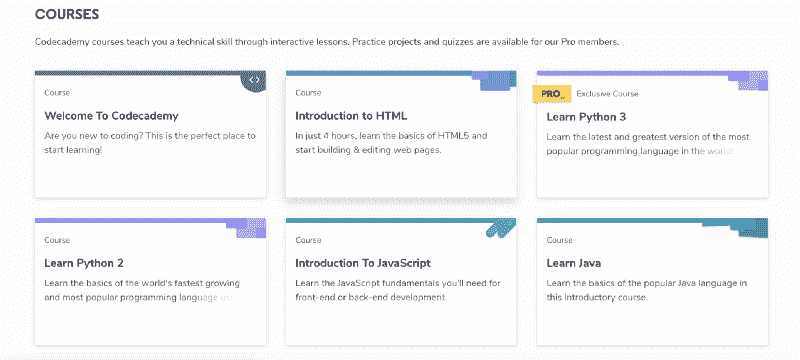
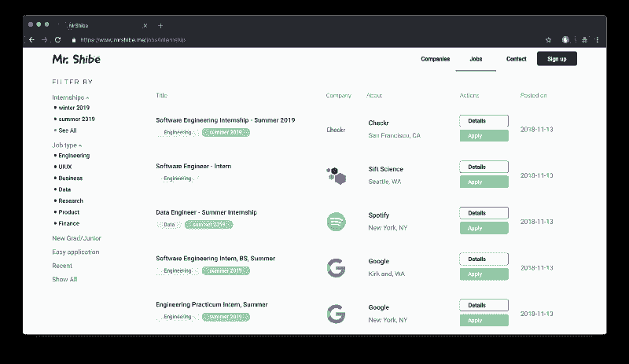
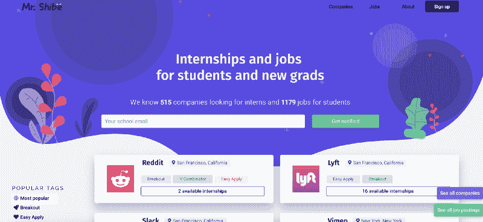
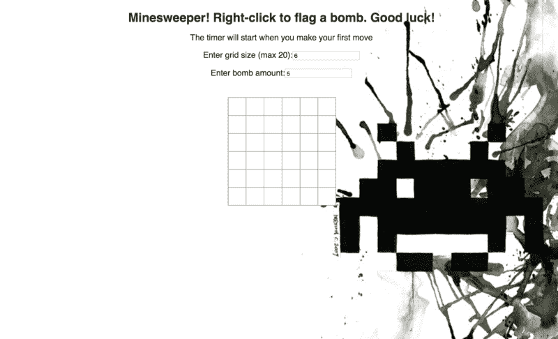

# 我是如何通过 4 个月的自学获得软件工程实习的

> 原文：<https://www.freecodecamp.org/news/how-i-got-my-software-engineering-internship-after-4-months-of-self-study-5b5c4836bd6f/>

本人大一，1-2 月左右开始自学编程。5 月份，我拿到了一家知名公司的实习 offer。

我能说的是现在找一份软件工程实习很难。你必须一遍又一遍地经历申请、为技术面试而学习和被代练的整个过程。我理解这种挣扎，因为我向 700 多家公司申请了工作。

但是，如果你严谨，学习方法正确，完全可以通过自学进入这个行业。

下面是一个粗略的一步一步的指导方针，包括我所采取的重要步骤，以及我具体做了些什么。

### 第一步:学习基础知识

如果你是新手，免费代码营和 T2 代码学院无疑是最好的资源。

他们都尽可能以最简单的方式提供解释，并教你进入这个行业必须知道的绝对基础知识。我建议从 CodeCademy 开始，学习您选择的语言的语法。

> 注意:为了有效地学习，知道你想申请哪些角色是很重要的。例如，如果你的目标是前端实习，freeCodeCamp 上的 web 开发课程将特别有用。本指南将主要关注前端。

#### **我做了什么:**

就我个人而言，我一直对前端工作更感兴趣。对于一个前端 web 开发人员来说，深入了解 JavaScript、HTML 和 CSS 可以说是最重要的事情。

因此，我开始了第一周的自学，把所有的时间都花在 CodeCademy 的优秀的 Javascript 入门课程上。这是完全免费的初学者友好的解释。为了使我的学习更加有效，我经常记下我所学的和我不理解的。我以后会复习这些笔记来刷新我的记忆，这对于不忘记我所学的知识是至关重要的。

HTML 和 CSS 相对来说比较好学。我继续学习 [freeCodeCamp 的网页设计完整课程](https://learn.freecodecamp.org/)。这是最好的免费资源之一。如果你完成了整个课程，你将会知道比网页开发更多的基础知识。

当你觉得自己已经了解基础知识时，我强烈推荐你继续学习[前端开发人员手册](https://github.com/FrontendMasters/front-end-handbook-2018)。它为更高级的学习者提供了一个完整的资源列表，包括付费和免费的。它包含了数千小时的阅读，并将教你一个网络开发大师应该知道的所有技巧。

### 步骤 2:创建项目

几周后，你应该准备好创建一个小项目。当你没有很多经验的时候，项目在你的简历上是巨大的。同样， [freeCodeCamp](https://www.freecodecamp.org/) 提供了非常好的项目创意。从小事做起。

如果你正在努力寻找项目想法，你可以谷歌“X 语言的 100 个项目想法”,它通常会成功。此外，看看其他 GitHub repos，学习他们的代码。

完成后，对其进行测试，并将源代码放在 Github 上。这一点至关重要，因为这是公司在没有工作经验的情况下验证你技能的唯一途径。尽可能将高质量的代码和文档放在一起。

#### **我做了什么:**

当我得到我的报价时，我已经做了 4 - 5 个项目。我从一个从另一个学生的 GitHub 派生的小型打字游戏 web 应用开始，从他们的代码中学到了很多，然后添加了我自己的。我逐渐转向更复杂的项目。下面是我在实习前做的所有项目的列表，它们的描述和我使用的书库:

1.  其他各种小游戏像扫雷，都是用 React 做的，用 CSS 做风格。
2.  使用 Javascript 和 Mapbox 制作的地图，可显示超过 50 万个交通数据点。
3.  一个工作的 React 本地应用程序，让用户展示他们最好的图片，后端在 Node.js 和 Mongoose 中实现，托管在 Heroku 上。

### 第三步:申请工作

我在这方面最有经验，因为我申请了这么多工作。关于求职和面试过程，我的最佳建议是:

1.  LinkedIn、Glassdoor 和 indeely Apply 都不是你的朋友。对于这些类型的发布，招聘人员会收到太多的申请，他们通常会使用 ATS(申请跟踪系统)来过滤掉所有的简历。如果你以前没有任何经验或令人印象深刻的项目，你通过筛选的机会非常渺茫。
2.  求职信是一把双刃剑。如果做得好，它真的能让你从其他候选人中脱颖而出。然而，如果做错了，情况会变得更糟。如果你要写一个，我的建议是不断地修改。你的求职信要特别针对你申请的公司。不要给每家公司都发同样的求职信，因为招聘人员知道你已经发了 100 封了。最后，请确保没有语法错误。一个错别字就足以让招聘人员拒绝你。
3.  我最成功的方法是直接在公司网站上申请，或者通过发邮件给招聘人员(如果公司很小，甚至是首席执行官)。如果公司没有公开的电子邮件，你通常可以猜到，因为它几乎总是以`hello at companyname dot com`的形式出现。比起你通过 Indeed/Glassdoor 提交简历，他们看到你简历的几率要高得多。你可以有一个模板，并为不同的公司稍微改变措辞。
4.  脸皮厚。公司会因为各种各样的随机原因拒绝你，招聘人员会一直跟踪你。这很正常。如果你的简历不那么吸引人，你获得面试的机会就更小。坚持申请，不要放弃。除非你停止尝试，否则永远不会结束。

### 第四步:面试

当你最终得到那份甜蜜的面试时，一定要做好准备。网上有很多资源教你如何在技术面试中胜出。如果你还没有读过的话，[破解编码面试](https://www.amazon.com.au/Cracking-Coding-Interview-Programming-Questions/dp/0984782850)是一本非常好的读物。

技术面试压力很大。对他们来说没有变通办法——你必须研究算法问题。Leetcode 为练习提供了大量的好问题。

然而，由于这些问题广为人知，你不太可能在面试中遇到同样的问题。面试官通常有一个随机问题库，不会发布在网上。尽管如此，基本思想还是一样的。例如，彻底了解你的数据结构和 Big O 总是好的。

另一件要注意的事情是:我面试过的公司经常提起我的项目，问我关于实施的技术问题。这是他们测试你是否在项目上撒了谎的方式，所以要做好准备。

#### **我做了什么**:

首先:在面试中表现糟糕是可以的。我完全搞砸了我的第一次。回忆起来很尴尬。

我意识到我对技术问题准备不足。我开始每天做 Leetcode 2 - 3 个小时。最重要的是不要在单一问题上花费太长时间。你的面试时间不是无限的。相反，设置一个计时器，比如简单问题 10 分钟，中等问题 20 分钟(如果你申请的是初级职位或实习职位，你在面试中通常不会遇到 Leetcode 难题)。

如果你不能及时解决，那完全没关系。看看解决方案，试着去理解它。标出你不能解决的问题，一周后再试。

由于面试也测试你的沟通技巧，你可以在做练习题时大声说出你的想法来做准备。相信我，这一开始听起来可能很奇怪，但是当你习惯于直言不讳时，这在面试中会有很大的不同。

### 资源:哪里可以找到入门级的工作和实习机会

我曾经找到的实习机会(除了 Glassdoor，事实上还有 Linkedin)包括[突破列表](https://breakoutlist.com/)和 [AngelList](https://angel.co/) 。

我意识到试图寻找实习机会是多么可怕。没有简单快捷的方法来找到一份完整的实习公司名单。freeCodeCamp 的社区非常棒，在我工作期间给了我很大帮助，我希望能有所回报。

在实习结束后，我想出了这个应用程序,作为我的兼职项目，来编制一份公司及其实习/入门级工作的列表，可以根据地点、标签、学期等进行过滤。我将在下一节详细阐述它。

### 结论

找到你的第一份工作/实习可能是一个漫长、令人沮丧和乏味的过程。然而，你从实际工作中获得的经验是完全值得的。

这是我实习后做的项目和我有史以来的第一个项目的比较。

My project to help students, new grads and self learners find internships and jobs. Available at [mrshibe.me](http://mrshibe.me)

The first project I made by myself. Minesweeper with a timer

差别很大，对吧？

这就是为什么我认为我实习的时间是完全值得的。如果没有我在实习中获得的指导和经验，我永远也不可能完成我的最后一个项目。该项目是一个平台和就业委员会，为学生、自学开发人员和新毕业生发现实习和入门级职位。你可以[在这里](https://www.mrshibe.me/)查看。

我努力改进，欢迎任何反馈。我想写我的下一篇文章，作为我如何设计和构建应用程序的一步一步的指南，所以让我知道你是否感兴趣。我也很乐意帮助那些刚刚起步的人，因为我理解他们的挣扎。如果您有任何问题，请不要犹豫，给我发消息(您可以突出显示它，然后单击弹出窗口上的消息图标)。

祝大家好运！