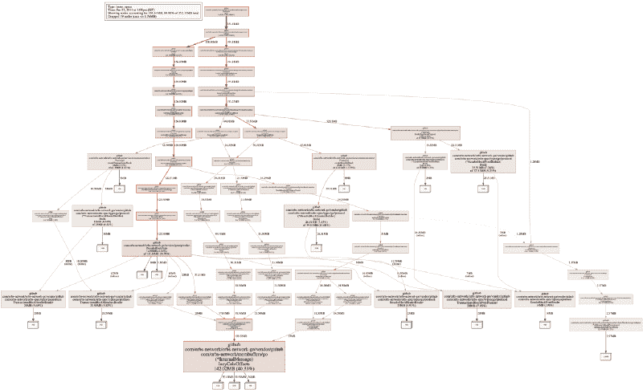
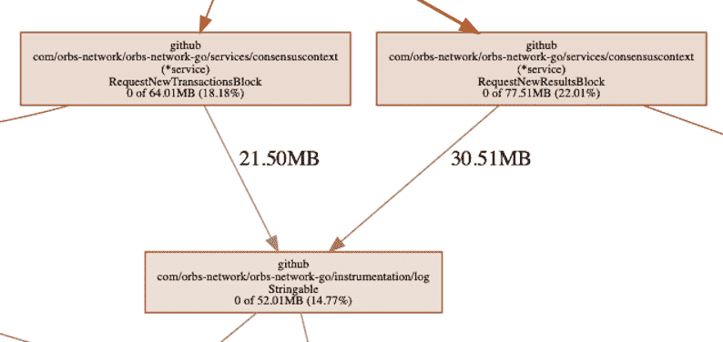
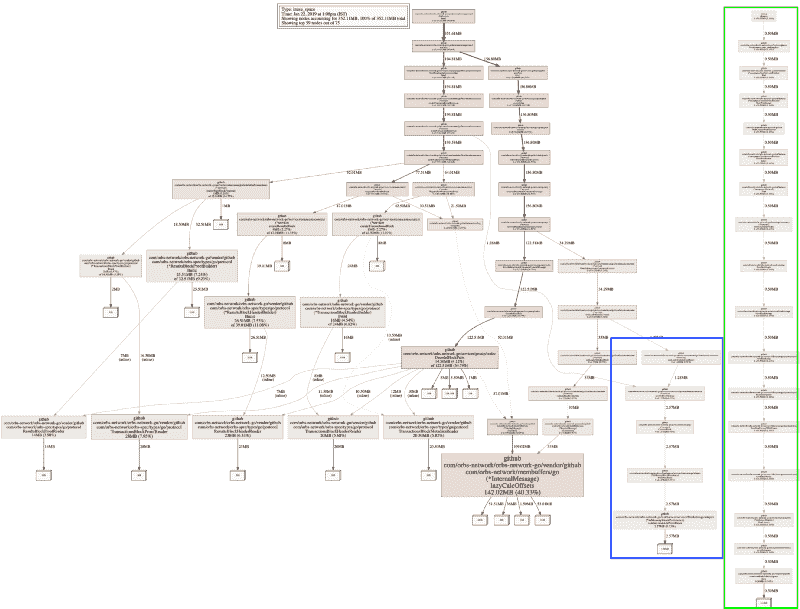
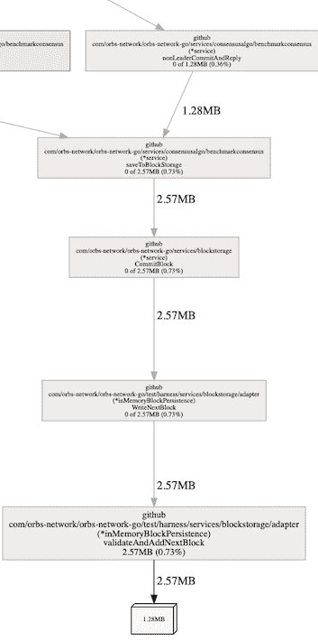
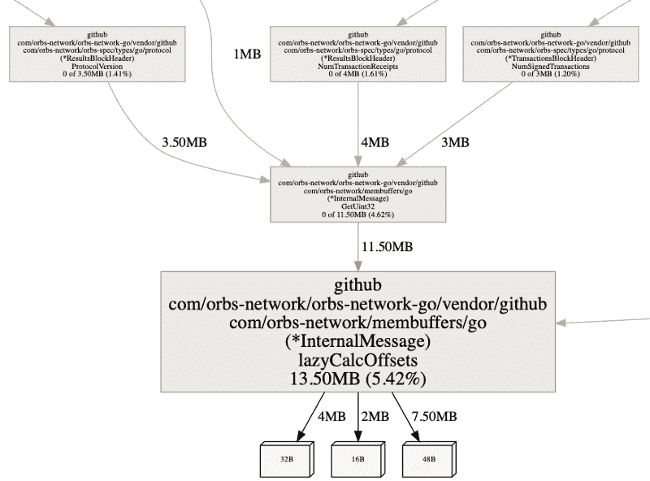

# 我是如何在大型代码库上使用 pprof 研究 Go 中的内存泄漏的

> 原文：<https://www.freecodecamp.org/news/how-i-investigated-memory-leaks-in-go-using-pprof-on-a-large-codebase-4bec4325e192/>

乔纳森·莱文森

# 我是如何在大型代码库上使用 pprof 研究 Go 中的内存泄漏的


Photo by [Daan Mooij](https://unsplash.com/@daanmooij?utm_source=medium&utm_medium=referral) on [Unsplash](https://unsplash.com?utm_source=medium&utm_medium=referral)

今年大部分时间我都在与 Go 合作，在 Orbs 实现可伸缩的区块链基础设施，这是令人兴奋的一年。在 2018 年期间，我们研究了为我们的区块链实施选择哪种语言。这让我们选择了 Go，因为我们知道它有一个很好的社区和令人惊叹的工具集。

最近几周，我们进入了系统整合的最后阶段。与任何大型系统一样，可能会出现后期问题，包括性能问题，特别是内存泄漏。当我们整合系统时，我们意识到我们找到了一个。在这篇文章中，我将涉及如何调查 Go 中的内存泄漏的细节，详细描述查找、理解和解决它的步骤。

Golang 提供的工具集非常出色，但也有其局限性。首先，最大的问题是调查完整堆芯转储的能力有限。完整的内核转储是运行程序的进程所获取的内存(或用户内存)的映像。

我们可以把内存映射想象成一棵树，遍历这棵树将带我们经历对象的不同分配和关系。这意味着无论根源是什么，都是“持有”内存而不是收集内存(垃圾收集)的原因。因为在 Go 中没有简单的方法来分析完整的核心转储，所以很难找到没有进行 GC-ed 的对象的根。

在撰写本文时，我们无法在网上找到任何可以帮助我们的工具。由于存在一种核心转储格式和一种足够简单的从调试包中导出它的方法，可能 Google 中就使用了这种格式。在网上搜索它看起来像是在 Golang 管道中，创建了一个这样的核心转储查看器，但看起来没有人在工作。话虽如此，即使没有这样的解决方案，利用现有的工具，我们通常可以找到根本原因。

#### 内存泄漏

在整个系统中，内存泄漏或内存压力可能以多种形式出现。通常我们把它们作为 bug 来处理，但是有时它们的根本原因可能是在设计决策中。

当我们在新兴的设计原则下构建我们的系统时，这样的考虑被认为是不重要的，这是可以的。更重要的是以这样一种方式构建系统，即**避免过早的优化**，并使您能够在代码成熟后执行它们，而不是从一开始就过度设计它。尽管如此，一些常见的看到**内存压力**问题实现的例子是:

*   分配过多，数据表示不正确
*   大量使用反射或字符串
*   使用全局变量
*   孤儿，永无止境的 goroutines

在 Go 中，造成内存泄漏的最简单方法是定义一个全局变量 array，并将数据追加到该数组中。这篇很棒的博文很好地描述了这个案例。

那么我为什么要写这篇文章呢？当我研究这个案例时，我发现了许多关于内存泄漏的资料。然而，在现实中，系统有超过 50 行代码和一个结构。在这种情况下，找到内存问题的根源比这个例子描述的要复杂得多。

Golang 给了我们一个神奇的工具叫做`pprof`。掌握了这个工具后，可以帮助调查并很可能找到任何内存问题。它的另一个目的是调查 CPU 的问题，但是我不会在这篇文章中涉及任何与 CPU 相关的内容。

#### go 工具 pprof

涵盖这个工具所做的一切将需要不止一篇博文。有一件事花了一段时间，那就是找到如何使用这个工具来获得可操作的东西。我将把这篇文章集中在它的内存相关特性上。

`pprof`包创建了一个堆采样转储文件，您可以稍后分析/可视化该文件，以给出两者的映射:

*   当前内存分配
*   总(累积)内存分配

该工具能够比较快照。例如，这可以让您比较当前和 30 秒前发生的事情的时差显示。对于压力场景，这有助于定位代码中有问题的区域。

#### pprof 配置文件

pprof 的工作方式是使用概要文件。

配置文件是堆栈跟踪的集合，显示导致特定事件(如分配)实例的调用序列。

文件 [runtime/pprof/pprof.go](https://golang.org/src/runtime/pprof/pprof.go) 包含了概要文件的详细信息和实现。

Go 有几个内置的配置文件供我们在常见情况下使用:

*   goroutine-堆叠所有当前 go routine 的跟踪
*   堆——活动对象内存分配的抽样
*   allocs —所有过去内存分配的样本
*   threadcreate —导致创建新操作系统线程的堆栈跟踪
*   阻塞—导致同步原语阻塞的堆栈跟踪
*   互斥体——竞争互斥体持有者的堆栈跟踪

在查看内存问题时，我们将重点关注堆配置文件。allocs 配置文件在数据收集方面是相同的。两者的区别在于 pprof 工具在启动时读取的方式。 *Allocs* profile 将在一种模式下启动 pprof，该模式显示自程序开始以来分配的总字节数(包括垃圾收集字节)。当试图使我们的代码更有效时，我们通常会使用这种模式。

#### 相助

抽象地说，这是 OS(操作系统)存储代码使用的对象内存的地方。这是后来被“垃圾收集”的内存，或者在非垃圾收集语言中被手动释放。

堆不是内存分配发生的唯一地方，一些内存也在堆栈中分配。堆栈的目的是短期的。在 Go 中，堆栈通常用于发生在函数闭包内部的赋值。Go 使用堆栈的另一个地方是编译器在运行前“知道”需要保留多少内存(例如固定大小的数组)。有一种方法可以运行 Go 编译器，这样它会输出一个分析，分析分配从哪里“逃离”堆栈到堆，但是在这篇文章中我不会涉及这个问题。

虽然堆数据需要“释放”和 gc-ed，但堆栈数据不需要。这意味着尽可能使用堆栈会更有效。

这是内存分配发生的不同位置的摘要。还有很多内容，但这超出了本文的范围。

#### 使用 pprof 获取堆数据

该工具有两种主要的数据获取方式。第一个通常是测试或分支的一部分，包括导入`runtime/pprof`然后调用`pprof.WriteHeapProfile(some_file)`来写堆信息。

注意`WriteHeapProfile`是运行的语法糖:

```
// lookup takes a profile namepprof.Lookup("heap").WriteTo(some_file, 0)
```

根据文档，`WriteHeapProfile`的存在是为了向后兼容。其余的配置文件没有这样的快捷方式，您必须使用`Lookup()`功能来获取它们的配置文件数据。

第二种，也是更有趣的一种，是通过 HTTP(基于 web 的端点)启用它。这允许您从 e2e /测试环境中的运行容器甚至从“生产”环境中提取数据。这是 Go 运行时和工具集的又一个优势。整个包文档都在这里找到，但是 TL；您需要将它添加到您的代码中，如下所示:

```
import (  "net/http"  _ "net/http/pprof")
```

```
...
```

```
func main() {  ...  http.ListenAndServe("localhost:8080", nil)}
```

导入`net/http/pprof`的“副作用”是在`/debug/pprof`的 web 服务器根目录下注册 pprof 端点。现在使用 curl，我们可以获得堆信息文件来进行研究:

```
curl -sK -v http://localhost:8080/debug/pprof/heap > heap.out
```

只有当您的程序以前没有 http 侦听器时，才需要添加上面的`http.ListenAndServe()`。如果你有一个，它会钩在上面，没有必要再听一遍。还有一些方法可以使用一个`ServeMux.HandleFunc()`来设置它，这对一个更复杂的支持 http 的程序来说更有意义。

#### 使用 pprof

我们已经收集了数据，现在做什么呢？如上所述，pprof 有两种主要的内存分析策略。一种是查看当前分配(字节或对象计数)，称为`inuse`。另一个是在程序运行期间查看所有分配的字节或对象计数，称为`alloc`。这意味着不管它是否被 gc-ed，所有采样的总和。

这是重申 ***堆*配置文件是内存**分配的一个样本的好地方。`pprof`在后台使用的是`runtime.MemProfile`函数，默认情况下，它收集每 512KB 分配字节的分配信息。可以更改 MemProfile 来收集所有对象的信息。请注意，这很可能会降低应用程序的速度。

这意味着，在默认情况下，较小的对象可能会出现问题，而这些对象可能会逃过 pprof 的检查。对于大型代码库/长期运行的程序，这不是问题。

一旦我们收集了概要文件，就该将它加载到 pprof 提供的交互式控制台中了。为此，请运行:

```
> go tool pprof heap.out
```

让我们观察显示的信息

```
Type: inuse_spaceTime: Jan 22, 2019 at 1:08pm (IST)Entering interactive mode (type "help" for commands, "o" for options)(pprof)
```

这里需要注意的重要一点是`Type: inuse_space`。这意味着我们正在查看特定时刻的分配数据(当我们捕获概要文件时)。类型是`sample_index`的配置值，可能的值有:

*   inuse_space —已分配但尚未释放的内存量
*   inuse_object s—已分配但尚未释放的对象数量
*   alloc_space —分配的内存总量(无论是否释放)
*   alloc_objects —分配的对象总量(不考虑已释放的对象)

现在在交互中键入`top`,输出将是顶级内存消耗者

我们可以看到一条线告诉我们关于`Dropped Nodes`，这意味着它们被过滤掉了。节点是一个对象条目，或树中的“节点”。删除节点是减少一些干扰的好主意，但有时它可能会隐藏内存问题的根本原因。随着我们继续调查，我们将看到一个这样的例子。

如果您想包含概要文件的所有数据，在运行 pprof 时添加`-nodefraction=0`选项或在交互中键入`nodefraction=0`。

在输出的列表中，我们可以看到两个值，`flat`和`cum`。

*   **flat** 表示该函数分配的内存由该函数持有
*   **cum** 意味着内存是由这个函数或它在堆栈中向下调用的函数分配的

这些信息有时可以帮助我们了解是否存在问题。举一个例子，一个函数负责分配大量的内存，但并不占用它。这意味着一些其他对象正在指向该内存并保持它的分配，这意味着我们可能有一个系统设计问题或错误。

关于交互窗口中的`top`的另一个巧妙之处是它实际上正在运行`top10`。top 命令支持`topN`格式，其中`N`是您想要查看的条目数。在上面粘贴的例子中，例如键入`top70`，将输出所有节点。

#### 形象化

虽然`topN`给出了一个文本列表，但是 pprof 提供了几个非常有用的可视化选项。可以键入`png`或`gif`以及更多(完整列表见`go tool pprof -help`)。

在我们的系统上，默认的视觉输出看起来像这样:



这一开始可能有点吓人，但它是程序中内存分配流(根据堆栈跟踪)的可视化。读图并不像看上去那么复杂。一个带数字的白色方块显示分配的空间(以及它现在在图形边缘占用的累积内存量)，每个较宽的矩形显示分配功能。

注意，在上面的图片中，我从一个`inuse_space`执行模式中取出了一个 png。很多时候你也应该看看`inuse_objects`,因为它可以帮助发现分配问题。

#### 深入挖掘，找到根本原因

到目前为止，我们能够理解在运行时是什么在我们的应用程序中分配内存。这有助于我们对程序的行为(或错误行为)有所了解。

在我们的例子中，我们可以看到内存被`membuffers`保留，这是我们的[数据序列化库](https://github.com/orbs-network/membuffers)。这并不意味着我们在那个代码段有内存泄漏，而是意味着内存被那个函数占用了。理解如何阅读图形以及 pprof 输出非常重要。在这种情况下，理解当我们序列化数据时，意味着我们将内存分配给结构和原始对象(int，string)，它永远不会被释放。

妄下结论或曲解图表，我们可以假设序列化路径上的某个节点负责保留内存，例如:



subset of the graph

在这个链的某个地方，我们可以看到我们的日志库，负责分配超过 50MB 的内存。这是由我们的记录器调用的函数分配的内存。想通了，这其实是意料之中的。记录器导致内存分配，因为它需要序列化数据以将其输出到日志，因此它在进程中导致内存分配。

我们还可以看到，沿着分配路径，内存只通过序列化保留，其他什么也没有。此外，记录器保留的内存量约占总内存量的 30%。上面的内容告诉我们，问题很可能不在记录器上。如果是 100%,或者接近 100 %,那么我们应该在那里寻找——但是不是。这可能意味着记录了一些不应该记录的内容，但这不是记录器的内存泄漏。

这是引入另一个名为`list`的`pprof`命令的好时机。它接受一个正则表达式，该表达式将作为列表内容的过滤器。“列表”实际上是与分配相关的带注释的源代码。在我们正在研究的记录器的上下文中，我们将执行`list RequestNew`,因为我们希望看到对记录器的调用。这些调用来自两个恰好以相同前缀开头的函数。

我们可以看到分配的内存位于`cum`列，这意味着分配的内存保留在调用堆栈中。这与图表显示的内容相关。此时，很容易看出记录器分配内存的原因是因为我们向它发送了整个“block”对象。它至少需要序列化它的一些部分(我们的对象是 membuffer 对象，它总是实现一些`String()`功能)。这是一个有用的日志消息，还是一个好的实践？可能不是，但这不是内存泄漏，不是在记录器端，也不是调用记录器的代码。

在你的`GOPATH`环境下搜索时`list`可以找到源代码。在它搜索的根不匹配的情况下，这取决于你的构建机器，你可以使用`-trim_path`选项。这将有助于修复它，并让您看到带注释的源代码。记得将 git 设置为正确的提交，它在捕获堆概要文件时正在运行。

#### 那么为什么记忆会被保留呢？

这项调查的背景是怀疑我们有问题——内存泄漏。当我们看到内存消耗高于我们预期的系统需求时，我们就有了这个想法。最重要的是，我们看到它不断增加，这是“这里有问题”的另一个强有力的指标。

至此，在 Java 或者。Net 中，我们会打开一些“gc 根”分析或剖析器，并获得引用该数据并造成泄漏的实际对象。如前所述，这在 Go 中是不可能的，一方面是因为工具问题，另一方面是因为 Go 的低级内存表示。

不深入细节，我们不认为 Go 保留了哪个对象存储在哪个地址(可能除了指针)。这意味着，实际上，要理解哪个内存地址代表对象(struct)的哪个成员，需要某种映射到堆配置文件的输出。从理论上讲，这可能意味着在进行完整的内核转储之前，还应该进行堆配置文件，以便可以将地址映射到分配行和文件，从而映射到内存中表示的对象。

在这一点上，因为我们熟悉我们的系统，很容易理解这不再是一个 bug 了。这(几乎)是故意的。但是让我们继续探索如何从工具(pprof)中获取信息来找到根本原因。

当设置`nodefraction=0`时，我们将看到分配对象的完整地图，包括较小的对象。让我们看看输出:



memory visualization with nodefraction=0

我们有两个新的子树。再次提醒，pprof 堆配置文件正在对内存分配进行采样。对于我们有效的系统，我们不会遗漏任何重要信息。更长的新树，用绿色表示，与系统的其余部分完全断开，是测试运行程序，它并不有趣。



system was configured to “leak” ?

较短的一个，蓝色，有一条边连接到整个系统是`inMemoryBlockPersistance`。这个名字也解释了我们想象中的“漏洞”。这是数据后端，它将所有数据存储在内存中，而不是持久存储到磁盘上。值得注意的是，我们可以立即看到它拿着两个大物体。为什么是两个？因为我们可以看到对象的大小是 1.28MB，函数保留了 2.57MB，这意味着两个。

这个问题在这一点上就很好理解了。我们可以使用 delve(调试器)来查看这是一个数组，它保存了我们拥有的内存持久性驱动程序的所有块。

#### 那么我们能解决什么呢？

太糟糕了，这是人为错误。虽然这个过程是教育(分享是关怀)，但我们并没有变得更好，是吗？

关于这一堆信息，有一件事仍然“有味道”。反序列化的数据占用了太多的内存，为什么要占用 142MB 内存呢？。。pprof 可以回答这个问题——实际上，它的存在就是为了准确地回答这类问题。

为了查看该函数的注释源代码，我们将运行`list lazy`。我们使用`lazy`，因为我们要寻找的函数名是`lazyCalcOffsets()`，我们知道代码中没有其他函数以 lazy 开头。输入`list lazyCalcOffsets`当然也可以。

我们可以看到两条有趣的信息。同样，请记住 pprof 堆概要文件采样关于分配的信息。我们可以看到`flat`和`cum`的数字是相同的。这表明分配的内存也由这些分配点保留。

接下来，我们可以看到 make()占用了一些内存。这很有意义，它是指向数据结构的指针。然而我们也看到第 43 行的赋值占用了内存，这意味着它创建了一个分配。

这让我们了解了地图，地图的赋值不是简单的变量赋值。[这篇文章](https://dave.cheney.net/2018/05/29/how-the-go-runtime-implements-maps-efficiently-without-generics)详细介绍了地图的工作原理。简而言之，一个地图有一个开销，与切片相比，元素越多，这个开销就越大。

以下内容应该有所保留:可以说，当数据不稀疏或者可以转换为顺序索引时，如果内存消耗是一个相关的考虑因素，通常应该尝试使用切片实现。然而，当扩展时，一个大的切片可能会减慢操作，而在地图中这种减慢可以忽略不计。优化没有神奇的公式。

在上面的代码中，在检查了我们如何使用该映射后，我们意识到，虽然我们将它想象成一个稀疏数组，但它并没有那么稀疏。这与上面的论点相匹配，我们可以立即看到，将 map 更改为 slice 的小重构实际上是可能的，并且可能使代码的内存效率更高。所以我们把它改成了:

就这么简单，我们现在不使用地图，而是使用切片。由于我们接收延迟加载到其中的数据的方式，以及我们稍后如何访问该数据，除了这两行和保存该数据的结构之外，不需要其他代码更改。它对内存消耗有什么影响？

让我们来看几个测试的`benchcmp`

读测试初始化创建分配的数据结构。我们可以看到运行时间提高了大约 30%，分配减少了 50%，内存消耗减少了 90%以上。)

由于地图，现在切片，从来没有充满了大量的项目，数字很大程度上显示了我们将在生产中看到什么。这取决于数据熵，但是在某些情况下，分配和内存消耗的改善可能会更大。

再看一下`pprof`，从同一个测试中获取一个堆配置文件，我们会看到现在内存消耗实际上下降了大约 90%。



要点是，对于较小的数据集，不应该使用切片就足够的地图，因为地图有很大的开销。

**全堆芯转储**

如前所述，这是我们现在看到的工具的最大限制。当我们调查这个问题时，我们沉迷于能够找到根本对象，但没有太大的成功。Go 随着时间的推移以很快的速度发展，但是这种发展是有代价的，例如完全转储或内存表示。完整的堆转储格式在改变时是不向后兼容的。最新版本在这里描述了，要写一个完整的堆转储，你可以使用`debug.WriteHeapDump()`。

尽管现在我们并没有发现自己被“卡住”,因为没有好的解决方案来探索完整的转储。到目前为止回答了我们所有的问题。

请注意，互联网会记住许多不再相关的信息。从 go1.11 开始，如果您打算尝试自己打开一个完全转储，以下是您应该忽略的一些事情:

*   没有办法在 MacOS 上打开和调试完整的核心转储，只有 Linux。
*   在[https://github.com/randall77/hprof](https://github.com/randall77/hprof)的工具是用于 Go1.3 的，有一个用于 1.7+的分叉，但也不能正常工作(不完整)。
*   https://github.com/golang/debug/tree/master/cmd/viewcore 的 viewcore 并没有真正编译。它很容易修复(内部的包指向 golang.org 而不是 github.com)，但是，*它也不工作*，在 MacOS 上不工作，也许在 Linux 上。
*   此外，https://github.com/randall77/corelib 在 MacOS 上也失败了

#### pprof UI

谈到 pprof，需要注意的最后一个细节是它的 UI 特性。当开始调查与 pprof 采集的档案相关的任何问题时，它可以节省大量时间。

```
go tool pprof -http=:8080 heap.out
```

此时，它应该会打开 web 浏览器。如果没有，则浏览到您设置的端口。它使您能够比从命令行更快地更改选项并获得视觉反馈。一种非常有用的消费信息的方式。

UI 实际上让我熟悉了火焰图，它很快暴露了代码中的问题区域。

#### 结论

Go 是一门令人兴奋的语言，拥有非常丰富的工具集，使用 pprof 可以做更多的事情。例如，这篇文章根本没有涉及 CPU 性能分析。

其他一些好的读物:

*   [https://rakyll.org/archive/](https://rakyll.org/archive/)——我相信这是关于性能监控的 go 贡献者之一，她的博客上有很多好帖子
*   [https://github.com/google/gops](https://github.com/google/gops)——由 [JBD](https://www.freecodecamp.org/news/how-i-investigated-memory-leaks-in-go-using-pprof-on-a-large-codebase-4bec4325e192/undefined) (运营 rakyll.org)撰写，这个工具保证了它自己的博文。
*   [https://medium . com/@ CEP 21/using-go-1-10-new-trace-features-to-debug-an-integration-test-1 DC 39 e 4 e 812d](https://medium.com/@cep21/using-go-1-10-new-trace-features-to-debug-an-integration-test-1dc39e4e812d)—`go tool trace`这是一篇关于 CPU 性能分析的好文章。