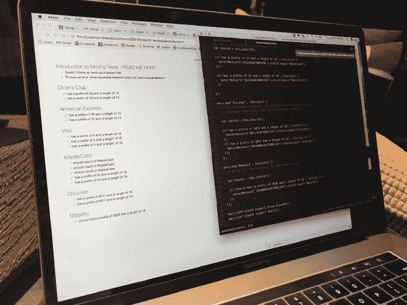

# 经过一年的努力，我是如何找到一份软件工程的工作的

> 原文：<https://www.freecodecamp.org/news/how-i-landed-a-software-engineering-job-in-a-year-f7475fce471d/>

安德鲁·恩戈

# 经过一年的努力，我是如何找到一份软件工程的工作的

我们许多人认为成为软件工程师需要多年的教育和极高的智商。虽然软件工程是最有前途的职业之一，但是不要让它阻碍你学习编码并成为一名软件工程师。

我认为对我来说过渡到计算机科学已经太晚了，但是不管你在生活中处于什么位置，学习和追求你的激情永远不会太晚。

### **我的非传统背景**

我没有上过顶尖大学，也没有技术背景。我小时候对解谜没有热情，也没有参加数学竞赛。事实上，当我还是个孩子的时候，在多次尝试让 wifi 工作失败后，我就偏离了诊断电脑的方向。

我毕业时获得了工商管理学位，做过两份对我来说没有挑战性的金融工作。这些都是轻松简单的工作，但是很快就变得平淡乏味了。我觉得我正在做的工作没有成就感，每次我要求更多的分析任务时都被拒绝。然后，我决定提高自己的技能，创造自己的机会。

一年多以前，我开始学习 SQL，因为它是财务分析中的一项流行技能。学习了语法之后，编码似乎不再那么可怕了。这有点像学习一门新语言。一旦你能够读和写，你就能理解那些曾经看起来完全陌生的东西。我真的很喜欢学习一门新语言，喜欢在工作中使用技术，所以我知道这是我必须追求的东西。

### **选择正确的路径**

我考虑了在发展中追求职业生涯的不同途径。我不想再花两年时间读大学，我也不想自己一个人学习所有的东西。我听说过一些人参加了编码训练营，并能够过渡到软件工程角色的成功故事。在做了大量研究后，我认为这是我的最佳选择，并申请了下一批黑客反应堆。

我需要通过一次技术面试才能被录取，所以我把所有的时间都花在了工作之余或者周末，尽可能多的学习。从全职工作中抽干后，很难抽出时间来学习全新的东西，但我实现目标的动力让我坚持下去。

我第一次面试彻底失败了，但我从错误中吸取了教训，并在截止日期当天预约了另一次面试。我确保这次我做好了准备，并与我的整个思考过程进行了沟通。第二天，我收到了录取通知书，我成为一名软件工程师的旅程正式开始了。

### **磨练你的手艺**

我决定去的学校位于旧金山，世界上最大的科技中心之一。在 SoCal 生活了一辈子，这绝对是一个重大的改变，说再见并不容易。我收拾好所有的东西，搬进了旧金山的合租公寓。

在我项目的最初几天，我开始了解我的同学。他们中的大多数人来自备受尊敬的大学，拥有 STEM 学位。他们中的许多人都有其他脚本语言的知识和面向对象编程的经验。我知道如果我不想落后的话，我有很多东西要补上。

他们称之为编码训练营是有原因的。课程安排在早上 9 点到晚上 8 点，一周六天，但我通常会呆到晚上 10 点或午夜。我生活、呼吸、睡觉都是代码。

头几周我真的很纠结。我会尽可能多的填充信息，同时确保我仍然保留了前几天的信息，并在第二天重复这个过程。有些时候，我怀疑自己，认为自己不具备成为一名程序员的条件。我牺牲了这么多，我的朋友和家人都指望我能坚强地完成比赛。我知道这是我唯一的机会，所以我坚持下来，度过了难关。

一天又一天，一周又一周开始飞逝，我慢慢地开始进入状态。我开始学习“如何学习”,并依靠自己的技能来解决我面临的问题。Google 是任何开发人员最好的朋友，很有可能其他人也遇到了和你一样的错误。

我每两天进行一次 sprints，内容涵盖 JavaScript 基础、前端框架、服务器、数据库、部署等等。最初几周，我只是随波逐流，但当我最终创建了一个完整的全栈应用程序时，一切都变得明朗了。我终于明白了我所使用的特定技术的目的，一切都变得有意义了。

### **让我们建造一些东西**

一旦基础建立，我的课程就转向了建筑项目。我会和强调前端或后端的团队一起做顶点项目。他们说你投入什么就会得到什么，所以我确保在这些项目中展示我绝对最好的作品。它不仅必须工作，而且代码必须干净易读，以防潜在雇主查看我的 git 存储库。

最后一个顶点项目被称为 MVP，也称为最小可行产品。我们基本上有 72 个小时来创建我们想要的任何东西，只要它是一个完整的堆栈应用程序。有限的时间是一个挑战，我必须确保我能够有效地管理我的时间。我不能对我的项目过于雄心勃勃，但我也想让它成为我引以为豪的东西。

我的第一个想法是建立一个分散的应用程序，利用以太坊区块链。这对雇主来说听起来印象深刻，但我不熟悉 Solidity 语言，不确定我是否能及时完成整个 dapp。另一个我会开玩笑的想法是为我和我的同学会去的所有附近的波霸商店开发一个波霸评级应用程序。

到了该做决定的时候，我记得我选择编码是因为它对我来说很有趣。我觉得我会把 110%的精力放在我喜欢的事情上，而不是我经常强调的事情上。我最终选择了波霸评级应用程序，并喜欢它的每一秒钟。

一旦我完成了基本的功能，我会继续实现附加的功能。它最终成为了一个充满激情的项目，并将永远是一个令我自豪的难忘项目。不要做某件事，因为它可能会给别人留下深刻印象，而是因为你真正喜欢它。

到第 13 周结束时，我的整个心态从我开始这个项目时就发生了变化。作为一名开发人员，我感到更加自信，并为我所完成的一切感到自豪。我学到了很多新技术，这些技术可能需要我花很多年才能学会。我变得更加自主，依靠自己的技能解决问题。我终于准备好投入到我的求职中，迫不及待地开始了。

Shoutout to cohort HRSF102! Woohoo!

### **研磨**

在我的项目结束之前，我知道我必须马上投入工作。我已经准备了几个月，现在是我向雇主展示我的机会了。我知道整个 MVC 以及如何构建完整的堆栈，但当我进行模拟面试时，我会变得非常紧张，完全空白。在那一点上，这将是一个向下的螺旋，我的整个思维过程将脱轨。我连模拟面试都搞不定，怎么通过真正的技术面试呢？

在研究 Leetcode 问题时，我加倍研究数据结构和算法。我必须确保我不是在记忆具体的问题，而是理解解决问题的过程来解决任何问题。一旦我能够想出一个问题的基本解决方案(也称为蛮力)，我知道面试官会寻找一个最佳的解决方案。他们想知道你的算法在时间和空间上是否有效。

一旦我建立了一个更好的解决问题的基础，是时候面对我对面试的恐惧了。我听说过休克疗法的概念，基本上就是直面你的恐惧。类似于蝙蝠侠如何通过将自己包围在一个充满蝙蝠的洞穴中来克服对蝙蝠的恐惧，我不得不更多地练习采访。

我使用了一个名为 Pramp 的网站，它会把你和另一个人配对，你们轮流面试对方。我鼓起勇气，安排了我的第一次面试。我会把我的思考过程说出来，解决方案自然会出现在我面前。我可以慢慢感觉到我的紧张感消失了，我开始享受面试。

在模拟面试结束时，我寻求反馈，了解了我可以改进的地方。一切结束后，我感觉棒极了！面试并没有那么可怕，你真的可以从这个过程中受益。然后我每天都练习，为真正的面试做准备。

> "成功不是最终的，失败也不是致命的:重要的是继续下去的勇气."——温斯顿·丘吉尔

### **全是数字游戏**

在我准备面试的时候，我也开始申请工作，因为申请过程需要一些时间，特别是对于大公司，可能需要几周或几个月。

我注意到新开发人员在申请前只关注准备是一种普遍趋势，但这可能是一个代价高昂的错误。当涉及到软件工程时，总有一些东西需要学习，所以你不能什么都准备。我被问到各种各样的话题，比如数据结构和算法、系统设计、前端设计、测试和领域知识。当你已经学习了“一切”的时候，可能需要几个月才能得到第一次面试机会。

一个策略是去面试那些你知道不是你首选的公司。这样，当你有机会为你梦想中的公司面试时，你会准备得更充分，知道该怎么做。

我知道参加训练营并不能保证我找到工作。我与那些拥有计算机科学学位和以前行业经验的人竞争。作为一名没有技术学位或相关工作经验的求职者，我在求职时处于劣势。

我申请了我遇到的任何一个工程师或开发人员的职位，并联系了我想去的潜在公司的所有关系人。我发出了 300 多份冷冰冰的申请，收到的回复率低得令人难以置信。我被过滤掉了，收到了无数的自动拒绝邮件。

我发现联系招聘人员最有效的方法是通过推荐。从雇主的角度来看，推荐是完全有意义的。当你有一个可以信任的现任员工为你担保的候选人时，为什么要相信一个你从未见过面的陌生人呢？任何人都可以做的一件事就是通过参加聚会和活动来扩大自己的社交网络。LinkedIn 是在公司寻找相互联系的好工具；充分利用它。

你第一次找工作会有很多障碍。我已经在技术筛选中多次否决了它，并从面试官那里得到了很好的反馈，只是后来收到了招聘人员的拒绝邮件。你只需要持之以恒，从过去的面试中吸取教训，坚持下去。如果你坚持做好每一件事，你最终一定会找到合适的机会并得到一份工作。

### **诚实的努力会有回报**

在我为期三个月的求职结束时，我受邀参加了五次现场面试，收到了三份录用通知。经过深思熟虑，我很高兴地宣布，我将加入旧金山湾区的 Zume 公司。我热爱这项任务和我遇到的每一个人。我所有的努力工作和漫漫长夜终于有了回报，我对现在的生活感到无比幸福。我非常感谢在这段旅程中支持我的每一个人。我知道我每天都会面临挑战，并会对我的工作产生更大的影响。

我喜欢软件工程的一点是，你有什么背景并不重要。任何人都可以学习如何编码和磨练自己的技能。如果你像我一样来自一条非传统的道路，可能需要比其他人多做一点工作，但这都是值得的。人生苦短，不能退而求其次，所以做自己喜欢的事吧。

祝你在事业上好运——安德鲁

欢迎在 LinkedIn 上联系和关注我，我会帮助激励那些想进入科技行业的人:[www.linkedin.com/in/andrew-ngo/](http://www.linkedin.com/in/andrew-ngo/)