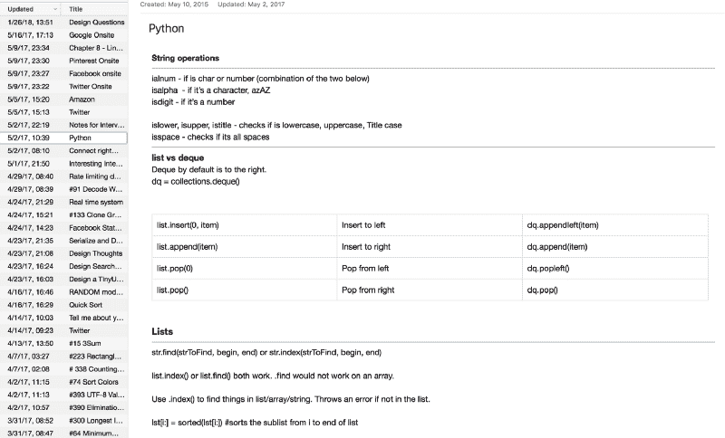

# 我如何在没有常青藤学位的情况下获得微软、亚马逊和推特的邀请

> 原文：<https://www.freecodecamp.org/news/how-i-landed-offers-from-microsoft-amazon-and-twitter-without-an-ivy-league-degree/>

这是写给那些即将开始找工作的人，以及那些担心没有斯坦福大学计算机科学学位就找不到顶级技术工作的人。有人告诉你，你不够好，无法在微软或脸书找到工作。

但是我在这里告诉你，你可以得到那份工作。以下是我如何在 Twitter 找到我梦想中的工作的。

点击阅读更多关于我的课程，了解我是如何准备的。

你可以在 Twitter [这里](https://www.freecodecamp.org/news/what-ive-learned-in-1-year-at-twitter-65150f5d4af2/)阅读我一年后的经历。

### 本文涵盖的内容:

*   我的背景
*   我如何获得世界顶级科技公司的面试机会:脸书谷歌、亚马逊、LinkedIn、微软、Twitter、Pinterest、Snapchat 等等。
*   作为一名全职软件工程师，我是如何获得多份工作机会的
*   从我的面试经历中得到的教训
*   点击这里订阅我的更多文章更新

如果你喜欢看我的故事，我在这里做了一个视频:

[https://www.youtube.com/embed/83Reyvrs-VQ?feature=oembed](https://www.youtube.com/embed/83Reyvrs-VQ?feature=oembed)

## 背景

我不是从常春藤盟校毕业的。我在爱达荷州的一所社区大学读了两年，然后在一所小型天主教大学完成了我的 CS 学位。

我在大学三年级开始学习计算机科学，因为当时听起来很有趣。我成长过程中唯一一台像电脑的东西是任天堂 SNES 的中国仿制品。即使那样，我每次放子弹进去它都会坏掉。

为了支持自己读完大学，我做过多份兼职工作，比如清洁地板和单口相声表演。

当我毕业的时候，我还没有找到工作。我申请了尽可能多的大型科技公司，并且幸运地获得了一些电话面试机会。

在这一点上，我没有一个技术屏幕是什么样子的概念，更不用说如何准备了。我参加这些面试时，以为面试官会问我什么是链表或二叉树。

我没有通过任何一次面试。

## 走向

我没有过多的去钻研自己是否优秀。我知道我可以学得很快。我只是需要一个机会。

俗话说，广撒网。所以我就这么做了。

我接下来做的事情是我特别自豪的。我编写了一个简单的 Python 脚本，从 Craigslist 上抓取职位列表，标题包含列表中的关键字，并将电子邮件收集到一个电子表格中。真实的战争故事，可以在这里阅读文章[。](https://www.freecodecamp.org/news/how-i-built-a-web-crawler-to-automate-my-job-search-f825fb5af718/)

这不是最聪明的解决方案，但在 Craigslist 上发帖的人对他们的标题出奇的准确。

然而，Craigslist 不喜欢人们抓取他们的网站。为了解决这个问题，我通过 VPN 运行我的脚本，并设置了一个计时器，每隔几分钟左右暂停一次脚本。它并不完美，但已经足够好了。

最后，我从旧金山、波特兰、斯波坎和西雅图收集了大约 500 封电子邮件。我根据搜索结果的具体程度和最新程度对其进行过滤，并通过添加越来越多的功能来不断改进。

事实证明，市场上已经有一些抓取 Craigslist 并自动发送电子邮件的机器人。这些公司大多是离岸公司，希望将自己的公司推向美国市场。

我的一个变通办法是，我精心制作了一些电子邮件，在邮件标题中使用了它们列表中的关键词。然后我用帖子的正文添加了更多的细节，让它看起来更有个性。我做了一个快速的 A/B 测试，我收到的回复从 2-3%增加到了 10%。

在 500 封左右的电子邮件中，我收到了大约 50 封回复，其中只有一小部分出现在手机屏幕上。我停在 500，是因为时间紧迫，需要尽快敲定一份工作。我在优化结果，而不是达到那个点。

幸运的是，我最终在西雅图的一家初创公司找到了一份初级软件工程师的工作。这家初创公司当时位于柯克兰，所以我必须坐 45 分钟的公交车才能赶上面试。

在接下来的 3.5 年里，我在那里学到了很多东西，比如亚马逊 AWS、EC2、DynamoDB、SQS 和 Docker。这期间我成长了很多。我学会了如何编写模块化、可维护的代码。我学会了如何思考软件设计。我学会了如何处理人际问题。

我和一群在微软、亚马逊和 LinkedIn 工作的聪明人一起工作，我试图成为这个团队中的“海绵”。我吸收了他们扔给我的任何东西。我相信这对我的职业生涯产生了巨大的影响。

## 启动天数

在初创公司工作期间，我几乎只做后端开发，中间还有一些开发工作。我开始编写一些函数来添加/修改一个功能，这些功能的范围大多很小。但是这是一个了解代码库和获得一些代码评审的好机会。

一年后，我开始拥有代码库的一部分，然后我的任务是将一组特性转化为服务。这是初创企业 SOA 阶段的开始。我们开始将网站的各种组件转化为服务，这就是我开始了解 RESTful 服务、认证、AWS 服务、发布订阅、分布式系统等等的方式。

有趣的是，我并没有通过书本或正规教育了解到这些。相反，我需要完成那组功能，但存在瓶颈。

所以我想，我们去解决吧！

有很多次我陷入了分析瘫痪——一种过度分析场景并最终无法取得进展的状态。

那些艰难的时刻是最大的学习机会。我开始学习功能范围、协商、监控、警报和文档。这个过程的每一步都揭示了更多我需要学习的东西。无论是作为个人还是软件工程师，我在这 2-3 年中成长最多。

## 我是如何准备面试的

在经历了第一次求职的痛苦后，我告诉自己，在未来的面试中，我必须做好准备。

我开始为面试做准备，概述了我擅长什么，不擅长什么，以及我可以改进的地方。我把它分成三类:**数据结构，算法，系统设计。**

在我职业生涯的大部分时间里，我都在使用 PHP，在大学里使用 C++，所以我想尝试一些更简单、更简洁的面试方式。

基于这个原因，我选择了 Python。这是一门很好的语言，容易学习，支持许多现成的数据结构，可以在白板上快速书写。我学习 Python 是通过浏览 YouTube 教程，如[这些](https://www.youtube.com/watch?v=Z1Yd7upQsXY)，以及阅读它们的文档。我更喜欢 Python 2.x，但你可以选择 2.x 或 3。

此外，我选择 Python 的另一个原因是它可读性很强，并且易于在白板上书写。这里有一个 C++和 Python 的简单比较。

一个按降序排序的 C++程序:

```
#include <bits/stdc++.h>
using namespace std; 
int main() {   
    int arr[] = {1,10,0,4,5};
    int n = size(arr)/sizeof(arr[0]);   
    sort(arr, arr + n, greater<int>());   
    for (int i = 0; i < n; i++) {       
        cout << arr[i] << " ";   
    }    
    return 0;
} 
```

与 Python 的版本相比:

```
a = [1,2,4,5,1000]
a.sort(reverse=True)
print a 
```

我收到了面试官的反馈，认为在面试中不要过于简洁。在 45 分钟的面试中，你希望用大部分时间解决实际问题。

专业提示:选择一种不太冗长的语言，这样你可以更快地在白板上写代码。

## 准备模式

我花了大约一周时间在 LeetCode、HackerRank 和 Project Euler 上完成简单的挑战，以熟悉它们的接口，并习惯用 Python 编写代码。

第一周让我了解了自己在某些编程语言方面的能力水平。我又花了一周时间完成了一些设计挑战，比如“设计 X ”,并且尽可能地深入。

这对我来说很有趣，因为我经常查看 iOS 应用程序，并试图找出它们是如何做到的。比如，你会如何从零开始构建 Instagram？(在脸书有人问我这个问题。)

我的背景是 API 设计和面向服务的架构，所以我借此机会展示了我将如何设计自己版本的 Instagram。因为我从我的副业项目中获得了一些 iOS 编程经验，所以我可以在这里谈一点关于回调和推送/长期轮询的内容。

我以一些我想在我自己版本的 Instagram 上拥有的功能开始了对话:喜欢、上传照片和简单的时间线。特性范围使我能够构建一个非常可靠的 API，因为我非常了解这些场景。

然后我画了一些高级设计的图片，客户端将如何与后端交互，后端将如何存储数据。

我从小处着手，然后在需要的地方添加更多组件，并主动寻找瓶颈所在。我对需求是什么，以及每种技术如何适应做了有根据的猜测(阅读**有根据的，而不是盲目的猜测**)。同样重要的是，哪些技术*不适合。*

例如，为什么要使用 Cassandra 而不是 MySQL 来存储某些信息(提示:规模、开发速度、模式审查)，为什么要使用 OAuth 而不是简单身份验证，Redis 与 Memcached 用于缓存数据，流处理与批处理，等等。

在这里你可以探索很多领域，所以通常一个小时的会议是不够的。要做好这些问题，你必须阅读和学习权衡。行业技术的利与弊。为此，我推荐一个像[高可扩展性](http://highscalability.com/all-time-favorites/)这样的网站。

就像和同事进行一次典型的头脑风暴会议一样，尽可能广泛深入地探索*。*

重要的是要知道这些设计面试是为了探究你知道多少，你了解多少，这是一个让你大放异彩的机会。我看了这个 YouTube [视频](https://www.youtube.com/watch?v=ZgdS0EUmn70)，视频来自一位前脸书工程师，讲述如何解决设计问题，它给了我一些见解，对我的设计面试帮助很大。我从中得到的两个主要教训是:**推动设计对话，**和**展示你所知道的**。

我列出了我的能力水平:**数据结构**(链表、散列图、二叉树、二叉查找树、堆、数组)**算法**(二分搜索法、散列、动态编程、排序)，以及**特定于语言的语法和库**(比如排序、Python 的 lambda、追加、索引)。

我选择了我最不擅长的领域，并开始着手于此:**算法**。

算法从来都不是我的强项。我的大学时代已经过去一段时间了，在我的日常工作中，我没有花太多时间去做二分搜索法。我对每种算法的表现以及在什么情况下使用它们有所了解。但是我对在 10 分钟内写完一篇二分搜索法并不是 100%满意。在白板上。在面试官面前。

我还从亚马逊[上买了一些精细的记号笔，效果非常好。也许这只是我的看法，但是面试房间里的精确标记通常根本不起作用。我通常会花 2-3 分钟寻找一支能用的笔，这是你不能浪费的 2-3 分钟。此外，与较厚的白板相比，细点记号笔允许您在典型的白板上多写 5-8 行代码。:)](https://www.amazon.com/86601-Low-Odor-Markers-Assorted-8-Count/dp/B000Z88D2E/ref=sr_1_3?ie=UTF8&qid=1518801079&sr=8-3&keywords=white+board+pens)

专业提示:买一套你自己的精细点标记。

我花 50 美元从好市多买了一块白板，从亚马逊买了一些书(列在下面我推荐的工具一节)，开始练习。我确保自己对二分搜索法、递归、动态编程、BFS 和 DFS 有所了解。许多面试问题都围绕着递归和二分搜索法或者它的一些变体。

我见过的最好的面试问题有许多不同的解决方案，随着你的进展，还会有额外的一层添加到上面。

我在 Google 上遇到的一个问题是关于文件系统目录，以及如何遍历它们(提示:递归)。我很快就解决了这个问题，面试官问我如何识别目录中丢失的文件。那有点困难，但是我挺过来了。然后我们进入如何重建目录，如何序列化/反序列化它，我们花了很多时间讨论文件目录如何在幕后工作。对我来说，这是一次非常愉快的会议。

## 在顶级公司面试

这是一次令人紧张的经历，至少可以说，是一次真正的过山车。

我是这样分配时间的:20%写简历，20%做研究，60%准备面试。

我花了 20%的时间整理我的简历，它至少三年没有更新了。我认真审视了我过去做过的事情，并挑选了我端到端处理的项目，而不考虑复杂性。

这样做的原因有两个。从开始到完成一个项目需要纪律和领导能力——这是我想认同的两个特质。

其次，拥有一个端到端的项目意味着我可以详细深入地谈论项目的每个方面。事实证明，这对于我在 Twitter 上浏览自己的设计至关重要，在 Twitter 上，他们不仅对我的项目设计进行了严格的盘问，还对其背后的决策进行了盘问。

我 20%的时间用于研究。在这种情况下，研究意味着对我感兴趣的公司进行尽职调查，并寻求推荐。推荐有助于回电。

从我的经验来看，我给初创公司和中期公司发出了 20 条左右的冷信息，只有少数人收到了回复。但是，几乎所有现有员工推荐给我的公司都在一周内给我发来了信息。这是轶事，但有价值的。

我不是那种善于交际的人，我也不知道有多少人能给我推荐一家我感兴趣的公司。为了解决这个问题，我上了 LinkedIn。他们有一个搜索功能，我用它来搜索一级和二级连接。第二层关系是那些离你的圈子只有一步之遥的人。换句话说，我们有共同的朋友可以为我的可信度担保。


LinkedIn search

这非常重要，因为给某人打电话找工作非常非常困难，尤其是在当今的市场上。人们在打电话给陌生人时，往往过于谨慎。使用 LinkedIn 对我的研究阶段非常有帮助。

回顾我面试过的所有公司，以下是我对每个公司的看法:

*   脸书/谷歌——非常机械。标准的面试过程，我没有感觉到和他们有任何个人联系。
*   Pinterest——不是最好的面试体验，而是一个很酷的产品和公司。
*   微软(Microsoft)——热爱团队，尤其是经理和她的经理。标准的面试问题，但是很有风度。第二选择。不过，你的收获可能会有所不同——微软的每个团队都有不同的面试。
*   **亚马逊** —标准面试流程。大约 50%的人喜欢它，其他人不喜欢。
*   Twitter——难以置信的有趣和个性化。我喜欢面试过程，非常重视个人和我过去的工作。
*   Snapchat——洛杉矶的酷酷的办公室，一大群决定加入创业潮流的人。感觉事情被笼罩在一片神秘的乌云之下。
*   Lyft —离我住的地方很近，漂亮的办公室，标准的面试流程。对此没有强烈的感觉。

## 来说说我的最爱吧

从很多方面来说，我认为 Twitter 的采访风格很难。但与此同时，它比我面试过的其他公司更有趣、更有风度。

他们的面试过程从与工程经理的电话介绍开始。根据你的表现，接下来会有一两个技术电话屏幕。如果你表现好，他们会带你去你面试的办公室，对我来说就是西雅图。有三个 1 小时 15 分钟的回合，每个回合有两名面试官。

前两个技术电话屏幕是标准的、普通的技术屏幕，您可以在这里解决共享编码文档上的编码问题。

然而，现场查房更多的是对话，而不是恐吓。面试官会问你一些关于你过去项目的深入问题，他们会问你过去做过什么。如果你声称对一个项目拥有所有权，你应该预料到一些关于它的问题。我们鼓励你用它们做参考，并从中获得灵感。

我从来没有感到任何神奇地想出一个完全可行的解决方案的压力，而且这种感觉是高度协作的。

## 其余的

相比之下，在脸书和谷歌面试感觉更机械。他们有一到两个技术电话屏幕，以及五到六轮现场编码。每一轮都需要在白板上写一些代码，你需要在合理的时间内拿出一个近乎完美的解决方案。

脸书有两轮编码，一轮设计，一轮行为。

当天结束时，我又参加了一轮影子测试，这没有计入我的总分。

谷歌进行了五轮编码，没有一轮聚焦于设计，没有一个面试官问我以前的项目。我不一定觉得这样不好。但我认为这感觉非常机械，没有给工程师太多机会来展示他们的能力。有些人在这些场景中表现出色，就像有些学生在考试中表现出色一样。

我不喜欢在 Pinterest 接受采访。我认为产品本身很有趣，他们的工程团队似乎正在研究非常酷的技术[问题](https://medium.com/@Pinterest_Engineering)。但是我在那里面试的时候绝对有过负面的经历。

Pinterest 有三轮编码和一轮设计。在那四轮中，设计轮最让我失望。原因如下:

面试官迟到了，他花了几分钟浏览了我的简历，然后在黑板上画了一些 API。他简单描述了他期望 API 做什么，并问我如何解决这个问题。我们阐明了 API 的特性，我开始使用白板描述我的解决方案。大约 5 分钟后，我转过身，看见他正在打盹！

不酷。

我在一次调查中给了招聘人员我的反馈，从那以后我没有收到他们的回复。

我不会深究我在所有面试中被问到的问题的细节。相反，我将分享我从准备过程中学到的一些见解和有用的技巧。

## 我学到的:

*   在你的简历上要诚实。大多数公司*会*问你关于你简历的问题，他们可以判断你是否编造了简历。能够对一个项目 100%了解**比对 10 个不同的项目 10%了解要好。**
*   一页简历**推荐**。对于科技公司来说尤其如此，科技领域的智慧似乎是，你应该为博士后工作预留两页或更长的时间，或者如果你已经做了很多你知道并非常关心的项目。我的一个朋友在 T2 经营一家名为 Jobscan 的公司，该公司扫描简历，并对简历做出 T4 特有的、可操作的改进。它们非常棒，所以试试吧:)
*   **社交，建立人脉**。软件工程工作的竞争非常激烈，这些顶尖的科技公司每天要筛选数千份简历。有推荐人会帮助你在简历上得到更多关注。
*   确定你的推销。每个对你感兴趣的公司都想知道你为什么对他们感兴趣。**糟糕的回答**:我现在只需要一份工作来支付账单。**一个不错的回答**:我在网上浏览，发现了你们。听起来你在研究有趣的东西。**一个好答案**:我知道你在 X 做一些有趣的工作来实现 Y。我过去做过一些工作，这里是我了解到的可能与 X 有关的 A、B、C。我对 Y 充满热情，因为废话。(*不要*用这个做模板。相反，你应该在这里看到模式——做你的研究，利用你的背景，向公司展示为什么你们两个会很适合在一起。)

## 一些更多的建议

技术面试非常困难，有时还会碰运气。然而，最好的机会总是留给那些有准备的人。

*   **早做准备，准备好***。每个人都知道他们应该为面试做准备，但大多数人不知道如何做好*。正如任何值得做的事情一样，要做好某件事需要刻意的练习。而刻意的练习意味着你需要有一个系统。**
*   ****建体系**练技术技能。我开始从 1-10 分给自己打分，看自己有多好，然后从自己最差的方面着手。我花了几天时间回答不同类型的问题，直到我完全掌握了每个概念。我**每天在 Evernote** 上写笔记。我有一个笔记，可以作为所有编程的大脑垃圾场。它充满了编程技巧&技巧、常见错误和误解、解决特定类型问题的框架等等。**

**

My notebook** 

*   **把你学过的东西记在笔记本上。我同时使用 [Evernote](http://evernote.com) 和 [OneNote](http://onenote.com) 来记录事情。OneNote 用于技术材料/代码，因为我喜欢我可以轻松地以任何方式设置笔记的格式。我用 Evernote 写文章/思考。上图显示了我在架构和系统设计上的笔记。**

**

Evernote for thoughts/tips** 

*   **把所有东西都记下来，即使你认为你不会用到它。我很容易忘记，所以我把学到的任何东西都写下来，包括 shell 命令。我不时地阅读技术博客，如果我发现什么有趣的东西，我会马上记在 Evernote 上。我会每周或每月修改，并相应地重新组织。这对我的职业生涯帮助很大。**
*   ****参加模拟面试**。这无疑是非常有价值的，我强烈建议这样做。我和朋友们进行了模拟面试，并尽可能多地练习。如果你找不到可以一起练习的朋友，那么我推荐 Refdash，这是一种面试即服务。他们有一群在谷歌、脸书和微软等大型科技公司工作的面试官。这些面试官会评估你的编码和设计技能。最棒的是，他们会在最后给你一个分数，给出具体可行的改进方法。**
*   **失败也没关系。在整个过程中，我多次面试失败。有时你只是过了糟糕的一天。如果你失败了，这并不是世界末日。公司倾向于说不，因为这对他们来说风险更低。从长远来看，假阳性比假阴性代价更大。最初的几次拒绝无疑是最刺痛人的。我刚开始面试时，多次电话面试都失败了，我的信心水平下降了。我对自己的能力产生了怀疑，并开始担心自己的技能在当今的就业市场上毫无用处。然而，我给了自己一个提示:如果你失败了 10 次，那就再尝试 10 次。*你只需要一次成功。*这种保证给了我很大的信心，让我继续努力，当我的第一份工作完成时，其他工作也变得容易多了。**

**我花了大约两个月的时间为我的面试做准备。在全职工作之外，我花了大约 **20 小时/周，或者 80 小时/月**学习和写笔记。**

**为了建立我的简历，我花了三年半的时间专注、认真地工作。我故意挑选那些艰难和令人讨厌的事情，这样我就能比其他人学到更多。尽管我的简历上没有名牌大学或顶级科技公司，但我对自己参与的项目有着清晰透彻的了解，这弥补了我的不足。这之所以成为可能，是因为我研究并记下了我学到的所有东西，并有一个系统来回顾它们。**

**记住:强者生存，强者兴旺。**

**TL；博士:不要放弃，为自己创造机会，多多练习，保持希望。专注于过程，并对过程采取有纪律的、专注的方法。**

### **我推荐的工具**

*   **设计数据密集型应用程序:学习扩展分布式系统的好书！强烈推荐。**
*   **[编程面试要素](http://amzn.to/2Dcs6Qd):非常适合解决编码问题。**
*   **[破解编码面试](http://amzn.to/2Hj91OH):非常适合覆盖基础 CS 编码问题。**
*   **每日编码 Problem.com:这是一个免费试用的网站，提供免费的每日编码问题。你可以报名参加有趣的日常编码挑战，如果你愿意，你也可以付费购买解决方案。**
*   **我把我所有的文件、图片、简历都放在这里。易于访问，一次安装，随处可用。爱它❤️(如果你通过这个链接注册，我们都将获得免费的 500MB！**
*   **[CodeRunner](https://coderunnerapp.com/) :我爱这个 Mac 应用！我多次使用它来运行特定的 Python 脚本/函数，效果非常好。？**
*   **[卡夫卡指南](https://amzn.to/2D8FUxS):我把这本书作为参考指南，对于高层次的描述很欣赏。**

**(如果你有兴趣了解更多信息，我在[zhiachong.com](http://zhiachong.com/resources)上分享了更多我个人使用和推荐的资源。)**

**感谢阅读我的故事！你可以在 [Twitter](https://twitter.com/zhiachong) 和 [LinkedIn](https://www.linkedin.com/in/zhiachong/) 上找到我。我很乐意联系并谈论更多关于科技、创业、:D 旅游的话题**

****学分:****

**我的良师益友布兰登·奥布莱恩(Brandon O ' brien),感谢他对本文进行校对，并就如何改进这篇文章提供了宝贵的反馈。**

**[YK·杉下](https://medium.com/@yksugi)，一个崭露头角的 Youtube 明星，他离开了谷歌的工作去追求他的梦想，负责校对和给出关键的反馈。**