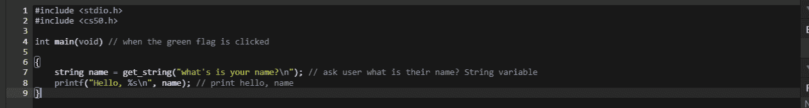

# 我如何在 6 个月内学会编码并构建一个真正的软件产品

> 原文：<https://www.freecodecamp.org/news/how-i-learned-to-code-in-6-months/>

2020 年 5 月 21 日，作为哈佛 CS50 在线课程的一部分，我写了我的第一行代码。我今年 30 岁，没有编程或工程经验，有一份全职工作和一个家庭。

First line of Code in C!

六个月后，我推出了一个生产就绪的 web 应用程序(见，[joyy . gifts:](https://joyful.gifts)[一个自动化的礼物赠送服务](https://joyful.gifts/))供全世界使用。

在这篇文章中，我将分享我是如何学习编码的，这个过程是什么样的，并且我将为那些在同一旅程中的人提供一些非传统的建议。

## **我是如何学会编码的**

从一开始，这个旅程就是关于作为一个建设者的灵活性。我的目标是学习解决现实世界问题的最佳工具。

如果你的目标是获得一份软件开发员的入门级工作，请对所有这些持保留态度——这里的一些内容可能不适用。

以下是我学习的方法。

### 我专注于建筑的乐趣

我专注于建设，并从建设中获得快乐。如果感觉就像匆匆浏览一套材料，我知道我做错了。

对于初学者来说，一个常见的陷阱是看教程而不跟进，并试图在他们所学的基础上进行构建。

因此，举例来说，在学习了 HTML/CSS 之后，我尝试构建了一个周记应用程序。这可能是一个完全不现实的目标，因为我除了简单的 HTML/CSS 语法之外什么都不知道。但这是一次美妙的学习经历。这里可以看到我的尝试[。](https://repl.it/@Jonathanadly/OneSTEP#progress.html)

### 我没有拿自己和别人比较

我没有和其他人比较我在哪里或者我使用的技术。如果它有效，如果它可靠，而且工作愉快，那就意味着我在正确的地方。

当你是一个正在努力学习的初学者时，新的工具和技术可能会分散你的注意力，而不是帮助你。

例如，很多时候放弃 C 和 Python 而使用更新、更好的工具的诱惑是很强烈的。

早期，编程的原则比你使用的语言或框架重要得多。此外，坚持对你有用的东西，不管它看起来有多不受欢迎。

### 我找到了专家

我花了很大力气寻找真正的专家，一旦找到他们，我会寻求他们的建议。

学习编码行业规模庞大。似乎每天都有新的教程或框架，有一长串的福音传道者想要教你。

寻找使用这些工具的专家。询问这些工具能解决什么问题，并在尝试之前评估你是否会面临这些问题。

### 我在与我相关的新技术上投入了时间

根据需要，我让自己熟悉新技术，但只有当它能解决我目前遇到的特定问题时，我才会深入研究。

这里有一个例子。单页应用程序是一项了不起的技术。通过各种 JavaScript 框架构建它们的进步令人印象深刻。所以我让自己熟悉他们能做什么，但是从来没有深入研究过，因为我还没有遇到他们为我解决的问题。

作为一个初学者，把重点放在你需要解决什么问题，以及解决这些问题需要的最简单的工具上。

### 我攻克了难题

如果“困难”的事情能解决问题，我不会回避。

例如，Docker 很难完全理解，但它解决了我的一个问题。

作为初学者，安装和升级软件库和软件包是困难的。

此外，努力找出如何浏览 Python 字典的方法也没什么，这是过程的一部分。

但是，因为 Windows 和一个库不太好而放弃并不理想。

### 我通常坚持使用成熟的技术

如果可以选择，我总是选择成熟可靠的技术，而不是崭新闪亮的技术。

随着技术的成熟，诸如最佳实践、安全漏洞和局限性等问题变得显而易见。

作为初学者，你想重新发明轮子弄清楚什么是跨站点请求伪造(CSRF)以及如何防止它吗？大概不会。

所以，如果可以的话，坚持从一开始就被证实的东西，然后继续探索。

## **我的编码之旅-我使用的资源**

这应该作为一个总体指导，而不是具体的一步一步的方向。软件开发发展非常快，资源会变得过时。

此外，在运送产品的过程中，您还需要学习一些更小的主题。一个简单的教程就可以解决这些问题。示例包括 GIT、Bootstrap、第三方集成、部署和文本编辑器。

以下是我用来学习编码的资源:

### 通过 [CS50](https://www.edx.org/course/cs50s-introduction-to-computer-science) 介绍算法。

我最喜欢它的地方:它是计算机科学的终极入门。计算机为什么以及如何做我们让它们做的事情。

你将从中获得什么:什么是数据类型和结构，什么是算法，什么是大 O 符号，为什么它很重要。

我如何使用它:设计和构建高效的数据库操作和业务逻辑。

### 通过 [freeCodeCamp](https://www.freecodecamp.org/) 学习 HTML/CSS 基础知识

我最喜欢它的地方:freeCodeCamp 是学习编码的完美工具。您马上开始编码，并在此过程中构建有用的项目。

你将从中获得什么:到目前为止，freeCodeCamp 是初学者学习 HTML 和 CSS 的最佳途径。直到今天，我不断地学习 CSS 模块，每次都学到新的东西。

我如何使用它:帮助我创造了[joyy . gifts .](https://joyful.gifts)的外观和感觉

### JavaScript via[eloquentjavascript](https://eloquentjavascript.net/)

我最喜欢它的一点是:如果你对算法和计算机科学基础很熟悉，并且只需要学习 JavaScript 的语法和技巧——这是一个很好的资源。

你将从中获得什么:理解 JavaScript 行为背后的原因并练习语法。

我是如何使用的: [joyful.gifts](https://joyfulgifts/) 的前端支付逻辑大量使用了 JavaScript。此外，通过 JavaScript，表单摩擦被最小化。

### Python/Flask 通过 [CS50](https://www.edx.org/course/cs50s-introduction-to-computer-science)

我最喜欢它的一点:Python 确实是一门美丽的语言，让构建任何东西都成为可能。

你将从中获得什么:如何使用 Python 通过 Flask 框架构建简单的 web 应用程序。

我如何使用它:Python 是一种通用的后端语言，它是 [joyful.gifts](https://joyful.gifts/) 的核心。

### Django——从《Django for 初学者》这本书开始

我最喜欢的是:Django 的简化方法。本质上，这是构建 Django 应用程序的一步一步的方法。

您将从中获得什么:Django 是什么，如何开始使用它，以及使用它可以构建什么。

我如何使用它:Django 是一个使用 Python 的稳定而成熟的 web 框架。像洋葱网和 T2 insta gram 这样的网站都建立在它的基础上，我的网络应用也是如此。

### 通过 [CS50W](https://courses.edx.org/courses/course-v1:HarvardX+CS50W+Web/course/) 使用 Django +现代 JavaScript

我最喜欢的是:这些项目非常实用，适用于现实生活。我能够建立一个类似维基百科的网络应用程序、一个电子邮件客户端和一个拍卖网站。

你将从中获得什么:如何利用前端和后端语言构建复杂的应用程序。

我如何使用它:大型 web 应用程序需要 JavaScript 才能工作。对于 fullstack 开发者来说，连接后端逻辑和前端魔法非常重要。

### Docker 通过[潜入 docker](https://diveintodocker.com/)

我最喜欢它的一点:在深入研究 Docker 的所有细节的早期，事情变得复杂，但最终通过一步一步的指导简化了。

你将从中获得什么:如何 Docker 化你的 web 应用程序，并使用 Docker 拥有一个健康的开发环境。

我如何使用它:如前所述，当你学习编程时，你需要不断地下载各种工具和库。Docker 简化了这一过程，并确保您的程序可以在任何笔记本电脑或服务器上运行。

### Django —通过“ [Django for professional](https://djangoforprofessionals.com/) s”和“[两勺 Django](https://www.feldroy.com/products/two-scoops-of-django-3-x) ”提供专业和最佳实践。

我最喜欢的是:这是部署生产就绪的 web 应用程序的一个很好的演练。

您将从中获得什么:您应该遵循什么样的最佳实践，以及如何确保您的应用程序能够伸缩。

我是如何使用它的:在构建一个学习工具和部署一个有真实用户和金钱交换的网络应用之间有一个巨大的差距。在后一种情况下，最佳实践对于确保安全性和可伸缩性非常重要，这非常有帮助。

## 一些非传统的建议

如果你想学习，学一些全新的东西。如果你想建造，就用你已经知道的和已经被证明有效的东西来建造。当你将成为唯一一个使用该软件的人时，有更多的空间去实验和学习。

流行的工具并不总是有用的工具。在评估是否要学习一个新工具时，考虑它所解决的问题。你作为一个初学者遇到的问题往往和大公司不太一样。

寻求那些经历过一两次灾难的更有经验的开发人员的建议。当你学习的时候，忽略最佳实践和使用捷径是可以的。甚至鼓励重新发明轮子，所以你完全理解它是如何工作的。但是，当您开始构建供世界使用的软件时，尽可能遵循最佳实践。

学习编码就像学习阅读或写作一样。有话好好说就厉害多了。当你在学习的时候，观察你周围的问题，并试着思考如何写代码来解决这些问题。这会让这个过程变得更加愉快，并带来切实的结果。

祝你旅途好运！

我很乐意回答任何关于我的旅程或[快乐的礼物](https://joyful.gifts/)的具体问题——联系我的最好方式是在[推特上。](https://www.google.com/url?sa=t&rct=j&q=&esrc=s&source=web&cd=&cad=rja&uact=8&ved=2ahUKEwjRkZjZ_frsAhVVGFkFHSBtCfEQFjAAegQIBBAC&url=https%3A%2F%2Ftwitter.com%2Fjonathan_adly_%3Flang%3Den&usg=AOvVaw2aiMSzGA-xNkyAiM4zq2cF)