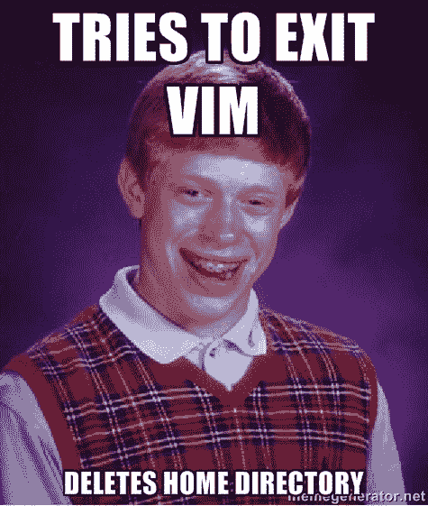
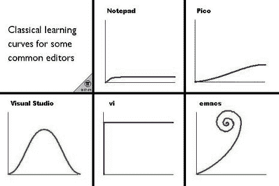

# 我如何学会爱维姆

> 原文：<https://www.freecodecamp.org/news/how-i-learned-to-love-vim-ce3e058d57fb/>

由 sanchitgear

# 我如何学会爱维姆

我和 Vim 有一段苦乐参半的关系已经很长时间了。

在过去的几年里，我曾几次尝试学习 Vim。每一次，我都放弃了它。相反，我会求助于我的“主要”文本编辑器(通常是*[【Atom】](https://atom.io/))。*

*但是有几个星期，我发现自己无法使用 Atom。这是由于一个[模糊的连接问题](https://github.com/atom/atom/issues/2456)。这使得我的设置在远程连接上完全无用。*

*在经历了悲伤的五个阶段后，我决定咬紧牙关，尝试(再次)学习 Vim。这次我强迫自己使用 Vim，而且是单独使用 Vim。*

*我知道——我可以很容易地切换到更直观的编辑器，比如 [Sublime](https://www.sublimetext.com/) 。或者我甚至可以使用成熟的 IDE，比如 [IntelliJ](https://www.jetbrains.com/idea/) 。*

*相反，我想“管他呢”。以下是我学到的一些东西。*

*

This would take some **really** bad luck…* 

### *学习基础知识*

*如果对您来说是新的，Vim 是一个看似古老的文本编辑器。它的根源可以追溯到 20 世纪 70 年代出现的一个名为 Vi 的程序。*

*Vim 的部分吸引力——和烦恼——是因为它被设计成完全与你的键盘一起工作。毕竟，在 Vi 诞生的时候，点击式图形用户界面并不是一个真正的东西。*

*Vim 改为使用**模式**。有两种主要模式可供使用:*

*   *正常模式:这是您在导航文件或编辑/操作文件时使用的模式。这是一种不需要输入新内容的模式。大多数 Vim 命令都是在此模式下输入的。*
*   *插入模式:插入模式允许输入新文本。在这种模式下，Vim 的行为更像一个“普通”的文本编辑器，比如 Atom 或 Sublime。当然，不包括鼠标的使用。*

*Vim 中还存在其他模式。一个例子是视觉模式，用于选择大块文本。通常，这些模式的使用频率要低得多。*

*Vim 通常在终端模拟器中使用。但是，存在独立的发行版。它可以在几乎所有的 Unix 和 Linux 系统上使用。Vim 的前身 Vi 是 UNIX 规范的一部分。因此，它预装在所有兼容系统上。*

### *可组合性*

*“可组合性”是 Vim 区别于其他编辑器的主要原因。它给了 Vim 自己特殊的语言。*

*它在文本编辑和操作的上下文中引入了名词和动词的概念。*

*动词描述您可以采取的操作(如删除、更改、移动)。*

*名词描述正在被操作的内容(通常是文本中的单词、行或位置)。*

*一些常用的名词/动词包括:*

```
*`Verbs d: deletec: change (overwrite)y: yank (copy)>: indent<: unindent`*
```

```
*`Actionsh,j,k,l: left, down, up, rightw: next wordb: previous word0: start of line$: end of linei: inside (excluding the following character)a: around (including the encasing characters)`*
```

*这个列表并不详尽。有成千上万的键绑定可用。但是你可以用最基本的方法获得很多。这个想法是将名词、动词和偶尔的数字组合在一起。这允许你创建不同的**动作** 来根据需要操作文本。*

*例如，要 **d** 删除一个 **w** 命令你键入组合键`dw`。*

*要从当前位置 **d** 删除 **2 w** 命令，你输入`d2w`。*

*要从当前位置一直删除到行尾，输入`d$`。*

*要删除所有的内容，你可以输入`di(`。就这样继续下去。*

*这种工作方法似乎不值得争论。但是如果你强迫自己每天使用这些组合，它们将成为你的第二天性。在某一点之后，通过减少进行某一编辑所需的击键次数而获得的速度绝对令人激动。接下来会有更多。*

### *Vim 会上瘾*

*是的，我知道。这是老生常谈了。但是请原谅我。*

**

*Vim 有一个臭名昭著的学习曲线。但是一旦你度过了不断诅咒你的电脑屏幕的阶段，使用 Vim 实际上是相当有趣的。*

*学习使用 Vim 的神秘命令可以让您快速完成文件编辑过程。过了一会儿，手指抬离键盘上的 home 行，甚至用鼠标，几乎都感觉不对！*

*仅仅过了一个月，我发现自己在经常使用电脑的时候，少了 Vim 的导航系统和其他快捷方式。*

*事实上，我曾经考虑过用这个扩展来试验[在浏览网页时启用 Vim 键绑定。我知道！](https://chrome.google.com/webstore/detail/vimium/dbepggeogbaibhgnhhndojpepiihcmeb?hl=en)*

*幸运的是，编程社区认识到了这一点。大多数主流文本编辑器都有一些启用 Vim 键绑定的方法。这给了“维默”们两全其美的体验，让他们摆脱了痛苦。*

### *给维姆一个战斗的机会*

*Vim 的关键改进是不使用任何其他东西。相反，你应该强迫自己用 Vim 的方式做每一件事。*

*例如，在 Vim 中编辑文件时，尽量不要求助于您的旧习惯。大多数人在刚开始时，都尽量远离“正常模式”。*

*相反，他们试图在“插入模式”中花费尽可能多的时间。在这种模式下，很容易更有家的感觉。它让你不用学习任何新东西就可以编辑你的文件。但这是一个错误。*

*如果你真的对学习如何让 Vim 为你工作感兴趣，你必须付出一些努力。这意味着花时间找出做某事的“正确”方法。*

*如果你发现自己一遍又一遍地重复击键来完成任何任务，**停止**。很可能有更好的方法来做你正在尝试做的事情。*

*谷歌一下。背下来。把它加入你的军火库。与阅读命令列表并希望需要使用其中一个命令相比，通过这种方式学习新命令要容易得多。*

*几天后，你可能会有一种直觉，知道什么时候浪费了击键次数。听从你的直觉。*

### *欣赏(？)现代编辑*

*许多人回避 Vim 的另一个重要原因是它看起来非常“简单”。*

*默认情况下，Vim 没有插件，也没有很好的特性。Vim 认为是“值得拥有”的特性可能与习惯现代 ide 的程序员认为是“值得拥有”的特性非常不同。*

*Vim 附带了准系统语法高亮显示(默认情况下是禁用的)。没有行号(同样，这需要单独启用)。*

*毫不奇怪，像这样的事情:*

*   *默认 Git 集成*
*   *“按需完成”代码完成*
*   *自动括号完成*
*   *代码片段*
*   *自定义配色方案*

*…不要预装 Vim。*

*这似乎是一个巨大的障碍——特别是对于习惯于在强大的 ide 中进行大量繁重工作的程序员来说。许多软件安装了一大堆插件和扩展，专门用来提高工作效率。*

*这种观点有一定的道理。Vim 有其局限性。*

*然而，另一方面——尽管您很欣赏现代 ide 所提供的东西以及构建它们所做的工作——您也意识到大多数 ide(甚至像 Atom 这样普通的编辑器)都有很多臃肿之处。*

*先进的 ide 包含了普通用户很少使用的特性。*

*学习有效地使用 Vim 在一定程度上是找出哪些插件对您的生产力绝对重要的一种练习。关键是构建一个特别适合您的需求和工作流程的编辑器。*

*在许多情况下，使用成熟的 IDE 非常有意义。高级特性可能远远超过您从使用 Vim 中获得的任何好处。*

*但是，这是你自己要弄清楚的事情。*

*尽管它是一个准系统，Vim 有一个蓬勃发展的插件生态系统。*

*Vim 有插件，几乎可以做任何你可以用其他编辑器做的事情。你只需要弄清楚你需要哪一个。*

*让我惊讶的是，仅仅用几个插件我就能走多远。我的 Vim 设置目前由大约五六个“基本”附件组成。我真的不觉得我错过了什么。*

*Vim 并不完美。这绝对不适合所有人。*

*但至少，要学会足够多的 Vim，以防不小心打开[不知道怎么退出](https://stackoverflow.blog/2017/05/23/stack-overflow-helping-one-million-developers-exit-vim/) …！；)*