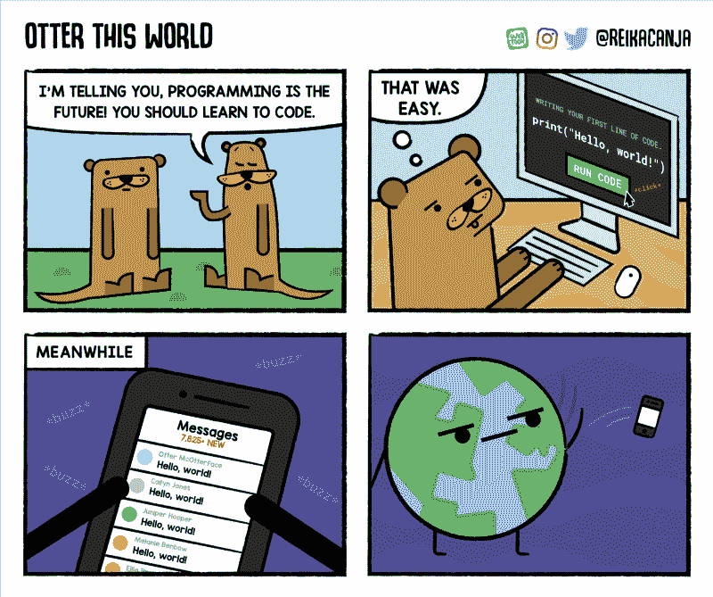
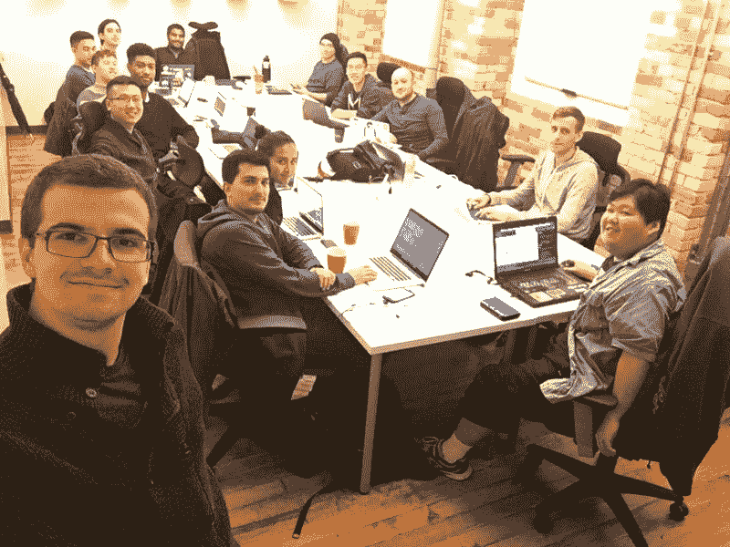

# 我是如何放弃我的咨询职业，进入科技行业的

> 原文：<https://www.freecodecamp.org/news/how-i-left-my-consulting-career-behind-and-broke-into-tech-c823711a662e/>

这里有三个值得你花时间的链接:

1.  我是如何放弃我的咨询职业，进入科技行业的( [24 分钟阅读](http://bit.ly/2ooUzg3)
2.  如何使用 JavaScript ( [8 分钟阅读](http://bit.ly/2nEZD2J))构建一个数学表达式标记器
3.  史诗般的 3 部分系列教程，将带你通过 React、Redux 和 CSS 动画( [24 分钟阅读](http://bit.ly/2otjb8T))创建特斯拉的电池续航里程计算器

额外收获:freeCodeCamp 的开源社区今天出现在 Tech Crunch 上( [1 分钟阅读](http://tcrn.ch/2op1Vjj) + [可选的 55 分钟播客采访](http://tcrn.ch/2op1Vjj))

### 想到这一天:

> "在徒劳地寻求绝对安全的过程中，我们会破产的."—美国总统德怀特·戴维·艾森豪威尔

### 每日一图:

网络漫画作者[水獭这个世界](http://bit.ly/2op5IgH)

### 今日学习小组:

多伦多自由代码营

编码快乐！

–昆西·拉森，自由代码营的老师

如果你从这些邮件中获得了价值，请考虑[支持我们的非营利组织](http://bit.ly/donate-to-fcc)。