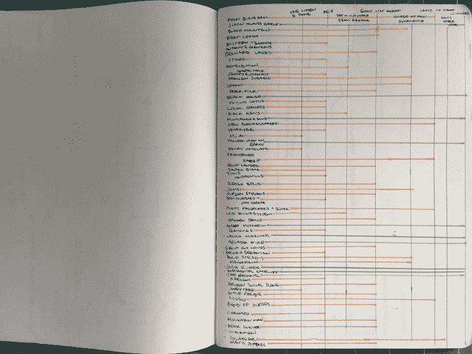
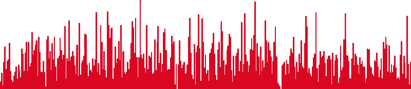
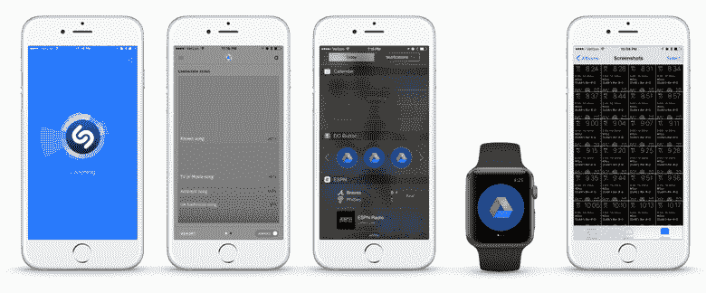
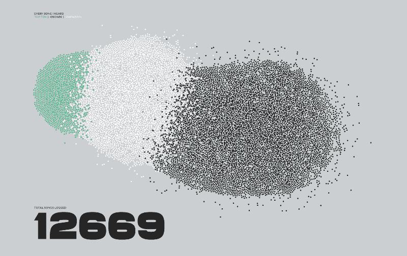
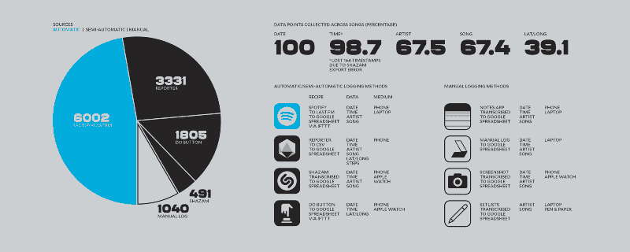

# 我把去年听的每一首歌都录了下来。这是数据。

> 原文：<https://www.freecodecamp.org/news/how-i-logged-every-song-for-a-year-8e965d3de5d1/>

埃里克·布姆

# 我把去年听的每一首歌都录了下来。这是数据。

Notebook I used to write down every new album I heard in 2010\. Colored lines are my year end list making in action.

2010 年 1 月初，在我盐湖城的家中，我打开了我的素描本，翻开了新的一页。我用手掌心把书脊压平，这样它就能平放在桌子上了。我取下黑色毡尖笔的笔帽，在右手页的上方写下*“贝斯纳德湖”*。我追踪每张新专辑的一年正在进行中。

这是我记录的第一份数据，后来我花了十年时间去了解我的音乐品味及其影响。随着时间的推移，我继续写下任何出现在我音乐雷达上的新专辑。到了年底，这个名单增长到了 58 张专辑，从那以后，我列出了我的年度十大专辑。

在接下来的几年里，我重复了这个过程，增加了数据点，让我对如何发现新音乐有了新的认识。

很快，我收集的数据量超过了我可以转录的数量，我放弃了素描本，转而使用应用程序和电子表格。随着我收集的数据量的增加，我的年终总结的密度和复杂性也在增加。

2015 年，我的自我量化达到了一个新的高度。我花了一整年的时间记录我听到的每一首歌。

每一个。单身。宋。

看电视、看电影、在杂货店、在餐馆吃饭、在城里四处走动、开着收音机开车、开着车窗开车、在教堂、在机场、在音乐会上、给我的孩子唱睡前歌曲、街头艺人、地铁表演者、乞丐、棒球比赛、坐在耳机音量开得很大的人旁边、邻居开派对、在洗手间、走向我的车， 同事们站在我的办公桌前播放歌曲，在办公室播放公共音乐，观看超级碗，与家人一起唱“生日快乐”，我的儿子学习如何使用 Spotify，跑步，骑自行车，周六早上捡篮球，试穿裤子，摆弄 Adobe Illustrator，最重要的是当我应该做其他事情的时候。

Total number of songs logged by day in 2015

从来没有一个地方没有音乐。事实上，一年中只有两天我听不到任何歌曲:一天是生病躺在床上，另一天是在爱达荷州的山里。其他日子都是伐木歌。

我严重依赖一些应用程序来获取大部分数据。

我找到了我的 Spotify 流到了 T2 的 Last.fm。

我抓住每一个可能的机会，但发现只有在开车或看电视时，当周围的噪音足够低时，它才是可靠的。

对于其他的事情，我用了记者或者 T2 在我的手机和苹果手表上设置的按钮。

My go-to tools (L to R): Shazam, Reporter, Do Button (iPhone), Do Button (Apple Watch), Screenshots

记者和 Do 按钮都允许我记录无法识别的歌曲，将它们分类(如电视歌曲、环境歌曲、广播歌曲等)。)并获取事件的时间戳和地理位置。此外，记者给了我输入歌曲名称和艺术家的灵活性，如果我能识别他们。

在我需要快速记录一首未知歌曲的情况下，比如和朋友一起吃午饭或逛杂货店，Do 按钮就派上了用场。在我的手机或手表上按一下按钮，日志就会被安全地记录在电子表格中。

其他方法完成了这个过程，比如手写清单或在我的手机上截图——尽管没有一种方法像在笔记本上涂鸦那样浪漫。

What every song I logged looks like on one page

当这一年接近尾声时，我整合了应用程序和电子表格中的数据。经过几周的复制、粘贴和格式化，我得到了我听过的每首歌的完整列表和总数。一万二千六百六十九首歌。一个月一千。每天不到 35 次。

对我的数据表进行了一些排序和过滤，让我有了更多的洞察力，最明显的是我能够识别的歌曲的百分比。我听到的歌曲中有 69.24%可以通过歌名和/或艺人识别。我还有每首歌的日期，以及除了 164 首歌之外的所有歌曲的时间戳(感谢 Shazam 在导出过程中丢失了它们)。

The full breakdown of all the tools I used, the number of songs logged with each tool, and the additional data they provided.

2015 年 1 月的第一天，上午 10 点 49 分，在我奥斯汀的家里，一首歌响起。我将手机平稳地从口袋中滑出，本能地，我的拇指找到了 home 键，当我将它举到视野中时，解锁了屏幕。我点击了 Reporter 应用程序的测地线图标，它的单色界面淹没了整个屏幕。我点击了“报告”按钮，然后在点击“保存”之前点击了两个预定义的问题。

我记录每首歌的一年正在进行中。7 年前，当我第一次在我的素描本上写作时，我做梦也没想到能收集到这么多关于我音乐习惯的信息。事实上，这在物理上可能是不可能的，因为它会消耗大量的素描本。虽然这么多页全大写的《chicken scratch》在我的书架上看起来令人印象深刻，但一个充满歌曲的冰冷电子表格被证明更有价值，更具可塑性，也更便于携带。最重要的是，我发现它非常有洞察力。

第二部分可以在这里找到，重点是我这一年跟踪歌曲的感悟。第三部分可以在[这里找到](https://medium.com/@ericboam/making-the-chart-that-best-illustrates-my-current-music-listening-habits-d2f568c02dd6#.yq3cmq5my)，它总结了一个音乐图表的制作。

我出版了一本 12 页的书，总结了我一年来在音乐方面的发现和过程。这是一个限量版的 250 本，所有的数据，地图和可视化塞满。点击此处订购一本书。

我上一年的项目都在我的网站上整理:[www.ericboam.com](http://www.ericboam.com)