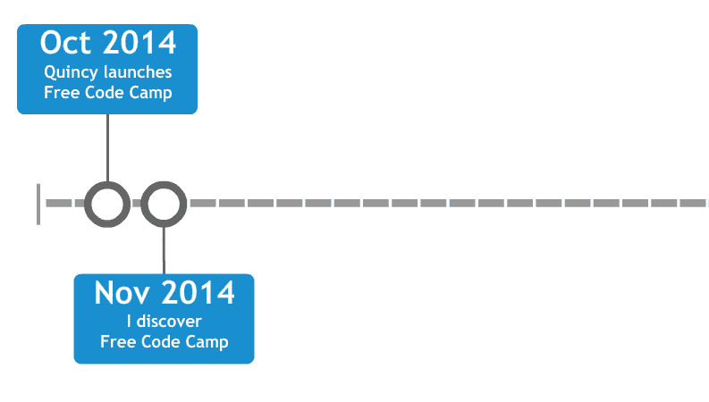
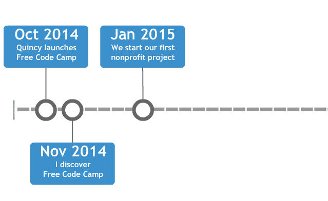
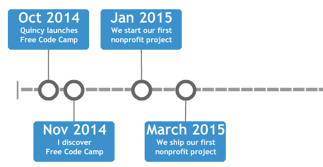
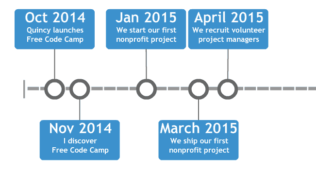
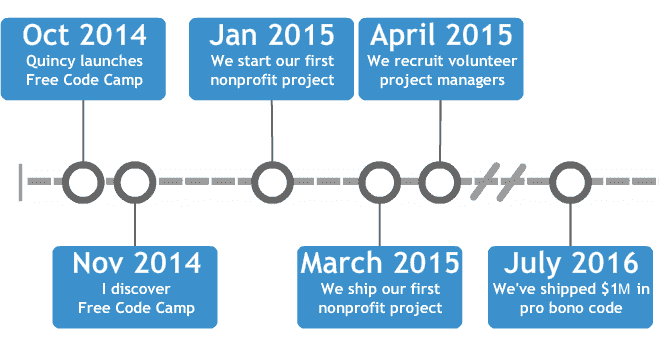
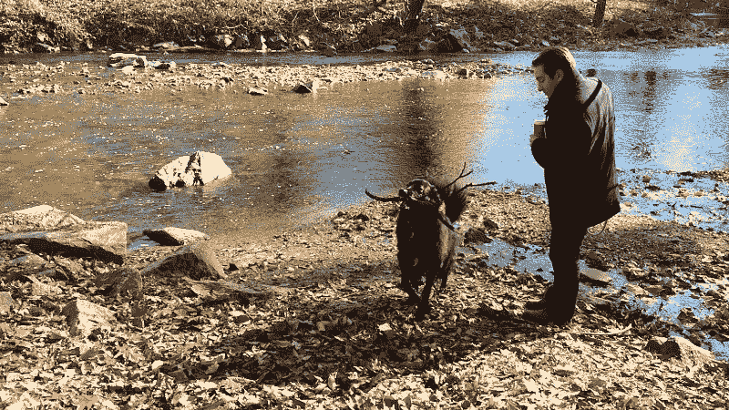

# 我如何赚到我的第一个一百万美元(公益代码)

> 原文：<https://www.freecodecamp.org/news/how-i-made-my-first-million-dollars-in-pro-bono-code-86f911040484/>

迈克尔·d·约翰逊

# 我如何赚到我的第一个一百万美元(公益代码)

我从一间玻璃墙的会议室向下凝视着波托马克河。

这是我在同一家公司面试的第三周。我马上就能获得大多数新英格兰大学毕业生梦寐以求的那种有声望的咨询工作。

商务休闲装。成长空间。他们甚至会为志愿者工作每年额外提供一周的带薪假期。

毕业典礼上的演讲仍然让我记忆犹新——演讲者总是提醒我们“回馈社会”和“改变世界”

我的妻子和狗和我一起搬到了华盛顿，所以我可以这样做。还给我。改变世界。

现在挡在我面前的是一群穿着西装的 A 型人格。

但他们要迟到了，我喝了太多咖啡，不能坐在这里盯着河看。所以我打开手机上的 Reddit，开始滚动。一篇文章引起了我的注意。我点击进入并开始阅读。

我直到后来才意识到这一点，但是我在等待的最后一次面试？这都不重要。

我不再一年花一周时间做志愿者工作，而是很快一年花 52 周去做。

我将领导一个项目，该项目将在最初的 18 个月里运送价值超过 100 万美元的公益代码。

我正在和昆西·拉森通电话，和他谈论他的文章。他的中心思想是，新开发人员可以通过为非营利组织构建项目来获得真实世界的经验。

昆西告诉我，到目前为止，他关于志愿者通过公益代码帮助非营利组织的理论只是一个理论。

这是一个有很多反对者的理论。

他和无数为非营利组织协调志愿服务的公司谈过，他们都告诉他同样的事情——这永远行不通。

他们说，当然，结对编程和敏捷软件开发是已经被证实的运送代码的方式。但是和志愿者一起做呢？远程操作呢？

“有一百万个活动部件可能会出故障，”他们告诉他。"没有预算和财政激励，最初迸发的良好意愿是不可持续的."

当我和昆西在我离白宫几英里远的新租的一室公寓里踱步交谈时，我的脑海里思绪万千。

只有一个成功的项目。

一个概念证明。

这就够了。

仅在我家附近就可能有一千个非营利组织。他们都想尽可能靠近联邦摇钱树。我可以联系他们。说服他们接受我们的想法。

“我可以帮助你，”我告诉昆西。

我会找到非营利组织并管理这些项目。他会把细节留给我。

太阳在国家广场升起。

在美国的另一边，Quincy 正在结束与韩国一名开发人员的结对编程会议。他通过我们的聊天室系统向我发送“干杯”，然后踉踉跄跄地上床睡觉。

我呷了一口热气腾腾的咖啡，打开自由代码营的共享收件箱。我们收到了一封来自波特兰非营利轮滑联盟的邮件。

该利益相关者写道，他们的联盟一直在使用志愿者管理软件，但它缺乏报告和多用户访问。它没有提供他们需要的灵活性，所以他们可以跟踪他们的溜冰者，因为他们在整个系统中移动。

“我们在推特上听说过你，”她说。"我们希望你能帮忙。"

我对轮滑德比一无所知。但是我知道我们可以用她描述的功能开发一个应用程序。对于一些新开发人员来说，这将是一个添加到他们投资组合中的伟大项目。

我在当天晚些时候安排了一个时间和她谈话。我的计划是获得更多关于他们工作流程的细节，并了解他们目前使用的软件的所有缺陷。

在电话里，我安抚她，“我理解你的担忧。我知道这看起来很难相信。我们真的不会收你一分钱。我说的是实话。我们不是这样赚钱的。”

我没有告诉她的是，我们还没有赚到钱。整个行动都是用昆西的积蓄来运作的。

尽管如此，她还是持怀疑态度。说服她比我想象的要困难得多。我们提供的听起来好得不像真的。

但是她继续向前，告诉我更多关于她的组织，以及他们需要他们的志愿者管理系统做什么。我能让她相信我们不是在偷梁换柱。

她深深地吸了一口气。“好吧，”她说。她停顿了一下，感觉像是永恒。“就这么办吧。”

挂了之后就没时间庆祝了。我需要决定我们开源社区中的哪些开发人员最适合处理我们的第一个项目。

在这一点上，自由代码营的课程仅包含 200 小时的任务，如“完成斯坦福大学的计算机科学 101 课程”和“解决 CoderByte 上的所有算法挑战”。这与开发人员开始我们的非营利项目之前我们最终需要的 1200 小时的内部编码挑战相去甚远。

我打开我的数据库，找到两个人，他们已经完成了 200 小时的课程，生活在相似的时区，每周有相同的时间。我给他们两个都发了邮件，安排时间谈谈。

我在电话里向他们解释这个项目，以及所有这些将如何运作。

当然，实际上我并不确定这一切将如何进行。这并不像是有一些标准发行的指导手册来远程运行完全公益性的项目，有软件开发新手的志愿者。

但是我把我的焦虑藏在心里。我们第二天开始。

我打开日历，然后立即向妻子道歉。她今天不会经常见到我。

我是 13 个正在进行的项目的敏捷项目经理，今天主持了五次 sprint 会议。

最后一次会议于午夜开始，是与印度尼西亚的一个非盈利组织举行的。如果一切顺利，这次会议将以我们交付第一个完成的项目而结束。

这个名为 Kopernik 的组织向农村分发设备，如滤水器、炉子和太阳能灯。这些村庄的妇女靠出售这些设备谋生。在一种补贴形式的创业中，这个“神奇女侠计划”刺激了当地经济，加速了改变生活的技术的传播。

Kopernik 在现场使用一种旧的基于纸笔的收据系统。这种方式会丢失很多数据，但至少当村庄失去互联网连接时，这种方式仍然有效——这种情况经常会持续数周。

在 10 个为期一周的开发冲刺过程中，我们已经建立了一个 Chrome 扩展，它可以在本地记录销售数据，然后在设备可以访问互联网时批量上传。由于这个应用程序，Kopernik 下次为他们的神奇女侠计划申请额外的拨款时，将有更好的数据来显示他们的功效。

会议结束时，来自 Kopernik 的利益相关方播放了一段简短的感谢视频，让我们大吃一惊。她说这是他们为我们做的，以示感谢。

这是我们需要的全部报酬。不久之后，我们交付了 roller derby 管理系统。这次没有感谢视频，但仍然是一个令人难以置信的非盈利组织。

我很清楚我们正在做一件大事。

而这仅仅是开始。

成千上万的非营利组织最终会从我们免费建立的内部工具中受益。

但是，如果仍然只有我来安排这些项目和主持这些会议，我们就没有办法帮助他们所有人。

为了达到那样的规模，我需要帮助。

我正在和项目管理协会通话。我一直在阅读他们新的敏捷认证从业者(PMI-ACP)认证的经验要求。

如果我的理解是正确的，领导我们的敏捷非营利项目将计入项目经理所需的 2000 小时敏捷经验。

如果这些时间有价值的话，我们应该可以招募志愿敏捷项目经理来帮助我们为一个目标编码。毕竟，他们将和我们的开发人员一样获得相同的真实世界体验。

等待音乐停止，那人跳回到线上。他告诉我，是的，这些非营利项目将计入 PMI-ACP。

嘣！我忍不住把手往桌子上一拍。我谢过他，结束了通话。

我立即开始敲打数字路面。我创建了一个谷歌表单，然后点击 Reddit 和 LinkedIn，发布了一个敏捷项目经理志愿者的招聘信息。

我的计划是组建一个完整的项目经理团队，这样我们就能承担尽可能多的项目。

仅在五个月前，所有这些还只是一个理论——一个专家们都持怀疑态度的理论。

然而我正盯着一张包含 30 份申请的电子表格。我意识到这就是成为一个正在走向成功的开源社区的一部分的感觉。

开始了。我们可以放大这个。

我在给纽约市的一个非营利组织打电话。我浏览了一下他们在我数据库中的申请。他们花了一大笔钱在那些用起来太麻烦的软件上。他们已经申请了无偿代码资助来取代它。

“你花了多少钱买这个软件？”

“每年大约 12000 美元，”她说。

“没有人会使用它吗？”

“在客户记录上编辑一行需要点击 25 次，”她说。

我不是 UX 设计师，但这个数字让我畏缩。

我问她他们还尝试了其他什么解决方案。她告诉我，对于他们的所作所为，目前只有两种解决方案。一个是他们正在使用的程序。另一种价格极其昂贵。

在问了几个资格确认问题后，很明显他们需要一个定制的解决方案。

我没有看到任何危险信号，所以我给了她一个好消息:我们可以给她的组织一笔无偿开发的代码拨款。她很高兴，也松了一口气，并说她会和她的团队分享这个消息。

我打开志愿者数据库。我已经亲自面试了所有这些申请人，但我可能不需要。他们已经完成了 1200 小时的全栈 JavaScript 挑战，并构建了 30 个项目。他们完全有资格。

然后我打电话给我们敏捷项目管理团队的 Jason。“我在纽约找到了一家专注于教育的非营利组织，他们需要一款具有批量数据导入、编辑这些数据的能力以及 CSV 导出功能的应用程序。你感兴趣吗？”

他告诉我他总是很感兴趣。

我给他发了两个志愿者的联系信息，他们要求在教育类非营利组织工作。

Jason 安排了一个范围会议来启动项目。这是我们的第二十三个。

然后，他和我匆匆去参加另一个应用交付会议。

那时我意识到:当你对这些 500 小时的项目的开发人员和项目经理采用保守的每小时 100 美元的费率时，我们已经卖出了超过 100 万美元的公益代码。

这正是这些非营利组织节省的开发成本。很难估计我们在提高生产率方面为他们节省了多少时间和金钱。

我们为他们构建的解决方案正在帮助他们更有效地筹集资金。在某些情况下，两小时的过程变成了两分钟的过程。我们让他们更好地了解他们的团队和物流。我们正在帮助他们更有效地执行任务。

今天的会议结束了，阳光依然明媚。我抓起皮带，带着我的狗去岩石溪游泳。

*如果您喜欢，请点击？所以其他人会在媒体上看到这个。*

*如果你是一个非营利组织，[今天就申请代码授权](https://www.freecodecamp.com/nonprofits)。*