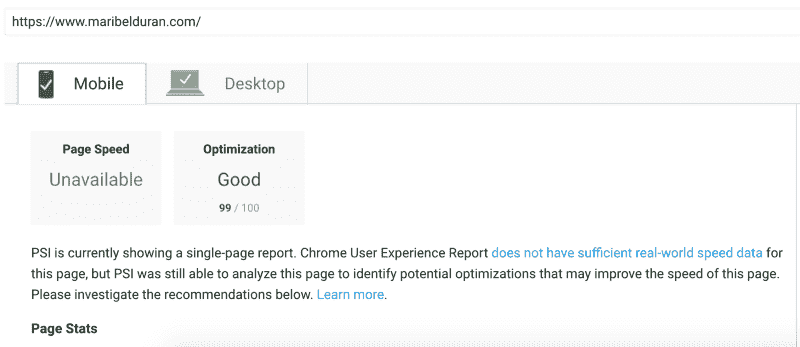
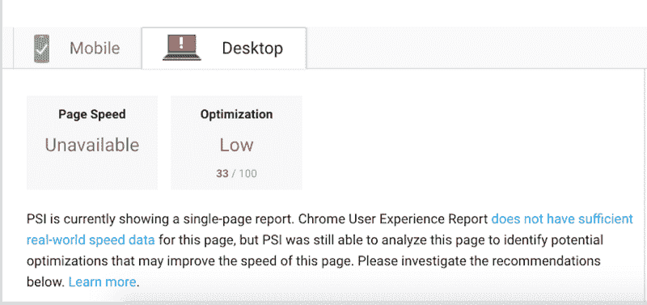
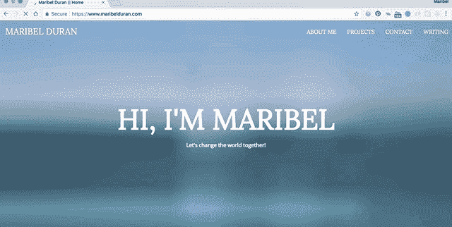

# 我如何用盖茨比让我的投资组合网站飞速发展

> 原文：<https://www.freecodecamp.org/news/how-i-made-my-portfolio-website-blazing-fast-with-gatsby-82ccddc2f671/>

如果您正在考虑用 React 构建一个静态站点，并希望它像猎豹一样快，那么您应该考虑使用 GatsbyJS。

我决定尝试一下，并惊讶于它的设置、部署是如此简单，以及网站现在的加载速度。Gatsby 使用其他前端工具的最佳部分，让开发体验感觉像是在度假。



After rebuilding my website with Gatsby and React ?

### **原始网站的性能问题**

我一直想优化我的作品集网站上的图片，这是我的第一个 freeCodeCamp 前端开发项目之一。



Before the help of Gatsby -_-

哎哟！一个 33/100 的谷歌优化分数看起来很痛苦。是的，我需要一些优化神的帮助。我的网站包含至少 17 个项目截图。我不想压缩每张图片，为每张图片生成多种尺寸和分辨率，并延迟加载它们。

当我第一次创建这个网站时，Bootstrap 3 `img-responsive`类负责缩放图像以适应不同的屏幕尺寸，但我没有想到它仍然在加载我在移动设备上的一些 1400 x 860 像素的截图！

我的分数也很低，因为我没有缩小我的 CSS 或设置浏览器缓存，也没有异步加载外部 CSS 资源。

### **盖茨比前来救援**

我真的想用 React 重建这个项目。我本来可以使用 [create-react-app](https://reactjs.org/docs/create-a-new-react-app.html) ，它提供了一个开箱即用的构建脚本和开发服务器，但这仍然没有解决必须为我的所有图像裁剪不同图像大小的长期任务。

幸运的是我正在听 [Syntax 的](https://syntax.fm/)、[的《为什么静态站点生成器很棒》第一集](https://syntax.fm/show/034/why-static-site-generators-are-awesome)，他们谈到了 StaticGen.com 列表上[的几个静态站点生成器。如果您还没有听说过静态站点生成器是做什么的，它们会将您的站点转换成一个包含单个 HTML 文件和静态资产的目录。不需要数据库或服务器代码。](https://www.staticgen.com/)

Gatsby 赢得了我，因为它与 create-react-app 有相似之处，包括热重装、简单的开发环境设置和构建脚本。Gatsby 通过提供服务器端渲染、智能图像加载和对性能的专注而更进一步。

由于 Gatsby 是建立在 React、GraphQL 和 Webpack 栈之上的，我们可以将我们的内容写成 React 组件！赢了！Gatsby 负责在构建时将 DOM 呈现为静态 HTML、CSS 和 JavaScript。

### 盖茨比形象的组成部分是 BAE

现在我想和你分享的是。盖茨比-形象！Gatsby-image ，是一个 React 组件，旨在与 Gatsby 的 GraphQL 查询一起工作，以完全优化网站的图像加载。

方法是使用 GraphQL 查询获得最佳大小的图像，然后用 gatsby-image 组件显示它们。

我如何使用这个组件为我的 17 个项目图像中的每一个自动创建 3 个缩略图？神奇！不是真的，但是感觉很像！

在我的 src/pages/index.js 文件中，我查询了所有的项目图像，并给它一个别名 ****ProjectImgs。**** 由于现在可以通过作为道具的数据对象访问查询的数据，所以我可以将 ****项目数据**** 数据(这是我的项目图像的节点列表)传递给我的`<Projects />`组件:

```
//imports
const HomePage = ({ data }) => {
  const siteTitle = data.site.siteMetadata.title;
  console.log(data.ProjectImgs); 
  const { edges: projectImgData } = data.ProjectImgs;
  const { edges: iconImgData } = data.iconImgs;
  return (
    <div>
     <Helmet
      title={siteTitle}
      link={[{ rel: "icon", type: "image/png", href: `${favicon}`}]}
     />
     <Cover coverImg={data.coverImg} />
     <div className="container-fluid main">
      <Navigation />
      <AboutMe profileImg={data.profileImg} iconImgs={iconImgData} 
      />                
     <Projects projectImgs={projectImgData} />
     <Contacts />
     <Footer />
     </div>
    </div>
  );
};
export const query = graphql`
  query allImgsQuery {
    //additional queries
    ...
    ProjectImgs: allFile(
      sort: { order: ASC, fields: [absolutePath] }
      filter: { relativePath: { regex: "/projects/.*.png/" } }
    ) {
      edges {
        node {
          relativePath
          name
          childImageSharp {
            sizes(maxWidth: 320) {
              ...GatsbyImageSharpSizes
            }
          }
        }
      }
    }
//additional queries
...
  }
`;
```

> 注意:我在让我的 graphQL 查询工作时遇到了一些麻烦，不得不做一些挖掘工作来弄清楚如何在一个文件夹中查询多个图像。对我有帮助的是查看其他与盖茨比一起制作的作品集网站。

使用控制台，我们可以看到`data.ProjectImgs`返回了什么，让您更好地了解我从查询中收到了什么，以及我将什么传递给了我的项目组件:

`Console.log(data.ProjectImgs)`返回边的数组:

```
{edges: Array(17)}
edges
:
(17) [{…}, {…}, {…}, {…}, {…}, {…}, {…}, {…}, {…}, {…}, {…}, {…}, {…}, {…}, {…}, {…}, {…}]
__proto__
:
Object{edges: Array(17)}
```

扩展其中一条边会显示一个包含 ****childImageSharp**** 属性的节点对象。它包含一个保存图像缩略图源的大小对象。这个 sizes 对象是我们最终想要传递给 gatsby-image 的``组件的对象。

扩展边以显示节点中的信息:

```
{edges: Array(17)}
 edges: Array(17)
 0:
  node:
   childImageSharp: {sizes: {…}}
   name: "CamperLeaderboard"
   relativePath:"projects/CamperLeaderboard.png"
   __proto__:Object
   __proto__:Object
 1:{node: {…}}
//more nodes
...
```

在我的`<Projects />`组件中，我接收项目图像的节点列表作为道具，对于每个项目，我提取****childimagesharp . size****对象(该对象被重命名为****imagesize****)，并将其传递到 gatsby-image 的``组件中:

```
import React, { Component } from "react";
import Img from "gatsby-image";
//more imports
...
class Projects extends Component {
  constructor(props) {
    super(props);
  this.state = {
      selectedType: "front-end"
   };
  this.onSelectChange = this.onSelectChange.bind(this);
  }

  onSelectChange(e) {
    this.setState({ selectedType: e.target.value });
 }
render() {
    const projectImgs = this.props.projectImgs;
    const { selectedType } = this.state;
    return (
      <section id="projects" className="section projects">
        <h2 className="text-center">PROJECTS</h2>
        <div className="section-content">
          <div className="subheader">
            <FormGroup controlId="formControlsSelect">
             ...
            </FormGroup>
          </div>
          <div className="project-list">
            {projectList.map(project => {
              const isSelectedType = selectedType === project.type;
              const singleCardClass = classNames("single-card", {
                hide: !isSelectedType
               });
              const image = projectImgs.find(n => {
                return n.node.relativePath === 
                       `projects/${project.img}`;       
              });
              const imageSizes = image.node.childImageSharp.sizes;
              return (
                <a
                  href={project.url}
                  key={project.url}
                  className={singleCardClass}
                  target="_blank"
                >
                  <div className="card-img">
                    
                  </div>
                  <div className="blue-divider" />
                  <div className="card-info">
                    <h4 className="card-name">{project.name}</h4>
                    <p>{project.description}</p>
                  </div>
                </a>
              );
            })}
          </div>
        </div>
      </section>
    );
  }
}
export default Projects;
```

这是最终的结果:



Example of lazy loading and blur effect using gatsby-image in a slow 3G network

就是这样！组件负责使用正确的图像尺寸，创建模糊效果，并延迟加载我的项目图像，因为它们位于屏幕的下方。上面的查询比查询单个图像要复杂一些。

如果您不熟悉 GraphQL，下面的一些资源可以更好地解释如何使用 GraphQL 查询和 gatsby-image 组件:

*   [在《盖茨比》中处理图像](https://www.gatsbyjs.org/docs/working-with-images/)
*   [盖茨比形象](https://www.gatsbyjs.org/packages/gatsby-image/)
*   [Gatsby . js 简化图像优化](https://medium.com/@kyle.robert.gill/ridiculously-easy-image-optimization-with-gatsby-js-59d48e15db6e)

### **托管 Netlify 轻而易举**

由于 Gatsby 生成静态文件，所以您几乎可以使用任何宿主提供程序。我决定将我的托管服务提供商从 Github Pages 改为 Netlify。我听说在 Netlify 部署一个网站有多容易，他们没有说谎。他们的自由层提供了令人敬畏的功能，使得部署过程和网站安全变得轻而易举。它提供了一键式 HTTPS，全球 CDN，连续部署，等等。

设置过程非常简单。我登录 Netlify，点击仪表板上的“New site from Git”按钮，为这个项目选择了 Git 存储库。我将站点配置为从主站点部署，然后单击“部署站点”。就是这样！Netlify 负责构建过程并将其发布到 web 上。

正如我提到的，Netlify 提供了连续部署，所以现在每当我在 GitHub 上将更改推送到我的主分支时，就会自动在 Netlify 上触发新的构建。一旦构建完成，我的更改将在网上发布。


Deployment setting is set to auto publishing

### **前途一片光明**

通过与 Gatsby 一起重建我的网站，我不仅了解了未来项目的不同图像优化技术，还了解了一点 GraphQL，练习了我的 React 技能，并借此机会尝试了一个新的托管提供商。

我真的对 Gatsby 和类似前端工具的未来感到兴奋，它们消除了配置环境和构建工具的复杂性。相反，我们可以将精力和时间集中在代码上，为我们的用户构建令人惊叹的东西。

> 如果你喜欢这篇文章，请点击？所以其他人会在这里看到它。
> 
> 让我们在[推特](https://twitter.com/maribeldotduran)上做朋友吧。快乐编码:)