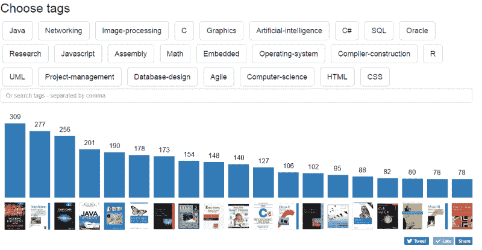
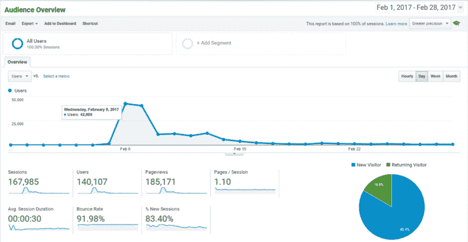
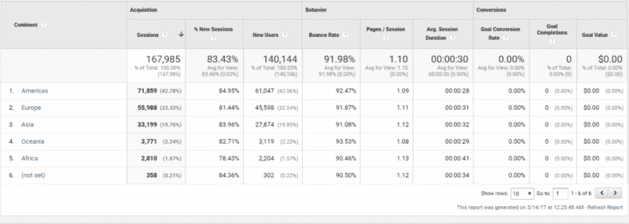
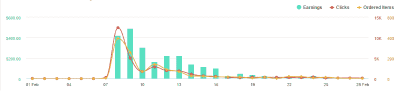
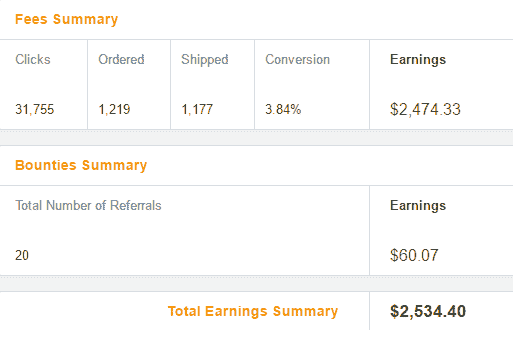

# 我的副业如何满足了我的好奇心，并让我赚了 3000 美元

> 原文：<https://www.freecodecamp.org/news/how-i-made-profit-on-publishing-most-mentioned-books-on-stackoverflow-2914d576e51f/>

弗拉德·韦策尔

# 我的副业如何满足了我的好奇心，并让我赚了 3000 美元

我很好奇 Stack Overflow 上最常推荐什么书。所以我分析了一个数据库转储，统计了提及次数，然后建立了一个网站来探索这些数据。(你可以点击阅读整个过程的详细步骤[。)](https://medium.freecodecamp.com/i-analyzed-every-book-ever-mentioned-on-stack-overflow-here-are-the-most-popular-ones-eee0891f1786#.f3zmngrka)

2 月 1 日，我推出了 dev-books.com。在接下来的几天里，该网站的访问量超过了 10 万次。

A screenshot from [Dev-Books.com](http://Dev-Books.com)

许多访问者与我联系，询问我从这个项目中获得的利润。因此，正如我所承诺的，我将发布这份来自谷歌分析和亚马逊的完整报告，以及我的故事。:)

### 这个网站如何赚钱

对于这个项目，我选择了亚马逊联盟计划，因为亚马逊是我所知道的最大的书店。帐户注册非常简单，所以不到一个小时我就收到了我的会员标签，可以在我网站的链接中使用。

### 冷启动

一切就绪并运行后，我在[黑客新闻](https://news.ycombinator.com/)和 [Reddit](http://www.reddit.com) 上发布了[dev-books.com](http://www.dev-books.com)的链接，试图吸引一些开发者关注我的项目。

不幸的是，它没有带来我所希望的广泛的观众。但我开始得到一些反馈，修复了一些 bug，并获得了如何推广我的项目的建议。

一天结束的时候，我收到了来自自由代码营老师 T2 昆西·拉森的消息，建议我写一篇关于我的项目和我是如何建立它的故事，让人们更容易理解它。

### 突破

阅读昆西·拉森的这篇文章，我发现了一个制作标题的非常有用的工具，叫做[标题分析器](https://coschedule.com/headline-analyzer)。我尝试了我的文章标题，得到了相当低的评分，所以我开始做一个更好的标题来转贴我的网站。

很快我得了 65 分，并在黑客新闻和 Reddit 上发布了新的标题。

根据谷歌分析，这一次，我在黑客新闻上的帖子排在最前面，连续几个小时有超过 750 个并发访问者。话虽如此，我可能由于我的 web 服务器故障而失去了一些观众(我也在这里写了关于[的内容](https://medium.freecodecamp.com/i-analyzed-every-book-ever-mentioned-on-stack-overflow-here-are-the-most-popular-ones-eee0891f1786#.uko51rk42))。

第二天，我发现[dev-books.com](http://www.dev-books.com)在脸书(你可以在这里看到)上有 5000 多股，被发布到 [lifehacker](http://www.lifehacker.com) ，以及被翻译和发布到世界各地的许多其他资源。

Google Analytics audience overview for February 2017,

### 地理定位

第二天，我从 Google Analytics 创建了一份地理定位报告，发现我收到了相当多来自亚洲和欧洲的流量——尤其是俄罗斯。

让我的亚洲和欧洲访客等待我们的订单是不礼貌的，所以我在 amazon.fr、亚马逊和亚马逊网站创建了会员账户

当然，因为这个问题，我已经失去了一些订单。

同一天晚上，我的访客开始获得他们最近的商店的链接。

### 最有趣的部分

在下面的图片中，您可以看到 Amazon.com 2017 年 2 月的统计数据。从亚马逊的欧洲集群中，我总共得到了 250 多美元。如果我从一开始就做基于地理位置的链接，会有更多吗？毫无疑问。

$490 on February 9th

这是我二月份的最终收入:2534.40 美元。

Summary for February 2017

我对这个结果满意吗？绝对的。

Dev-books.com 仍在运营，并不断带来一些订单，所以在我推出它的一个半月里，它已经赚了 3000 多美元。

你如何评价我的结果？还能高很多吗？我很乐意在下面的评论中，在 [Twitter](https://twitter.com/VLPLabs) 或[脸书](https://www.facebook.com/VLP-Labs-727090070789985/)上得到你的反馈/建议/故事。