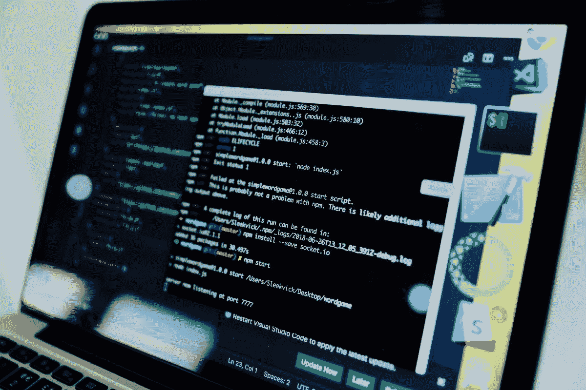
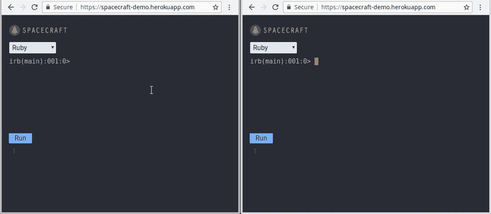

# 我是如何找到工作并得到我梦想中的工作的

> 原文：<https://www.freecodecamp.org/news/how-i-navigated-the-job-hunt-and-landed-my-dream-job-b37bf3d0d630/>

朱利叶斯·泽威克

Photo by [Emiliano Bar](https://unsplash.com/photos/kheTI8pIywU?utm_source=unsplash&utm_medium=referral&utm_content=creditCopyText) on [Unsplash](https://unsplash.com/search/photos/new-york-city?utm_source=unsplash&utm_medium=referral&utm_content=creditCopyText)

这篇文章是关于我如何在纽约寻找一份全职软件工程师的工作，并最终得到了我梦想中的工作。我花了两年时间来培养自己的技能，并渴望在一家工程卓越性要求很高的顶级科技公司工作。

我知道这个目标不容易实现，尤其是没有计算机科学学位，在纽约市几乎没有任何关系网，还要与顶尖学校的工程师竞争。这是一个漫长的过程，我已经做好了长期的准备。

****9 周后……****

我欣喜若狂地宣布，我已经接受了 DigitalOcean 的邀请，在他们的纽约总部担任软件工程师 II。

这一成功是在无数的学习会议、模拟面试、数小时的练习以及面对无数的挑战和拒绝之后取得的。但我保持着高昂的情绪，从另一端出来时比我想象的还要开心。

****你从开始到结束是怎么走的？****

那个问题就是这篇文章要讲的！我将详细介绍我的面试准备过程，我如何建立自己的人际网络，以及在求职过程中如何管理自己。

也就是说，每个人的经历都是不同的，应该从这篇文章中找到他们认为对自己有益的东西。没有两次求职是相同的，每一次都有不同的因素。

说到这里，让我们开始吧！

### **首先要做的事情:建立一个坚实的基础**

Photo by [NESA by Makers](https://unsplash.com/photos/vII7qKAk-9A?utm_source=unsplash&utm_medium=referral&utm_content=creditCopyText) on [Unsplash](https://unsplash.com/search/photos/software-development?utm_source=unsplash&utm_medium=referral&utm_content=creditCopyText)

最重要的是，你有一个坚实的软件工程基础。与其追逐最热门的技术，重要的是拥有快速深入学习新事物所需的技术基础。

在我看来，最好的方法是选择一种经过行业验证的语言，并在学习变量、函数、工具、软件设计、数据库、API 和构建 web 应用程序时坚持使用它。这让我专注于我的知识深度、解决编码挑战的熟练程度以及构建高质量项目的经验。

为了建立我的基础，我选择在 [Launch School](https://launchschool.com/) 学习，该学校提供广泛的课程和严格的评估流程，确保我在进步之前已经深入学习了基础知识。

### 打造一个给雇主和工程师留下深刻印象的项目

SpaceCraft demo

如今，有许多训练营和在线教程为有抱负的软件开发人员提供项目，帮助他们找到工作。

然而，现在开发简单的 CRUD 应用程序或 Instagram、网飞、Reddit 等热门应用程序的克隆版的开发者市场已经饱和。这些项目不再像过去那样给雇主或其他工程师留下深刻印象。

也就是说，许多工程师在给你推荐人之前需要某种方式来评估你，没有什么可以替代用一个可靠的项目来展示你的技能。

这就是为什么[古伊](https://gooi.tech/)、[尼克](https://njohnson7.github.io/)和我建造了[飞船](https://spacecraft-repl.com/)，一个实时协作的 REPL，允许开发者在浏览器中为 Ruby、JavaScript 和 Python 编写和执行代码。

这是一次不可思议的经历，也是一大堆工作。你可以在这篇[文章](https://hackernoon.com/building-spacecraft-a-real-time-collaborative-repl-deebcf084ed9)中阅读更多关于我们如何建造航天器的信息，或者阅读我们的[案例研究](https://spacecraft-repl.com/whitepaper)。

我们花了数百个小时研究如何构建 REPL，实现实时协作，使用 Docker 创建独立的用户会话，以及使用代理服务器处理用户请求。

### 有效地推销自己

[https://livestream.com/accounts/686369/events/8535115/player?width=640&height=360&autoPlay=true&mute=false](https://livestream.com/accounts/686369/events/8535115/player?width=640&height=360&autoPlay=true&mute=false)

虽然宇宙飞船可以展示我们的技能，但我仍然需要让人们来看看它。自从我为了找工作搬到纽约后，我的职业关系网几乎为零，我尽最大努力让自己面对尽可能多的工程师。

这就是为什么我们的团队写了我们的案例研究，一篇关于 HackerNoon 的文章，并在 Meetups 上展示。这些努力帮助我们在众多申请者中脱颖而出，并引起了雇主和工程师的兴趣。

在 Meetups 上展示对我来说是一个游戏改变者，因为他们在那里得到了我的名字，并获得了几家公司的推荐，同时给了我练习和完善沟通技巧的机会。

我还建了一个[个人网站](https://rouxcaesar.github.io/)，并扩充了我的[LinkedIn](https://www.linkedin.com/in/julius-zerwick-842000b2/)&[AngelList](https://angel.co/julius-zerwick?al_content=view+your+profile&al_source=transaction_feed%2Fnetwork_sidebar)个人资料，以便未来的公司更容易找到我并看到我的工作。

花时间通过写文章、出席活动和专业社交网站来推销你自己和你的技能，可以在面试过程中获得巨大的回报。

在看到我更新的个人资料和听我演讲后，联系我的工程师和公司数量大幅增加，在我的外联电子邮件中添加我的演讲视频导致了更高的回复率和更多的面试。

### 联系工程师和公司

同样，我也确保始终联系我感兴趣的公司的工程师。使用 LinkedIn Connect 请求，我与来自 DigitalOcean、蟑螂实验室、Oscar Health、DataDog、Peloton 等公司的工程师举行了十多次咖啡会议。这些会议帮助我了解了纽约的就业市场，听取了内部人士对公司文化和团队的看法，并获得了推荐。

我的建议是随意参加这些会议，对你的同事工程师的工作、职业和公司感兴趣。不要一开始就要求引荐，很多时候，如果你很友好，谈话进展顺利，他们会主动推荐你。

我做的另一种拓展形式是更直接地给工程师发电子邮件。每当我找到一份我真正喜欢的工作，我会通过 LinkedIn Inmail 联系在该公司工作的工程师，需要时使用 [Clearbit Connect](https://chrome.google.com/webstore/detail/clearbit-connect-supercha/pmnhcgfcafcnkbengdcanjablaabjplo?hl=en) 查找联系信息。

在邮件中，我会介绍我的背景、我印象最深刻的项目、我的一个演讲的链接，并询问他们是否愿意就这个职位进行交流。

这种形式的外联使我的回复率比任何其他渠道都高，我所有的邮件中有近 1/3 得到了回复。记住，找工作完全是一场数字游戏，最好尝试各种形式的拓展，看看哪种方式能给你带来最高的回报。

### 学习，练习，重复

Photo by [Kaleidico](https://unsplash.com/photos/3V8xo5Gbusk?utm_source=unsplash&utm_medium=referral&utm_content=creditCopyText) on [Unsplash](https://unsplash.com/search/photos/whiteboard?utm_source=unsplash&utm_medium=referral&utm_content=creditCopyText)

也就是说，如果我没有在技术面试中取得成功的技能，这些努力都不会有任何结果。有了坚实的基础，我需要花时间解决编码挑战，研究与职位相关的话题。

你在面试中可能面临的问题和挑战种类繁多，很多时候你不知道会发生什么。许多顶级公司将专注于算法和数据结构，而初创公司和中型公司可能专注于更“实际”的问题，如重构现有的类或向基本项目添加功能。

我的建议是研究各种各样的编码挑战，尽最大努力预测他们会问你的问题。对于算法和数据结构，我建立基础和概念理解的主要资源是:

*   数据结构和算法的常识指南
*   [破解编码面试](https://www.amazon.com/Cracking-Coding-Interview-Programming-Questions/dp/0984782850/ref=sr_1_1?crid=3B576YLQLTSY8&keywords=cracking+the+coding+interview&qid=1553352055&s=gateway&sprefix=cracking%2Caps%2C285&sr=8-1)
*   碱基

我还在每周 5-6 天的时间里每天解决 2-3 个问题。

很多公司还会有一个系统设计面试，评估你的水平。如果你的目标是中高级职位，你需要在这方面投入更多的时间。

我发现最好的资源是[钻研系统设计面试](https://www.educative.io/collection/5668639101419520/5649050225344512?authorName=Design%20Gurus)和阅读各种特定主题的博客。以下是我推荐的几个博客:

*   [所有分发的东西](https://www.allthingsdistributed.com/2018/06/purpose-built-databases-in-aws.html)
*   [高可扩展性](http://highscalability.com/)
*   [盖恩洛](http://blog.gainlo.co/index.php/2017/03/24/chapter-5-system-design-interviews-part-complete-guide-google-interview-preparation/)
*   [碱基](https://medium.com/baseds)

另一个非常常见的步骤是完成带回家挑战。这些挑战多种多样，让人很难做好准备，但还是有一些共同的话题。我看到的几个是:

*   构建一个 RESTful API 来处理几个提供的 cURL 请求
*   构建一个 CLI 应用程序，存储输入(如专辑、艺术家和发行年份)并允许用户检索它们
*   使用 React/Rails 构建一个游戏(例如:井字游戏、二十一点、扫雷)
*   给定成品的规格和示例，创建一个尽可能接近完美像素的网页。

好处是你有更多的时间在自己家里舒适地完成它们，并且有很多机会通过编写一个全面的测试套件、识别和解决边缘案例以及寻找额外的润色来留下深刻印象。

在找工作的过程中，我通常会在周一至周四向公司申请，拓展业务，解决 LeetCode 挑战或研究系统设计。我预约了周五到周六来练习构建一个带回家的项目。以下是一些需要考虑的问题:

*   [https://x-team . com/blog/how-to-create-a-ruby-API-with-Sinatra/](https://x-team.com/blog/how-to-create-a-ruby-api-with-sinatra/)
*   [https://www.discoverdev.io/blog/series/js30/](https://www.discoverdev.io/blog/series/js30/)
*   [https://daveceddia.com/react-practice-projects/](https://daveceddia.com/react-practice-projects/)
*   [https://medium . freecodecamp . org/how-to-build-a-react-js-chat-app-in-10-minutes-c 9233794642 b](https://medium.freecodecamp.org/how-to-build-a-react-js-chat-app-in-10-minutes-c9233794642b)
*   [https://code burst . io/writing-a-crud-app-with-node-js-and-MongoDB-e 0827 cbbdafb](https://codeburst.io/writing-a-crud-app-with-node-js-and-mongodb-e0827cbbdafb)
*   [https://code burst . io/learning-react-js-by-building-a-mine sweeper-game-ced9d 41560 ed](https://codeburst.io/learning-react-js-by-building-a-minesweeper-game-ced9d41560ed)
*   [https://github.com/karan/Projects](https://github.com/karan/Projects)

为了准备现场编码挑战，我每周使用 [Pramp](https://www.pramp.com/#/) 进行 3-4 次模拟面试，这极大地提高了我的表现。

我以前在[为什么你需要一个面试脚本](https://medium.com/launch-school/why-you-need-an-interview-script-b86e18d0200a)中写过这个话题，但本质上，当处于压力下时，我们的心理能力会因为被评估的感觉而受到影响。解决这个问题的最好方法是进行模拟面试，重现这种经历，直到我们适应为止。有一个解决问题的过程也确实帮助了我，我发现最好的一个是 [PEDAC](https://medium.com/launch-school/solving-coding-problems-with-pedac-29141331f93f) 。

### 知道你在一个角色和公司里想要什么

Photo by [Thom Holmes](https://unsplash.com/photos/k-xKzowQRn8?utm_source=unsplash&utm_medium=referral&utm_content=creditCopyText) on [Unsplash](https://unsplash.com/search/photos/journal?utm_source=unsplash&utm_medium=referral&utm_content=creditCopyText)

综上所述，花点时间仔细考虑你到底在看什么是很重要的。在后端、前端或全栈位置之间，您有强烈的偏好吗？你想加入多大的公司？你对哪些行业感兴趣？还有你想往哪个方向发展事业？

你对这些问题的回答会对你选择面试的公司产生巨大的影响。作为软件开发人员，我们很幸运不缺少工作和公司招聘，但记住以下几点很重要:

1.  有各种各样的角色和工作领域可供选择，您应该考虑您希望专攻软件开发的哪些领域。
2.  你应该试着找一个你乐意工作几年的职位和公司。我个人的观点是，作为一名工程师，建立你的经验、信誉和专业网络很重要，最好在每个职位上至少工作 1-2 年，而不是每 6 个月-1 年跳槽一次。
3.  就像软件行业有很多好工作一样，也有很多你想避免的坏工作。不是每份工作都会让你在成熟、有经验的团队中工作，构建雄心勃勃、富有挑战性的项目。有些工作你可以日复一日地主要处理单调乏味的任务，清理遗留代码，或者简单地处理次要的 UI 组件。

所以花点时间想想你想要什么，列出你在理想工作中寻找的东西。对我自己来说，我想要一个主要关注后端开发的角色，有机会:

*   学一门像 Go 这样的编译语言。
*   致力于分布式系统和微服务。
*   加入经验丰富的工程师团队进行学习。
*   有能力不时远程工作。
*   在重视多元化和包容性的公司工作。
*   对继续教育有好处。

我积极地寻找能提供大部分机会的公司，没有花时间去申请那些不能提供的公司。虽然不是每家公司都有我想要的一切，但我知道我会对最终结果感到满意，而不是到处申请。

一个附带的好处是，通过瞄准我下一个角色的细节，我能够将我的研究集中在相关的主题上，这使我能够在每次面试中都有所提高，我觉得这给了我在数字海洋获得职位所需的优势。

### 管理面试周期

Photo by [Tim Gouw](https://unsplash.com/photos/bwki71ap-y8?utm_source=unsplash&utm_medium=referral&utm_content=creditCopyText) on [Unsplash](https://unsplash.com/search/photos/job?utm_source=unsplash&utm_medium=referral&utm_content=creditCopyText)

软件开发的面试过程是非常累人的，而且精疲力竭的可能性非常高。通常，该流程可能包含 3-5 个步骤，甚至更多，如下所示:

*   与人力资源或招聘人员的初步电话筛选
*   打电话给公司工程师或招聘经理
*   公司工程师的现场代码挑战
*   将项目带回家
*   在公司现场
*   潜在要约延长

累死人了，对吧？每个公司都是不同的，有些公司在现场之前只有 1-2 次面试，有些公司则需要几个月！

在找工作的过程中，我经历了一个周而复始的循环。首先，我会有多家公司的初步电话筛选。这将导致代码挑战、带回家的项目或技术电话屏幕。在几个这样的步骤和机会被过滤掉之后，任何在线站点都会在同一周或两周内聚集起来。

由于我在这个过程中走得越远，这些阶段的强度就越大，由于学习的增加，我有更少的时间来申请新的申请，最终我在我的网站上全职学习，而没有发送新的申请。如果没有合适的工作机会，那么我会重新开始新的申请，这个循环会重新开始。

在经历这个周期时，这里有一些提示:

*   尝试在整个周期中保持应用程序的高活动。为了让你的面试漏斗充满新的机会，坚持申请和拓展是很重要的。
*   有一个应用程序和外联的日常目标要完成。我周一至周四的每日目标是提交至少 5 份申请(通常附有求职信)，并与 5 名工程师喝咖啡或询问空缺职位。
*   批判性地思考每一次面试中会发生什么。你可能会在最初的电话屏幕上了解到一些关于面试过程的细节，但是为了做好准备，一定要询问更多的信息。
*   如果你和 CTO 通电话，要知道他们会问你一些关于简历的技术问题和行为问题。
*   不要把时间安排在连续几天。它们是迄今为止最累人的步骤，需要更多的准备。在工作间隙，至少要给自己一天的休息时间来充电、复习题目和做好心理准备。

### 在整个过程中避免精疲力竭

在这一点上，我想强调在求职过程中避免精疲力竭的重要性。由于要完成的面试数量庞大以及相关的压力，有时很容易让人感到力不从心。

不要过度劳累，除了面试之外，每天学习和编码 6 个多小时，每周抽出时间断开连接，重新充电。这将有助于你在后期面试中保持精力和注意力。

我每天最多学习 4 个小时，并优先考虑深度工作，如加州纽波特的[深度工作](https://www.amazon.com/Deep-Work-Focused-Success-Distracted/dp/1455586692)中所述，即你在一段时间内高度专注于一项比你习惯的更困难的任务，而不受任何干扰。

这意味着解决算法问题或实践比我已经完成的更难的项目。这确保了我不断提高自己的技能，同时也确定了我在哪些方面还需要努力和学习。

不管我一周有多忙，我总会抽出至少一天时间放松一下，为即将到来的面试充电。

### **最终……**

我对我找工作的结果非常满意，觉得我上面详述的方法对我很有效。对于那些正在找工作的人，我希望这篇文章能对你有所帮助。我也推荐阅读下面这篇文章，我发现它对我找工作很有帮助:

得到我梦寐以求的软件工程工作需要什么——孙李

祝所有找工作的人好运，保持下去！

请在评论里告诉我你的想法！我很想听到更多关于你的求职经历和对你有用的东西。