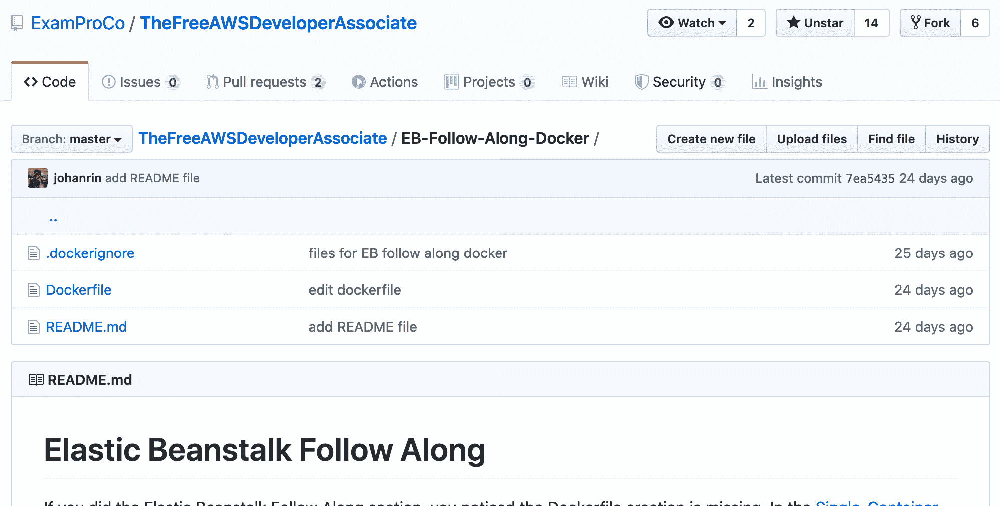
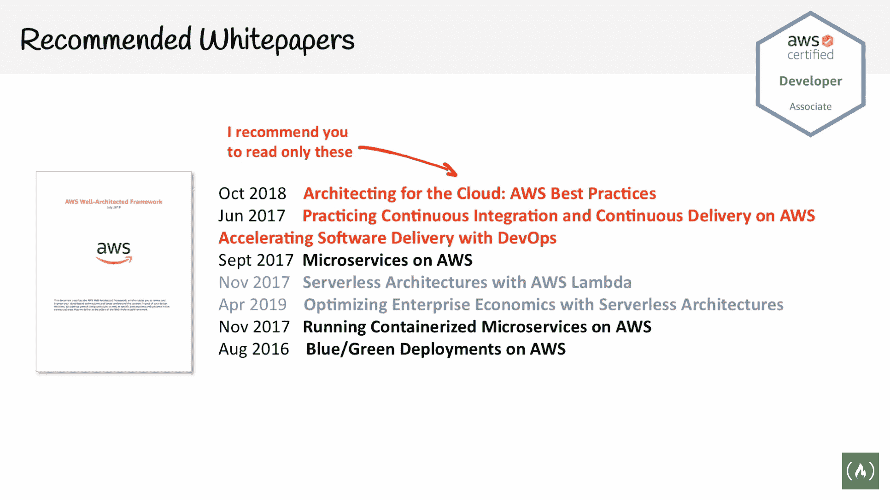
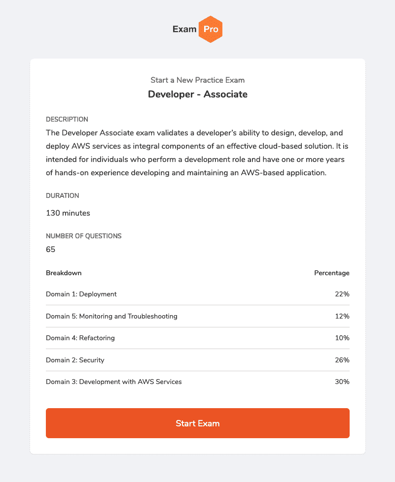
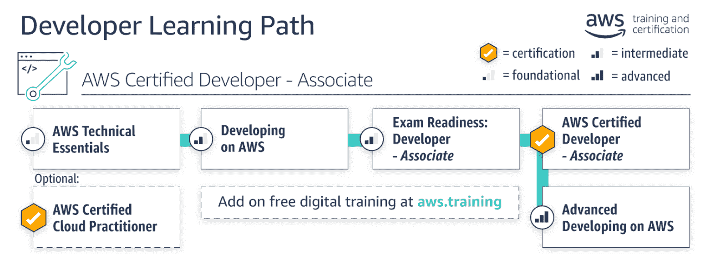
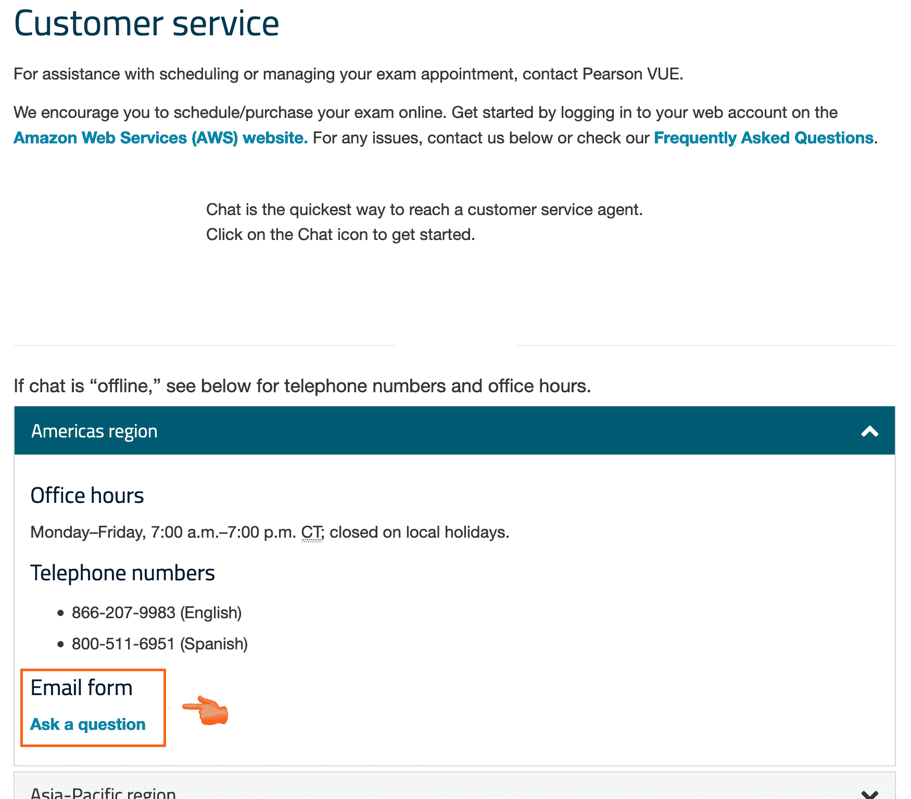

# 我如何通过 AWS 认证开发人员助理考试

> 原文：<https://www.freecodecamp.org/news/how-i-passed-the-aws-certified-developer-associate-exam/>

freeCodeCamp 在今年年初开始了#AWSCertified challenge。你可以通过完全免费的课程获得 AWS 认证。

是的，你没看错。免费课程。

AWS 提供 12 种认证。今天，freeCodeCamp 的 YouTube 频道上提供了 3 门课程:

1.  [AWS 认证云从业者](https://www.freecodecamp.org/news/aws-certified-cloud-practitioner-training-2019-free-video-course/)
2.  [AWS 认证解决方案架构师助理](https://www.freecodecamp.org/news/pass-the-aws-certified-solutions-architect-exam-with-this-free-10-hour-course/)
3.  [AWS 认证开发人员助理](https://www.freecodecamp.org/news/pass-the-aws-developer-associate-exam-with-this-free-16-hour-course/)

在本帖中，我将向您展示如何成功通过 AWS 认证开发人员助理考试。

我们开始吧。

## 建立一个学习程序

我们在日常生活中都很忙。总是有事情要做，但时间总是不够。准备 AWS 认证开发人员助理需要时间和投入。

根据安德鲁·布朗的说法，通过这项考试需要 2 个月的学习时间。与 AWS 认证云从业者或 AWS 认证解决方案架构师助理证书相反，您需要亲自动手理解课程中讨论的所有概念。

我花了 20 天的时间完成备考，但这不是重点。重要的是你每天对学习的承诺。

我一步一步地前进。从星期一到星期六。每天，我花 4 到 5 个小时来完成这项任务。当然，你可以花更少的时间。最重要的是找到最适合自己的，规律工作。

我的准备分为 4 步:

1.  一边记笔记，一边观看课程的 2 或 3 个部分
2.  深入探究我不理解的事情
3.  阅读 AWS 白皮书
4.  参加模拟考试

我使用了安德鲁·布朗开发的免费 ExamPro AWS 认证课程。这是一个 16 小时的课程，发布在 YouTube 上，帮助您了解 AWS 并练习跟随部分。安德鲁·布朗做了大量的工作。他的解释非常清楚，而且直截了当。

有时你会因为不理解某些事情而感到沮丧。我记得整个下午都被第一个跟随者卡住了。我甚至想过跳过它，因为它太让人泄气了。

第二天，睡了一夜好觉后，我花了一整天调试代码。我甚至提交了一个 pull 请求来帮助别人。解决这个问题帮助我深入了解我不了解的事情，并激励我写其他 AWS 故事来巩固我的知识。

[https://github.com/ExamProCo/TheFreeAWSDeveloperAssociate/tree/master/EB-Follow-Along-Docker](https://github.com/ExamProCo/TheFreeAWSDeveloperAssociate/tree/master/EB-Follow-Along-Docker)

完成课程后，你可能会觉得有必要补充你所学的内容。你可以阅读安德鲁·布朗推荐的 AWS 白皮书。

Recommended AWS whitepapers

以我为例，我读了以下几条:

*   在 AWS 上实践持续集成和持续交付:用 DevOps 加速软件交付
*   AWS 上的微服务
*   云架构:AWS 最佳实践

这是我第一次阅读 AWS 白皮书。我必须承认我很惊喜！它对我理解我所缺少的东西帮助很大，并给了我报名考试的信心。

如果你对如何安排在线考试感到好奇，你可以看看玛西娅·维拉巴的 YouTube 视频。她解释了你需要知道的一切，以避免给自己太多压力。

[https://www.youtube.com/embed/oWnSjh_Zb4w?feature=oembed](https://www.youtube.com/embed/oWnSjh_Zb4w?feature=oembed)

值得一提的是:当你通过一门考试时，AWS 为你预订下一门考试提供 50%的折扣！

在你考试的前几天，我强烈建议你用模拟考试来训练。你可以很容易地在网上找到它们。Andrew Brown 给了我 ExamPro 的访问权限，让我参加了[开发人员助理实践考试](https://www.exampro.co/aws-exam-developer-associate)。

ExamPro Developer Associate Practice Exam

模拟考试很有挑战性。离真正的考试很近。你有两个小时来回答 65 个问题，时间不多了。提交模拟考试后，将显示您的分数。最重要的是，你可以回顾自己的错误答案，阅读解释，了解自己为什么会犯这些错误。

如果您没有通过模拟考试，请确保在参加相同的模拟考试之前先复习您的问题/答案。会提高你对真正考试的信心。

我能够通过 AWS 认证开发人员助理考试。在此之前，我通过了 AWS 认证云从业者和 AWS 认证解决方案架构师助理的相同准备。

所有这些都需要时间、耐心和奉献。我不特别，你也可以。一开始并不容易，但值得去做。

## 课程是不够的

如果你认为 16 个小时的课程足以让你通过，那你就错了。如果你打算只学完这门课就安排考试，你肯定会错过很多问题。

别担心，Andrew Brown 在 AWS 认证解决方案架构师助理课程中讲述了其中的大部分主题。

下面是一个不完整的列表，可以帮助你完成考试:

*   [亚马逊机器映像(AMI)](https://www.youtube.com/watch?v=Ia-UEYYR44s&t=14860s)
*   [弹性文件系统(EFS)](https://www.youtube.com/watch?v=Ia-UEYYR44s&t=20360s)
*   [弹性块存储(EBS)](https://www.youtube.com/watch?v=Ia-UEYYR44s&t=21037s)
*   [极光](https://www.youtube.com/watch?v=Ia-UEYYR44s&t=25334s)
*   [红移](https://www.youtube.com/watch?v=Ia-UEYYR44s&t=25678s)
*   [云观察](https://www.youtube.com/watch?v=Ia-UEYYR44s&t=27214s)
*   [驱动力](https://www.youtube.com/watch?v=Ia-UEYYR44s&t=33289s)
*   [VPC 跟着一起走](https://www.youtube.com/watch?v=Ia-UEYYR44s&t=6270s)
*   [OpsWorks](https://docs.aws.amazon.com/opsworks/latest/userguide/welcome.html)

## 初学者可以通过考试

假设你是一个完全的初学者，你想知道你是否应该首先参加 AWS 认证云从业者。

AWS 设计了一个[开发人员学习路径](https://aws.amazon.com/training/path-developing/)和推荐的认证。

AWS Developer Learning Path

AWS 认证云从业者不是强制性的。如果你有一些编程的基础知识，你就可以去了。

当然，备考需要更多的工作。建立你的学习常规，做好充足的准备。不要害怕独自深潜。你必须理解课程，而不是死记硬背。一定要理解容器和持续集成和持续交付(CI/CD)。

继续努力，你能行的！

## 我的在线考试经历

我的在线监考遇到了一个技术问题。监考老师在签到流程结束后开始了我的考试。但是我的屏幕变黑了，无法看到问题！

监考人通过音频会议联系了我。我们一起花了 20 分钟试图解决这个问题，但它不可能开始我的考试。

如果类似的事情发生在你身上，你必须尽快联系客服。无法再次连接到您的在线考试。将您的电子邮件表格直接发送至:[https://home.pearsonvue.com/aws/contact](https://home.pearsonvue.com/aws/contact)

Pearson VUE customer service

您的问题将在 3-5 个工作日内得到解决。重新安排考试大概需要一周的时间。耐心点！

为了避免不愉快的意外，我建议您:

*   在考试前运行[系统测试](https://home.pearsonvue.com/aws/onvue)
*   考试当天重启你的笔记本电脑
*   请务必提前 30 分钟登录您的帐户，开始办理登机手续
*   签到后，关闭除考试应用程序之外的所有应用程序

最后同样重要的是，第一次安排考试可能会很困难。在目前的情况下，找到一个适合你的时间表是很有挑战性的。

你知道吗，如果你对考试不满意，你最多可以重新安排两次考试时间。这正是我第二次尝试时所做的。我的第一次考试预约在晚上 09:15，这对我来说不太好。我好不容易改到下午 3 点的预约，通过了！

## 现在轮到你了

在将近 42 天的时间里，我致力于#AWSCertified 挑战。

每天都很累，很不容易，但我不后悔。虽然我仍然不知道所有的 AWS 服务(这甚至可能吗？)，了解了很多 AWS 和云计算的知识。我确信它会在将来帮助我！

一路上，我也遇到了一些非常棒的人。一开始，我有点不愿意在推特上发布我的进步或鼓励人们。现在，我确信这是挑战的最佳方式。

不要害羞！欢迎[加入 Discord 频道](https://discord.gg/nfwweUG)提出你的问题，或者直接在 Twitter 上联系人们。你会对结果感到惊讶。

这是一次长途旅行。我要感谢安德鲁·布朗和昆西·拉森让这一切成为可能。

我做了我该做的，现在轮到你了。

你准备好接受挑战了吗？

> 官方 AWS 认证开发者助理！！！？？？
> 
> 再次感谢 [@andrewbrown](https://twitter.com/andrewbrown?ref_src=twsrc%5Etfw) 和 [@ossia](https://twitter.com/ossia?ref_src=twsrc%5Etfw) 发起[# AWS 认证](https://twitter.com/hashtag/AWSCertified?src=hash&ref_src=twsrc%5Etfw)挑战！！！
> 
> 现在我成为了 [#freeCodeCamp](https://twitter.com/hashtag/freeCodeCamp?src=hash&ref_src=twsrc%5Etfw) 的作者，我将写下这段旅程，并分享我的反馈 pic.twitter.com/x8wKve7uKp[✌️](https://t.co/x8wKve7uKp)
> 
> — Johan Rin (@johanrin) [April 29, 2020](https://twitter.com/johanrin/status/1255439034060546048?ref_src=twsrc%5Etfw)