# 如何通过 TensorFlow 开发者证书考试

> 原文：<https://www.freecodecamp.org/news/how-i-passed-the-certified-tensorflow-developer-exam/>

今年 3 月 12 日，TensorFlow 团队[推出 TensorFlow](https://blog.tensorflow.org/2020/03/introducing-tensorflow-developer-certificate.html) 开发者证书考试。

切到 6 月 13 日，我是 TensorFlow 开发者认证。✅

那么在这长达 3 个月的间隙里发生了什么呢？

在兑现了我所有的商业和个人承诺后，我设法请假一个月来准备考试。在研究了考试的所有细节后，我制定了一个学习计划，让自己在 ****14 天*内准备好考试。****

### 这很酷——但是什么是张量流呢？

要旨: [TensorFlow](https://www.tensorflow.org/) 是一个端到端的开源机器学习平台。它有一个全面的生态系统，包括库、工具和社区资源，让 ML/AI 工程师、科学家/分析师构建和部署 ML 驱动的应用程序。

谷歌、Airbnb、DeepMind、英特尔、Twitter 和许多其他公司目前都由 TensorFlow 提供支持，它帮助他们解决了各种各样的问题。

现在，我不是一个认证传道者。但由于我已经作为一名数据科学爱好者使用并密切关注 TensorFlow，它引起了我的注意。

这是一个惊人的学习连胜，我在这里分享所有的基本细节**什么是程序， ****我如何**** 做到的，以及 ****你如何**** 也能做到！**

# **这个 [**证书项目**](https://www.tensorflow.org/certificate) 是关于什么的？**

**该证书是一项官方验证，确认您在人工智能驱动的就业市场中解决深度学习和 ML 问题方面对 TensorFlow 的熟练程度。**

**如果你已经掌握了开发这些深度神经网络并利用它解决问题的技能，你可以参加考试，通过证书来区分自己。**

****哦，嘣！不是另一个认证计划…？****

# **为什么要考？**

**首先，这不同于观看几个 2-3 分钟长的视频讲座，参加一个多项选择题测验，然后获得认证的认证。这将要求你编码并解决一类你需要准备的问题。**

**其次，你有多少次想过要掌握一个新的库或者技术，然后中途放弃计划？如果你和我一样，99%的时候。**

**对我来说，这个认证是我学习旅程的终点。我有一些使用 TensorFlow 的经验，但这是对我自己实际上没有解决的问题的挑战。**

**第三，你至少应该继续关注你所在领域的技术空间。这里有一个来自 StackOverflow 的趋势，显示了 TensorFlow 是如何被大量用户使用的，这些用户占平台上每 100 个问题中的近 1 个:**

**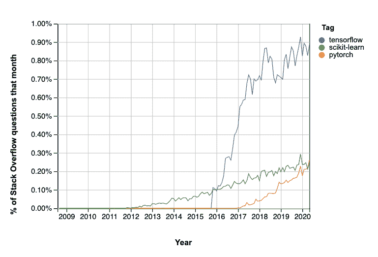**

**最后，我觉得谷歌总是为它的用户/开发者提供价值。我相信他们组织考试的方式值得一试，因为它验证了你的技能，增加了你的个人资料的权重。**

****好吧！我被说服了，你能告诉我这次考试我应该做什么吗？****

# **考试演练**

**该考试是一项基于表现的在线测试，通过在专门的 PyCharm 环境中构建 TensorFlow 模型，为您提供要解决的问题。**

**您可以在支持 [PyCharm IDE](https://www.jetbrains.com/help/pycharm/installation-guide.html) 要求的计算机上参加考试。你需要一个可靠的互联网连接，你可以在任何适合你的时间参加考试(我在午夜开始我的考试)。**

**该考试测试您解决问题的能力，如从真实世界图像中进行图像分类，自然语言处理，以及使用 ****Tensorflow 2.x**** 进行时间序列预测。**

**你可以花 5 个小时来参加考试。如果您超过了时间限制，考试将自动提交，您将只针对您提交并测试您的模型的问题进行评分。**

**你可以使用你在 ML 开发工作中通常使用的任何学习资源。**

******考试费用:**** 每次考试费用 100 美元。**

****啊*-哈*！那么你是如何准备这场恐怖的漫长考试的呢？****

# **我是如何开始准备考试的**

**我做的第一件事是花大量时间研究考试本身。TensorFlow 团队为您提供了这本 [****综合手册****](https://www.tensorflow.org/site-assets/downloads/marketing/cert/TF_Certificate_Candidate_Handbook.pdf) ，告诉您关于考试的每一个细节，以及您在参加考试之前应该掌握的技能:**

**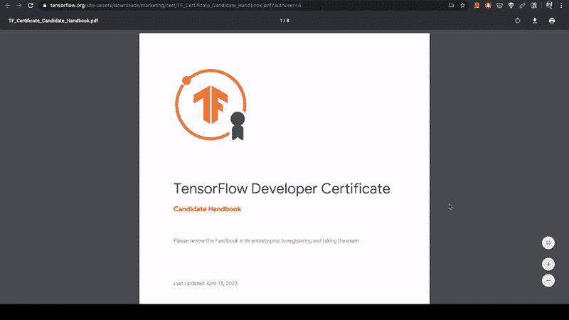**

**在研究了考试之后，我 ****为自己设计了一个课程**** 来涵盖这本手册中提到的每一项技能。**

**接下来，我给自己设定了一个 ****的时间表**** ，这样我的工作安排就不会让我偏离轨道，我会优先考虑那 20 天的学习。**

**就这样——我开始准备考试，使用了由这些[推荐的有用资源组成的课程:](https://www.notion.so/15049893501f4387893a5de0059ef8a5?v=9154c52a61494668b12802f157bce0d4)**

**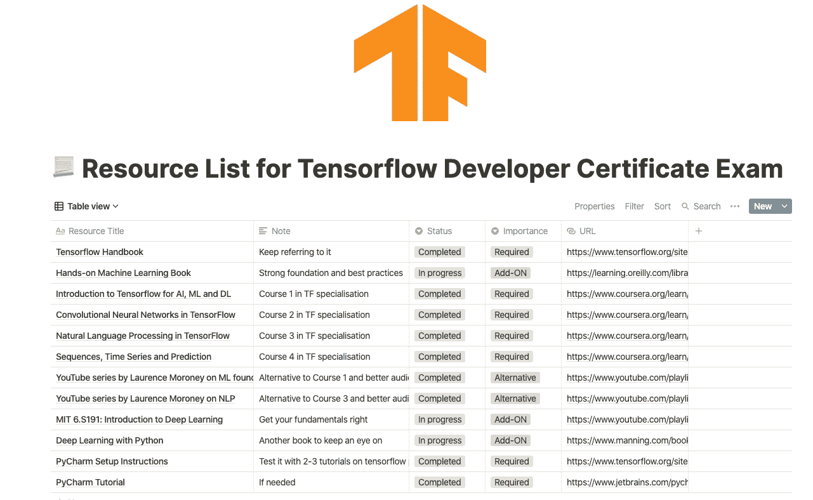

Link to my compilation of resources: [https://www.notion.so/15049893501f4387893a5de0059ef8a5?v=9154c52a61494668b12802f157bce0d4](https://www.notion.so/15049893501f4387893a5de0059ef8a5?v=9154c52a61494668b12802f157bce0d4)** 

# **[Imp]:学习课程—回顾我用来通过考试的所有资源**

**对于刚接触 Tensorflow 或机器学习的人来说，这本手册可能描绘了一幅可怕的画面。但是制定一个计划和时间表会让你度过难关。这是能让你为考试做好准备的课程。**

**Tensorflow 团队再次做了一项了不起的工作，根据你对机器学习的熟悉程度来推荐资源。最重要的是，我一直在跟着一些书籍和播放列表，它们极大地帮助我巩固了大脑中的基础知识，并帮助我超越了考试要求本身。**

**我还审查了我使用的所有这些资源，根据以下品质，我使用了****【5】****的评分标准:**

*   **有用性——通过考试**
*   **学习价值——可能不会对考试结果产生直接影响，但会帮助你打下坚实的基础，解决更复杂的问题。**

**以下是资源列表以及每项资源将花费的时间和成本:**

### **1. [Coursera 的 tensor flow in Practice specialty](https://www.coursera.org/specializations/tensorflow-in-practice)**

**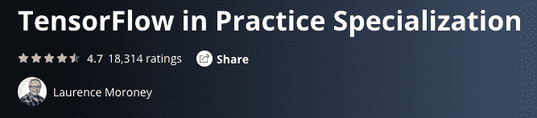**

******有用性:5/5 —**** 这是考试取得好成绩(甚至及格)绝对需要的。它将帮助你涵盖手册中技能清单上提到的每一项技能。这是[认证主页](https://www.tensorflow.org/certificate)上推荐的课程。**

**如果你仔细研究技能清单，然后将其与课程大纲进行比较，你将能够找出每项技能的直接对应关系。看起来，要么课程是为认证考试设计的，要么相反。**

**整个专业包含 4 门课程:**

*   **机器学习和深度学习导论。**
*   **张量流中的卷积神经网络**
*   **张量流中的自然语言处理**
*   **序列、时间序列和预测**

******学习价值:4/5 —**** 课程本身依靠其他资源来帮助你深入理解它所使用的基本概念和主题。这更像是一门实践课程。**

******时间:**** 根据你投入的时间，应该需要 4-8 周。我以前有处理图像分类问题的经验，我花了 14 天时间观看了整个专业化系列并练习了他们提供的所有练习。**

******费用:****7 天免费试用后，每月费用为 59 美元。如果要付钱的话，完全值得。其他资源提供了一个免费的选择。**

### **2.劳伦斯·莫罗尼的机器学习基金会的 YouTube 播放列表**

**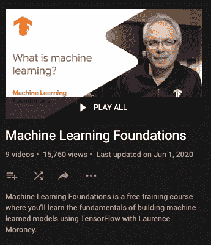**

******有用性:4/5 —**** 这是在[谷歌开发者 YouTube 频道上开始 TensorFlow 专业化的两门课程的替代方案。](https://www.youtube.com/channel/UC_x5XG1OV2P6uZZ5FSM9Ttw?sub_confirmation=1)**

**有一个由同一作者劳伦斯·莫罗尼创作的专用的 [NLP 零到英雄播放列表](https://www.youtube.com/playlist?list=PLQY2H8rRoyvzDbLUZkbudP-MFQZwNmU4S)。**

******学习价值:3/5****——同上，但如果你是机器学习的初学者，需要依赖其他视频和资源。**

******时间:**** 如果你每天花 3-4 个小时准备，每个播放列表 1-2 周。**

******费用:免费******

### **3.[使用 Scikit-Learn、Keras 和 TensorFlow 进行机器实践学习，第二版](https://learning.oreilly.com/library/view/hands-on-machine-learning/9781492032632/)**

**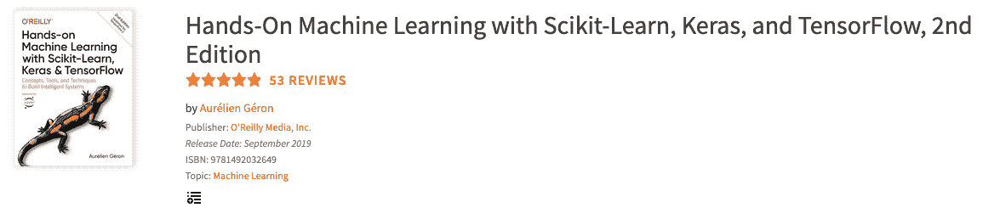**

******有用性:3/5**** —分数是因为其 ****与考试**** 的相关性。对于初学者来说，这将是理解机器学习的基础资源，然后逐渐深入深度学习、张量流、计算机视觉、CNN、RNNs 等等。**

******以下是《T2》中最 u **seful 的章节:********

*   第 10 章——介绍带有 Keras 的人工神经网络
*   第 11 章—训练深度神经网络
*   第 12 章—使用 TensorFlow 定制模型和培训
*   第 13 章—使用 TensorFlow 加载和预处理数据
*   第 14 章—使用卷积神经网络的深度计算机视觉
*   第 15 章—使用 rnn 和 CNN 处理序列
*   第 16 章——自然语言处理与 RNNs 和注意力

我从考试前就开始阅读这本书，作者 Aurelion 为有抱负的数据科学家、ML/AI 工程师创造了一本书的瑰宝。

它阐明了基本概念，解释了每种算法背后的数学原理，然后解释了解决问题的实践代码以及最佳实践，涵盖了一切。所有机器学习爱好者的必读书目。

****学习价值:5/5 —**** 这是迄今为止最好的入门机器学习的书。

****时间:3-4 个月—**** 我会推荐你慢慢阅读每一章，然后练习每章末尾给出的练习。

****费用:**** 如果你负担得起，我推荐你订阅 [****奥赖利媒体****](https://learning.oreilly.com/register/)****【50】****一个月，你不仅可以得到这本书，还可以得到所有的出版物和视频/现场讲座。或者，你可以在亚马逊上以当地的价格购买平装本(大约 60 美元)。

我是一名[奥赖利讲师](https://www.oreilly.com/pub/au/7782)，所以我的门户网站上有可用的资源。

### 4.其他有用的 YouTube 播放列表

这些是我浏览过的几个播放列表，以便更好地理解每个必需的概念:

*   [****麻省理工 6。S191:深度学习简介:****](https://www.youtube.com/playlist?list=PLtBw6njQRU-rwp5__7C0oIVt26ZgjG9NI)
    ****有用性 3/5 —**** 它将帮助你熟悉深度学习和使用 TensorFlow 开发神经网络。您应该涵盖播放列表中的前 3 个视频——DL 介绍、递归神经网络和卷积神经网络。

    ****费用:**** 免费
    ****时间:**** 3 小时
*   [****卷积神经网络 by Andrew NG****](https://www.youtube.com/playlist?list=PLkDaE6sCZn6Gl29AoE31iwdVwSG-KnDzF)
    就像上面的播放列表但是用了 Andrew NG 解释深度学习的方法。我去年看了这个系列，很有帮助。我看了劳伦斯在他的课程中推荐的视频。
    ****用处:3/5 —**** 更多关于基础知识。
    ****学习价值:4/5****
    ****时间:****8–10 小时理解每段视频中的概念。
*   [****序列型号****](https://www.youtube.com/playlist?list=PLkDaE6sCZn6F6wUI9tvS_Gw1vaFAx6rd6) ****by 吴恩达****
    ****用途:3/5 —**** 更多关于基础知识。
    ****学习价值:4/5****
    ****时间:****8–10 小时理解每个视频中的概念。

### 5. [PyCharm 教程系列](https://www.jetbrains.com/pycharm/learning-center/)和[环境设置指南](https://www.tensorflow.org/site-assets/downloads/marketing/cert/Setting_Up_TF_Developer_Certificate_Exam.pdf?authuser=4)

如果您以前从未在 IDE 中工作过，强烈建议您熟悉考试环境。

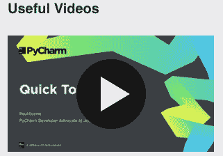

****有用性:5/5**** (必选)——这是 PyCharm ****初学者**** 的入门系列，可以帮助你快速高效地使用 PyCharm。

****学习值:NA****

请务必阅读环境设置指南，以参加 [TensorFlow 开发人员证书考试](https://www.tensorflow.org/site-assets/downloads/marketing/cert/Setting_Up_TF_Developer_Certificate_Exam.pdf?authuser=4)。

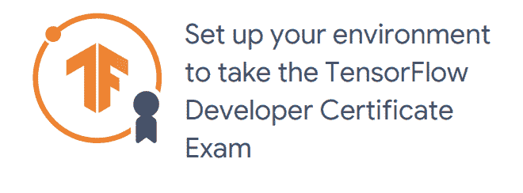

[https://www.tensorflow.org/site-assets/downloads/marketing/cert/Setting_Up_TF_Developer_Certificate_Exam.pdf?authuser=4](https://www.tensorflow.org/site-assets/downloads/marketing/cert/Setting_Up_TF_Developer_Certificate_Exam.pdf?authuser=4)

请遵循 PDF 中提到的说明，因为认证团队不会对您的疏忽负责。

**哇！那是一长串的资源，你是如何设法学习的？**

# 我的准备时间表

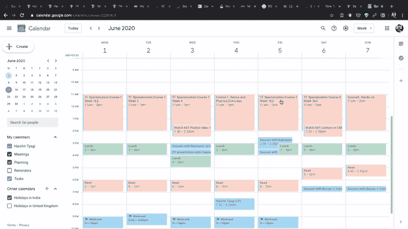

到了四月底，我肯定会把这个从我的清单上划掉。我会像对待任何其他项目一样接手它，并决心将它进行到底。

所以，我以前每天晚上都计划第二天早上要做什么。粉红色的时间段被封锁，用于学习该课程。这 3-4 个小时是我最有效率的时候，也是我能掌握最多的时候。

我在两周内有一个相当一致的日程，当我接近考试日时，我提高了强度，每天练习超过 5-6 个小时。

*好的，那么 w *什么*是你学习的过程*？**

# 我是如何学习的

我习惯于首先观看每周的课程，然后练习视频课程后提供的 colab 中的代码。

在每个周末，我会完成劳伦斯在他的课程中设计的作业。
****注意:我过去常常自己编写完整的代码，而不仅仅是完成占位符代码。****

我还会在晚上睡觉前或者在我的时间段结束时重温动手操作手册中的章节，只是为了让一切都清晰明了。然后我会了解考试课程之外的后续步骤。

TL； ****手表博士。代码。练习。阅读。重复一遍。****

# 都准备好参加考试了，下一步是什么？

如果你认为你已经涵盖了手册中提到的所有技能，并且觉得你已经准备好参加考试了，那就太好了。

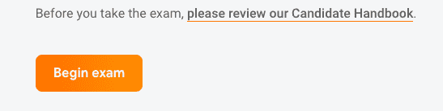

现在，您可以购买考试了。它由一个名为 TrueAbility 的第三方平台提供服务。您需要提交您的政府颁发的身份证(护照将工作)进行认证。

考试交 100 块。你现在可以走了，当你觉得准备好了，你就可以开始考试了。

他们为您提供了如何设置 PyCharm 参加考试的详细说明。我建议你在开始考试前做以下事情:

*   确保你有一个良好可靠的互联网连接。
*   如果您是 IDE 新手，请确保您已经阅读了 PyCharm 初学者教程。
*   我通过运行几个 TensorFlow [教程](https://www.tensorflow.org/tutorials/images/classification?authuser=4)来测试我的 PyCharm。他们工作得很好，我准备安装考试插件开始。
*   在点击开始考试按钮之前，我会仔细阅读考试说明。报名考试后会提供给你。

点击开始考试按钮！

# 考试期间

您的考试环境将被创建，您将被引导到您必须解决的问题。我不会分享考试的细节，因为那是不道德的。

以我的经验来看，一切都很顺利，我也相当有信心在看完问题后完成考试。果然我在 3 小时内完成了考试 ****。****

## 提示和技巧

*   确保在考试前 1-2 天在 PyCharm 上做一些练习，而不是仅仅在 Colab 笔记本上工作。
*   对于在我的本地机器上花费时间的模型，我在 Google Colab 上训练它们，然后将训练好的模型上传到项目文件夹中。
*   在你的模型训练时，继续研究其他问题；我有 3 个模型在训练中——1 个在我的机器上，2 个在 Google colab 上，我在第 4 个模型上工作，同时我试图调整超参数。
*   如果你有足够的时间，继续努力为每个模型获得最好的结果。

# 考试后的仪式

完成后，点击提交并结束考试按钮。当我完成后，我收到了一封来自 TrueAbility 的电子邮件，祝贺我通过了考试:

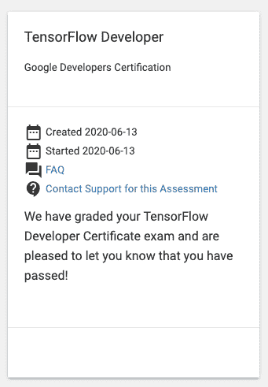

没有关于你考试成绩的详细分析或报告。他们只是简单地提到你是否通过了考试。

通过考试后，要求你加入 [TensorFlow 证书](https://developers.google.com/certification/directory/tensorflow)网，告诉你不同地区的证书持有人:

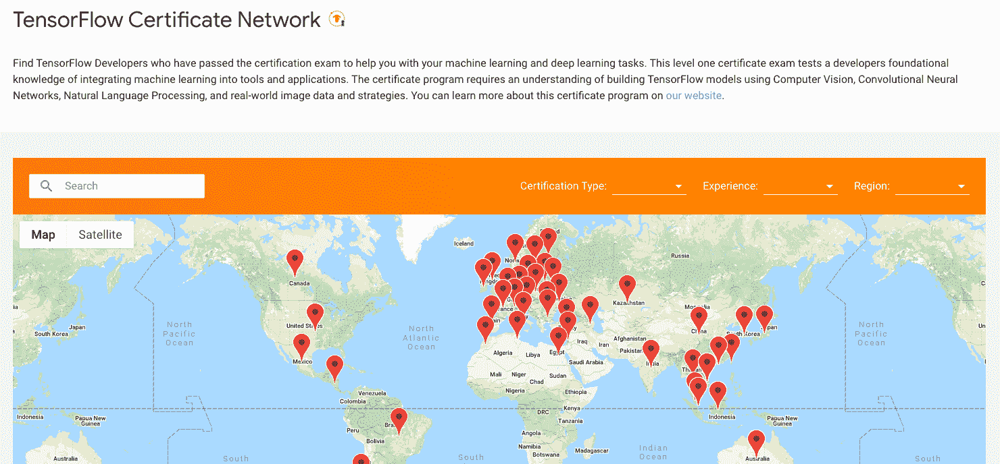

## 证书在哪里？

真正拿到证书需要一周左右的时间。考试三天后我拿到了我的。

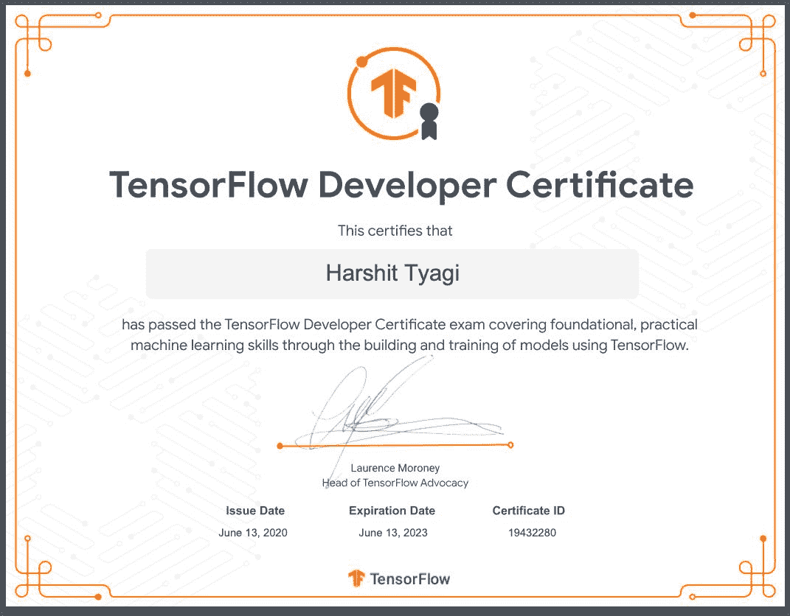

My Certificate

一旦你收到证书，你就可以在你的社交媒体个人资料上展示这个徽章，并在你的简历中将其标记为一项成就。

# 考试常见问题

### 参加考试真的那么重要吗，我就不能根据每个部分做一个等价的项目吗？

我想说你肯定能做到，事实上，当你发展一项新技能时，这可能是更好的方法。

但是这种考试有助于你获得认可，而且，因为它是由谷歌提供的，所以拥有它是件好事。它不是学习深度学习或 TensorFlow 的万能解决方案。

### 我想从头开始，我应该查看哪些资源？

在做事中学习。许多博客都在谈论先学习深奥的数学，但是你很快就会对使用这种方法失去兴趣。

先从学习编程(Python 或者其他任何语言)开始，然后逐步深入机器学习。你也可以看看 Andrew NG 的这个[课程。](https://www.coursera.org/learn/ai-for-everyone?utm_source=gg&utm_medium=sem&utm_content=08-AIforEveryone-IN&campaignid=6499977756&adgroupid=76330509045&device=c&keyword=artificial%20intelligence%20deep%20learning&matchtype=b&network=g&devicemodel=&adpostion=&creativeid=382100381191&hide_mobile_promo&gclid=Cj0KCQjwuJz3BRDTARIsAMg-HxV5tfB76c0JYtqj1dGU3Oa9IFBkvWjr-yydlUYtXj5mODRUhBQ8TyMaAlkcEALw_wcB)

### 我总是需要一个导师或者某个人来推动我做事，解决我的疑惑和问题，可以提出解决方案吗？

在很多情况下，导师的确会有所帮助。如果你希望有人在这些资源之外帮助你了解这些细节，你可以看看 [Codementor](https://www.codementor.io/?partner=harshittyagi) ，在那里你会找到可以帮助你解决所有问题的人工智能和人工智能专家。

### 这个对我来说有点贵，有没有免费或者便宜一点的方法？

是的，Tensorflow 团队正在为那些可能难以负担考试费用的人提供一些津贴。更多详情请访问[此链接](https://www.tensorflow.org/site-assets/downloads/marketing/cert/TF_Education_Stipend.pdf)。

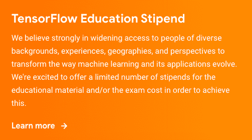

如果你的问题没有在这里解决，请随意回复这篇文章，我会尽快回复你。:)

# 下一步是什么？

就像任何其他技能一样，开始构建东西并在现实世界的项目中工作。开始关注像 TensorFlow 这样的开源项目。用这个徽章申请工作，并与他人分享你的故事。

我正在做一个完整的深度学习基础系列，对 ML/DL 有志者有用。同时，你可以在我的 Youtube 频道上观看我的教学。

这里有一个基于这个博客的视频，你可以观看我分享我的旅程:

[https://www.youtube.com/embed/yapSsspJzAw?feature=oembed](https://www.youtube.com/embed/yapSsspJzAw?feature=oembed)

我将很快在 TensorFlow 上推出一个完整的系列。订阅我的频道，了解有趣的数据科学内容。

# [数据科学与 Harshit](https://www.youtube.com/c/DataSciencewithHarshit?sub_confirmation=1)

[https://www.youtube.com/embed/-pVOoKrBtL8?feature=oembed](https://www.youtube.com/embed/-pVOoKrBtL8?feature=oembed)

通过这个渠道，我计划推出几个涵盖整个数据科学领域的[系列。以下是你应该订阅](https://towardsdatascience.com/hitchhikers-guide-to-learning-data-science-2cc3d963b1a2?source=---------8------------------)[频道](https://www.youtube.com/channel/UCH-xwLTKQaABNs2QmGxK2bQ)的原因:

*   这些系列将涵盖每个主题和子主题的所有必需/要求的高质量教程，如 [Python 数据科学基础](https://towardsdatascience.com/python-fundamentals-for-data-science-6c7f9901e1c8?source=---------5------------------)。
*   解释了为什么我们在 ML 和深度学习中这样做的数学和推导。
*   [与谷歌、微软、亚马逊等公司的数据科学家和工程师](https://www.youtube.com/watch?v=a2pkZCleJwM&t=2s)以及大数据驱动型公司的首席执行官的播客。
*   [项目和说明](https://towardsdatascience.com/building-covid-19-analysis-dashboard-using-python-and-voila-ee091f65dcbb?source=---------2------------------)实施到目前为止所学的主题。

如果这个教程有帮助，你应该看看我在 [Wiplane Academy](https://www.wiplane.com/) 上的数据科学和机器学习课程。它们全面而紧凑，帮助您建立一个坚实的工作基础来展示。