# 我如何根据预算用强化学习来计划我的饮食

> 原文：<https://www.freecodecamp.org/news/how-i-planned-my-meals-with-reinforcement-learning-on-a-budget-a82aac906ada/>

斯特林·奥斯本博士研究员

# 我如何根据预算用强化学习来计划我的饮食

在我最近发表了一篇关于将强化学习应用于现实生活问题的文章之后，我决定用一个小例子来证明这一点。目的是创建一个算法，可以找到一个合适的食品选择，以适应预算和满足我的个人偏好。

我也已经将描述、数据和代码内核发布到 Kaggle，可以在这里找到。

如果您有任何问题或建议，请告诉我。

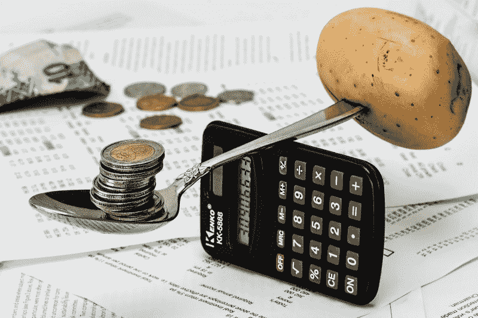

Photo: Pixabay

### 目标

购买食品时，超市里有许多相同成分的不同产品可供选择。有些不太贵，有些质量更好。我想创建一个模型，对于所需的配料，可以选择制作一顿饭所需的最佳产品，这两者都是:

1.  在我的预算内
2.  符合我的个人喜好

为此，我将首先构建一个非常简单的模型，在介绍我的偏好之前，它可以推荐低于我预算的产品。

我们使用模型的原因是，从理论上来说，我们可以衡量问题，考虑越来越多的成分和产品，这些成分和产品会导致问题超出任何心理计算的可能性。

### 方法

为了实现这一点，我将建立一个简单的强化学习模型，并使用蒙特卡洛学习来寻找产品的最佳组合。

首先，让我们将模型的各个部分正式定义为马尔可夫决策过程:

*   做任何一顿饭都需要有限数量的配料，这些配料被认为是我们的**状态**
*   每种成分都有有限的可能产品，因此是每个状态的**动作**
*   我们的偏好成为选择每个产品的**个人奖励**,我们将在后面更详细地介绍这一点

蒙特卡洛学习将达到最终目标的每一步的质量结合起来，并要求为了评估任何一步的质量，我们必须等待并看到整个结合的结果。这个过程在许多不同产品的剧集中一遍又一遍地重复，直到它找到看起来会导致积极结果的选择。这是一个强化学习过程，我们的环境是基于我们获得的关于成本和偏好的知识来模拟的。

蒙特卡洛通常被避免，因为在能够学习之前，需要花时间经历整个过程。然而，在我们的问题中，在确定所选产品组合是好是坏时，我们需要进行最终检查，将所选产品的实际成本相加，并检查其是否低于或高于我们的预算。此外，至少在现阶段，我们不会考虑超过几个成分，因此在这方面所花的时间并不重要。

[https://www.tractica.com/artificial-intelligence/reinforcement-learning-and-its-implications-for-enterprise-artificial-intelligence/](https://www.tractica.com/artificial-intelligence/reinforcement-learning-and-its-implications-for-enterprise-artificial-intelligence/)

### 抽样资料

在这个演示中，我为一顿饭创建了一些样本数据，其中有 4 种配料和 9 种产品，如下图所示。

我们需要为膳食中的每种成分选择一种产品。

这意味着我们有 2 x 2 x 2 x 3 = 24 种成分的 24 种产品可供选择。

我还包括了每个产品的实际成本和 V_0。

V_0 只是满足我们要求的每个产品的初始质量，我们将其设置为 0。

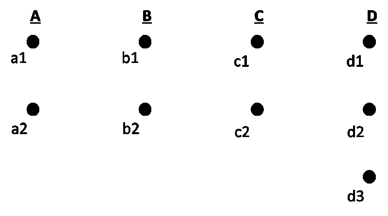

Diagram showing the possible product choices for each ingredient

首先，我们导入所需的包和数据。

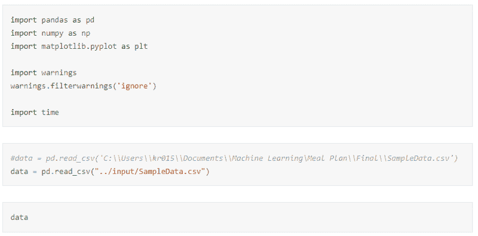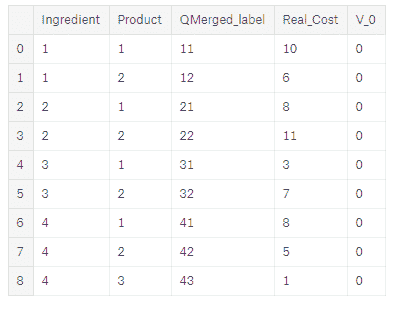

### 在理论上应用该模型

目前，我不会为产品引入任何个人奖励。相反，我将只关注选择的产品组合是否低于我们的预算。这个结果被定义为我们问题的**终端回报**。

例如，假设我们的预算是 30，那么选择:

a1→b1→c1→d1

那么这个选择的真正成本是:

£10+£8+£3+£8 = £29 < £30

因此，我们的终极奖励是:

R_T=+1

鉴于，

a2→b2→c2→d1

那么这个选择的真正成本是:

£6+£11+£7+£8 = £32 > £30

因此，我们的终极奖励是:

r _ T = 1

现在，我们只是告诉我们的模型选择是好是坏，并观察这对结果有什么影响。

### 模型学习

那么我们的模型实际上是如何学习的呢？简而言之，我们让我们的模型尝试许多产品组合，并在每个组合结束时告诉它选择是好是坏。随着时间的推移，它将认识到，一些产品通常会带来良好的结果，而另一些则不会。

我们最终创造的是每个产品有多好的价值，用 V(a)表示。我们已经介绍了每种产品的初始 V(a ),但是我们如何从这些初始值开始做出决策呢？

为此，我们需要一个**更新规则**。这告诉模型，在每次它给出它的产品选择后，我们告诉它选择是好是坏，如何把它加到我们的初始值中。

我们的更新规则如下:

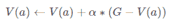

这乍一看可能不寻常，但在文字上，我们只是简单地更新了任何行动的值 V(a ),如果结果是好的，则增加一点，如果结果是坏的，则减少一点。

g 是**回报**，简单来说就是获得的总回报。目前在我们的例子中，这只是终端奖励(相应地+1 或-1)。稍后，当我们包括个人产品奖励时，我们将再次介绍这一点。

Alpha，αα，是**学习速率**，我们将在后面演示它如何影响结果，但现在，简单的解释是:“学习速率决定了新获得的信息覆盖旧信息的程度。因子 0 使代理什么也学不到，而因子 1 使代理只考虑最近的信息。”(【https://en.wikipedia.org/wiki/Q-learning】T2

### 更新值的小演示

那么我们如何在模型中使用它呢？

让我们从一个包含每种产品及其首字母 V_0(a)的表开始:

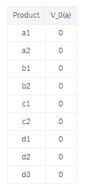

我们现在随机挑选产品，每个组合被称为**集**。为了简化计算，我们现在还设置α=0.5。

例如:

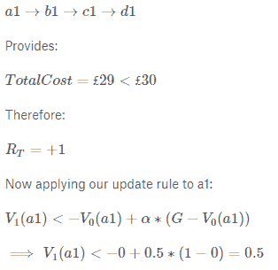

因此，导致这一积极结果的所有行动也被更新，以便与 V1(a)一起生成下表:

所以让我们再随机挑选一集来试试:

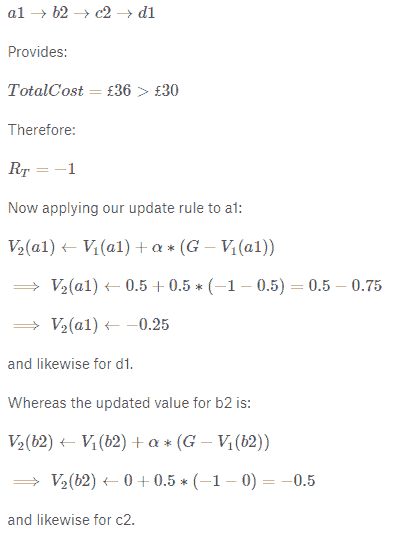

因此，我们可以将 V2(a)添加到我们的表中:

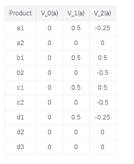

### 动作选择

你可能在演示中注意到了，我只是简单地随机选择了每集的产品。我们可以这样做，但是使用一个完全随机的选择过程可能意味着一些行为没有足够频繁地被选择来知道它们是好是坏。

同样，如果我们走另一条路，决定贪婪地选择产品，也就是说，选择目前具有最佳价值的产品，我们可能会错过一个事实上更好但从未有机会的产品。例如，如果我们选择 V2(a)的最佳行动，我们将得到 a2、b1、c1 和 d2 或 d3，它们都提供正的最终回报。因此，如果我们使用纯粹贪婪的选择过程，我们将永远不会考虑任何其他产品，因为这些产品继续提供正的结果。

相反，我们实施**ε-贪婪**动作选择，其中我们随机选择具有概率ϵ的产品，并贪婪地选择具有概率 1−ϵ1−ϵ的产品，其中:

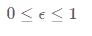

这意味着我们将很快达到产品的最优选择，因为我们继续测试“好”的产品实际上是否是最优的。但这也为我们偶尔探索其他产品留下了空间，只是为了确保它们没有我们目前的选择好。

### 构建和应用我们的模型

我们现在准备构建一个简单的模型，如下面的 MCModelv1 函数所示。

虽然这看起来很复杂，但我所做的不过是应用前面讨论的方法，这样我们就可以改变输入并仍然获得结果。诚然，这是我第一次尝试这样做，所以我的代码可能写得不完美，但应该足以满足我们的要求。

为了计算终端奖励，我们目前使用以下条件来检查总成本是少于还是多于我们的预算:

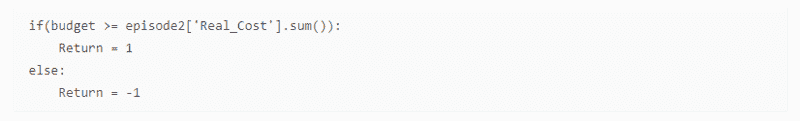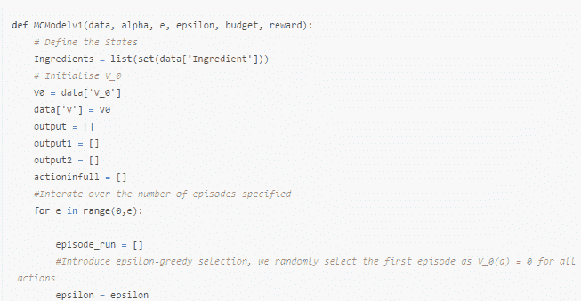

该模型的完整代码太大，不适合放在这里，但可以在链接的 [Kaggle](https://www.kaggle.com/osbornep/reinforcement-learning-for-meal-planning-in-python/notebook) 页面找到。

#### 我们现在用一些样本变量运行我们的模型:

在我们的函数中，模型有 6 个输出:

*   Mdl[0]:返回每集所有 V(a)的总和
*   Mdl[1]:返回最便宜产品的 V(a)之和，由于样本数据的简单性，可以对其进行定义
*   Mdl[2]:返回非最便宜产品的 V(a)之和
*   Mdl[3]:返回最后一集的最佳动作
*   Mdl[4]:返回为每个产品添加了最终 V(a)的数据表
*   Mdl[5]:显示每集的最佳动作

从这些可以学到很多东西，所以让我们仔细研究每一个，并确定我们可以学到什么来改进我们的模型。

#### 最后一集的最佳行动

首先，让我们看看模型建议我们应该选择什么。在这种情况下，它建议总成本低于预算的行动或产品是好的。

然而，我们还可以检查更多内容，以帮助我们了解正在发生的事情。

首先，我们可以画出所有动作的总 V，我们看到这是收敛的，这是理想的。我们希望我们的模式能够趋同，这样当我们尝试更多剧集时，我们就能“分区”选择最佳产品。输出收敛的原因是因为我们将它每次学习的数量减少了一个因子αα，在本例中为 0.5。我们将在后面展示如果我们改变这个或者根本不应用它会发生什么。

我们还绘制了我们知道最便宜的产品的 V 的总和，这是基于能够单独评估小样本量和其他产品。同样，两者正向趋同，尽管较便宜的产品似乎价值略高。

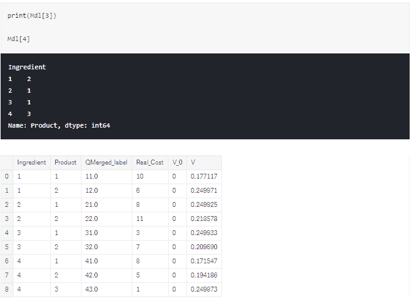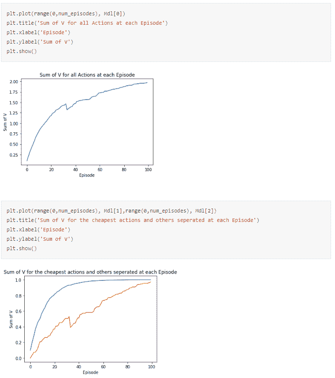

#### 那么，为什么会发生这种情况，为什么模型会提出它所做的动作？

为了理解这一点，我们需要剖析每集模型提出的建议，以及这些建议与我们的回归有何关联。

下面，我们针对每个状态采取了最佳措施。我们可以看到，建议的行动确实在剧集之间变化很大，并且模型似乎很快就决定了想要建议哪个。

因此，我绘制了每集建议行动的总成本，我们可以看到行动最初有所不同，然后变得平稳，最终总成本低于我们的预算。这大大有助于我们理解正在发生的事情。

到目前为止，我们告诉模型的是提供一个低于预算的选择，它已经做到了。它只是找到了一个低于所需预算的答案。

那么下一步是什么？在我介绍奖励之前，我想演示一下如果我改变一些参数会发生什么，以及如果我们决定改变我们希望模型建议的东西，我们能做些什么。

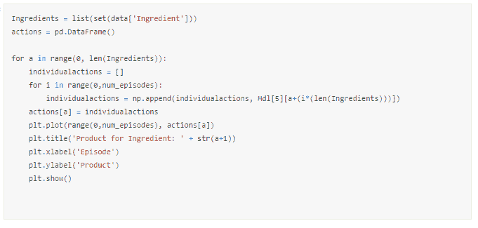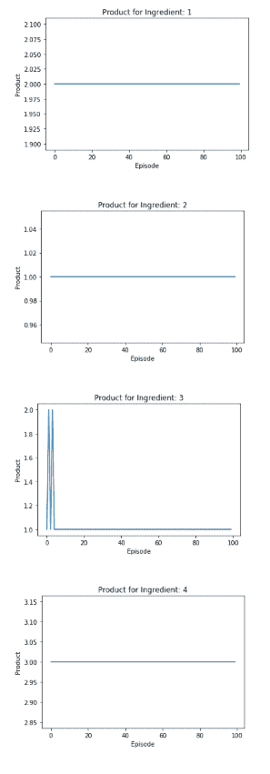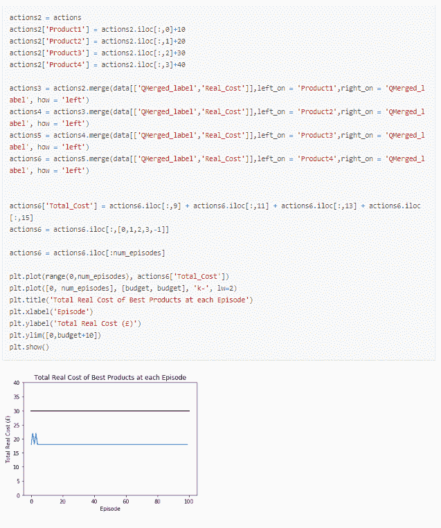

### 改变参数的影响以及如何改变模型的目标

我们有几个可以改变的参数:

1.  预算
2.  我们的学习率，α
3.  输出动作选择参数，ϵ

#### 变动预算

首先，让我们观察一下，如果我们把预算定得过低或过高，会发生什么。

一个小的预算意味着我们只能得到一个负的回报，意味着我们将迫使我们的 V 向负的方向收敛，而一个太高的预算将导致我们的 V 向正的方向收敛，因为所有的行为都是持续的正的。

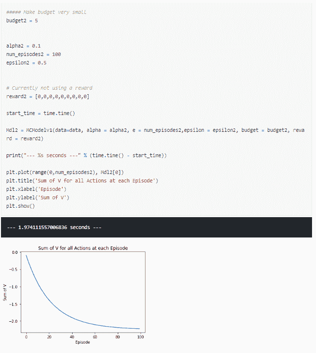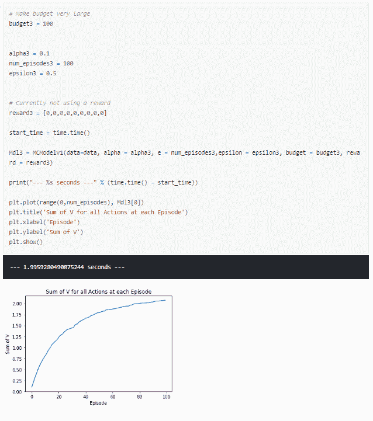

后者看起来就像我们在第一轮中所做的那样，许多情节都带来了积极的结果，因此许多产品组合都是可能的，最便宜的产品与其他产品之间几乎没有区别。

相反，如果我们考虑一个给定产品价格的合理低的预算，我们可以看到一个趋势，最便宜的产品看起来正趋同，而更贵的产品负趋同。然而，这两部电影的流畅度并不理想，每一集之间都有很大的波动。

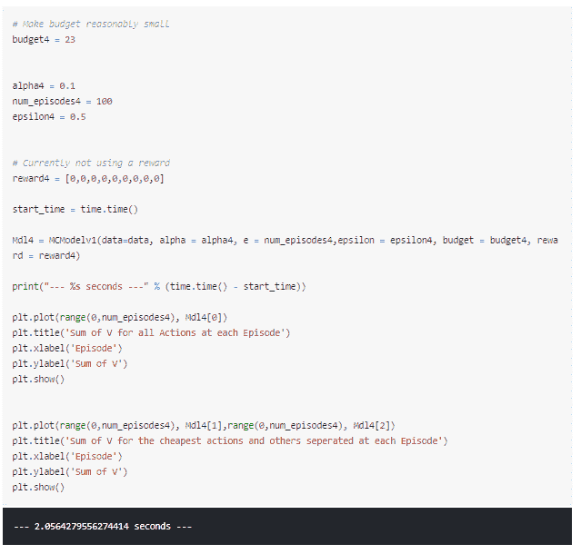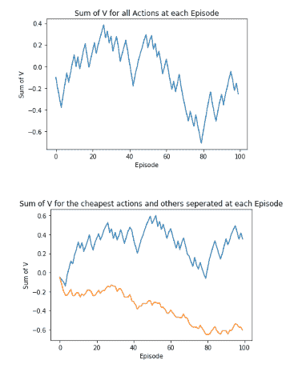

那么，我们能做些什么来减少输出的“尖峰”呢？这就引出了我们的下一个参数，α。

### 变化α

#### 堆栈溢出用户 VishalTheBeast 对 alpha 导致的输出结果做了很好的解释:

> “学习率告诉我们向解决方案迈进的幅度。

> 它不应该是太大的数字，因为它可能会在最小值附近连续振荡，也不应该是太小的数字，否则将需要很多时间和迭代才能达到最小值。

> 在学习速率中建议衰减的原因是，最初当我们处于解空间中的一个完全随机的点时，我们需要向解大步跳跃，后来当我们接近解时，我们进行小跳跃，因此小改进，最终达到最小值。

> 可以这样类比:在高尔夫球比赛中，当球远离球洞时，球员非常努力地击球，以尽可能靠近球洞。后来，当他到达标记区域时，他选择了一根不同的棍子来获得准确的短杆。

> 所以不是说他不选短杆就不会把球送进洞，他可能会把球送到目标前面两三次。但是，如果他发挥最佳状态，使用正确的力量到达球洞，那将是最好的。学习率下降也是如此。”— [来源](https://stackoverflow.com/questions/33011825/learning-rate-of-a-q-learning-agent)

为了更好地演示改变 alpha 的效果，我将使用 Plot.ly 创建的动画情节。

我已经在这里写了一个更详细的指南。

在我们的第一个动画中，我们在 1 和 0.1 之间改变 alpha。这使我们能够看到，当我们减少阿尔法我们的输出平滑一些，但它仍然很粗糙。

然而，即使结果变得平滑，它们不再在 100 集内收敛，而且，它们的输出似乎在每个 alpha 之间交替。这是由于小阿尔法组合需要更多集来学习，并且动作选择参数ε为 0.5。本质上，一半的时间输出仍然是由随机性决定的，所以我们的结果不会在 100 集的框架内收敛。

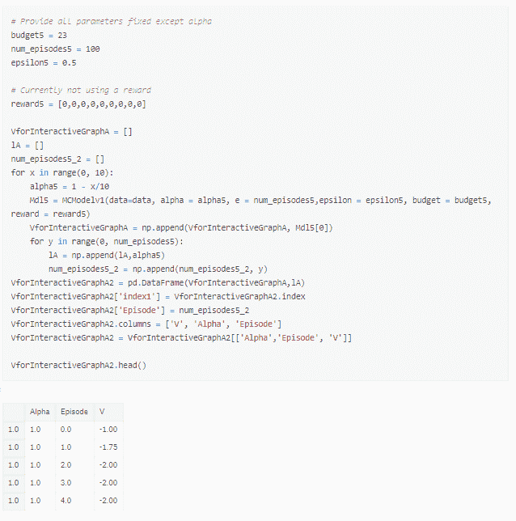

在我们的动画情节中运行它会产生类似如下的结果:

### 变化的ε

考虑到前面的结果，我们现在将 alpha 固定为 0.05，并将 epsilon 在 1 和 0 之间变化，以显示完全随机选择操作对贪婪选择操作的影响。

下图显示了不同 epsilon 的三个快照，但动画版本可以在 [Kaggle](https://www.kaggle.com/osbornep/reinforcement-learning-for-meal-planning-in-python/notebook) 内核中查看。

我们看到高ε产生了非常零星的结果。因此，我们应该选择一个相当小的值，比如 0.2。虽然ε等于 0 看起来很好，因为曲线很平滑，正如我们前面提到的，这可能会让我们很快做出选择，但可能不是最好的。我们需要一些随机性，这样模型就可以在需要时探索其他动作。

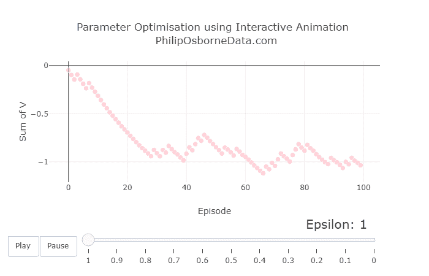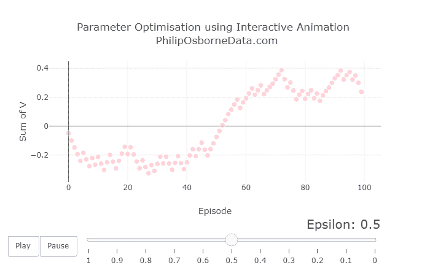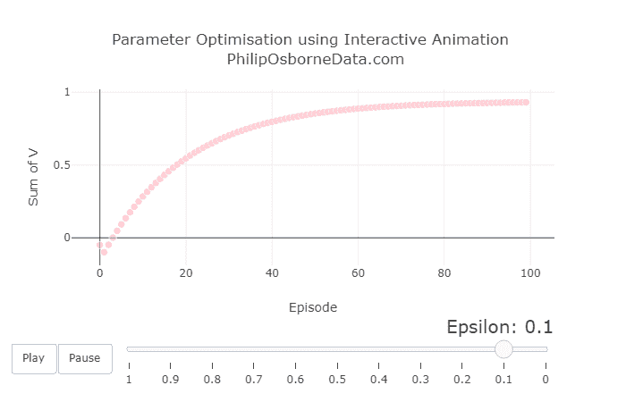

### 增加剧集数量

最后，我们可以增加剧集的数量。我没有马上这么做，因为我们在一个循环中运行 10 个模型来输出我们的动画图，这会导致运行模型的时间爆炸。

我们注意到低 alpha 需要更多的剧集来学习，所以我们可以运行 1000 集的模型。

然而，我们仍然注意到输出是振荡的，但是，如前所述，这是因为我们的目的只是推荐一个低于预算的组合。这表明，当有许多组合低于我们的预算时，模型无法找到单一的最佳组合。

因此，如果我们稍微改变我们的目标，以便我们可以使用模型找到最便宜的产品组合，会发生什么？

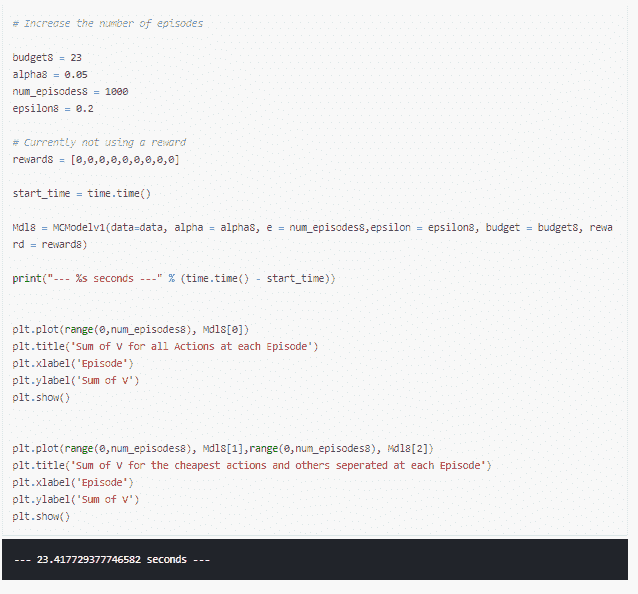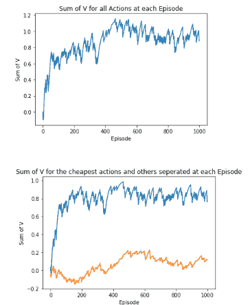

### 改变我们模型的目标，找到最便宜的产品组合

这样做的目的是为了更清楚地将最便宜的产品与其他产品区分开来，而且它几乎总是为我们提供最便宜的产品组合。

要做到这一点，我们需要做的就是稍微调整我们的模型，以提供一个相对于该组合在该集中低于或高于预算多少的最终奖励。

这可以通过将退货计算改为:

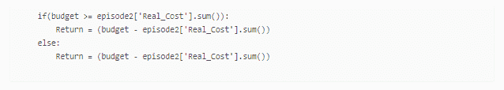

我们现在看到，最便宜的产品和其他产品之间的区别得到了强调。

这确实展示了强化学习的灵活性，以及根据您的目标调整模型是多么容易。

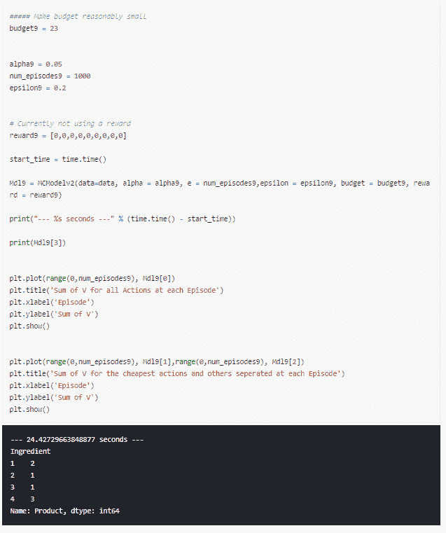

### 首选项介绍

到目前为止，我们还没有包括任何个人对产品的偏好。如果我们想包括这一点，我们可以简单地为每个产品引入奖励，同时仍然有一个终端奖励，鼓励模型低于预算。

这可以通过将退货计算改为:

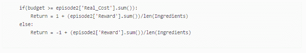

那么为什么我们现在的回报计算是这样的呢？

首先，我们仍然希望我们的组合低于预算，所以我们分别为高于和低于预算提供积极和消极的奖励。

接下来，我们要考虑每个产品的奖励。出于我们的目的，我们将奖励定义为 0 到 1 之间的值。MC 回报的正式计算方法如下:

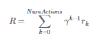

γ是贴现因子，它告诉我们，与前面的步骤相比，后面的步骤有多重要。在我们的例子中，所有行动对于达到低于预算的预期结果同样重要，所以我们设置γ=1。

然而，为了确保我们达到低于预算的主要目标，我们对每项行动的奖励总和取平均值，使其始终分别小于 1 或-1。

同样，完整的模型可以在 [Kaggle](https://www.kaggle.com/osbornep/reinforcement-learning-for-meal-planning-in-python/notebook) 内核中找到，但是太大了，无法在这里链接。

### 使用奖励引入偏好

假设我们决定购买产品 a1 和 b2，我们可以给每一个产品增加奖励。让我们在下面的输出和图表中看看这样做会发生什么。我们稍微改变了预算，因为 a1 和 b2 加起来是 21，这意味着没有办法再选择两个产品，使其低于预算 23。

应用一个非常高的奖励迫使模型选择 a1 和 b2，然后寻找能使它在我们预算之内的产品。

我一直在比较最便宜的产品和其他产品，以表明该模型现在不再评估最便宜的产品。相反，我们得到总成本为 25 的输出 a1、b2、c1 和 d3。这既低于我们的预算，也包括我们的首选产品。

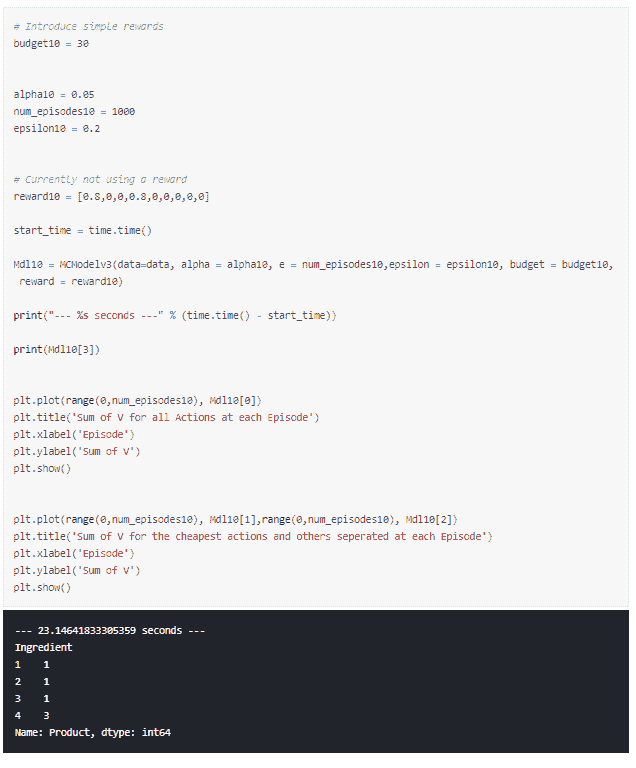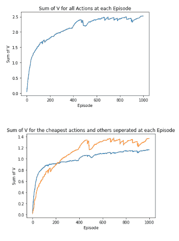

我们再试试一个奖励信号。这一次，我给每个人一些奖励，但希望它能提供我的奖励的最佳组合，使我们仍然低于预算。

我们有以下奖励:

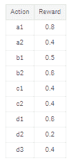

运行该模型几次表明，它将:

*   经常选择 a1，因为这有更高的回报
*   我总是选择 c1，因为回报是一样的，但它更便宜
*   我很难在 b1 和 b2 之间做出选择，因为回报分别为 0.5 和 0.6，但成本分别为 8 和 11
*   通常会选择 d3，因为它比 d1 便宜得多，即使报酬稍低

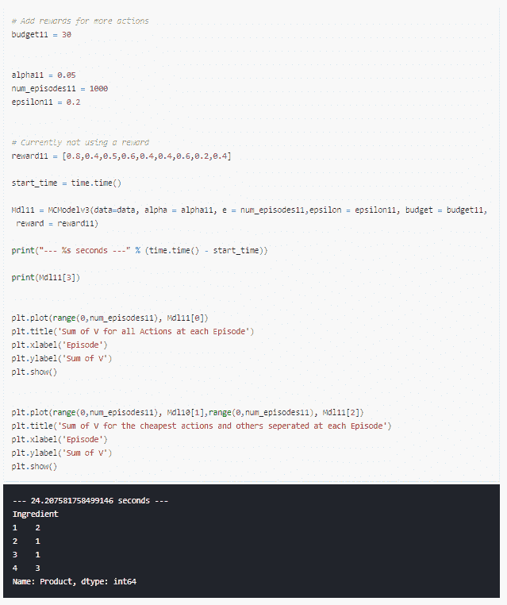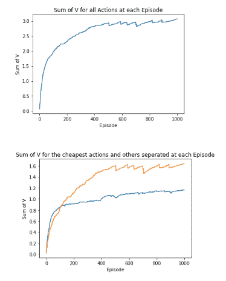

### 结论

我们已经成功构建了一个蒙特卡洛强化学习模型，以:

1.  推荐低于预算的产品，
2.  推荐最便宜的产品，还有
3.  根据偏好推荐最好的产品，但仍低于预算。

在这个过程中，我们展示了在强化学习中改变参数的效果，以及理解这些如何使我们达到预期的结果。

在我看来，我们还可以做更多的事情，最终目标将是应用于真正的食谱和来自超市的产品，其中需要考虑增加的成分和产品的数量。

我创建这个样本数据和问题是为了更好地理解强化学习，希望你会觉得有用。

感谢阅读！

斯特林·奥斯本