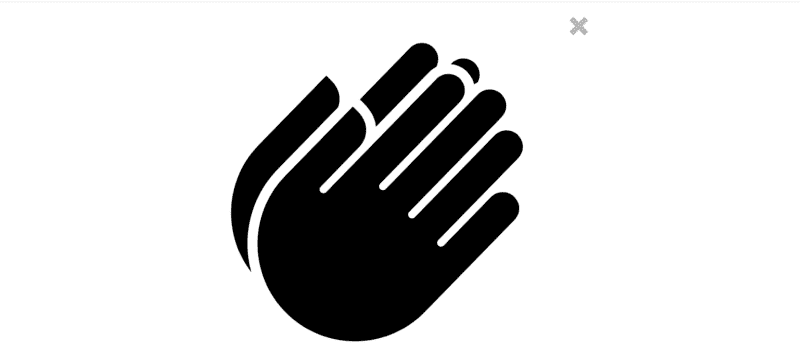
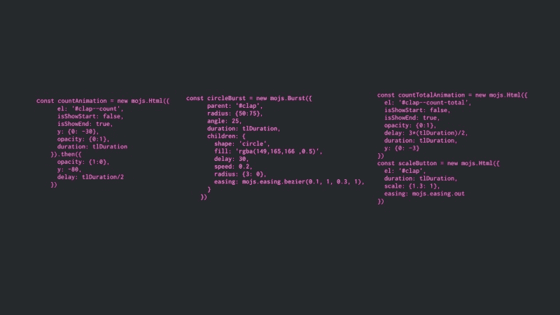

# 我是如何(重新)构建了中等拍手效果的——以及我从实验中得到了什么。

> 原文：<https://www.freecodecamp.org/news/how-i-re-built-the-medium-clap-effect-and-what-i-got-out-of-the-experiment-991672995fdf/>

四年前，我读到一句话，这句话将永远改变我的生活。

我不记得周围的环境，但太阳非常热，我在谷歌搜索的结果页面上。

毕加索的一句名言突然出现了，接下来的几周我完全沉浸在其中。

> 好的艺术家临摹；伟大的艺术家偷窃

> ——巴勃罗·毕加索

### 什么？他真的是那个意思吗？

由于多个问题让我头脑发热，我不得不阅读更多关于帕布罗的资料。

巴勃罗·毕加索被认为是 20 世纪最有影响力和最伟大的艺术家之一。在这一点上，我知道他不是一个到处胡说八道的失败者。

我继续讲述我的生活，但这句话从未离开过我。

几年后，我成了“偷窃”哲学的忠实追随者。它是如此的根深蒂固在我的潜意识里，以至于我想有一天我会写一本关于这个主题的纽约时报畅销书。

Life happened. I never got to write the book :(

我几乎把这条规则应用到我做的每一件事上。

例如，我花了几个小时手工重写了几个 codepens(由他人构建),都是为了通过窃取来学习一些东西。今年早些时候，我看到丹·阿布拉莫夫谈论类似的事情。

我毕竟没有疯。

偷取规则似乎是掌握的一般规则。

在他的书《巅峰:新专业科学的秘密》中，安德斯·埃里克森谈到了反馈循环以及它对掌握知识的重要性。事实上，这也是本杰明·富兰克林用来写不可思议的书的技巧。他可以说是他那个时代最优秀的美国作家之一。

这种思维模式和学习方法让我试图重现中度鼓掌效应。

### 实验

Medium clap 是由至少比我聪明五倍的人设计和制造的。但这不是我第一次重新创作别人的东西。Medium clap 只是众多此类项目中的一个。

我一直觉得中拍手是如此令人满意。很多次我在 50 分钟后鼓掌，只是为了感受那令人满意的动画。

构建 Medium clap 是一个有趣的实验。我们的目标不是创造一个完全相同的克隆体，只是一些与之相似的东西。

### 我使用的技术

对于内容，我使用了好的 HTML 和一些 SVG。我从名词项目中得到了一个拍手图标。

SVG Created by Luis Durazo from the [Noun Project](https://thenounproject.com/search/?q=clap&i=28959)

我在 Illustrator 中打开拍手图标，随心所欲地编辑它。然后我通过 [SVGOMG](https://jakearchibald.github.io/svgomg/) 进行了优化。

我需要 Javascript 来实现交互性。所以，我用 vanillaJS 构建了 clap，然后通过 [ReactJS](https://codepen.io/ohansemmanuel/full/zEJpYy/) 将它分叉以进行重建。

对于动画，我选择了 [LegoMushroom](https://www.freecodecamp.org/news/how-i-re-built-the-medium-clap-effect-and-what-i-got-out-of-the-experiment-991672995fdf/undefined) 的 mo.js，它似乎是最适合再现中型拍手动画的。 [Mo.js](http://mojs.io) 是一个非常有趣的动画库，带有声明式 API。我发现它对初学者也很友好。

### 我是如何开始的

我不是特别确定从哪里开始。我对 SVG 有一些经验，但对 mo.js 没有太多经验。

此时[代码笔](http://codepen.io)上没有任何“工作中”的媒体拍手。那里没什么可学的。

所以我又偷了。

“网上肯定有我可以借鉴的东西，”我对自己说。经过几次失败的搜索，我找到了一些东西。

玛丽·卢的[的](https://tympanus.net/codrops/)是一个实用的前端材料的资源地狱。我在那里搜索并找到了一些[动画图标](https://github.com/codrops/Animocons)。

The codrops animated icons were inspired by this shot by [Daryl Grinn](https://dribbble.com/daryl)

这些图标一点也不像 Medium clap，但肯定有值得学习的地方。

你知道我做了什么，对吧？

我从头开始构建了 codrops 动画图标。我手工复制了整个代码库。

这给了我很多的视角，我知道之后该如何处理这个问题。

### 你如何学得很快？

除了构建 codrops 动画图标，我对 mo.js 没有太多的经验

那不是什么大事。我总是对更快地学习新东西的前景感到兴奋，我已经开发了一个快速学习东西的系统。

2012 年，斯科特·扬在不到一年的时间里完成了麻省理工学院著名的计算机科学课程的全部 33 门课程，从线性代数到计算理论。他很快成为我的灵感。

麻省理工学院的课程应该是四年的课程，但不知何故，他设法在 12 个月内系统地驯服了它。

我相信超学习。在当今经济中，这是一项非常重要的技能。

那么，计划是什么？

首先，我需要保险。mo.js 地形周围的覆盖。就像斯科特说的，如果没有地形图，你就无法计划攻击。

首先，我浏览了一下 mo.js 官方教程。老实说，我跳过了一些。我在 youtube 上看到一个视频，Sarah Drasner 解释了 mo.js 库是如何工作的。我以两倍的速度观看视频。我也读了莎拉的书， [SVG 动画](https://www.amazon.com/SVG-Animations-Implementations-Responsive-Animation/dp/1491939702)。有一章专门介绍了 mo.js 库。

我读得很快。

在这一点上，我所需要的是关于这个库如何工作以及它能做什么的报道。

之后，我开始将我的知识运用到工作中。是时候构建[介质](https://www.freecodecamp.org/news/how-i-re-built-the-medium-clap-effect-and-what-i-got-out-of-the-experiment-991672995fdf/undefined) clap 了。

在动画上花了很多时间后，我终于把它做对了。一些不烂的东西。

Example configurations for the animations powered by mo.js

我在某些地方卡住了。我犯了错误，甚至花了几天时间来调整东西。不过，是的，我把它修好了。

### 有什么意义？

我相信不断挑战自我。推动自己超越我认为我知道或能做的。

这只是这方面的另一个实验。

### 这是一次失败的实验吗？

我不会这么说。

10 月 11 日，这支笔被摘走了，并被 2000 多人观看。

我在拉各斯 ReactJS 峰会上做了一个关于 SVG 和微交互的演讲。在那里，我谈到了 ReactJS 应用程序环境中的微交互，并展示了如何构建中等拍手效果。

### 结论

我已经找到了对微交互的新热爱，我相信他们是做出伟大产品的小巨人。

总的来说，这是一次有趣而富有成效的实验。我不后悔。一点也不。

我是否计划重新创建一些更有雄心的项目？太好了。

但是，嘿，这是另一天的谈话:)

继续构建，继续编码！