# 我是如何用 WebGL 重现街头霸王乐队仙女座菌株音乐视频的

> 原文：<https://www.freecodecamp.org/news/how-i-recreated-the-music-video-gorillazs-andromeda-with-webgl-f9b0fe55fb17/>

让我看看

# 我是如何用 WebGL 重现街头霸王乐队仙女座菌株音乐视频的

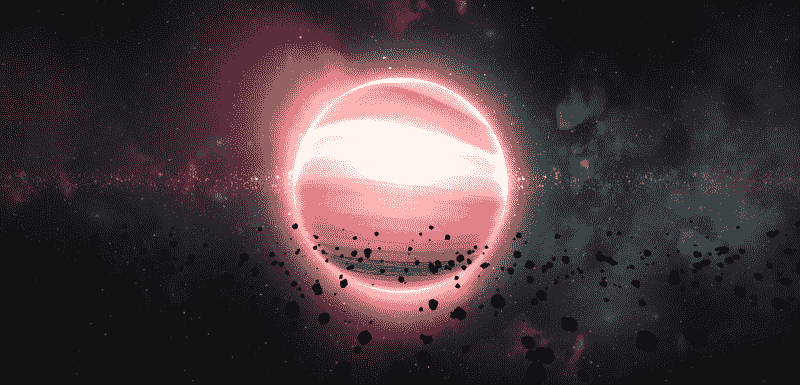

我第一次看《街头霸王乐队——感觉良好》音乐录影带时是 14 岁。我爱上了它说“哇！卡通音乐录影带？多牛逼啊！”。接下来我知道我买了恶魔日专辑。

几年后…大约 4 个月前，YouTube 给我看了新的街头霸王乐队音乐视频《仙女座》。当它完成缓冲时，我立即想到这个视频可以在浏览器上呈现。

那时我开始用 WebGL 重新制作仙女座音乐视频。请随意在 WebGL 上查看[街头霸王乐队-仙女座菌株。](http://yagiz.me/andromeda/)

当我开始重新创作时，我做的第一件事是下载 [three.js](https://threejs.org/) ，这是一个可靠的 3D JavaScript 库。我下载了源代码，从一个简单的“Hello World”场景开始。然后我开始计划物体，纹理和动画。

我把我的项目分成四个主要部分。这些是背景场景，流星场景，土星场景和动画。

### 分析音乐视频

仙女座音乐视频其实有一个简单的场景。从左向右移动的背景星系图像。一个有流动纹理的球体，我称之为土星。流星在前方飞舞。有时，当音乐变得更高时，一颗流星从左上角飞来，撞向土星，使它发出更亮的光。

我本来打算模仿一个类似的。所以我用背景、土星和流星等元素勾画了下面的场景。

### 背景场景

这看起来是场景中最简单的部分，这是真的。技术上来说很简单。首先创建一个平面。从左到右制作动画。创建另一个并将其放在第一个的后面。将它们的混合模式设置为叠加，这样它们看起来就合并了。最后，添加一些纹理。

但是，如何找到一个适当的，真正的 4K，美丽和丰富多彩的星系纹理？

这很难。

我在大约 1000 个网站上查找授权或免费图片。但我能找到的只是一些漂亮、锐利的 4K 壁纸，而不是真正的纹理。

这很糟糕。我不得不一个接一个地购买和下载它们。然后试着把它们转换成连续的纹理。并编辑其亮度和对比度设置。在所有这些步骤之后，我在场景中测试了它们，试图看看它们是否好看。

这花了一些时间，但我设法找到了完美的图像。这是完全值得的，我真的很高兴看到结果:

我需要添加一些后期处理效果，如改变我的项目色调。我用的是 EffectComposer(你可以在这里找到详细教程[。](http://blog.cjgammon.com/threejs-post-processing))，它不是 three.js 的一部分，但是附带了它的例子。通过使用 EffectComposer，我可以很容易地给我的背景场景添加色调效果。

### 流星场景

流星是这个项目中最简单的部分。同时，他们也是性能的敌人。场景中有 500 个在移动和旋转！我需要用最简单的方法找到一个流星模型来制作流畅的动画。

在 three.js 中，你可以用普通的几何图形做很多令人惊奇的事情。用[八面体几何图形](https://threejs.org/docs/index.html#api/geometries/OctahedronGeometry)，我变形了它的每个顶点。它基本上看起来像一块石头:

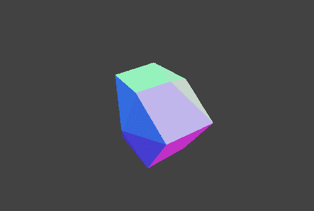

我之前说过，这个项目有 500 颗流星。每一个都有不同的移动速度，旋转速度和随机大小。他们从右向左移动。当他们离开视图时，他们会传送到视图的右侧。

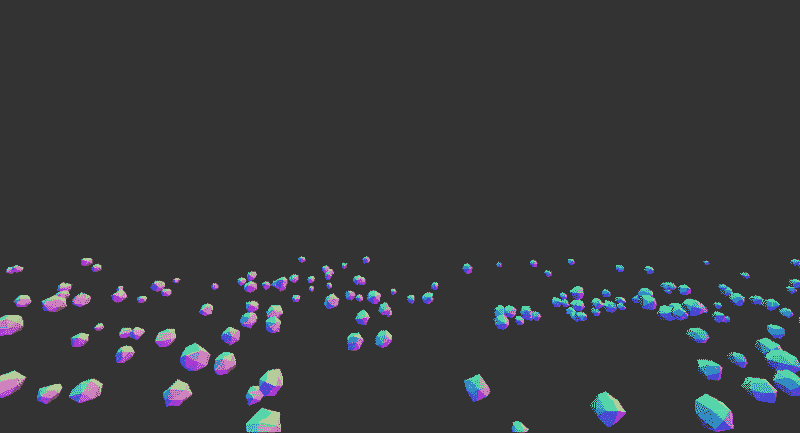

土星后面的流星实际上是一张静态图像。首先，我试图从头开始创建这个静态图像。我画了一些带有发光效果的随机圆圈，但是我不喜欢它们在场景中的样子。然后我发现了一个星星纹理。我把它染成黄色，混合模式设置为加色。

### 土星场景

毫无疑问，这是这场戏最难的部分。要了解原因，您需要在音乐视频中考察它的特性:

*   纹理的动画方式是它的顶部比底部移动得快。
*   土星不旋转，但纹理使它看起来像摆动。
*   土星内部发光。边缘和中心部分更亮。
*   土星也有外发光。事实上，有两个外部发光。其中一个更亮，靠近边缘，另一个更大，更暗。

#### 纹理

找到一个合适的漂亮的特克斯…你已经知道这很难。但是我的一个同事给了我一个最简单的主意，在谷歌图片上搜索**“土星纹理”**。我对我的发现感到震惊。

出现的第一张图片与仙女座音乐视频中使用的图片完全相同。艺术家/设计师是否在谷歌图片上搜索了“土星纹理”，并在制作中选择了第一个？这普遍吗？

无论如何，因为我找到了我的土星纹理，接下来的部分是动画。这是最大的挑战。在我研究了一下之后，我明白我需要使用一种叫做**片段着色器**的东西。但那到底是什么？据我所知，这是一个存在于。js/。html 但是在 GPU 中运行。

渲染 3D 模型时，该模型上的每个像素都需要知道应该使用哪种纹理颜色。一种方法是使用 [UV 贴图](https://en.wikipedia.org/wiki/UV_mapping)。我将 UV 贴图坐标指数化。所以顶部变得比底部快。虽然有点反复试验，但我想我做到了。

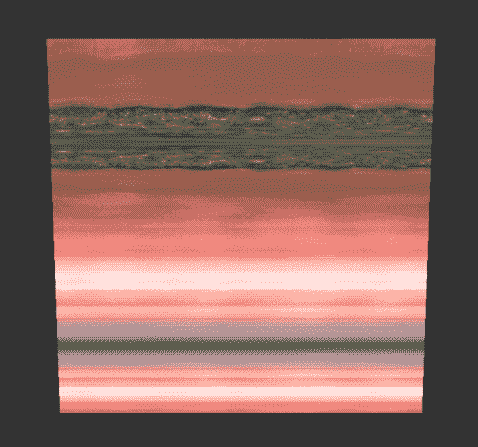

视频中，土星也在摆动。为了实现这个动作，我得到了一个 sin 函数的帮助。该正弦函数的输入之一是帧时间，它会随着时间的推移而增加。所以，球体看起来像是在摆动。

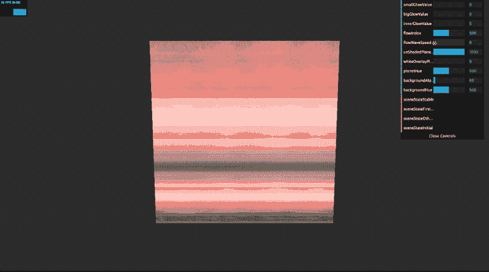

#### 洋溢

该项目中有三种类型的发光，内部，大外部和小外部发光。

对于内部发光，我创建了简单的黑白渐变纹理。然后，我将它的像素颜色添加到片段着色器中原始的土星纹理颜色中:

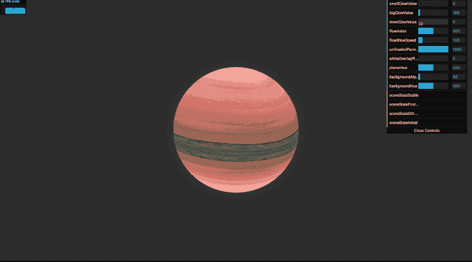

起初，我认为我可以通过使用片段着色器来创建外部发光。但我认为这有点过了，因为相机和土星不旋转。

所以我创建了黑白圆形渐变纹理。我把它们放在土星后面，并将它们的混合模式设置为加法模式。这为我节省了大量的开发时间。

你可以看到更大的光晕在活动。别忘了它实际上是土星后面的一架飞机:

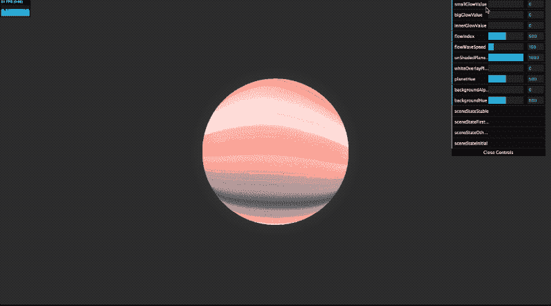

这是用同样的技术制作的更小但更亮的光晕:

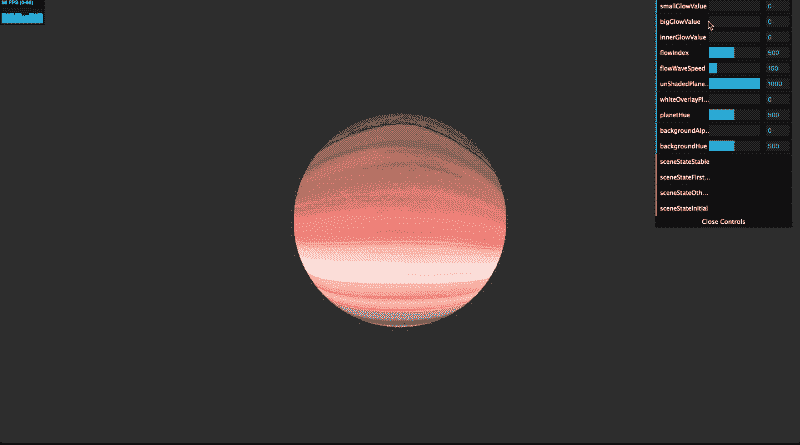

这是启用所有发光的土星的最终结果:

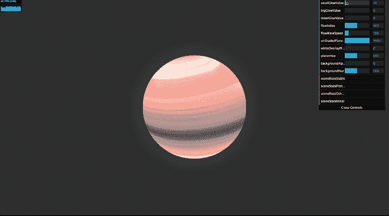

### 动画

项目的最后部分是创建与歌曲同步的动画。

在视频中，一颗流星从左上角飞来，三次撞向土星。在第一次碰撞中，真实的土星纹理、发光效果和背景变得可见。在第二次和第三次碰撞中，土星纹理和发光变得更亮。

我选的是 [tween.js](https://github.com/tweenjs/tween.js) ，JavaScript 动画库，超级好用。整个场景由背景不透明度、纹理流动速度和内外发光亮度等参数动态控制。然后，我跟踪 YouTube 播放器的当前时间，并开始以正确的秒数显示这些参数。

您可以在下面看到第二次爆炸:

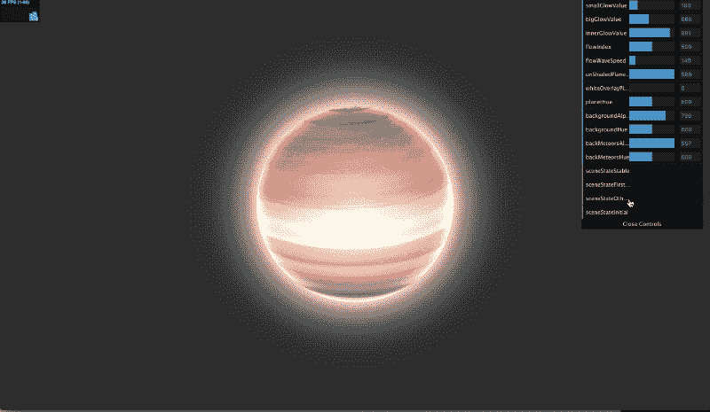

### 将他们聚集在一起

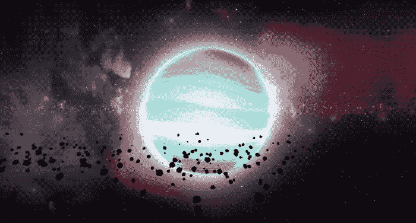

当我把所有的组件放在一起时，我不断地将我的项目与实际的音乐视频进行比较。我一遍又一遍地听同一首歌，看同一段视频，以确保我的动画与实际视频相符。很多次我完全改变了效果的值，使它们吸引观众的眼球。

经过多次修改和在场景中来回移动，我对最终结果，我的最终产品非常满意。甚至我第一次开始的时候也没想到会看到这么漂亮的东西。

在移动设备上测试该项目也令人满意。看到动画像在桌面上一样流畅，感觉棒极了。我不需要为移动设备设计任何性能技巧。

我不得不说，尝试 3D 是一次奇妙的经历。如果你擅长 JavaScript 和数学，但没有太多 3D 方面的经验，我强烈建议你玩一玩。看到你能用一些平面和球体做些什么是有益的。

*   开发者:[亚吉兹·古尔古尔](http://yagiz.me)
*   项目链接:[http://yagiz.me/andromeda/](http://yagiz.me/andromeda/)
*   项目来源:[https://github.com/yagiz/andromeda](https://github.com/yagiz/andromeda)