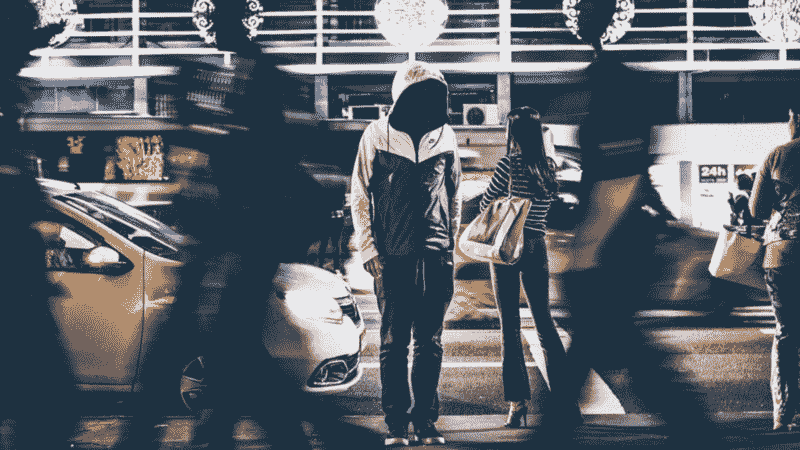
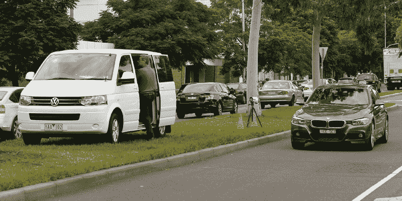
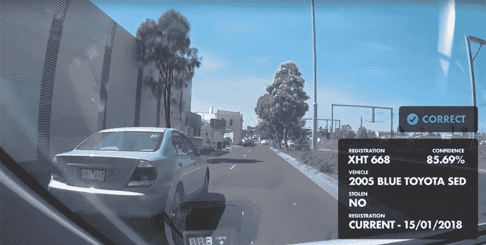
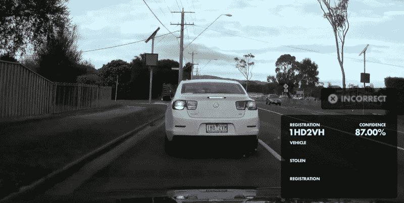
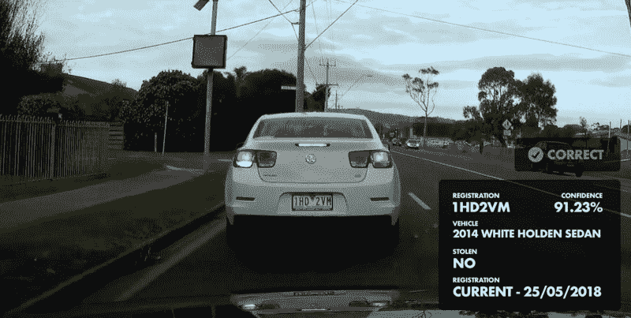

# 我如何用 57 行代码复制一个 8600 万美元的项目

> 原文：<https://www.freecodecamp.org/news/how-i-replicated-an-86-million-project-in-57-lines-of-code-277031330ee9/>

泰特·布朗

# **我如何用 57 行代码复制一个 8600 万美元的项目**

#### 当现有开源技术的实验做得“足够好”时

维多利亚警察局是澳大利亚维多利亚州的主要执法机构。过去一年，维多利亚州有超过 16，000 辆汽车被盗，损失约 1.7 亿美元，警察局正在尝试各种技术驱动的解决方案来打击汽车盗窃。他们称这个系统为 BlueNet。

为了帮助防止被盗车辆的欺诈性销售，已经有了一个 VicRoads [基于网络的服务](https://www.vicroads.vic.gov.au/registration/buy-sell-or-transfer-a-vehicle/buy-a-vehicle/check-vehicle-registration/vehicle-registration-enquiry)来检查车辆注册的状态。该部门还投资了一台固定式车牌扫描仪，这是一台固定的三脚架相机，可以扫描过往车辆，自动识别被盗车辆。

不要问我为什么，但有一天下午，我有一个愿望，那就是制作一个车载车牌扫描仪的原型，如果车辆被盗或未注册，它会自动通知你。了解到这些独立组件的存在，我想知道将它们连接在一起会有多困难。

但是，在谷歌上搜索了一下之后，我发现维多利亚警方最近进行了一次类似设备的试验，估计推广成本在 8600 万美元左右。一位敏锐的评论者指出，装备 220 辆车的 8600 万美元的成本相当令人口渴，每辆车 390909 美元。

我们当然可以做得更好。

Existing stationary license plate recognition systems

### 成功的标准

在开始之前，我概述了产品设计的几个关键要求。

#### ***要求#1:图像处理必须在本地进行***

将直播视频传输到中央处理仓库似乎是解决这个问题最低效的方法。除了庞大的数据流量费用，您还将网络延迟引入到一个可能已经非常慢的过程中。

尽管随着时间的推移，集中式机器学习算法只会越来越准确，但我想知道本地设备上的实现是否“足够好”。

#### ***要求#2:它必须与低质量的图像一起工作***

因为我没有 Raspberry Pi 相机或 USB 网络摄像头，所以我将使用 dashcam 镜头——它很容易获得，是样本数据的理想来源。作为额外的奖励，dashcam 视频代表了您对车载摄像机的整体质量期望。

#### ***需求#3:需要使用开源技术*** 构建

依赖专有软件意味着每次你请求改变或增强时都会被刺痛——而且这种刺痛会持续到以后的每次请求。使用开源技术是显而易见的。

### **我的解决方案**

在较高层次上，我的解决方案从 dashcam 视频中提取图像，通过本地安装在设备上的开源车牌识别系统提取图像，查询注册检查服务，然后返回结果进行显示。

返回到安装在执法车辆中的设备的数据包括车辆的品牌和型号(仅用于验证牌照是否被盗)、注册状态以及车辆被报告为被盗的任何通知。

如果这听起来很简单，那是因为它确实很简单。比如图像处理都可以由 *openalpr* 库来处理。

这就是识别车牌字符的全部内容:

> **一个小警告**
> vic roads API 的公共访问不可用，因此通过网络抓取对该原型进行车牌检查。虽然一般不赞成——这是一个概念的证明，我没有抨击任何人的服务器。

下面是我的概念验证刮的肮脏的样子:

### 结果

我必须说我感到惊喜。

我原以为开源的车牌识别会很垃圾。此外，图像识别算法可能没有针对澳大利亚车牌进行优化。

该解决方案能够在宽广的视野中识别车牌。

Annotations added for effect. Number plate identified despite reflections and lens distortion.

虽然，解决方案偶尔会有特殊字母的问题。

Incorrect reading of plate, mistook the M for an H

但是……解决方案最终会让他们正确。

A few frames later, the M is correctly identified and at a higher confidence rating

正如你在上面两张图片中看到的，几帧后处理图片的置信度从 87%上升到 91%。

原谅我的双关语，我很有信心，通过增加采样率，然后按照最高的置信度排序，可以提高精确度。可替换地，在继续验证注册号之前，可以设置阈值，该阈值仅接受大于 90%的置信度。

这些都是非常直接的代码优先修复，并不排除使用本地数据集训练车牌识别软件。

#### 8600 万美元的问题

公平地说，我完全不知道 8600 万美元的数字包括什么——我也不能说我的没有本地化培训的开源工具与试点 BlueNet 系统相比有多准确。

我希望该预算的一部分包括更换几个遗留数据库和软件应用程序，以支持每辆车每秒数次的高频率、低延迟的牌照查询。

另一方面，每辆车大约 391，000 美元的成本似乎相当高——特别是如果 BlueNet 不是特别精确，并且没有大规模的 IT 项目来退役或升级相关系统。

#### 未来应用

虽然很容易陷入“永远在线”的车牌窃听器网络的奥威尔式本质，但这项技术有许多积极的应用。想象一下，一个被动系统扫描其他驾车者寻找绑架者的汽车，自动提醒当局和家庭成员他们当前的位置和方向。

Teslas 车辆已经装满了能够接收 OTA 更新的摄像头和传感器——想象一下将这些变成虚拟的好心人车队。Ubers 和 Lyft 司机也可以配备这些设备，以大幅增加覆盖范围。

使用开源技术和现有组件，似乎有可能提供一个回报率更高的解决方案——投资远低于 8600 万美元。

**第二部分** —我发布了一个更新，我用自己的镜头测试并捕捉到一辆未注册的车辆，在这里:

[**还记得我复制的那个 8600 万美元的车牌扫描仪吗？接下来是这样的。**](https://medium.freecodecamp.org/remember-that-86-million-license-plate-scanner-i-replicated-heres-what-happened-next-9f3c64e8f22b)
[*成功，失败，抓一个很调皮的司机*medium.freecodecamp.org](https://medium.freecodecamp.org/remember-that-86-million-license-plate-scanner-i-replicated-heres-what-happened-next-9f3c64e8f22b)