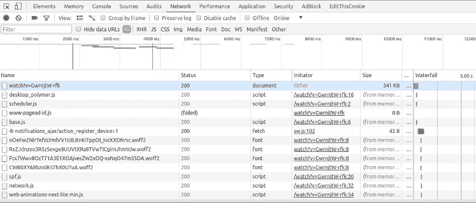
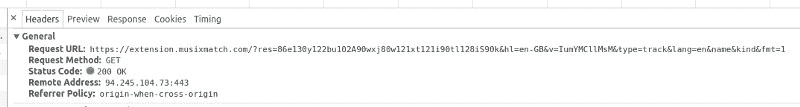
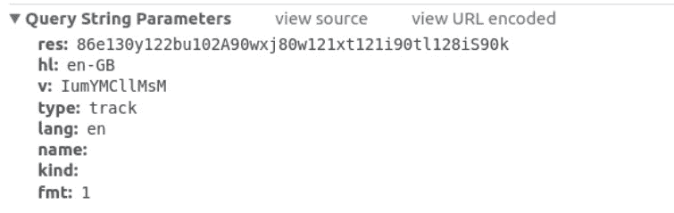
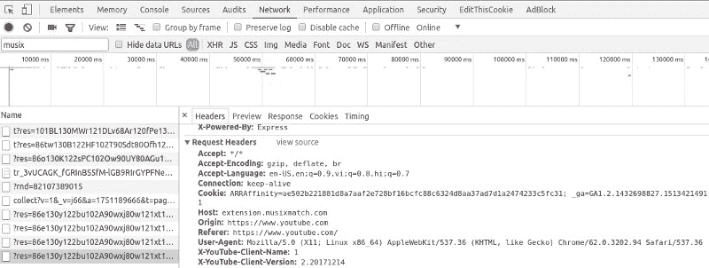
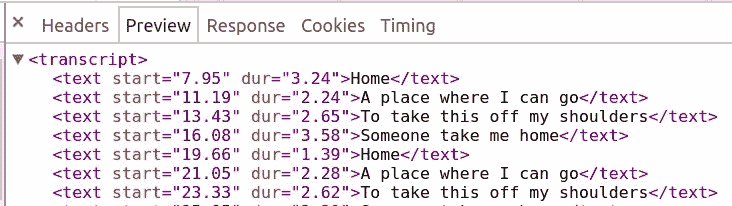

# 我如何对 Chrome 扩展进行逆向工程来编写我自己的 Flask 应用程序

> 原文：<https://www.freecodecamp.org/news/how-i-reverse-engineered-a-chrome-extension-to-write-my-own-flask-app-d77f36421106/>

图沙尔·阿格拉瓦尔

> 基本上，如果我不打算使用某个服务，我就不会费心对它进行逆向工程。乔恩·莱赫·约翰逊

从我的简历中可以明显看出，我对音乐以及几乎所有与音乐相关的事物都非常着迷。我相信音乐录影带，如果导演得当，可能是感受音乐内在灵魂的最佳方式。

所以，这一切都是从我看一首由**二十一飞行员**演唱的歌曲 **Heavydirtysoul** 的音乐录影带开始的。音乐录影带太棒了，我甚至不喜欢歌词。我听了几遍才知道，除了副歌部分，我没听懂多少歌词。

这对于许多以英语为第二语言的人来说是一个实际问题。如果你不理解歌词，你就无法充分欣赏一首歌。

就在那时，我想到了一件事:如果我可以在音乐视频旁边播放一首歌的歌词(很像字幕)，会怎么样？如果我能为我的音乐视频创建字幕文件，然后在我的视频播放器上播放，那就太棒了！

## 初始接近和寻找音乐匹配

然后，我开始全面搜索可以为我提供歌词的网站或 API。不出所料，我找到了十几个提供歌词的网站。很酷…不是吗？

那鸿因为，我真正需要的是定时歌词，很像电影的字幕。我希望歌词文本与屏幕上的当前视频帧同步。经过大量搜索，我无法找到任何这样的服务。

仅仅过了一个星期，就有人告诉我使用 **Musixmatch** ，这是一个 chrome 扩展，可以在 YouTube 视频上嵌入歌词。所以，是的，有人已经在做我想做的事情了。这听起来像是我想到的大多数其他经过深思熟虑的所谓新想法...我离为我最喜欢的音乐视频获取 sub rip“SRT”字幕文件只有一步之遥。

### 黑客攻击开始了…

我已经有了一些使用 chrome 开发工具的经验(感谢 Node.js 和前端设计)。于是我戴上黑客眼镜，启动了 Chrome 开发工具。我切换到网络选项卡，开始寻找任何可能包含歌词的文本文件。



Snapshot of developer tools with YouTtube video playing

但是我在分析一个播放 YouTube 视频的页面上的请求，所以我有很多请求。由于扩展获取歌词，请求必须与 Musixmatch 域有关。

所以我用关键字‘musix’过滤，耐心地寻找我的文件，我终于找到了。歌词和时间戳。我记下了那个请求的 URL，坦率地说，它对我来说就像是胡言乱语。不管怎样，我复制了 URL 字符串，然后粘贴到 URL 栏，瞧，我得到了歌词。

因此，剩下的唯一事情就是找出 URL 是如何被构造的，参数是什么..



Request URL

### 参数和什么？

经过所有的分析和过滤，我最终得到了这个。一个带有一堆未知参数的长 URL。



Parameters for the URL

我需要更深入地了解每个参数的重要性。很明显，真正重要的参数只有`res`和`v`。其他的只是用来做家务的。然后我开始探索选项，结果浪费了一个小时才发现参数`v`不过是 YouTube 视频 Id。

例如，带有 URL https://www.youtube.com/watch?v=ZQeq_T_2VE8 的 YouTube 视频的视频 Id 或`v`是`ZQeq_T_2VE8`。既然我已经揭开了`v`的神秘面纱，我原以为我几乎不用再花一个小时就能找到`res`的下落，但是好家伙，我错了。

### 参数“res”的奇怪情况

一个小时的深度分析研究，什么都没给我。过了一会儿，我意识到即使我改变了几个字母，这个 URL 仍然有效。我继续挖掘，3 个小时后，我发现字符串中的字母没有任何意义。它们只是被随意摆放。

```
A typical value of res : 90rt120b114xz70xv82w85vv90a94hn90vb102av86
```

所以我完成了字母，但数值对我来说还是陌生的。我能想到的下一件事是应用一点逆向工程来分析这些数字。

我开始删除所有的字母，因为它们没有任何意义，我首先注意到这些值的数量是固定的，是 11。我尝试了许多其他视频，但数量保持不变。

突然，我想到，视频 Id，我们之前讨论过的`v`，也有 11 个字符。然而，`v`中的每个字符可能是一个字母或一个数字，甚至是一个“-”或“_”，不像`res`只有数字。

所以，我尝试了最明显的映射，可以将一个字符映射到它的数值，ASCII，就是这样。我猜，字符是 ASCII 编码的，字母随机放在数字之间，使整个字符串看起来更随机。

在这一点上，我很高兴。毕竟，我已经了解了所有的参数，只差一步就可以编写自己的脚本来下载“srt”格式的歌词文件了。为了确保万无一失，我检查了不同的视频，似乎没有任何问题。我还把网址分享给了我的一个朋友(是啊，一个音乐爱好者)。

我得到了一个快速回复，上面写着“这是什么？“没什么。我反复检查了这个网址，它在我的浏览器上运行良好。

### 谁是罪魁祸首？:P

> 我没有收到像内衣这样奇怪的东西。我收到了饼干。:P —詹妮弗·安妮斯顿



Cookie field in the Request Headers

我再次启动了开发者工具，然后复制了一首新歌的链接。它再次工作，然后我切换到一个隐姓埋名的标签，粘贴相同的网址。没用。

我参加 CTF(夺旗)比赛的经历立刻告诉我，这与饼干有关。如果一个 URL 在一个浏览器窗口中有效，而在另一个窗口中无效，这是最有可能的情况。

我切换到开发人员控制台，看到浏览器确实在发送 cookie。可以肯定的是，我多次分析了这个请求，最终发现发送的 cookie 与 Musixmatch 服务器在响应中发送的相同。此外，每个 cookie 仅在特定时间段内有效。

因此，我使用 urllib 编写了一个 Python 脚本，它首先从普通的 HTTP 响应中获取 cookie，因为 cookie 可以跨域工作。然后 cookie 和其他参数被构造成一个 HTTP 请求，我们得到了歌词...终于！！

### 为成功的请求准备参数

下面是上面讨论的所有步骤的 Python 代码。代码首先生成参数，然后请求获取 cookies。然后使用参数准备 URL。接下来，cookie 和其他头字段(如“Host”和“User-agent ”)一起定义在头请求中，以使它看起来更真实。

### 将原始定时歌词解析成 srt 格式

现在，下一个主要的事情或者唯一剩下的任务是将原始的定时歌词数据转换成适当的 srt (SubRip Text)格式。下面是 MusixMatch 歌词格式的样子。



HTTP Response for the lyrics

以下是 srt 文件的正确格式。这些文件包含以组为单位的格式化的纯文本行，由一个空行分隔。字幕按顺序编号，从 1 开始，如下图所示。

```
100:00:00,350 --> 00:00:03,45071 buildings explodedor caught fire.
```

```
200:00:03,490 --> 00:00:05,020Elliot, tell me what it isthat you think he did.
```

```
300:00:05,060 --> 00:00:06,930Sorry.I don't know if I can say.
```

这听起来像是需要做大量的工作，因为数据还没有被正确格式化。但是，如果您有所需的数据和 Python 知识，只需要一个简单的脚本来处理数据，这正是我所做的。在 HTML 解析过程中，HTML 标签让我有点恼火，但是你猜怎么着，有一个很棒的 HTML 解析库，它让整个过程变得非常简单。不用猜库的名字，HTMLParser :-)。

## 最后的话

所以，我把这个脚本和一些修改放在一起，在 flask 服务器上有一个简单的前端，我有了自己的歌词获取接口，可能是全世界唯一的一个！！

顺便说一下，如果你喜欢音乐，可以看看 Musixmatch。真的很牛逼。这个练习只是出于教育目的，并没有以任何方式侵犯 Musixmatch 的版权。