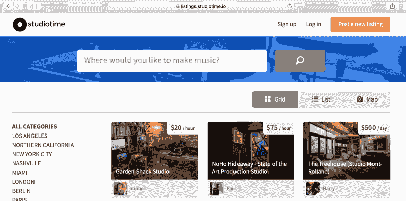
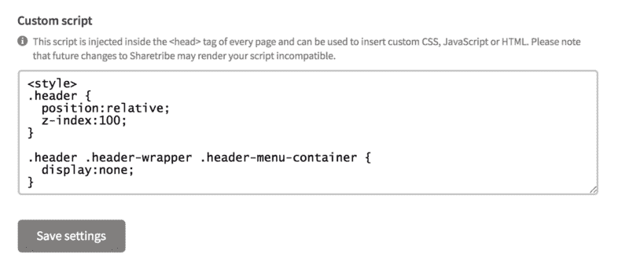
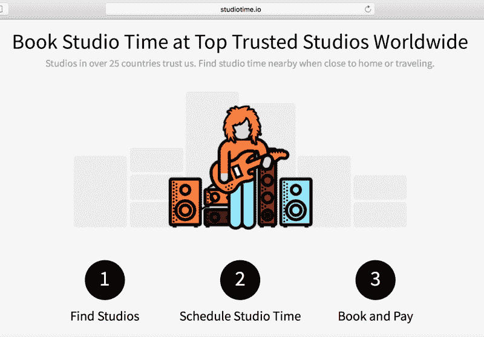
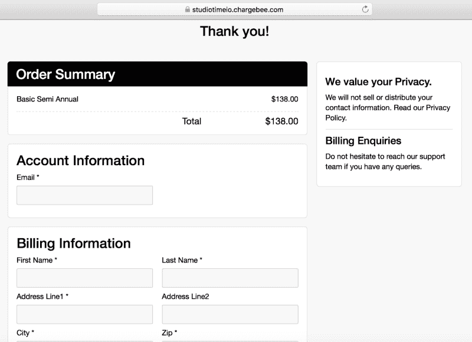

# 我如何进入世界上最大的音乐工作室市场

> 原文：<https://www.freecodecamp.org/news/how-i-scaled-the-worlds-largest-music-studio-marketplace-75a90e5d551b/>

作者:迈克·威廉姆斯

# 我如何进入世界上最大的音乐工作室市场

Part 2 of my How I series that features to tools I used in scaling Studiotime to the largest online community of music studios!

在我之前的[帖子](https://medium.com/p/742b47bc09c2/edit)中，我分享了更多关于我如何在一个晚上将 Studiotime 从一个想法变成 MVP(最小可行产品)的故事。在产品搜索上发布后，它在几个小时内就产生了数千用户。现在我想讨论一个我有很多疑问的话题:我是如何将它扩展到世界上最大的音乐工作室市场的。

我使用 Sharetribe 为 Studiotime 构建了最初的 MVP，这样我就可以快速启动、验证产品，并关注反馈。随着市场规模的扩大，我一直在构建和产品上花费相对较少的时间和资源。我不再需要支持完全定制的市场平台，而是利用集成在一起的工具来提供 Studiotime 所需的完整功能和特定用户体验。

### Studiotime 工具堆栈

正如在第 1 部分中提到的，我利用 Sharetribe 作为市场平台的全部功能。该功能包括用户帐户创建、个人资料、用户对用户消息、工作室列表创建、工作室预订、支付和同行评审。子域 [listings.studiotime.io](http://listings.studiotime.io) 上的任何 Studiotime 页面都在 Sharetribe 的托管平台上。

All listings.studiotime.io pages are on Sharetribe’s hosted platform.

除了 Sharetribe 提供的基本功能之外，我还必须进行一些定制，以满足 Studiotime 的特定需求。我在前端做了这些改变(因为他们没有公开 API)，允许在他们的托管版本管理面板上定制脚本。

Where I inserted some of the customization where allowed on the Studiotime admin panel for the Sharetribe hosted component.

[Wordpress](http://www.wordpress.com) -我使用我为所有 Studiotime 登陆页面创建的 Wordpress 模板，例如[主页](http://www.studiotime.io)、[为什么](http://www.studiotime.io/why)、[订阅](http://www.studiotime.io/subscription)，以及我们的[艺术家、制片人和工程师社区](http://www.studiotime.io/community/)。我使用单独的域，然后将它们集成在一起，以提供无缝的用户体验。所有的 [www.studiotime.io](http://www.studiotime.io) 页面都在 Wordpress 上，这些页面的一些功能只是链接到 [listings.studiotime.io](http://listings.studiotime.io) 子域，以获得 Sharetribe 平台上的全部功能，并通过链接进行整合。

Any domain [www.studiotime.io](http://www.studiotime.io) such as this Why page at [www.studiotime.io/why](http://www.studiotime.io/why) is on Wordpress.

由于 Sharetribe 的平台没有考虑订阅功能，Wordpress 也不是收集、管理和通知订阅的最佳平台，所以我使用 Chargebee 作为订阅平台。

I link to the Chargebee hosted subscription payment checkout from [www.studiotime.io/subscription.](http://www.studiotime.io/subscription.)

By using Chargebee, I also have subscription management capabilities and analytics.

[Stripe](http://www.stripe.com) - Stripe 是我们用于 Studiotime 和订阅的支付网关。它很容易与 Chargebee 和 Sharetribe 的托管平台集成。

Zapier 是我用来连接来自多个托管平台和工具的通知和通信的工具，并将它们集成在一起，以便它们可以有效地与一个 hub(Slack)通信。

Slack 是我集成多个平台、工具和所有通知的地方，因为没有一个主要的 API，API 与工具的集成，但必须有一个主要的集成点。如果没有 Slack，所有的工具将很难一起管理，因为 Sharetribe 没有 API，而是托管的。

A snapshot of how I have subscriptions integrated with Slack (via Zapier), which then triggers user authorization on Studiotime all through Slack.

现在，您已经看到了 Studiotime 的工具堆栈，您可以了解我是如何利用工具来实现 Studiotime 所需的特定功能，将它们集成在一起，并允许我在产品本身上用最少的时间和资源来扩展 Studiotime。

有了创造性的方法和足智多谋，你可以像我为你的副业项目或创业所做的那样利用工具。这些不仅仅是为了 MVP 的建立，也可以是为了像 Studiotime 这样的市场领导者，studio time 是世界上最大的在线音乐工作室社区。

> 有问题并想了解更多关于 Studiotime、工具和流程的信息？请在下面评论您的问题，我将在 How I 系列的第 3 部分中以问答的形式回答您的问题！

> 想看更多细节的视频吗？观看我分享更多内容的视频: