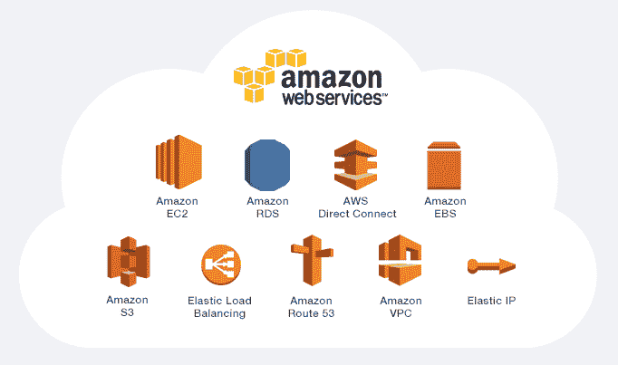
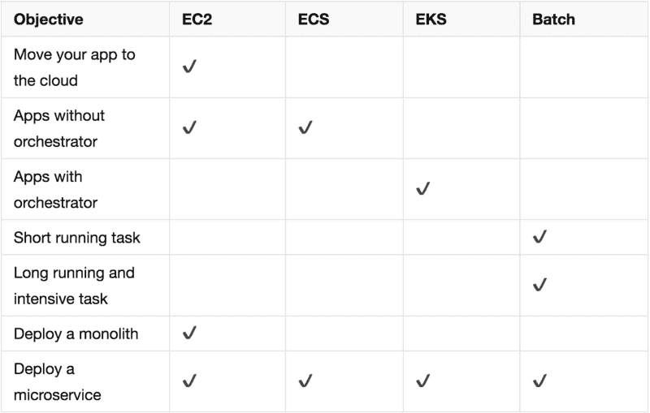
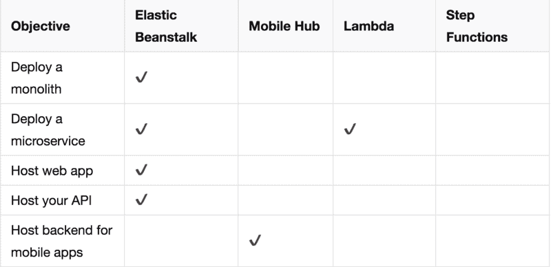
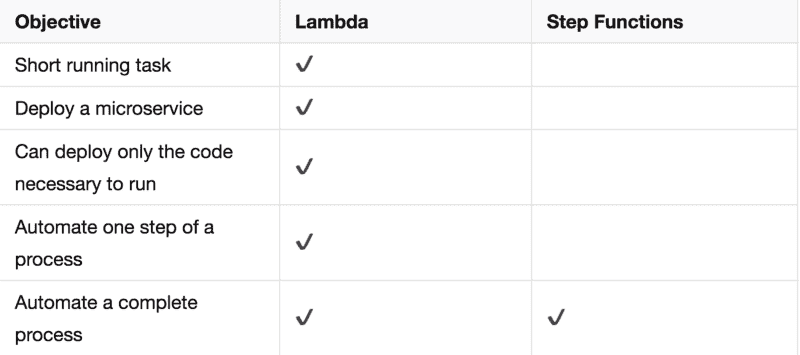

# 我如何选择 AWS 服务来运行我的应用

> 原文：<https://www.freecodecamp.org/news/how-i-select-aws-services-for-running-my-apps-14e3abb7c56a/>

彼得·姆巴努戈

# 我如何选择 AWS 服务来运行我的应用

AWS Services

选择使用哪个 AWS 服务来运行您的应用程序可能会让我们有些困惑。即使对有经验的人来说，做决定也需要一些时间。也许您是 AWS 的新手，您可能仍然需要了解各种 AWS 服务的内容和原因。或者，您可能知道如何使用 AWS，但它仍然会花费您更长的时间，因为您没有一个便于轻松选择的过程。让我向您展示我是如何做到这一点的，以及我遵循的流程。

### 看看这个过程

当您选择使用什么服务来运行应用程序时，请尝试回答以下问题。

### 问题 1:我需要多大的控制力？

当回答这个问题时，我决定什么是我想控制的，什么是我想留给 AWS 的。

我选择是否要控制它将在哪个操作系统(OS)上运行，如何配置网络，服务器，应用程序代码及其配置。

但是更多的控制意味着更大的责任。例如，如果我控制着操作系统，我将负责更新它，保护它，并配置向公共网络公开的内容。

不同的云计算选项赋予您控制权和责任。让我们看看这些选项以及我们可以控制的内容。

#### 选项 1:基础设施即服务(IaaS):

IaaS 计算为您的 IT 资源提供了最高级别的灵活性和管理控制。它提供对网络功能、计算机(虚拟的或专用硬件上的)和数据存储空间的访问。如果您想要控制裸机运行您的应用程序并处理以下所有责任，请使用此选项:

1.  应用程序配置
2.  应用代码
3.  服务器维护和配置
4.  操作系统
5.  抗病毒素
6.  网络

以 IaaS 形式提供的服务包括:

1.  弹性计算云(EC2)实例
2.  亚马逊光帆
3.  EC2 集装箱服务
4.  Kubernetes (EKS)的弹性集装箱服务
5.  AWS 批次

#### 选项 2:平台即服务(PaaS)

PaaS 计算消除了您管理底层基础架构(硬件、操作系统、网络)的需求。这样，您就可以专注于创建和运行应用程序，而不是构建和维护底层基础设施和服务。如果您想要控制，请使用此选项:

1.  应用程序配置
2.  应用代码
3.  服务器配置

同时将其他职责留给 AWS。

作为平台即服务提供的服务有:

1.  弹性豆茎
2.  移动集线器

#### 备选方案 3:作为一种服务发挥作用(FaaS)

FaaS 计算为您提供了部署代码和设置运行代码所需配置的能力。您让 AWS 来处理底层基础设施和网络。如果希望控制应用程序逻辑和配置，请使用此选项。

此外，使用它的另一个重要原因是应用程序偶尔会运行。也就是说，与其他类型的云服务产品中的应用程序不同，它并不总是开启和运行的。

此类别中可用的服务有:

1.  希腊字母的第 11 个
2.  阶跃函数

### 问题二:用户会如何使用 app？

另一个需要考虑的问题是知道用户将如何使用应用程序。

1.  **它会一直打开并运行，等待输入/数据处理吗？**即使没有输入/数据/请求进来，它也只是处于闲置状态，消耗服务器资源和基础设施。
2.  它会仅在需要时运行吗？在这种情况下，应用程序在有请求或数据要处理时启动，在完成时停止。

如果我的应用程序使用模型满足问题 **1** ，那么我需要使用经典模型来运行应用程序。我可以使用 EC2 实例、ECS 或 Elastic Beanstalk。如果它满足问题 **2** ，我就用 Lambda 运行。

有时候我们想运行后台任务。它们将根据运行时间的长短和良好运行所需的资源数量而有所不同。当面对这个问题时，我会在使用 Lambda 和 Batch 之间做出选择。如果我需要一个任务在最大允许处理时间内运行，并且不需要超过 Lambda 所能提供的资源，我会选择 Lambda。如果与此相反，我会选择 Batch。

这两个问题帮助我在 AWS 中选择服务。下表显示了如何通过回答更具体的问题以及了解哪些服务符合标准来进行选择。

#### 选择 IaaS 产品

selecting IaaS services

#### 选择 PaaS 产品

selecting PaaS services

#### 选择 FaaS 产品

selecting PaaS

上面的步骤应该可以指导你，让你更快更容易地做出决定，所以我希望你觉得它们有用。

这是我的过程，将来可能会改变，但我会尽量保持这篇文章的更新。我遗漏了一些与数据/存储相关的服务，我将在以后的帖子中分享。

如果你想分享你的想法，或者纠正你认为我错了的地方，请留下你的评论。我从我的朋友 Barry Luijbregts 那里学到了一些步骤。

> Peter 是一名软件开发人员、科技作家和 Hamoni Sync 的制作者。他目前在 Field Intelligence 工作，帮助构建物流和供应链应用程序。他还参与这些产品的设计研究和客户支持。他也是帽衫的贡献者和线下第一社区的成员