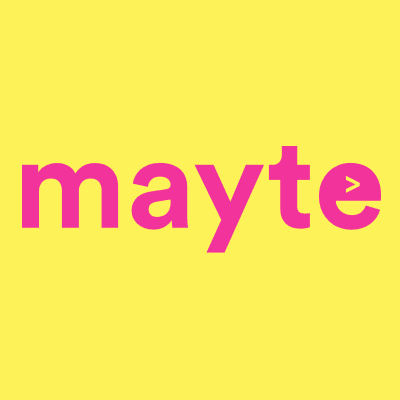

# 作为一名自学成才的开发人员，我是如何找到第一份工作的？我疯狂地准备着。

> 原文：<https://www.freecodecamp.org/news/how-i-set-myself-up-to-land-my-first-job-as-a-self-taught-developer-43d326ea6b67/>

乔纳森·普茨

# 作为一名自学成才的开发人员，我是如何找到第一份工作的？我疯狂地准备着。

> “给我六个小时砍树，我会用前四个小时磨利斧头。”——亚伯拉罕·林肯。

这句话很好地体现了我将要给出的建议。因此，如果你必须从这篇文章中学到什么，我会鼓励你记住这句话。如果你不太清楚这些著名词汇背后的含义，到时候你会明白的。

我认为有必要提供一点关于我自己的背景故事。我不想让你把我当成一个给你建议的陌生人。我想让你把我看成一个和你一样的个体，和你有相似的经历。

我是一名 22 岁的自学成才的开发人员。9 个月前开始学的。

在我踏上编码之旅之前，我是一个受社会和教育系统影响的典型青少年。

在我高中的最后一年，有人给了我几个月的时间，告诉我需要做出我一生中最重要的决定之一，我想在高等教育中学习什么。

我想我会去一个稳定和安全的领域，所以我选择了供应链和物流。

在大学的两年里，我忐忑不安，也不确定为什么。我认为，作为一名年轻的大学生，不快乐和不满足的滋味是正常的。我想:“一旦我毕业并找到一份工作，这一切都会改变！”

我现在知道这与事实相去甚远。

真正的问题是，我还没有找到真正有激情的事情——一些我可以花时间和精力去做的事情，而不是贴上“工作”的标签。就在我第三年开始之前，我发现了自我发展的世界，并在那之后不久开始编程。

我最近在一家年轻的成长中的初创公司找到了一份开发人员的工作。

My second home!

这是我第一次也是唯一一次和一家真正的公司坐下来谈，我成功了。

注意，在此之前，我确实见过两家招聘机构。但那是为了提高我的面试技巧，为将来的面试做准备。

总而言之，我认为第一次成功是一个相当大的成就。虽然我有项目和代码可以展示，但我相信是我过去的经历、性格、思维方式以及我作为候选人时的定位导致了我的成功。

### 我是这样成为候选人的。

让我们先解决最重要的(也是非常明显的)问题。

#### 每天编码。

如果你对开发人员这件事是认真的，你应该尽可能地掌握和提高你的技能。编码应该是你自己的延伸。

你应该到达这样一个点，当你醒来的时候，你自然会想坐下来练习代码。

如果你错过了一天，这不是生死攸关的事情，但重要的是你每天都要努力适应。

#### **设定目标。**

你可能已经听过很多次了，希望这一次你能坚持下来，并开始做。

设立目标被宣扬是有原因的。

没有目标，你永远不会发挥你的全部潜力。没有目标，你会不停地追逐某样东西，但永远也不会成功。

“我要成功！”或者“我想变得富有！”这些不是目标，这些是愿望。

你一定要具体。你必须确切地知道你想要什么，以及你将如何得到它。你必须工作直到你得到它。

明确你想要什么，写下来，每天阅读。

9 月初，我在日记中写道:“到 2018 年 2 月，我将在一家我信任的公司找到一份开发人员的工作。”

从那时起，我做的每一件事，都是为了达到那个目标。

我大约 5 周前才开始看招聘启事。我在 3 个月内实现了我的目标，而不是最初设定的 5 个月。

这就是目标的美妙之处。有方向和目标意味着一切的不同。

#### 抓住任何学习的机会。

今年，我得以参加欧洲创新学院，这是世界上最大的极限创业项目。

我遇到这个机会是因为我把自己放在那里，提高了对我个人品牌的认识，这将是下一个话题。

学院对我来说是一生难得的机会。我能够与来自世界各地的学生合作，也能得到来自谷歌等公司的专家的指导和教导。

我带着洞察力和知识回家，这绝对让我成长，让我在竞争中脱颖而出。

在与潜在雇主会面时，你能做的最好的事情就是展示你是如何致力于通过新的机会学习和成长的。他们为什么要雇佣一个明知候选人很有可能变得自满的人，因为他们已经在公司获得了一个职位？

此外，学院的导师会不断强调，创业公司最重要的不是想法，而是背后的文化和人——集体思维。

雇佣有上进心和动力的员工对公司最有利。成为那个人。

#### 打造你的个人品牌。

如果你想脱颖而出，你必须在你希望成为其中一员的行业中显示出一些权威。开始把你自己和你的内容放在那里。

我之所以能够获得加入创业计划的机会，是因为一个朋友看到了我正在做的事情并推荐了我。我不知道这个项目的存在，如果我不告诉自己我的目标和我渴望成为什么样的人，我可能会错过这个项目。

擅长写作？开始写博客。

擅长上镜？开一个 YouTube 频道。

享受音频？开始你自己的播客。

你不必成为专家，你只需要开始记录你的旅程。每个人都喜欢故事。

愿意把自己放在那里，脆弱，并显示你是认真的。通过这样做，你已经超越了大多数竞争对手。

### **结论**

> “给我六个小时砍树，我会用前四个小时磨利斧头。”

还记得我们以前的老朋友吗？

人们如此沉迷于试图学习某些编码框架或语言，以试图安抚招聘信息。那些只是工具。最重要的是谁在使用工具。

如果你能与雇主会面，并真正展示自己是一个适合他们团队和文化的候选人，你就有很大的机会获得这份工作——不管你是不是自学的。

如果你的目标是砍树，而不是毫无准备地乱砍，为什么不掌握斧头并磨快它呢？现在你可以几下子就把那棵树砍倒。或者，如果你幸运的话，一蹴而就！

祝你旅途好运。像往常一样，我的收件箱对任何需要进一步建议或有问题的人开放。

请随时在下面的任何平台上与我联系！

[insta gram](https://www.instagram.com/jonathanpucc/)|[LinkedIn](https://www.linkedin.com/in/jonathan-puc-549531b3/)|[Twitter](https://twitter.com/jonathanpuc7)