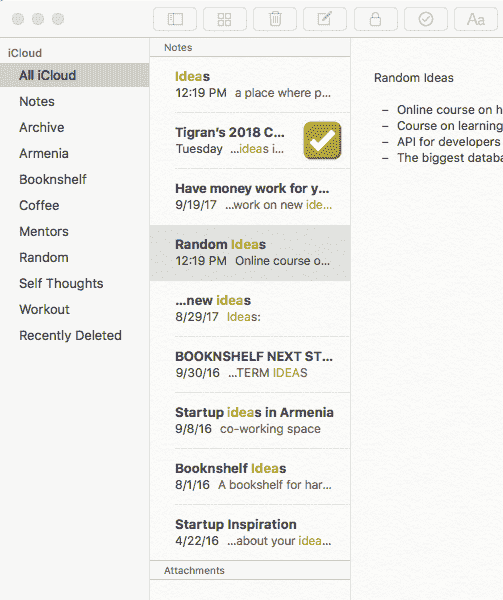
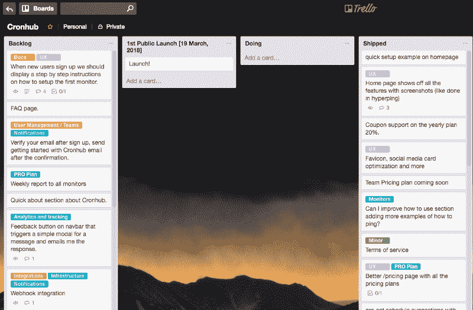
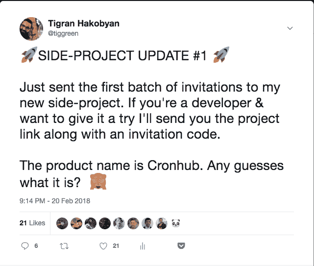

# 我是如何在全职工作时运出我的第一个 SaaS 兼职项目的

> 原文：<https://www.freecodecamp.org/news/how-i-shipped-my-first-saas-side-project-while-working-full-time-5ad33cf89121/>

作者:蒂格兰·哈科比安

# 我是如何在全职工作时运出我的第一个 SaaS 兼职项目的

这是我的个人故事，讲述了我在 Buffer 全职工作时如何运出我在 SaaS 的第一个兼职项目。这篇文章的目标是激励你。如果你像我一样，有一份全职工作，并想建立一个有利可图的副业作为收入来源，那么这个故事可能会引起你的共鸣。

通过这篇文章，我想展示我如何不“匆忙”或过度工作，仍然能够运送一个真正的 SaaS 产品。

我是一名 web 开发人员，非常幸运的是，除了在空闲时间踢足球之外，我还喜欢编码和构建 web 项目来取乐。最近，我创建了 [Booknshelf](http://booknshelf.com/) ，帮助许多人在网上整理他们的书籍。虽然全职工作对我的工程成长有很大的影响，但我从我的个人项目中获得了一些开发技能。

直到去年，我才开始考虑在全职工作之外有一个不同的收入来源。依赖一份薪水的想法有点可怕。我知道我有能力和热情去解决一些事情。

我决定要创业，考虑到我所拥有的技能，可能是网上创业。引发这些想法的另一个原因是，我想体验和学习创业意味着什么。我一生中从未经营过任何企业，所以我认为这是一个很好的学习机会，一条我可以学到我目前没有的技能的道路。可能发生的最糟糕的事情是，如果我失败了，我仍然会获得经验和大量的知识。

### 想法

你可能已经猜到了，作为一名开发人员，我做的第一件事就是开始思考想法。想法对我来说从来都不是问题，但找出哪些想法是合适的总是问题。这一次，我决定尝试一种不同的方法，并在采取行动之前认真思考这个想法。我想用一些标准来检验每个想法。

*   我想解决一个真正的问题，可能是我个人面临的问题
*   应该是为了我很了解的市场
*   这不应该是一个新的想法(它不会改变世界)
*   它可以成为一门生意

任何想法的黄金法则是它必须解决人们面临的问题。过去，我在笔记上添加了太多的想法——所以这是一个访问我保存的想法池的问题。

我从一开始就知道，如果我为开发者开发一些东西，我可能会更成功，因为我非常了解这个市场，我的大多数密友和在线追随者都是技术人员。我可以利用我的网络和观众来验证我的想法，并在我做出任何承诺之前获得可靠的反馈。

这真的把我所有的想法过滤成了一个 2-3 件我可以做的事情的列表。其中一个想法是我不断反复想起的。这是我在 Buffer 和之前的副业项目工作期间都遇到过的问题:一种监视预定 cron 作业的简单方法。

由于我的工作领域之一是分析数据基础设施，所以我在后台运行了十几个 cron 作业，为我们的客户收集日常分析数据。它必须是最新的。我们使用的 [Datadog](https://www.datadoghq.com/) 监控服务确实很棒，但它主要是为监控连续服务或服务器而设计的。我想要一个简单的仪表板，在那里我可以看到我所有 cron 作业的列表、它们的状态和日志。每天获取所有运行作业的报告，这样我就知道一切都在正轨上。

在选择这个想法后，我想看看市场上是否有任何现有的解决方案。如果有的话，这是对某些工具有需求的好迹象。

事实上，市场上有一对夫妇有不同的付费计划。我不一定想要建立一个全新的东西，因为如果我这样做了，我就很难定义和验证市场。所有现有的解决方案都有付费计划，所以我知道人们会为此付费。下一个目标是通过构建和发布最初的 MVP 来验证我的想法是否正确。

### 最有价值球员

我花了 2 个月的时间构建了 Cronhub 的初始版本(是的，我给它起了个名字)。一些可行的东西，我可以发送给我的一些朋友和 Twitter 追随者来尝试。对于 MVP，我想要一些非常简单，但又足够有价值的东西，让人们愿意为它付费。我知道你可能认为两个月的时间对于打造一个 MVP 来说太长了，但是我没有采用传统的“仓促”方法。相反，我:

*   每天只工作 1-2 小时
*   每天睡 8 小时
*   我想看的时候就看网飞
*   周末充分休息
*   使用我觉得最舒服的技术堆栈

由于我有一份全职工作，我通常从晚上 7 点到 8 点半在 Cronhub 上工作。我也可以在清晨工作，但我早上大部分时间都在健身房。有几天，下班后我感到精神上非常疲惫，我放松了，但大多数时候我坚持我的例行公事。

我知道，如果我想完成这个项目，我必须保持动力，每天提交，即使是一个小的变化(可能是一行提交)。对我来说，坚持不懈总是非常有用的。我用 Trello 把我的项目任务分解成小的里程碑。

我试着把每个任务做得很小，这样我就可以在一天内开始并完成。保持小任务有助于我更快地完成任务，并看到我每天的进展。当你看到进步时，它会给你很大的激励，让你继续前进。我认为这是一个心理把戏。做大任务会让你慢下来，最终你会放弃，因为你感到无聊，你想跳到别的事情上去。

我从不通宵工作。每天 10 点半左右睡觉，7 点醒来。拥有充足的睡眠是我的头等大事。它定义了我白天的精神能量，我不能牺牲它。除了睡个好觉，我决定花大部分周末时间做一些完全不同的事情，比如踢足球，看电影，或者和朋友家人在一起。尽管我热爱编码，但我知道这很容易让自己筋疲力尽。周末帮助我提神醒脑。

我认为作为一名开发人员，你总是希望使用最热门和最酷的技术。没关系。我也想那样。然而，我的目标不同，我想用我已经知道的技术尽可能快地构建和发布 Cronhub。我一直专注于我的目标，并且使用了拉腊维尔和武杰斯。Cronhub 是一个使用 Laravel 作为后端的单页面应用程序。

### 封闭测试版发布

2 月 20 日，我完成了 Cronhub 的最简版本，并准备邀请第一批早期用户试用。在我发完推特后，大约有 20-25 个人在推特上联系我，请求邀请。我从他们那里得到的反馈非常有价值。

有几个报告的错误和一些很棒的功能建议，我已经添加到我的反馈文档中。跟踪用户反馈是一个重要的步骤，因为它有助于确定你在做产品决策时可以参考的明显模式。

总的来说，第一印象和反馈是令人鼓舞的。现在我需要继续改进产品，为首次公开发布做好准备。我计划在一个月内首次公开发布。

### 公开发布

三个月后，我将向公众推出我的第一个 SaaS 兼职项目。耶！

我当然很紧张，不知道这会不会成功。然而，我知道这让我离我的目标更近了一步。我的目标是让 Cronhub 成为一家盈利的在线企业，在这里我可以学习和体验经营企业的所有隐藏秘密。毕竟，最坏的情况会是什么呢？我会学到很多东西！

我知道我可能太专注于考虑盈利能力，但在过去免费建立了几个副业项目后，我知道是时候更认真地对待我的时间了。时间是我拥有的最有价值的资产，我想有意识地使用它。开发付费产品更有动力，它会推动你前进。另外，免费维护副业是很昂贵的——我从自己的经验中知道这一点。

### 经验教训

过去的三个月是反思的好时机，也是评估哪些做得好，哪些做得不好的好时机。每次我建立一个新项目，都是一次新的学习经历。每个项目都是独一无二的，需要围绕产品进行不同的思考。作为一名产品工程师，我想发展我的产品思维，这很有帮助。

总的来说，我学到了很多东西，这些东西真的帮助我开始并提出了一个想法。我想和你们分享其中最重要的。

*   **解决一个你亲自面对的问题**。这一点非常关键，因为本质上你是在为自己打造产品，时刻把自己记在心里。这使得做出好的产品决策变得更加容易。你知道你应该问什么问题，你问对问题的几率更高。
*   让你的任务保持小规模。当你把你的项目分成几个部分时，试着把它们变小。衡量任务大小的一个好方法是问自己“我能在一天内完成这个任务吗？”如果答案是“不”，那么这可能是一个大任务，你可以进一步分解它。
*   **好好睡觉，好好休息。我不能强调适当的睡眠有多重要。你不必通宵工作。关注渐进的进步和日常的小承诺。如果你不照顾好自己，你会很快感到疲倦，最终放弃。**
*   选择一个你熟悉的市场。我是开发商，对这个市场很了解。我知道成为一名开发人员需要什么，以及开发团队如何协作。这给了我一种在这个市场上行得通和行不通的感觉。当然，我还是有可能是错的，但是几率要小很多。
*   谈论你的项目。这对我来说很有挑战性，我仍在适应。我不太喜欢谈论自己。我更喜欢听。谈论我正在建设的项目对我来说并不容易，因为我有点害羞，不想给人留下我不断谈论自己的印象。然而，我知道我必须把这个消息传出去，把我的项目推向市场。别人一开始就是这样发现的。这篇文章就是一个例子。

### 最后

非常感谢你的阅读。我希望你喜欢这个故事，并从中学到至少一件事。我很乐意收到您的来信，所以请随时提出您的问题。你可以在推特上联系我，或者发电子邮件给我。

如果你是使用 cron jobs 的开发人员或团队成员，你可以免费试用 [Cronhub](http://www.cronhub.io/) 。如果您升级到“开发者”计划，使用优惠券“indiehackers”获得 20%的折扣。

[Cronhub 今天上 PH](https://www.producthunt.com/posts/cronhub)如果你想支持我:)

保持运输——Tigran

*最初发表于[www.indiehackers.com](https://www.indiehackers.com/@tigran/how-i-shipped-my-first-saas-side-project-while-working-full-time-42862e847b)。*