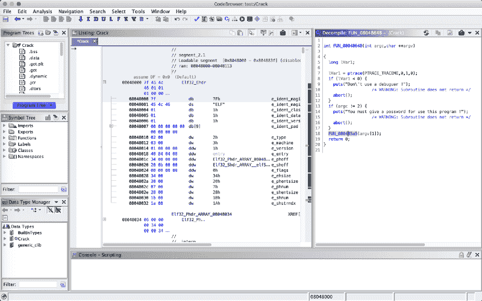
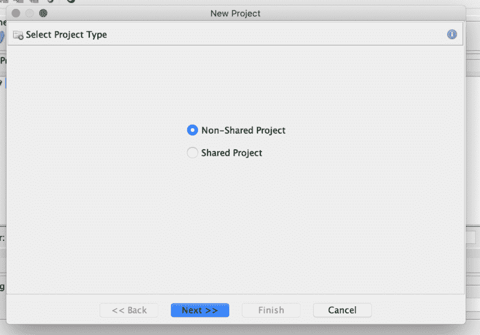
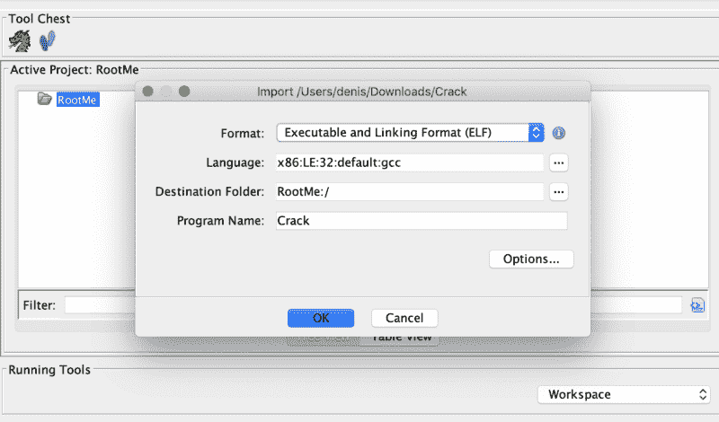
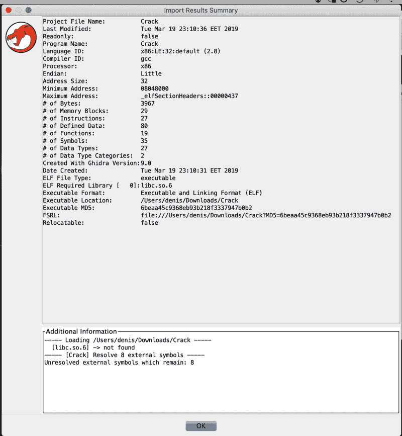
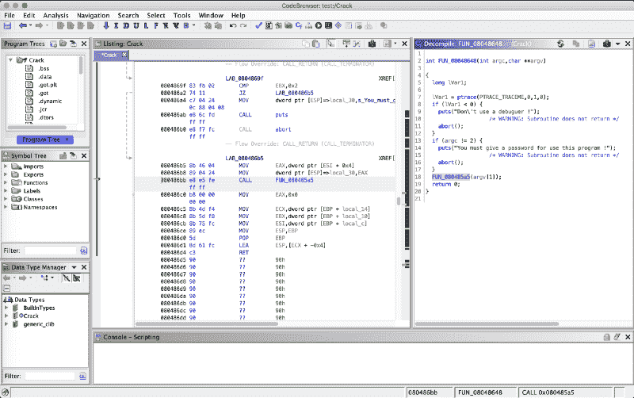
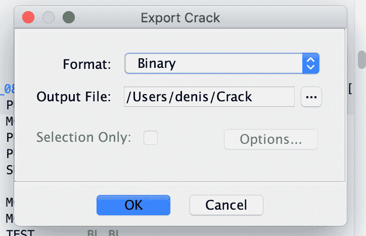

# 我是如何用国家安全局的 Ghidra 解决一个简单的难题的

> 原文：<https://www.freecodecamp.org/news/how-i-solved-a-simple-crackme-challenge-with-the-nsas-ghidra-d7e793c5acd2/>

by Denis Nuțiu

# 我是如何用国家安全局的 Ghidra 解决一个简单的难题的



你好！

我最近玩了一会儿 g hidra T1，这是一个逆向工程工具，最近由美国国家安全局开源。官网对该工具的描述是:

> 由美国国家安全局研究局开发的支持网络安全任务的软件逆向工程(SRE)工具套件。

我正处于逆向工程生涯的初期，所以没做什么高深的东西。我不知道像这样的专业工具会有什么功能，如果你想了解高级 Ghidra 功能，这篇文章可能不适合你。

在这篇文章中，我将尝试解决我在网站 [root-me](https://www.root-me.org/) 上发现的一个简单的 CrackMe 挑战。我正在解决的挑战叫做[自我破解](https://www.root-me.org/en/Challenges/Cracking/ELF-CrackPass)。如果你想自己尝试，那么你应该考虑不要读这篇文章，因为它会破坏来自你的挑战。

我们开始吧！我打开 Ghidra 并创建了一个新项目，我称之为 RootMe。



然后，我通过将挑战文件拖到项目文件夹来导入它。我将使用默认设置。



在得到一些关于二进制文件的信息后，我按 OK，选择文件，然后双击它。这将打开 Ghidra 的代码浏览器实用程序，并询问我是否要分析该文件，然后我按“是”并继续使用默认值。

在我们导入文件之后，我们获得了一些关于二进制文件的信息。如果我们按 OK 并关闭这个窗口，然后双击我们导入的文件，这将打开 Ghidra 的代码浏览器实用程序。当提示我分析二进制文件并继续使用默认值时，我选择 Yes。



代码浏览器相当方便。在左边的面板中我们可以看到反汇编视图，在右边的面板中可以看到反编译视图。

Ghidra 直接向我们展示了 ELF 头信息和二进制文件的入口点。双击入口点后，分解器视图跳转到入口函数。

现在我们可以成功地识别主函数，我将其重命名为 main。如果该工具能够尝试自动检测主函数并相应地重命名它，那就太好了。


在分析主函数之前，我想改变它的签名。我将返回类型改为 int，并更正了参数的类型和名称。这个改变已经在反编译视图中生效了，这很酷！？

反编译视图中突出显示的一行也会在汇编视图中突出显示。



让我们探索一下 FUN_080485a5 函数，我将把它重命名为 CheckPassword。

CheckPassword 函数的内容可以在下面找到。我已经直接从 Ghidra 的反编译视图中复制了代码，这是许多这种类型的工具所缺乏的一个简洁的特性！能够复制汇编和代码是一个很好的特性。

```
void CheckPassword(char *param_1) {   ushort **ppuVar1;   int iVar2;   char *pcVar3;   char cVar4;   char local_108c [128];   char local_100c [4096];   cVar4 = param_1;       if (cVar4 != 0) {          ppuVar1 = __ctype_b_loc();           pcVar3 = param_1;           do {               if (((byte )(ppuVar1 + (int)cVar4) & 8) == 0) {         puts("Bad password !");                     /* WARNING: Subroutine does not return */         abort();       }       cVar4 = pcVar3[1];       pcVar3 = pcVar3 + 1;     } while (cVar4 != 0);   }   FUN_080484f4(local_100c,param_1);   FUN_0804851c(s_THEPASSWORDISEASYTOCRACK_08049960,local_108c);   iVar2 = strcmp(local_108c,local_100c);   if (iVar2 == 0) {     printf("Good work, the password is : \n\n%s\n",local_108c);   }   else {     puts("Is not the good password !");   }   return; }
```

看了一下代码后，我得出了以下结论。带有`if`的块检查用户是否提供了密码，并检查所提供的密码是否是有效的字符或其他东西。我不确定它在检查什么，但是 __ctype_b_loc()的文档是这样说的:

> 函数 __ctype_b_loc()应返回一个指针，指向当前语言环境中的字符数组，该数组包含当前字符集中每个字符的特征。该数组应包含总共 384 个字符，可以用任何有符号或无符号字符进行索引(即索引值在 128 和 255 之间)。如果应用程序是多线程的，数组应该位于当前线程的本地。

不管怎样，这段代码不值得浪费时间，因为它不会以任何方式修改我们的密码，它只是验证密码。所以我们可以跳过这种验证。

下一个调用的函数是 FUN_080484f4。看它的代码，我们可以看出它只是一个定制的 memcopy 实现。我没有从反编译器的角度复制 C 代码，而是复制了汇编代码——是的，这很有趣。

```
*************************************************************                     *                           FUNCTION                                               *************************************************************                     undefined  FUN_080484f4 (undefined4  param_1 , undefined4  p     undefined         AL:1           <RETURN>     undefined4        Stack[0x4]:4   param_1                                 XREF[1]:     080484f8 (R)        undefined4        Stack[0x8]:4   param_2                                 XREF[1]:     080484fb (R)                        FUN_080484f4                                    XREF[1]:     CheckPassword:080485f5 (c)    080484f4 55              PUSH       EBP 080484f5 89  e5           MOV        EBP ,ESP 080484f7 53              PUSH       EBX 080484f8 8b  5d  08       MOV        EBX ,dword ptr [EBP  + param_1 ] 080484fb 8b  4d  0c       MOV        ECX ,dword ptr [EBP  + param_2 ] 080484fe 0f  b6  11       MOVZX      EDX ,byte ptr [ECX ] 08048501 84  d2           TEST       DL,DL 08048503 74  14           JZ         LAB_08048519 08048505 b8  00  00       MOV        EAX ,0x0             00  00                         LAB_0804850a                                    XREF[1]:     08048517 (j)    0804850a 88  14  03       MOV        byte ptr [EBX  + EAX *0x1 ],DL 0804850d 0f  b6  54       MOVZX      EDX ,byte ptr [ECX  + EAX *0x1  + 0x1 ]             01  01 08048512 83  c0  01       ADD        EAX ,0x1 08048515 84  d2           TEST       DL,DL 08048517 75  f1           JNZ        LAB_0804850a                         LAB_08048519                                    XREF[1]:     08048503 (j)    08048519 5b              POP        EBX 0804851a 5d              POP        EBP 0804851b c3              RETComment: param_1 is dest, param_2 is src. 08048501 checks if src is null and if it is it returns else it initializes EAX (index, current_character) with 0\. The next instructions move bytes into EBX (dest) from EDX (src).The loop stops when EDX is null.
```

另一个函数 FUN_0804851c 从“THEPASSWORDISEASYTOCRACK”字符串生成密码。查看反编译视图。我们可以大致看出这个函数是如何工作的。如果没有这些，我们就需要手动分析函数中的每一条汇编指令来理解它的作用。

然后，我们将之前生成的密码与从用户处获得的密码进行比较(第一个参数，argv[1])。如果匹配，程序会说干得好并打印出来，否则会打印一条错误消息。

从这个基本分析我们可以得出结论，如果我们在各个地方给程序打补丁，我们就可以让它吐槽密码，而不需要我们反转任何 C 函数，写代码。修补程序意味着改变它的一些指令。

让我们看看我们需要修补什么:

在地址 0x0804868c，我们将 JNS 指令修补到 JMP 中。瞧，这种变化反映在反编译器视图中。绕过 ptrace 结果检查。

```
{   ptrace(PTRACE_TRACEME,0,1,0);   if (argc != 2) {     puts("You must give a password for use this program !");                     /* WARNING: Subroutine does not return */     abort();   }   CheckPassword(argv[1]);   return 0;}
```

在地址 0x080485b8 处，我们将 JZ 指令修补到 JMP 中。我们绕过了前面看到密码验证块。

```
void CheckPassword(undefined4 param_1) {   int iVar1;   char local_108c [128];   char local_100c [4096];   CustomCopy(local_100c,param_1);      GeneratePassword(s_THEPASSWORDISEASYTOCRACK_08049960,local_108c);   iVar1 = strcmp(local_108c,local_100c);   if (iVar1 == 0) {     printf("Good work, the password is : \n\n%s\n",local_108c);   }   else {     puts("Is not the good password !");   }   return; }
```

在地址 0x0804861e，我们将 JNZ 连接到 JZ。这将反转 if/else 条件。因为我们不知道密码，所以我们将提交一个随机的密码，这个密码不等于生成的密码，从而在 else 块上执行 printf。

```
void CheckPassword(undefined4 param_1) {   int iVar1;   char local_108c [128];   char local_100c [4096];   CustomCopy(local_100c,param_1);   // constructs the password from the strings and stores it in   // local_108c    GeneratePassword(s_THEPASSWORDISEASYTOCRACK_08049960,local_108c);   iVar1 = strcmp(local_108c,local_100c);   if (iVar1 == 0) { // passwords are equal     puts("Is not the good password !");   }   else {     printf("Good work, the password is : \n\n%s\n",local_108c);   }   return; }
```

仅此而已！

现在我们运行程序。在其他工具中，我们只需保存文件就可以了，但在 Ghidra 中，我们似乎需要导出文件。

要导出程序，我们去文件->导出程序(O)。我们将格式更改为二进制，然后单击 OK。



我在桌面上安装了导出的程序，但是无法运行，我无法运行导出的程序。在尝试用 readelf -h 程序读取它的头之后，我得到了下面的输出:

```
root@DESKTOP:/mnt/c/users/denis/Desktop# readelf -h Crack.bin ELF Header:   Magic:   7f 45 4c 46 01 01 01 00 00 00 00 00 00 00 00 00   Class:                             ELF32   Data:                              2's complement, little endian   Version:                           1 (current)   OS/ABI:                            UNIX - System V   ABI Version:                       0   Type:                              EXEC (Executable file)   Machine:                           Intel 80386   Version:                           0x1   Entry point address:               0x8048440   Start of program headers:          52 (bytes into file)   Start of section headers:          2848 (bytes into file)   Flags:                             0x0   Size of this header:               52 (bytes)   Size of program headers:           32 (bytes)   Number of program headers:         7   Size of section headers:           40 (bytes)   Number of section headers:         27   Section header string table index: 26 readelf: Error: Reading 1080 bytes extends past end of file for section headers
```

可耻。看起来 Ghidra 弄乱了[文件头](https://en.wikipedia.org/wiki/Executable_and_Linkable_Format#File_header) …现在我不想手动修复文件头。所以我启动了另一个工具，对该文件应用了相同的补丁，保存它，用一个随机参数运行它，并验证该标志。

#### 结论

Ghidra 是一个很好的工具，有很大的潜力。在目前的状态下，它不是很好，但它的工作。在我的笔记本电脑上运行时，我还遇到了一个奇怪的滚动错误。

另一种选择是支付$$购买其他这类工具，制作自己的工具，或者使用免费但不太用户友好的工具。

让我们希望一旦代码发布，社区将开始修复和改进 Ghidra。

感谢阅读！