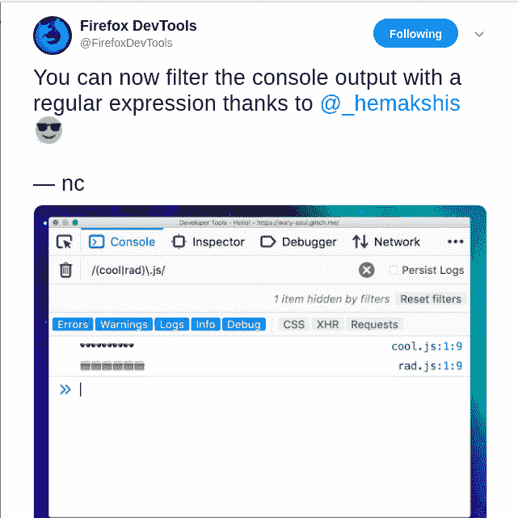

# 在失去动力两年后，我是如何开始我的开源之旅的

> 原文：<https://www.freecodecamp.org/news/how-i-started-my-open-source-journey-after-being-demotivated-for-two-years-db4ebc6ecb84/>

作者:Hemakshi Sachdev

# 在失去动力两年后，我是如何开始我的开源之旅的

Photo by [David Clode](https://unsplash.com/@davidclode?utm_source=medium&utm_medium=referral) on [Unsplash](https://unsplash.com?utm_source=medium&utm_medium=referral)

> 为开源做贡献是非常困难的。这样做的人是有多年经验的专家，而我们只是初学者——这不适合我们。

当我第一次问我的朋友们什么是开源和谷歌代码之夏，以及我们如何为他们做贡献时，他们说的就是这些话。我内心的自卑(或者我应该说我给他们的优越感是因为他们比我更喜欢编码)让我在漫长的两年里相信了他们的话。所以我完全放弃了为开源做贡献的想法。

但是今天，我已经向 Mozilla、freeCodeCamp 和 Gatsbyjs 等组织提交了 12 份成功的 pr，还有 3 份正在审核中。你猜怎么着？我还在上大学，几乎没有在任何组织或公司工作的经验！

所以，如果你和我一样认为开源不适合你，那就停止吧！

这一切是如何开始的？

### 关于我的一点背景？？

我的编码之旅始于三年前，当时我学会了如何用 C 语言编程。从那以后，我学习了 C++，算法和数据结构，并在 CodeChef，SPOJ，HackerRank & Codeforces 等多个网站上解决了数百个算法和逻辑问题。

后来，我继续从 [freeCodeCamp](https://www.freecodecamp.org/) 学习 web 开发。我喜欢它的课程，最重要的是他们的项目。但最棒的是他们自由开放的社区，随时准备帮助你。很多人在论坛或 Gitter 聊天室帮助我消除疑虑，得到的回复总是令人鼓舞。

我真的觉得我欠这个社区，并且一直在寻找我可以提供帮助的人。老实说，每当我在 freeCodeCamp 聊天室帮助别人解决问题时，感觉总是很棒。一年后，我又有了为开源做贡献的想法。我和那些同样的朋友讨论了我想投稿的愿望，但是我得到的都是和以前一样的话。我第二次打消了这个念头。

### 那一点点自信和勇气的火花？

在成功完成实习并找到工作后，我在大学的最后一年完全自由了。谷歌代码之夏的想法再次闯入我的脑海。由于这可能是我进入 GSoC 的最后一次机会，我不想在离开大学后进入现实世界之前有任何遗憾，所以我最后对自己说了这样一句话:

> 让我们试一试。最坏的情况是，我可能会失败，但至少我知道我尽力了！我不想仅仅因为一个人对我说我做不到就放弃一个机会！

我谷歌了所有关于开源的东西，从什么组织开始，如何找到可以贡献的东西，每一件事情！

最后，我决定选择 Mozilla，因为它是对初学者最友好的组织。由于 Mozilla 是一个非常大的组织，它旗下有相当多的产品，这个大问题又出现了:我应该选择哪个产品？

在他们的[介绍页面](https://developer.mozilla.org/en-US/docs/Mozilla/Developer_guide/Introduction)的帮助下，并了解了我自己的兴趣，我选择了 Firefox DevTools。为什么选择 DevTools？因为对我来说，没有什么比帮助别人学习、提高和成长更好的了。事实上，我开发或实现的东西可以帮助其他人学习，这是我能想到的最好的感觉。

### 真正的斗争开始了？

老实说，在开始之前，一切看起来都很吓人。但是一旦都做完了，你开始发现一切都是小菜一碟。第一步也是最重要的一步是获取和构建代码。几乎所有的组织都有非常详细的分步指南。我费了很大劲才拿到密码。火狐的代码库是 H U G E！感谢缓慢的网络连接，这让情况变得更糟。经过三天的努力，我终于能够得到代码，并且能够按照文档中提到的步骤在本地构建 Firefox。

现在我已经让它全部工作了，下一步就是实际上开始工作了！我浏览了所有的`[good-first-bugs](https://bugs.firefox-dev.tools/?easy&tool=all)`,并通过自我介绍和表现出对解决问题的兴趣来评论我觉得有趣的。我被分配到其中一个。

每个导师都知道我们是开源的新手。找到一个我们必须做出改变的地方就像大海捞针。因此，它们引导我们找到代码文件，有时甚至是行号，我们必须在那里分析问题并做出所需的更改。即使他们不愿意，你也有权利要求他们，他们会很乐意帮助你。

在接下来的 10 天里，我所做的就是研究代码、调试、构建、运行和分析…但是，我无法得出任何解决方案或结论！？最后，我决定带着我所有的分析和结果，向我的导师寻求帮助。有时候你必须寻求帮助，因为不这样做你就无法前进！整个代码对你来说是新的，没有人会在几天内理解它。

我的导师意识到这不是一个`good-first-bugs`类的问题，并自己解决了它。老实说，这有点令人沮丧。但是我的导师给了我另一个相对容易解决的问题，经过一两天的分析，我终于解决了！是的，我终于可以提交我的第一个补丁了！但是让它着陆真的不是那么容易，那么多小错误和 ESLint 错误真的令人沮丧。终于，经过 3 到 4 轮审核，我的补丁落地了！耶！？

在提交了我的第一个补丁后，我很快开始寻找更多的问题来解决。我继续解决更多的问题，但是很快我意识到我想要解决的问题不仅仅是做一些小的改变，而是一些更复杂的问题。我也仍然不确定我的兴趣，所以想探索更多的组织。所以我也解决了 Mozilla 的 Taskclusters、freeCodeCamp 和 Gatsbyjs 上的一些问题。但很快我意识到 Firefox DevTools 是我最喜欢使用的工具？并继续为此做出贡献。

这就是为开源做贡献的过程:

1.  找到一个问题来解决。
2.  研究代码库，了解需要做什么。
3.  代码。提问。提交。
4.  提交补丁。
5.  解决评审意见，使补丁落地。
6.  回到步骤 1。

### 最终注释

对于所有正在阅读这篇文章的人，我希望我能够激励你，让你意识到你适合为开源做贡献——因为事实是你适合！事实上，甚至没有必要知道一种特定的编程语言，因为您总是可以帮助编写文档，或者您可以报告详细的错误，并且总是可以在这个过程中学习一些东西。

是的，我知道我们可能不会对代码库做出任何大的贡献，或者不会开始任何大的开源项目，但是这些小的贡献和大的贡献一样重要。有句话说得好:水滴汇成大海。你永远不知道什么时候你的一点点贡献可能会对别人有所帮助，有一天你也可能会得到这个:

是啊！我的一个贡献得到了 Firefox DevTools 的认可。✨:这是第[条推文](https://twitter.com/FirefoxDevTools/status/1116361470500057088)。

因此，对于所有开源初学者或想从开源开始的人，我只想说:忘记别人的想法和信念，只记得你想做什么。你有能力，这才是最重要的。勇敢迈出第一步，世界会指引你走得更远——或者我应该说导师会指引你走得更远。？

最后，我要感谢我所有的导师和开源维护者，他们在我的旅程中给予了帮助，并将在未来继续这样做。特别感谢[扬·洪扎·奥德瓦科](https://github.com/janodvarko)和[尼古拉斯·切沃贝](https://github.com/nchevobbe)帮助我，回答并澄清我所有的疑惑和问题，并在指导我时表现出如此大的耐心。**非常感谢！❤️**

任何需要开源或编程帮助的人，不要犹豫，给我发邮件到 sachdev . hemakshi[at]Gmail[dot]com。我喜欢收到电子邮件？。

感谢 freeCodeCamp 团队发表这篇文章。？