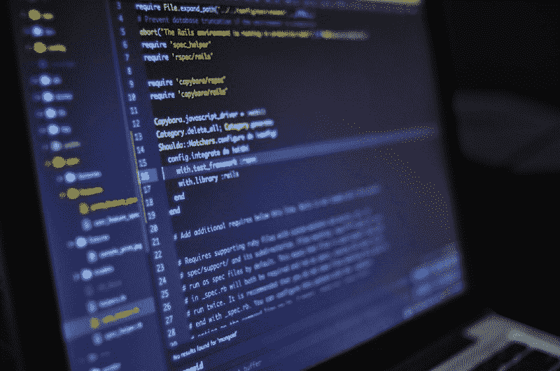
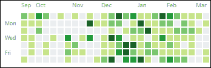

# 我如何在 10 个月内转行并找到一份开发人员的工作:一个真实的故事

> 原文：<https://www.freecodecamp.org/news/how-i-switched-careers-and-got-a-developer-job-in-10-months-a-true-story-b8895e855a8b/>

这就是我如何在 40 岁时从没有相关背景经验或学位的情况下开始职业生涯转向前端开发。我在全职工作时只进行自我指导学习，几乎不花任何钱。

> “我坐在马德里市中心的一家咖啡馆里，一边喝着咖啡，一边在笔记本电脑上敲着键盘，尽管外面正在下雨。过一会儿，我将进入我作为前端开发人员的第一天。10 个月前，我是格拉纳达的一名英语教师，对编程一无所知，但现在我来到了这里。怎么会这样？”

几个月前，当我准备开始新工作的第一天时，我写下了这些激动的文字。请跟我来，我将与你分享我是如何来到这里的。

### 感觉特别

当我第一次开始考虑成为一名开发人员时，我会带着一点怀疑的态度阅读像这样的文章。我一直在作家的背景中寻找让他们“特别”的东西。使他们适合这份工作。一些我没有的东西。

从那以后，我开始明白事情并不是这样的。成为一名开发人员没有任何“特殊”的要求。我不会告诉你这很容易，因为这并不容易。但是好消息是所有的需求都是每个人都可以达到的。你必须愿意努力工作，学到很多东西，并且始终如一。当事情变得艰难时，你需要坚持。当你觉得自己不适合做这件事的时候，说服自己走出绝望的时刻。这就是所有需要做的，每个人都可以通过一点练习来做这些事情。

我开始没有相关的背景研究。我没有钱花在昂贵的课程上，在我已经忙碌的日子里没有时间，而且我已经快中年了。每个人的情况都不同，但我明白了，如果你用心去做，你就能做到。

### 背景

在我写第一行代码的那一天，我之前从未做过任何编程，也没有接触过编程。我早年从事餐饮业。然后我拿到了音乐技术学位，接着在西班牙做了十年的 ESL 老师。我甚至对电脑都不是特别熟练。我确实总是对最新的科技创意感到兴奋。我认为程序员是现代的超级英雄。

不过，我从没想过自己动手。部分原因是我认为编程是某种精英活动。这是给那些从顶尖(昂贵)大学毕业的有天赋的人的。虽然像这样的个人确实存在，但大多数开发人员都不是好莱坞黑客类型。发展比我想象的要容易得多。

#### 起源故事

这一切都始于与我的搭档的一次生动的对话。她正在探索 STEM 领域女性人数少的原因，尤其是在技术领域。她决定自己成为一名程序员来解决这个问题。她想成为我们家年轻女孩的榜样。就这样，她开始了解它。

这很快也让我兴奋起来，因为我们意识到有大量的可用资源。这不是什么黑暗的艺术，而是我们可以学习和掌握的技能。

剧透一下，她还从人力资源部跳槽过来，事实上比我早一个月得到了一份开发人员的工作。

因此，有一天我们在科学博物馆发现了一本关于编程的儿童书籍。我们回到家，打开记事本，写下`<h1>Hello Worl` d < /h1 >在浏览器中打开，t `hen change` d 颜色:红色。我们兴奋地尖叫着！那是什么巫术！

我被迷住了。我想用代码做东西，我想让计算机做我说过的事情！

#### 我以前的工作

那时我已经和孩子们一起工作了 8 年。这不会是人们谈论他们不喜欢的没有前途的工作的典型部分。因为我热爱我的教学工作，喜欢和孩子们一起工作，我在我的工作场所很舒服。这是令人欣慰和愉快的。

但有时候，即使你爱着某样东西，你心里也清楚，是时候继续前进了。这是我人生的一个新阶段，我有了新的观点和新的抱负。最重要的是，我想要一个新的挑战。一些能让我远离舒适区的东西。

### 通往成功的唯一途径

这显然不存在。我们中的三个人几乎同时开始学习为职业变化编程:我的搭档、我自己和一个好朋友。我们三个现在都在这个领域工作，我们的方法之间很少有共同点。每个人都遵循适合自己的材料和方法。如果说我们之间有什么共同点的话，那就是我们都没有放弃，并且一直坚持下去。我们都付出了很多努力和坚持。

因此，与其说这是一条真正的道路，不如说我要告诉你一些我的道路。这不是唯一的方法，也不是最好的方法。这对我很有效。

#### 入门指南

首先，我开始阅读和观看 YouTube 上关于编程的视频，以了解从哪里开始。然后我开始摆弄 HTML 和 CSS。我跟随教程并编写代码来构建一些基本的网页。这让我意识到这是我真正想做的事情。

#### 设定目标

我联系了在这一领域工作的两个朋友，寻求建议和意见。这些早期鼓励和指导的话语对我前进并让我专注于一个明确的目标至关重要。

我花了一些时间来整理所有的选项，并设定对我有用的现实目标。我需要迅速改变职业。我没有其他的收入来源，这意味着在我能转换工作之前，我要维持我的工作。

我认为前端开发是最容易获得和最受欢迎的选择。我通过关注初创公司工作所需的技能，而不是自由职业者，进一步缩小了范围。

然后我设定了一个期限。我不希望这个目标最终出现在我再也看不到的待办事项清单上。那是 2017 年的春天，所以我向自己承诺，接下来的学校课程将是我最后一次当老师。所以到了 2018 年 9 月，一年多一点，我不得不在外地工作。

假装在这个阶段我已经清楚地掌握了一切是幼稚的。我没有。在进行如此冒险的职业改变时，确定性不是你可以拥有的奢侈品。在那一点上和整个过程中有各种各样的怀疑。这里的关键是坚持。一旦我做了决定，无论如何我都要走这条路，看看它通向哪里。

#### 学问

我知道前进的唯一道路就是为此而学习。我有全职工作，所以等到“我有时间”从来不是一个选项。我不得不一边工作一边做，或者干脆不做。我很幸运，我的搭档同时也在学习。这有助于我们组织我们的一天，以最大限度地利用学习时间。起初，我们会做我们所谓的“周末新兵训练营”,在那里我们会把整个周末都用来编码。典型的一天是这样的:

早上 8:00:起床，早餐。
上午 8:30:开始编码
下午 12:30:去健身房
下午 1:30:吃午饭，然后休息
下午 3:00/4:00:继续编码
晚上 8:00/11:00:结束一天

然后我的暑假来了，我充分利用它，把“周末新兵训练营”变成了“日常新兵训练营”。尽管有享受夏天和放松一下的诱惑，我还是坚持了那个时间表。

九月来了，我回去工作了。我有意识地决定减少工作时间。我接受了我会以更少的收入来换取更多的学习时间。这也是让我对职业转变的承诺更加认真的另一个步骤。

很难表达离开我的代码有多难。我想做的就是回到我的电脑前，完成解决这个问题或修复那个布局。但是现实生活开始了。新学年的开始总是需要很多时间来准备和组织。正如任何一个老师会告诉你的那样，这也占用了一个人大量的个人时间。

那一刻我的任务可能会被打乱。尽管我尽了最大努力，但我编写代码的时间越来越少。我开始失去动力。我试着坚持下去，但是有时候我就是没有时间。即使有最好的意图和良好的动机，生活也会让事情变得复杂。

My activity on GitHub showing the dip in October

但是，从我的 GitHub 活动图可以看到，我一直在努力。我不停地投入时间，哪怕是一个小时，哪怕是在读一篇文章。我做了所有我能做的事情，不至于到了失去所有动力的阶段。当你离开一件事足够长的时间后，每过一天就更难回到过去。

然后随着 12 月的临近，看到新的一年即将来临，我的最后期限越来越近，我再次振作起来，变得有条理。我开始全力以赴，投入这些时间，不管我有多累，时间有多少。有时我会早起编码，有时我会熬夜。

这意味着我的生活几乎被简化为支付房租和学习。其他的就不多了。我基本上一直保持着这种节奏，直到我开始打包搬到马德里的那一天。那是在 2018 年的春天，比我的最后期限早了几个月。

### 工具和资源

在我得到工作机会的 10 个月里，我沉浸在与代码相关的所有事情中。我在 Twitter 上最常被问到的问题是我使用了哪些资源。我已经写了[另一篇文章](https://medium.freecodecamp.org/the-tools-and-resources-that-landed-me-a-front-end-developer-job-1314c6f1fa7f)来深入回答这个问题。然而，这里有一个最重要的工具和资源的简要列表。

#### 课程

*   freeCodeCamp.org
*   卡西迪·威廉斯和柯尔特·斯蒂尔的《我的课程》
*   韦斯博斯的 JavaScript 30 等课程
*   YouTube: Traversy Media，LevelUpTuts
*   Christina Truong 的 Lynda.com 课程
*   Udacity 前端 Nanodegree(付费课程，但我获得了谷歌的奖学金)

课程只能带你走这么远，所以我用其他工具来补充，帮助我学习和找到工作。

*   Twitter:我经历的一个基石。尤其是非常支持和热情的 [#100DaysOfCode](https://twitter.com/hashtag/100daysofcode?f=tweets&vertical=default&lang=en) 社区。
*   GitHub:一个重要的学习工具，也是我免费托管所有项目的地方。这通常是雇主查看你工作的第一个地方。
*   投资组合:通过构建 it 和其他自发项目，我学到了最重要的开发技能。

你也可以查看[我的学习跟踪器](https://github.com/Syknapse/My-Learning-Tracker-first-ten-months) GitHub repo。它列出了我前十个月使用的所有资源和途径。

### 找工作

令人惊讶的是，对我来说，这部分并不过分复杂。我没有投大量的简历，也没有花几个小时找工作。相反，我选择了有选择性和专注。

最终我进入了五个面试流程。我被其中一个拒绝了，也没能完成另一个带回家的挑战。我完成了三个，得到了三个邀请中的三个。其中一个是完全不够的，没有吸引力。另外两个，几乎同时到达，都是非常有趣的提议。其中一个就是我现在的工作。

我不想听起来对此漠不关心。那是一段紧张的时光。我仍然不知道我的技能是否可以被雇佣。我进入流程时甚至不确定自己是否会因为经验不足而被嘲笑。这是一个令人伤脑筋的时刻，但也是一个令人兴奋和充满希望的时刻。当我最终发现自己有两个真正的好提议摆在桌面上时，我非常高兴，简直不敢相信。

我将永远感激那些做出这些决定并决定给我一个机会的人。

这两家公司的面试过程非常不同。一个是与公司不同的人进行一系列视频通话。这是一家规模虽小但发展良好的公司，希望建立一个新的前端开发团队。经过几周的反复，他们给了我第一份真正的工作。

另一家是处于高速增长期的年轻初创公司。在一次电话面试后，我接到了一个需要在几天内完成的技术挑战。它包括构建组件、进行 API 调用和显示正确的信息。然后来了一段视频聊天，聊的是我写的代码。然后我被邀请和技术团队喝一杯，看看我们是否合得来。之后我得到了一份初级前端的工作邀请。

最终我不得不做出选择。这是一种奢侈，我不敢相信我得到了。但是我知道我想要什么，我接受了创业公司的邀请，基于一个要点:他们似乎非常清楚导师的重要性，并给我成长和学习的指导。这是关键。这绝对是正确的选择。

就这样，在马德里的那个雨天，喝完咖啡后。走进业务区的一间办公室，介绍自己是新的前端开发人员，开始了新的职业生涯。

我希望你喜欢我的故事。如果你这样做了，你会让我高兴，如果你给它一些美味的掌声。你甚至可以通过分享让我的一天变得美好，这样更多的人可以阅读它，并且知道他们也可以变得美好。我想继续写更多这样的文章。因此，如果你想了解这个过程的任何特定方面，我很乐意听到。来在[推特](https://twitter.com/Syknapse) @Syknapse 上打个招呼吧

看看我的文章，我利用了所有的资源来获得这份工作。